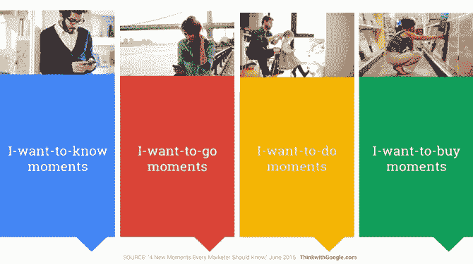

# 2019 年的 11 个数字营销预测

> 原文：<https://medium.datadriveninvestor.com/11-digital-marketing-predictions-for-2019-414ca0380d3b?source=collection_archive---------5----------------------->

技术每天都在变化。随着人们从传统媒体转向数字媒体，从旧设备转向新设备，营销人员必须快速创新，想出新的策略来获得牵引力。它有助于观察趋势，并提前计划那些将会持续的趋势。

【2019 年 11 个数字营销预测

随着数字营销格局的不断发展，以下是 2019 年你可能会看到的一些趋势:

Photo by [Andy Kelly](https://unsplash.com/@askkell?utm_source=medium&utm_medium=referral) on [Unsplash](https://unsplash.com?utm_source=medium&utm_medium=referral)

**1)影响者营销和推荐计划的增长**

根据[尼尔森的全球广告报告](https://www.nielsen.com/content/dam/nielsenglobal/apac/docs/reports/2015/nielsen-global-trust-in-advertising-report-september-2015.pdf)，83%的消费者相信他们认识的人的品牌推荐。如今的消费者更信任有信誉的内容和口碑营销，而不是传统广告。品牌越来越意识到与客户发展更强关系的价值，以鼓励推荐，创造积极的社会证明，并促进品牌宣传。为了使他们的促销更有针对性和价值，公司将在推荐项目、内容营销和影响者营销方面投入更多。品牌将利用真实的客户、员工和真正的影响者来联系他们的目标受众。一个例子就是摩托罗拉通过 YouTube 影响力发布 Moto Z 系列和 Moto Mods 的方式。

**2)推动成功的内容分发战略**

营销人员再也无法摆脱被动的分销策略。在潜在买家可以看到的正确渠道上分发内容，将与创作内容一样重要。品牌将投入更多时间，在顾客最活跃的地方识别和发布他们的内容。

AI 将会留下来

2019 年，你不太可能因为机器人而失业，但你会看到更多人工智能解决方案，让你作为数字营销人员的生活变得更容易。人工智能将成为软件和设备不可或缺的一部分。AI 将帮助您实现营销自动化，分析复杂数据以了解买家行为，个性化营销信息，并提供出色的客户服务。

**4)通过语音设备进行数字营销**

到 2019 年，仅在美国就将有超过 6700 万台语音辅助设备。这为营销人员扩大营销活动带来了新的机会。据 ComScore 称，到 2020 年， [50 %的搜索将是语音搜索。有了亚马逊 Echo 这样的设备，你可以查看新闻、玩游戏、](https://www.campaignlive.co.uk/article/just-say-it-future-search-voice-personal-digital-assistants/1392459)[订购多米诺披萨](https://www.thedrum.com/news/2017/07/31/dominos-turns-amazon-echo-let-customers-order-pizza-using-only-their-voice)等等。随着 Siri 等人工智能助手成为我们日常生活中不可或缺的一部分，公司将在其数字营销战略中包括更多基于设备的内容。

聊天机器人的崛起

说到智能助手，在不久的将来，聊天机器人将无处不在。根据甲骨文的一项研究，[80%的企业](https://go.oracle.com/LP=43079?elqCampaignId=79575&utm_source=Triggermail&utm_medium=email&utm_campaign=Post%20Blast%20%28bii-apps-and-platforms%29:%20Microsoft%2C%20Qualcomm%20partner%20to%20build%20Windows%2010%20chips%20%E2%80%94%2080%25%20of%20businesses%20want%20chatbots%20by%202020%20%E2%80%94%20Google%20brings%20RCS%20to%20Canada&utm_term=BII%20List%20Mobile%20ALL)已经使用或计划到 2020 年实现聊天机器人。未来的聊天机器人将会更加智能，反应也更加灵敏。从自动化重复性任务到提供出色的客户服务，聊天机器人将帮助品牌快速有效地与用户沟通。

**6)社交媒体与其他服务的整合**

随着电子邮件收件箱被垃圾邮件塞满，人们会转向社交媒体平台获取品牌和优惠信息。随着越来越多的人在社交媒体上闲逛，品牌增加对社交媒体营销的投资是有意义的。像脸书这样的平台将继续允许他们的服务集成到第三方应用程序中。这将使新用户更容易注册网站和应用程序。公司应该更加小心他们在社交媒体上的举动。社交媒体上的用户对他们想看的内容有更多的控制权。如果你说了一些愚蠢的话或者给他们发垃圾邮件，他们会很快惩罚你。

**7)更多视频**

视频内容越来越受欢迎的趋势将会继续。投资视频内容对商业也有好处。统计表明 [72%的商家通过视频提高了转化率](https://www.wyzowl.com/video-marketing-statistics-2016/)。视频内容将变得[更加便于搜索](https://searchengineland.com/google-auto-playing-video-previews-search-results-carousel-android-281005)，并将成为 YouTube、脸书、Instagram 和 LinkedIn 上营销不可或缺的一部分。

2019 年，您将会看到更多:

*   个性化外展的直播，
*   视频产品演示，
*   360 度视频，以及
*   来自品牌的个性化视频信息。

**8)更多增强现实**

这个世界可能还没有为虚拟现实做好准备，但 AR 已经到来。营销人员将把 AR 纳入他们的数字战略，以提供互动体验。参与性和知识性的 AR 活动将有助于公司在 2019 年提高品牌知名度。例如，百事可乐使用 AR 在伦敦的一个公共汽车站播放创意广告。AR 确实让广告变得更有趣。

**9)个性化**

每位顾客都是独一无二的。他们做出购买决定的方式是独特的。吸引买家注意力的最佳方式是根据他们的独特需求定制个性化的营销信息。2019 年将是个性化营销的一年，更加以客户为中心的战略。谢天谢地，人工智能将使营销人员更容易实现个性化。人工智能支持的分析将使品牌能够预测客户需求，并帮助个性化内容、电子邮件和优惠。例如，网飞的成功归功于 ML 提供的个性化推荐。

**10)更多移动用户和微时刻营销**

2019 年，人们将继续与手机挂钩。美国人平均每天在移动设备上花费将近 3 小时 35 分钟。2019 年的营销基本上将针对移动设备。虽然移动使用量将继续增加，但移动用户的注意力持续时间和耐心将急剧下降。购买决定在[的微小时刻](https://www.thinkwithgoogle.com/marketing-resources/micro-moments/)迅速做出。面对不同屏幕上的大量内容，人们很快就会远离那些不能快速消费的内容。这意味着品牌必须更加努力才能引起注意。人们将更加关注有效的[微时刻营销](https://www.inc.com/jonathan-lacoste/wtf-is-micro-moment-marketing.html)策略，以赢得要求苛刻的移动用户的关注。最终，成功的要素将是清晰而简洁的信息，能够被迅速地消费掉。

Decision are made in [Micro-moments](https://www.thinkwithgoogle.com/marketing-resources/micro-moments/how-micromoments-are-changing-rules/)

**11)更多整合的数字营销努力**

为了真正接触到在线消费者，品牌必须在所有相关的数字渠道上吸引他们。普通人会与多个应用程序、搜索引擎和软件进行交互。因此，品牌有必要通过多种数字渠道与用户互动，以减少客户流失并优化客户终身价值。公司将继续专注于整合数字营销工作。借助像 [MoEngage](https://www.moengage.com/) 这样的新一代用户参与工具，数字营销人员可以为他们的客户提供无缝、集成和[全渠道营销](https://www.moengage.com/blog/where-are-you-with-your-omni-channel-marketing-strategy-for-2019/)体验。

随着人们在互联网上花费更多的时间，数字营销的投资将继续增长。2019 年的营销战略将更加以客户为中心，以人工智能为动力，更加整合。成功会降临到那些快速创新、快速适应、与众不同的人身上。