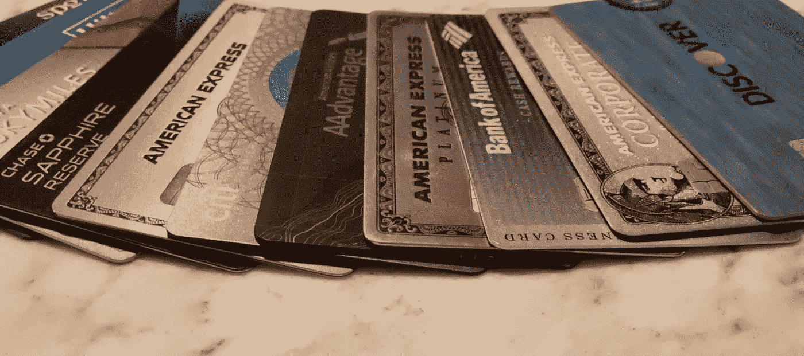
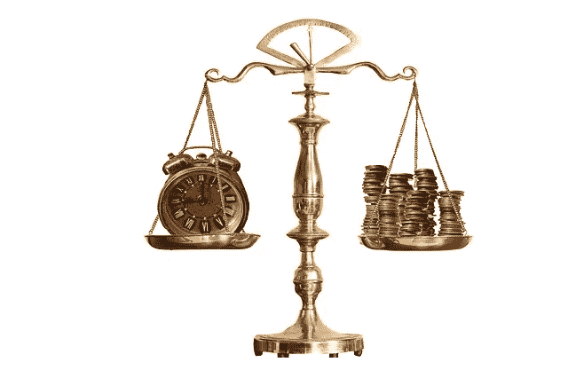
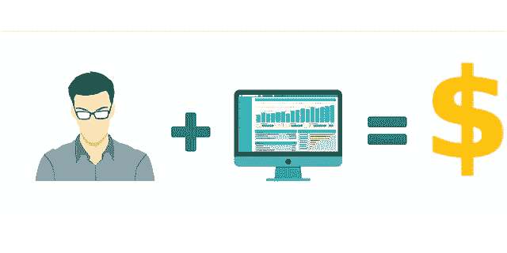
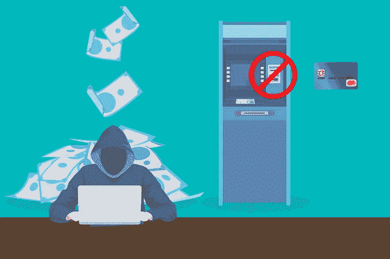

# 信用卡能真正帮助你、你的企业和你的底线的 10 个理由

> 原文：<https://medium.datadriveninvestor.com/11-reasons-credit-cards-can-actually-help-you-your-business-and-your-bottom-line-56b9eb816bf1?source=collection_archive---------19----------------------->

Images of the American Express Platinum Card, Corporate Platinum Card, Gold Card logos are registered trademarks of the American Express Company. The image of the Bank of America Business Cash Reward Card logo is a registered trademark of Bank of America Corporation. The image of the Discover Card logo is a registered trademark of Discover Financial Services, Inc. The image of the Chase Sapphire Reserve Card logo is a registered trademark of J.P. Morgan Chase & Co. N.A. The image of Citi ThankYou Premier logo is a registered trademark of Citigroup, Inc. Images of American Airlines and AAdvantage logos are registered trademarks of American Airlines, Inc. Images of the Delta and SkyMiles logos are registered trademarks of Delta Air Lines, Inc. The image of the Hilton Honors logo is a registered trademark of Hilton Worldwide Holdings, Inc. The image of the SPG logo is a registered trademark of Starwood Hotels and Resorts Worldwide, LLC, a subsidiary of Marriott International.

## 本文中讨论的信用卡产品、特性、好处和优惠在本文发表时已经存在。由于发卡机构可能会对产品特性进行更改，因此本文中的所有陈述在本文发布后可能不再适用。我没有因为这篇文章中提到的任何产品得到任何人的补偿。

在我还没有 ATM 卡的时候，我的父母就教育我要远离信用卡。我父亲对他的信用非常负责，只在绝对必要的时候才使用信用。他有一张主要的信用卡和一两张商店卡，其中一张是梅西商店的卡。他很少使用信用卡，而是选择用现金支付一切。他这样做不是因为他富有。我们过着简朴的生活。我父亲是唯一的全职收入来源，他的工资对于当时的中下阶层家庭来说还算不错。他只是认为，当你可以用现金支付时，就不应该用信用卡支付。这样你只花你所拥有的。今天我坚信这一点，尽管对我来说这是一个代价高昂的教训。我度过了信贷债务和冲销的短暂时期。不是我没有很好的理财；只是我是个冲动型买家。虽然我会经历购买者后悔的时刻，但我永远不会抽出时间来归还我多年来购买的任何垃圾。再加上我为刷爆了的信用卡支付的利息，嗯，你可以明白为什么这是一个昂贵的教训。信用卡是邪恶的！，或者说我是这样被父母教导的，从我自己早年的生活经历中。

这同样适用于企业，尤其是初创企业。任何企业都不应使用信用卡来弥补运营损失。然而，我会给你 10 个理由，为什么在特定的情况下，应该使用信用卡，我会解释我的理由来支持这一点。在某些情况下，负责任地使用信用卡，会是一个非常好的支付选择。

在我继续之前，我想先向你们中的一些人道歉，他们可能是工商管理硕士和有经验的企业主。我将在这篇文章中解释许多你可能已经知道的事情。我本人拥有 MBA 学位，是一家受联邦和州政府机构高度监管的大型机构的首席执行官。在我从事管理的这些年里，使用复杂的公式来预测金钱的未来价值，从来没有人把我拉到一边，让我知道最大化现金流和利润的简单方法。

这些年来，我学会了在一个基本原则上应用许多不同的策略，为你的血汗钱寻找可衡量的附加值和回报，在许多情况下是免费的。

这篇文章将列出在你的商业运作和日常生活中使用信用卡的 10 个理由。在我这样做之前，让我们回顾一下不同类型的信用卡选项。并不是所有的卡片都是一样的。

信用卡有哪些不同的种类？

*公司卡:*这是一些大公司的卡，通常是上市公司和非营利公司，它们需要第三方的财务监督，包括定期的独立财务审计。有两种类型的公司卡:

1.  个人责任:每个授权用户都要经历一次软信用拉取，这意味着他们的个人信用要接受信用审查，账户可能会被报告给信用局。账单必须由个人在到期日之前支付，卡才能再次使用。在这种情况下，授权用户可以直接为他们的帐户支付账单，并由公司报销，或者等待公司支付账单，然后他们才能在下个月使用该卡。在这两种情况下，债权人都不会要求个人对收费负责。公司仍然对授权用户的任何费用负责。
2.  公司责任:授权用户不需要经历软信用拉和他们的授权用户。公司必须在到期日之前支付所有授权卡的账单，而不是单个持卡人。

*名片:*这些名片适合小企业和个体经营者。任何小企业主都可以申请名片，只要该小企业有雇主识别号码或 EIN。虽然授权用户也可能对他们的卡上的费用负责，但是商家对费用负责。

*个人卡:*这种卡适用于个体经营者，小企业主可以自己购买商品。这些卡与主卡持有者的社会安全号绑定在一起。发卡机构在主卡持卡人的信用报告中报告信用查询、每月余额和支付历史。它也在授权用户的信用报告中报告，但授权用户个人不对账户上的任何费用负责。

*年费:*很多卡都要收年费。通常，收取这些费用是为了抵消与该卡提供的特殊功能和优惠相关的成本。许多高级卡提供“高端”的额外待遇，但它们也伴随着明显更高的年费。最好的卡是那些没有年费的卡。

现在我们已经讨论了现有的不同类型的信用卡，以下是你应该每天使用信用卡的 10 个理由:

**1。购买力**

资本意味着流动资金。你能用来消费的钱越多，你的购买力就越强。有很多理由让你拥有可及的购买力。首先，这是一种资本融资形式。有时我们需要资本融资来解决短期现金流问题。我们称之为营运资本。有时我们需要资金来启动一个新项目或扩展现有业务。我们称之为投资资本。我们需要营运资金来经营我们的公司。我们不一定需要投资资本来经营我们的公司，因为投资资金是我们从日常流通中取出的钱。我们将这笔钱存入定期存单或其他形式的短期或长期投资。营运资本是流动的，投资资本是可变现的。无论哪种方式，资本都让企业为机遇做好准备，为风险做好准备。营运资金是用来经营企业的。拥有大量营运资金并不一定意味着你的生意兴隆。另一方面，营运资金少并不意味着你的生意不景气。你看，营运资本不是现金，而是你拥有的购买力。如果你从购买力的角度来看营运资本，它是按照你的现金和现金等价物减去你的流动负债来计算的。我们称之为速动比率。因为只有你所借的那部分循环债务被记录在你的流动负债中，所以你的实际购买力大于你在账面上记录的。更好的是，没有对公司资产的留置权，这与担保贷款和担保信贷额度不同，你实际上是以你自己的股权为抵押借钱，银行以存款的形式持有你的股权。你拥有的未使用的信用额度越多，你的购买力就越强，而且由于信用卡是无担保的信用形式，只要你在支付利息前付清余额，你实际上就是在用别人的钱免费借款。利用这种购买力的最佳方式是通过介绍性优惠。

**2。介绍性的 0%四月利率**

这是一个绝无利息可还的浮动应付款的好机会，只要在 0%优惠期结束前付清全部余额。唯一的问题是，如果你没有完全付清账单，并且余额为 0 美元，那么你购买的所有商品将会被收取全年的利息，通常利率很高，可能在 20%左右。这是一个很棒的提议，但前提是你有办法在 0%年利率到期前偿还所有贷款。有许多信用卡提供长达 18 个月的介绍性 0%年利率，用于新的购买，在某些情况下，用于余额转移。

信用额度和信用卡为企业主提供了购买力，但是两者之间还是有一些区别的。首先，我在上面简要提到了资产安全。还有很多其他的，这就是一个不能代替另一个的原因。在大多数情况下，信用卡最适合用来购物，而本地信用卡最适合用来预支现金。我在下面列出了最好使用每种方法的所有理由:

*信用卡更适合购物和供应商发票付款:*

a.免息宽限期最长为结单日后 *21 天*。

b.所有购买的奖励积分和现金返还。

c.延长保修和价格保护。

d.支付灵活性。支付任何高于最低还款额的款项。

e.一个账户下多个授权用户有不同的信用额度。

f.与大多数信用额度不同，大多数信用卡是无担保的。

g.欺诈保护。

h.在长达 18 个月的时间里，购买和余额转移的初始年利率为 0%*!*

*信用额度更有利于预支现金和透支保护*

a.更高的月支出限额，因为 loc 由您的存款担保或支持。

b.较低的利率，不像信用卡通常有高利率。

c.提取(预支现金)您的 LOC 现金，无需支付与信用卡预支现金相关的高额费用。

d.提取您的 LOC，最高限额为您每月可用的总信用额度，不像信用卡只允许不超过您每月可用的总信用额度的 10-20%的预支现金，这取决于您的信用卡。

e.方便地从 LOC 中提取资金，并直接转账至运营和工资账户，以弥补潜在透支。尤其是工资单，必须有足够的资金来支付员工的工资和税收。

由于信用卡提供无担保的免息购买力，信用卡显然是购买短期资本的赢家。

**3。延长短期融资**

Image Description: justice scales balance lawyer lower fees money. Image Source: Monam, Pixabay.com

使用信用卡的明显好处是它的融资灵活性。融资的利息费用，对任何规模的公司来说都是一个昂贵的成本中心。诀窍是免费获得融资。如果你能使用信用卡做到这一点，它应该是你的第一选择。这里的想法是让借来的钱为你工作，没有利息，然后在利息之前偿还。

现金流计算为现金流入或现金流出。现金进来，就是现金流入。现金流出，就是现金流出。任何时候你延迟支付你的账单，或者*浮动你的应付账款*，这都是一种“现金流入”,因为你口袋里的钱不应该在你的口袋里，因为它是别人欠的，因此属于别人。你有更多的现金，尽管你的债务增加了。相反，偿还债务是一种“现金外流”虽然你减少了债务，但你也减少了可用现金。你从不对过期账单收取滞纳金的供应商那里获得的应付款项越多，你手头可供支配的现金就越多。基本都是免费融资。

这种模式的问题是，在你冒着损害你的供应商关系的风险之前，你只能浮动你的应付款。供应商的表现、定价和反应时间因客户而异。这在很大程度上取决于几个关键因素，如销售百分比、定价、关系历史和付款周转等。浮动你的应付款会让你的供应商认为你是一个付款缓慢的人。这会影响你以后谈判价格和支付条款的能力。它还会影响您联系供应商时的反应时间。如果你有未付发票，你将不会是一个优先事项。打电话给客户支持部门请求帮助或澄清或解决问题只会导致转移到收款部门。供应商不喜欢为未付的发票追账。此外，付款缓慢的客户通常不是首选客户，因此客户服务、价格谈判、交付时间和周转时间最终都会受到影响。

使用这种方法还会对财务报告产生影响。快速浏览一下资产负债表就会发现，当你的流动负债一年比一年增加时，你的支付就会变慢。然而，由于你持有现金的时间越长，你的流动资产也会增加。这就保持了负债率相对不变。使用 loc 延迟付款不起作用，因为你要支付利息。因此，即使你的总负债与资产比率没有受到影响，利息支出也会影响损益表。当你最终还清短期债务时，你的流动负债会减少，但流动资产也会减少，你在此期间产生的任何利息都被记为费用，会降低你的底线。

那么，你如何浮动你的过期发票来创造现金流入，而不会产生利息支出呢？信用卡。虽然这似乎是常识，但使用信用卡支付发票实际上是间接延迟了付款。基本上，你是在利用你只能从信用卡延期付款中得到的短暂免息宽限期。这里有一个例子:

> 假设你从 WB Mason 订购办公用品，付款条件是从发票日期起 30 天内付清。订单是 9 月 1 日下的。这些物资将在 9 月 3 日的下一次装运中交付。发票上注明了装运日期。账单 10 月 1 日寄出，10 月 3 日应付账款收到。该账单包括多张发票，其中包括 9 月 1 日订单的发票。账单的到期日是 10 月 15 日。很多时候，发票还包括滞纳金之前的宽限期，可以延长两周到 10 月 30 日，但对于这篇文章，我们将坚持 15 日。您的 AP 部门使用信用卡在线支付账单，而不是签发支票。发票被标记为已支付，并在 15 日为信用卡费用生成新的发票。对账单期间发生的任何费用都将记入下一个账单。如果账单周期在您使用信用卡支付 WB Mason 账单的前一天结束，那么在下一张账单发出之前，您有整个 30 天的账单周期。这就是为什么何时用信用卡支付账单是非常重要的，也应该纳入你的策略。对于这个例子，我们将使用这个最好的场景。信用卡账单周期于 14 日结束，因此 10 月 15 日的新费用将不会显示在您的下一张账单上。下一份声明于 10 月 19 日发出，并已寄出。你的 AP 部门在 10 月 23 日收到声明。根据条款和条件，从账单寄出或交付之日起有 21 天的付款到期日宽限期(您应该对每个信用卡发行商都很熟悉)。对于这个例子，我们将使用 10 月 19 日的邮件日期。付款截止日期是 11 月 9 日。但是，请记住，该声明不包括费用，因为它是在该计费周期结束后的第二天做出的。由于周期是静态的，在大多数情况下，你可以指望每月 14 日结算的对账单，对账单会在每月 19 日左右邮寄给你。您可能会在 20 日到 23 日之间的某个时间收到对账单，并且您的对账单通常会在对账单发布之日起 21 天内到期(根据条款和条件，可能会寄出，也可能会收到，这通常是 21 天宽限期的原因)。因此，每个月的预产期都是 11 月 9 日或 10 日。因此，10 月 15 日的这笔费用要到 11 月下旬才会显示在您的信用卡账单上，您必须在 12 月 9 日或 10 日之前全额付清账单(您的会计部门可以安排在未来某个日期付款，这在 9 日或 10 日是周六或周日时特别有用)。使用这种方法将 30 天的净付款延长到 90 多天，没有人被延迟付款，也没有发生滞纳金或财务费用。如果您能够与供应商协商 net 60 付款条款，作为您原始合同协议的一部分，您可以将此时间表再增加 30 天。从服务或产品交付之日起的大约 120 天内，你基本上不需要为提供的服务或交付的产品付费，也就是 4 个月！你本质上所做的是增加你的流动负债，并用信用卡来循环债务。

不像 loc 从你提款时就开始收取利息，信用卡提供无息融资宽限期，让你在收取利息前偿还余额。说到扩展的免费融资，信用卡再次成为明显的赢家。

**4。跟踪和控制支出**

大多数信用卡通常不提供强大的费用跟踪功能。Capital One Spark cards 提供一些消费跟踪工具。美国运通是独一无二的，因为它的许多产品都提供商业智能或 T2 商业智能工具来生成消费报告，尽管没有比美国运通公司卡更好的了。这是他们的公司卡提供的一个巨大的好处。费用跟踪工具非常强大，如果你在日常开支中使用他们的公司卡，那么在跨部门管理你的开支方面会有很大的不同。按类别列出的支出报表包含丰富的详细信息，可用于创建预算。美国运通公司账户提供 SAP Concur 集成软件，该软件不仅提供广泛的费用分析工具，还允许您将信息导出并在许多情况下集成到您的会计软件中。这些都是您公司卡福利的一部分。您可以拥有任意多的授权用户，因为公司要承担全部费用。对于不想承担费用的员工来说，这是一个好消息，尽管如果公司收到一份费用账单，而员工离开公司，这对公司是不利的。该雇员不承担任何责任。

Image Description: freelance work job making-money money dollars. Image Source: JuralMin, Pixabay.com

美国运通商务卡还提供有用的支出跟踪工具，对小企业非常有用，尽管不如 Concur 强大。

Brex 是一种通过萨顿银行发行的新公司卡。Brex 由一对来自斯坦福的 22 岁学生创立，他们都已经辍学全职经营 Brex。Brex 的目标是拥有闪光技术的初创企业家，这些技术不仅可以帮助初创公司管理他们的资金、供应商账户和跟踪支出，还可以提供获取收据的技术。Brex 背后的辉煌在于其支出人工智能跟踪技术，该技术使用算法来解释支出行为。它帮助企业更有效地管理他们的支出。与 Concur 非常相似，它为 NetSuite、Xero、Expensify 和 QuickBooks 等流行的会计软件提供了集成功能，未来还会有更多的集成。与美国运通公司白金卡高达 450 美元的年费和 300 美元的额外授权用户费不同，Brex 用户每月每增加一张卡只需支付 5 美元。Brex 的 AI 软件决定你是否有资格，以及他们会给你多少学分。您的小型企业帐户中必须至少有 50k 美元才有资格，并且您需要提供您的银行帐户登录信息。由于 Brex 是一种签帐卡，余额也必须在每个账单周期内全额支付。

今天的信用卡允许在没有卡的情况下方便灵活地购物。通过电子邮件和短信提醒，收费是实时的。您可以按持卡人个人设定消费限额。这不仅提供了更方便的监控，还允许您根据自己的需要随时增加和减少限制，并且可以轻松地在线配置。授权用户也可以在线查看他们的声明和活动，还可以收到提醒，并可以在卡丢失时冻结卡。监控公司各处员工的使用和控制访问的能力为您提供了监控和控制使用和支出所需的工具。这是使用信用卡进行日常消费的一个巨大优势，特别是如果你有一个销售团队和客户保持团队，他们需要在客户关系上花钱。还是那句话，这只是信用卡独有的。

**5。与供应商建立更好的关系**

Image Description: agreement business businessman businesswoman client. Image Source: Rawpixel, Pixabay.com

虽然在商业世界中，大多数经常性交易是通过支票支付的，如租金和抵押贷款，但许多经常性交易可以放在信用卡上。大多数供应商和几乎所有的商家都接受大多数主要的信用卡。许多供应商实际上更喜欢用信用卡支付，如果你通过他们的支付门户网站设置自动支付，他们甚至会提供折扣。他们更喜欢自动安排付款，因为这样可以降低应收账款的融资成本和追踪未结发票的成本。大多数供应商更愿意支付商家费用，以保证按时付款。

**6。保护**

Image Description: cards card stealing steal dangerous danger ban. Image Source: Teguhjatipras, Pixabay.com

*欺诈保护:*信用卡提供了另一项旨在保护消费者的独特功能。防欺诈是携带和使用信用卡的主要好处之一。许多过去携带现金和借记卡的人正在转向信用卡，因为信用卡公司，而不是消费者，陷入了欺诈性收费的圈套。

*价格保障:*花旗银行为他们的许多产品提供价格保障。像 Sift 和 Earny 这样的应用程序可以追踪你用提供价格保护的信用卡购买的东西。你只要把提供价格保护的信用卡和你的电子邮件联系起来。然后你用这些信用卡购物，应用程序会监控价格下降长达 90 天。如果价格下降，应用程序将通知信用卡发行商，并提供所有必要的文件来完成索赔。有一些限制，你每次购买和总共得到多少保护，保护多长时间是好的，以及其他条款。总而言之，这是一个非常好的功能，让你有机会获得意外的发现。

延期保修:有些信用卡也提供延期保修保护。花旗银行为他们的许多信用卡产品提供慷慨的、延长的保修保护。花旗双倍现金卡、Advantage 白金卡、Advantage 行政卡、ThankYou Premier 卡和 ThankYou Prestige 卡是花旗集团提供延长保修保护的一些卡。美国运通的产品提供不太慷慨的保修保护，但它们的保护包括在某些情况下的磨损。截至 2018 年 8 月，大通削减了其所有产品的大部分延长保修范围。使用提供延长保修保护的信用卡是为小额和大额购买增加保护的好方法，从而避免购买延长保修的需要。这种便利可以让你不需要从商家那里购买延长保修，为你节省 49 到 149 美元。

*保险:*一些信用卡发行商提供特定产品的保险。例如，一些信用卡提供保险来覆盖丢失、被盗和损坏[手机](https://www.nerdwallet.com/blog/credit-cards/credit-cards-with-cell-phone-insurance/)。所有提供此类保护的信用卡还对索赔次数、每次索赔的最高赔付额以及 12 个月内所有索赔的最高金额设置了限制。尽管它们是相似的，但是关于保险资格的政策却有所不同。我在这一段放了一个详细的链接。许多高级卡提供[旅游保险](https://www.tripsavvy.com/the-best-credit-cards-for-travel-insurance-4147438)。旅行保险的类型和覆盖范围因发卡机构而异。有些提供全面的租赁汽车一级和二级保险。其他形式的旅行保险包括航班延误、行李丢失/延误、行程取消以及疾病/紧急医疗护理和医疗后送。我在这一段放了链接，这样你可以了解更多关于这个话题的信息。

**7。类别消费的奖励积分和现金返还**

*奖励积分:*每个信用卡产品线的奖励计划都是独一无二的。有些程序允许转移到其他程序。与合作伙伴关系最多的三个最著名的计划是美国运通会员奖励计划(MR)、大通终极奖励计划(UR)和花旗银行 ThankYou (TY)奖励计划。这三个都是积分计划，允许您将积分转移到航空公司和酒店合作伙伴，以获得里程和住宿。让这些计划如此吸引人的是，当您使用积分直接通过这些计划预订航班时，积分具有的价值。价值范围从 1.2 美分至 2.4 美分/美元。有一些网站实际上讨论如何通过转让合作伙伴获得最大价值。*和 [*一英里一次*](https://onemileatatime.com/) 是人们为了研究兑换积分和里程的最佳方式而去的众多热门网站中的两个。所有这三个计划还允许您以每积分 1 便士的价格将积分兑换为对账单积分和合作伙伴在线网站的在线购物积分。*

**

*Image Description: cash back online shopping offer selling sale. Image Source: Mohamed_Hassan, Pixabay.com*

1.  **美国运通会员奖励计划(MR):* 会员奖励计划非常灵活，您可以使用积分以 1:1 的转换率直接转到航空公司和酒店合作伙伴，但您也可以使用转换率较高的美国航空公司和达美航空公司，通过寰宇一家和天合联盟的大多数航空公司进行转换率。白金卡为 5X 直接从航空公司购买机票和直接从 AmexTravel 门户网站预订酒店提供奖励收益。金卡现在在美国餐馆和超市提供 4 倍的折扣*
2.  **Chase Ultimate Rewards(UR):*UR 计划是最强大的，因为您可以通过隶属于寰宇一家和星空联盟的航空公司转机到大多数主要航空公司，如英国航空公司和联合航空公司，转机率非常高，在大多数情况下价值略高于会员转换率。Sapphire Reserve 卡为所有形式的餐饮(包括外卖)和所有形式的旅行费用(包括过路费、停车场、公共交通、出租车和铁路)提供 3 倍的奖励收入。然而，气体被排除在外。自由向 5X 提供基于日历的类别支出的奖励收入。为了应用奖金 5X，您还必须经历每个季度激活奖金类别的麻烦。*
3.  **花旗集团(Citi)thank you Rewards(TY):*TY 项目可以说是三个项目中最弱的。与其说是价值，不如说是灵活性。例如，如果您取消了一张 ThankYou 卡，您在取消的卡上获得的积分将会过期，即使您有另一张 ThankYou 卡。这是花旗 TY 项目独有的。他们的奖励合作伙伴列表确实包括一些独家航空公司，但选择范围较小，而且您没有 MR 和 UR 提供的庞大网络。ThankYou Premier 卡在餐饮和汽油方面提供 3 倍的奖励收入，在娱乐方面提供 2 倍的奖励收入，包括从电影和音乐会到游乐园的一切。计划于 2019 年 1 月发布的新的 ThankYou Prestige 卡将在机票和餐饮方面与白金卡相匹配，并通过 5X 奖励收入击败金卡。*
4.  **旅行奖励:*许多信用卡都提供旅行积分，可用于旅行费用的账单积分。巴克莱银行、Capital One 和 Discover Card 以这种方式报销您的差旅费。*
5.  *现金奖励:这些项目更受不经常出差的人欢迎。现金奖励计划提供的价值不像旅游积分那样高，但它们能为你提供更好的东西，即现金返还。花旗银行双倍现金卡、Chase Ink 商业现金卡、美国银行现金奖励卡、Capital One Venture One 卡和美国运通 Blue Cash 卡都是在类别和日常消费方面提供巨大回报的优秀卡。双现金卡是我个人最喜欢的，因为它为所有购物提供 2%的现金返还(购物时 1%+付账时 1%)。缺点是，这是巨大的，这是没有商业版的卡，因为我在这里提到的其他一些卡。谢天谢地，美国运通为小企业提供了一个很好的现金返还选择。美国运通 SimplyCash Plus 信用卡为办公用品提供 5%的现金返还，为无线手机运营商服务提供 3%的现金返还，为您在一个日历年内消费的第一笔 50，000 美元提供 3%的额外选择。您可以选择的类别包括餐馆、汽油和航运。如果你更愿意选择你想获得现金奖励的类别，那么你想仔细看看美国运通商务金卡。*

*如果你想最大化你的支出回报，那么你要仔细看看一年中堆叠卡片的组合。例如，堆积你的大通名片:使用你的大通墨水商业现金卡，在 5X 赚取办公用品，互联网，有线电视，手机/电信，直到你达到 25，000 美元的门槛。然后，您可以切换到美国运通 SimplyCash 商务信用卡，继续在办公用品和手机/电信上赚取 5X，直到您达到 15 万美元的消费门槛。然后，您使用您的 Chase Ink Business Preferred card 获得 3 倍奖励，按此顺序支付高达 15 万美元的互联网和手机账单。将美国运通卡金卡与大通墨水卡和美国银行商务现金奖励卡叠加在一起，可以让你继续赚取你已经支付的许多商务费用类别，而不必担心门槛。我在这里[提供了一个商业信用卡的完整列表，你可以根据自己的消费习惯组合这些信用卡来获得最大的回报。](https://www.moneycrashers.com/best-small-business-credit-cards/)*

*花旗双倍返现卡、Chase Unlimited 和 Ink Cash Unlimited 以及 Capital One Venture One 等卡对所有消费提供统一的现金奖励。它们从 1.5%到 2%不等。这些卡片对于收集所有其他非类别消费的奖励非常有用。*

*类别消费达到或超过 2%的卡还提供 1%的现金，或在所有其他非类别购买中每消费 1 美元获得 1 点积分。因此，即使你没有在任何类别上花费，或者你的大部分花费在非类别购买上，你仍然可以至少获得 1%的现金返还，或者每花 1 美元获得 1 分。这还是很划算的。*

**

*Image Description: financial planning report chart business analysis. Image Source: Mohamed_hassan, Pixabay.com*

*如果你把你可能用积分卡支付的所有费用加起来，你就能积累相当多的现金，你可以用它来降低你的账单余额或增加你的购买力。它找到了钱。根据你的业务规模，任何卡的组合，如果用于每一笔可以用卡的交易，一个月可以增加几千美元。仅从史泰博购买的一件办公用品平均就能达到数千件。*

*奖励本质上是通过以报表信用和未来购买信用的形式对您的购买进行折扣来减少您的运营支出。奖励计划为小企业提供了丰厚的回报。再加上免费融资，你从奖励中获得的回报确实证明了你可以如何提高你的底线。*

***8。额外津贴***

*大多数企业主可能不欣赏甚至不知道所有的额外津贴，这些额外津贴通常隐藏在他们目前放在钱包里的信用卡细则中。这些通常用来吸引新的申请人，然后在他们收到卡时滑入条款和条件声明的深渊。额外津贴是作为持卡人带来的好处，不管你是否使用该卡。这就是为什么额外津贴经常被遗忘。额外津贴各不相同，通常取决于你的年费有多高。由于优质卡迎合重视服务和特殊待遇的客户，这就是优质卡与众不同的地方。*

**

*Image Description: pool swimming swimming pool relaxing relaxation. Image Source: Free-Photos, Pixabay.com*

*对于眼光敏锐的商务旅行者来说，只有一种卡是最重要的，那就是美国运通公司和商务白金卡。我将只提到这两种卡共有的额外好处，虽然单独来说，它们可能有额外的好处，没有特定的顺序:*

1.  **休息室使用权:*如果你经常坐飞机中途停留，没有什么比坐在漂亮的休息室里，一边品尝冰镇啤酒或一杯葡萄酒，一边大嚼精心挑选的进口奶酪和米其林品质的食物更令人愉快的了。休息室包括 Admirals 俱乐部休息室、Priority Pass 休息室(参与 Priority Pass 计划的航空公司休息室)，当然还有令人垂涎的美国运通百夫长休息室。许多休息室包括私人更衣室和淋浴，当然，还有免费 wi-fi。*
2.  **TSA 预检/全球入境/清算申请信用:*大多数高级卡每 5 年提供一次 TSA 预检或全球入境的全额申请费报销。只需支付 85 美元的申请费，美国运输安全管理局(TSA)的预检就可以让你更快地通过机场安检，而且你不必脱鞋。只需 100 美元的申请费，当你从国外返回时，全球入境就能让你通过海关，并获得美国运输安全管理局预检的所有特权。[有些人会争论](https://www.smartertravel.com/mobile-passport-app/)，我碰巧同意，移动护照可能比全球入境更好，而且完全免费。Clear 是一家私人公司，它在自助服务亭使用生物计量来验证您的身份。Clear 允许您绕过线路检查您的身份。这项服务每年的费用高达 179 美元。达美天合联盟会员可享受 100 美元的会员折扣，该折扣必须每年更新。*
3.  **航空旅行相关费用的积分:*当您必须支付行李托运费用时，这尤其有用。大多数航空公司对托运的第二件行李收费，尽管现在许多公司对第一件行李收费。许多高级信用卡提供高达 250 美元的年度旅行积分，这取决于您使用的高级卡，只要通过航空公司而不是第三方购买，您就可以用它来购买飞行中的物品。一些航空公司的联名信用卡也提供机上购物折扣。然而，这是有限度的。例如，美国运通白金卡每年为飞行杂费提供 200 美元和 100 美元的积分，但你必须在日历年年初选择承运人，一旦选择了承运人，你就不能再更换承运人。一些数据表明，只要您尚未使用当年的任何旅行积分，客户服务代表就会强制执行航空公司的改签请求。礼品卡在技术上不包括在内，但是来自博客的一些数据表明这是可以做到的。我不建议这样做，但这完全取决于你。大通蓝宝石储备提供非常慷慨的 300 美元的年度信贷，用于支付您的任何旅行费用。这些点数会自动出现，直到您的帐户达到 300 美元的点数。它每年 1 月重置，因为它抵消了大多数旅行费用的成本，人们可以说这将 450 美元的年费降至 150 美元。*
4.  **参加特别活动:*许多美国运通卡和 Chase premium 卡都邀请参加由各自计划策划的特别活动。除了美国运通卡白金卡提供的专属“仅限受邀者”活动外，许多美国运通卡产品还提供预售音乐会门票。大多数花旗银行卡都提供花旗通，做同样的事情。*
5.  **客户服务:*大多数优质卡提供的客户服务都是超群的、个性化的。Chase Sapphire Reserve 持卡人几乎无需等待，电话始终由现场代表 24 小时接听。美国运通白金卡会员仍然需要体验自动代表，但这很容易通过请求代表来绕过。等待时间最短。我个人从未与我的任何高级卡代表有过不愉快的经历。他们总是很有耐心，给你一个他们想帮助你的真实印象。*
6.  **礼宾服务:*这是我最喜欢拥有高级卡的原因。当你试图给潜在客户留下深刻印象的时候，这是一个非常重要的特征。大多数高级卡都提供某种形式的礼宾服务。美国运通百夫长“黑色”卡、J.P .摩根储备卡和迪拜首张皇家万事达卡为您随时随地随心所欲提供无限便利。只有超级富豪才有资格拥有这种卡。你在银行有数百万的存款，是流动的，如果是美国运通黑卡，你必须被邀请去申请。对于我们这些愿意支付高额年费的人来说，有一种卡是最好的，那就是美国运通白金卡。其他高级卡甚至无法与之媲美。当然，他们可能无法[骑着摩托车为你孩子在伦敦的学校项目](https://www.creditcardinsider.com/blog/the-american-express-centurion-black-card/)从死海给你带沙子(据报道这确实发生了)，但是他们可以给你今晚在百老汇看 Hamilton 的票，这是给一个有价值的客户留下深刻印象的好方法。我实际上打电话给美国运通白金礼宾服务，代理人以当天晚上的市场转售价格定价了汉密尔顿的门票。她说如果我需要，她可以给我拿来。我当然拒绝了这个提议。我不打算花 800 美元买一张百老汇秀的门票。很高兴知道我可以。*

***9。注册奖励优惠***

**

*Image Description: signs green red reward travel. Image Source: Geralt, Pixabay.com*

*所以我列出了很多你应该考虑使用信用卡来帮助你做生意的理由。这是容易的部分。难的是找到合适的卡来申请。信用卡公司知道这种困境，所以他们经常用高额积分来吸引潜在的申请者。这是一个用最少的花费获得大量积分的好方法。除了全年提供注册奖金，他们偶尔会在有限的时间内增加注册奖金。诀窍是一旦你决定申请哪张卡，就知道什么时候扣动扳机。由于大多数信用卡对你申请注册的次数有一定的限制，这使得决定何时申请变得更加困难。*

*美国运通终身只允许一张卡的一次签约奖金，即使你过去取消了那张卡，想重新签约。你只能得到一次奖金。Chase 允许每 24 个月为您之前已经收到的任何卡发放一次注册奖金，无论您是否还拥有它。在这方面，花旗银行与大通银行相似，但他们走得更远，他们取消了你在 24 个月内获得整个产品线签约奖金的资格。因此，如果您在过去 24 个月内因开立新的 Citi ThankYou Premier 卡而获得注册奖励，则在 24 个月后，您将没有资格获得任何 Citi ThankYou 产品的注册奖励。*

*选择是巨大的，但在你扣动扳机之前先做好你的研究，这样你就可以得到最大的签约奖金。我能给你的最好建议是看看最高的历史优惠，如果这张卡提供奖金，而且是有史以来最高的，那就去争取吧。如果没有，等一会儿，报价很可能会回来。选择一张卡，你知道它过去没有涨价，将来也不会涨价。此外，您可能想先看看某些卡产品，而不考虑奖励优惠，因为这些发卡机构对审批设置了限制，而不考虑信誉。我将在下一节进一步解释。*

**

*Image Description: application apply now English keyboard enter. Image Source: athree23, Pixabay.com*

**应用限制:* 你听说过信用卡界的术语“Churner”吗？没关系，我也是直到最近才知道。搅动者是一种亚文化，他们的唯一目标是在满足最低消费要求后收集奖励积分。对他们来说，为申请信用卡而提供的奖励积分是一种商品，而不是使用他们刚刚申请的信用卡获得奖励的一种方式。搅动者完善了用很少的钱获得最大回报的艺术。他们兑换积分和现金，然后注销卡。大通采取了严厉的方法来阻止这种现象。尽管其他信用卡公司采取的立场是通过限制奖金资格来限制搅动者可以收取的金额，但大通决定将搅动者识别为每年花费信用卡数百万美元的连续信用卡申请人。大通决定，任何人在 24 个月内从任何公司开立超过 5 个任何种类的信用卡账户，包括商店信用卡，在申请大通的大多数信用卡产品时将被自动拒绝，无论您的信用记录或与大通的银行客户关系如何。信用卡社区称这个不成文的政策为“5/24 规则”大通银行的代表相信，这项政策只影响到一小部分潜在的新客户。他们宁愿失去一些不符合 5/24 规则的优秀潜在客户，也不愿让顾客申请他们的产品。克服这一限制的最佳方法是首先申请大通的产品，从他们的名片开始。出于某种原因，互联网上的数据点声称，大通没有在他们的 5/24 等式中计算商业账户。这对企业主来说是个好消息。不利的一面是，如果你在过去 24 个月内已经开立了 5 个以上的新账户，你将被拒绝开立大通商业信用卡。一旦你建立了你的大通商业信用卡阵容，然后申请其他名片。大多数新的商业账户不会出现在你的信用报告中。然后继续申请受 5/24 规则影响的你最喜欢的大通个人卡，直到你有了 5 个新账户，然后再申请你真正想要的其他个人卡。我在这里加了一个[链接](https://thepointsguy.com/guide/ultimate-guide-chase-5-24-rule/)，看看哪些追卡会受到影响。*

*10。改善信用记录*

**

*Image Description: Approved Finance Business Loan Banking Credit. Source: InspiredImages, Pixabay*

*为什么拥有良好的循环信用记录对小企业如此重要？资本融资是成功发展的关键。增长通常是成功商业模式的标志。信贷经常为增长提供即时的流动资金。有时这是一个有机的机会来扩大业务，无论是租赁更大的空间，购买设备或增加您的劳动力来满足需求。有时候这是一个收购竞争对手的绝佳机会。你企业的信用记录越长越好，当你需要贷款时，贷方批准你贷款的机会就越大。*

***使用信用卡的最佳理由***

*我列出了 10 个在你的生意中使用信用卡的理由。在我列出的所有理由中，最有说服力的理由是，根据我目前所述，你可以无息借款 30 至 60 天，甚至更长时间。如果你不是一个新企业，并且你有一个银行账户，你可以申请一个信用额度。LOC 的利率比信用卡更有吸引力，但是没有免息宽限期。信用卡为企业主提供了一个独特的机会，可以免费借钱 30 天，还可以选择支付任何高于最低还款额的金额。如果你有结余，你肯定会支付高利率，但这篇文章的重点是利用只有在你没有结余的情况下才能提供良好回报的好处。万一你不能支付，循环信贷是无担保的。你的信用会被摧毁，但他们不能只是冻结或扣押你的资产。信用卡不会做的一件事是担保贷款违约会危及你的业务，甚至更糟的是，你的个人资产。*

**

*Image Description: Intel hacker attack processor internet anonymous. Source: Geralt, Pixabay.com*

*任何信贷，当不负责任地使用并且没有足够的资金偿还时，可能会毁掉你、你的家庭和你的企业，但当负责任地使用时，可能会成为盟友。记住，贷方从利息中赚钱。尤其是信用卡，依靠其客户在高利率的循环信贷上保持余额。他们希望你能按时支付账单，但他们也希望在这个过程中向你收取利息。归根结底，你要遵守纪律，充分了解你采取的任何策略的所有回报和风险。但是让我们面对现实:如果你已经是一名企业家或投资者，或者正在考虑成为一名企业家或投资者，你可能已经知道这一点。*

**声明:我不是认证的财务顾问，当然你永远不应该把你在网上读到的任何来自专家建议的东西当成事实。我只是根据自己的亲身经历写下使用信用卡的原因，并不一定反映其他人的经历。你应该做你自己的研究，并且在采取任何策略之前都要进行尽职调查。**