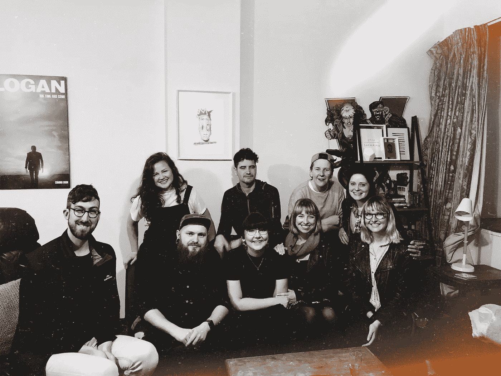

# 我创业头 12 个月的 12 个教训

> 原文：<https://medium.datadriveninvestor.com/12-lessons-from-my-first-12-months-of-business-bd8c98542793?source=collection_archive---------62----------------------->

本周，我已经正式全职运营[黑人&白人工作室](http://blackandwhitestudios.nz/)一年了！(欣赏我和我的朋友们庆祝里程碑的俗气合影&！)为了庆祝，我想分享一下我在过去 12 个月里学到的 12 件事，这些事可以帮助其他人做生意！

# 1.雇用一个好会计

我会大声疾呼，但你应该做的第一件事就是雇佣一名会计师。有太多的会计、税收和所有金融方面的东西，你没有时间去学习，也不能出错。当你经营一家企业时，管理你的财务是一个全新的游戏，所以一个好的会计师会一次又一次地为自己买单，而且(无论如何在新西兰)你可以把它作为业务费用报销，所以就这么做吧！

# 2.理解这些数字并掌握它们

如果你有一个会计，这并不意味着你可以忽略这些数字。当然，他们会帮你很多，但是如果你不明白他们在谈论什么，那就没什么用了。尽你所能了解你的财务状况和生意中的其他数字，并与他们保持联系。跟踪对你的业务很重要的事情(客户、项目、关注者、参与度等)，并定期查看它们是如何变化的。您将能够感受到企业的脉搏，并做出更好的决策！

# 3.享受自由，但拥抱某种结构

当我第一次开始全职为自己工作时，我非常兴奋可以穿着睡衣睡觉，穿着睡衣工作，想休息就休息。这并没有持续太久，因为我很快意识到这样工作效率不高，也不能帮你支付账单。自主创业的神奇之处在于，你可以灵活安排自己的时间，以最适合自己和自己生活方式的方式工作，但你仍然需要保持某种结构和时间表，才能做到最好。我起得相对早，早上有一个非常固定的日程，知道一天中什么时候对某些类型的工作最有效率，但我仍然给自己一个奢侈的下午，在我姐姐休假的时候陪陪她，或者教一堂课或开一个研讨会。一切都是为了平衡！

# 4.更好地了解自己

随着更好地了解自己，我学会了最有效率的方法和最适合我的惯例。我很喜欢好的性格测试，我认为每个人都可以从了解他们如何工作和为什么工作中受益。知道我是一个 [INFJ-T(内向、直觉、感性、判断、狂暴)](https://www.16personalities.com/infj-personality)并阅读大量相关资料，不仅帮助我更好地了解自己，我如何最好地工作，我作为朋友、合作伙伴和企业主是什么样的，为什么，而且帮助我在这些事情上不感到孤独！它帮助我理解了为自己工作是我的最佳选择，为什么是这样，我的价值观是什么，我的性格类型如何影响这些，以及我希望我的企业如何以此为基础运行。我不建议做一些性格测试，阅读更多关于它们的内容，写日记来处理和理解你的感受，花更多的时间和自己在一起来了解你是谁以及为什么！

# 5.坚持你的价值观

一旦你开始了解你自己和你的企业，你将有希望更多地了解你作为一个企业的价值观，尽可能地坚持这些价值观是很重要的。当你刚入行时，接受任何工作，在任何你能做的地方工作，做一些不太适合你的事情，这很有诱惑力，对此我完全感到内疚。为了一些额外的金钱、人际关系或新项目而暂时牺牲你的价值观似乎是值得的，但从来都不是。这样做只会让事情变得困难、不舒服和令人心烦。我知道这很难，但是坚持你的价值观，这不仅会强化你的品牌，而且在这个过程中，你会对自己的工作更加开心和满意。

# 6.学会说不

坚持你的价值观通常意味着不得不对一些事情说不。众所周知，我不擅长对事情说不，因为我只是想帮助每个人，但这实际上对我的工作、我的业务和我的心理健康非常有害。有时一个项目不符合你的价值观、你的时间表或你的服务，不管拒绝它有多难，重要的是你要真正评估你是否应该接受它。经济学家蒂姆·哈特福德(Tim Hartford)一针见血地解释说[‘对一件事说好就意味着对你当时可以做的其他事情说不。’](https://www.girlboss.com/life/pamela-druckerman-book)你会接手一个新项目，却没有那么多时间为现有客户做好工作吗？你会在活动上发言，而不是和你的伴侣约会吗？当你应该给自己留点时间的时候，你会通宵工作吗？坚持这些价值观，学会对不一致的事情说不。

# 7.对让你兴奋的事情说“是”

经营企业就是要学会说不，但也要学会在有趣的机会出现时说是，让你兴奋不已！我全职经营黑白工作室，但我也花时间在梅西大学辅导了几个学期的字体设计，成为惠灵顿设计大会的主持人，在惠灵顿市议会设计团队做了三个月的合同，参加了几个播客和其他有趣的事情！这些都符合我的兴趣、技能和价值观，我很兴奋，所以我答应了！经营自己的企业的奇妙之处在于，你可以做这些事情，并在新的机会出现时尝试它们，为什么不呢？！

# 8.永远不要停止学习

尝试这些新的东西，一是因为我对它们感兴趣，二是因为我喜欢学习新的东西，我认为你永远不应该停止学习。作为一个企业主，有太多的东西需要你去学习，但是学习你想学的东西也很重要！如果你停止学习，你的业务将停滞不前，你不会与行业一起成长，你会很快厌倦。我订阅了 [Skillshare](https://skl.sh/2N4eLDz) ,这样我就可以上课学习新技能，我阅读了大量关于思维、商业和创造力的书籍，我参加研讨会、会议和演讲活动，向同行业和其他行业的其他人学习，我加入了一个负责任的小组，在那里我可以向我的同事学习，我不断鞭策自己在任何可能的地方学习！这很有趣，有助于你发展业务，并激励你跳出框框。

# 9.寻找工作伙伴。

我是一个名为[目标粉碎者俱乐部](https://goalcrusherclub.com/)的团体的成员，在这个团体中有一个较小的责任团体。这一群富有创造力的企业主回答彼此的问题，帮助解决不可避免的业务恐慌，庆祝彼此的胜利，让我们所有人都负起责任，并每月召开审查会议，以跟踪指标并共同设定目标。身边有能激励和支持你的人(即使是虚拟的)是非常重要的。即使对于像我这样内向的人来说，独自工作也会感到孤立和孤独，尤其是如果你周围的人都有“传统”的工作，并且不真正理解你的工作需要什么。我很感激我可以和这些人交流想法，问问题，发泄，庆祝和聊天。我也有一些自由职业者和学习的朋友，我喜欢和他们一起在咖啡馆、共同工作空间或我的家庭工作室工作，这样我有时就有一些同伴了！

# 10.让激励和支持你的人围绕在你身边

就像你身边有其他企业家一样有价值，你也需要那些让你感觉更好的人，当你需要大哭一场、大笑一场或发泄一场时，他们会在你身边，或者一路上激励你。我的两个最好的朋友不是设计师，他们是作家和律师，但是和他们在一起激励了我很多！他们总是在周六吃早午餐，看一部少女电影，或者在周五晚上喝酒，他们在那里是为了眼泪，笑声和咆哮。我的父母是有史以来最支持我的人，他们也经营着自己的事业，所以与他们见面总是一个完美的情绪助推器。我也有一个可爱的、快乐的、支持我的伴侣，他总是在我身边，帮助我保持理智，在我有压力的时候帮助我，陪我欢笑、庆祝和同情，同时用他的音乐天赋、努力工作和英俊的外表激励我；)无论你的人是谁，都要感激他们，尽可能多花时间和他们在一起。他们可能不会直接参与你的业务，但他们是你成功的重要因素。

# 11.人脉很广

现在，我不是一个天生喜欢人群、聚会或任何真正涉及一大群陌生人的事情的人，但人际关系网对你的业务来说是如此有价值和不可或缺，尤其是在开始的时候。几乎我所有的客户都是通过口耳相传和推荐来找我的，所以这真的是关于你认识谁的问题！去参加你所在行业和你客户所在行业的活动，认识一些人，尽可能花时间和他们在一起。你会从这些人身上学到很多东西，扩大你的人脉，谁知道这种联系会带来什么呢！几年前，我遇到一个人，他推荐了我现在的大部分客户，还有我遇到的一些不断回来的客户！人脉是关键。

# 12.照顾好你自己

经营自己的企业是如此的值得和令人难以置信，但它也可能真的很难，尤其是如果你是独自解决的话，所以照顾好自己是至关重要的。当你在自己的公司时，你的生意运转得最好，所以花时间确保你在身体上、精神上和情感上都很好。例如，我经常偏头痛，对奶制品和麸质过敏，生活在持续的压力状态中。我很快认识到，如果我不花时间记录我的感受，吃健康的食物来补充我的能量，睡去我的偏头痛，掌控一切，那么如果发生这种情况，我不只是增加压力，休息一下和朋友在一起，离开屏幕一段时间以及所有这些小事，我就不会达到最佳表现，因此我的事业也不会。你和你的健康是最重要的事情，所以总是把它放在第一位，你的生意可以生存下来，当你没事的时候会做得更好。

到目前为止，你学到了什么？请在下面的评论中告诉我！或者分享一下你可能会采取的行动吧！

*原载于 2018 年 10 月 24 日*[*【www.holliearnettdesign.com】*](https://www.holliearnettdesign.com/home/2018/10/24/12-lessons-from-my-first-12-months-of-business)*。*