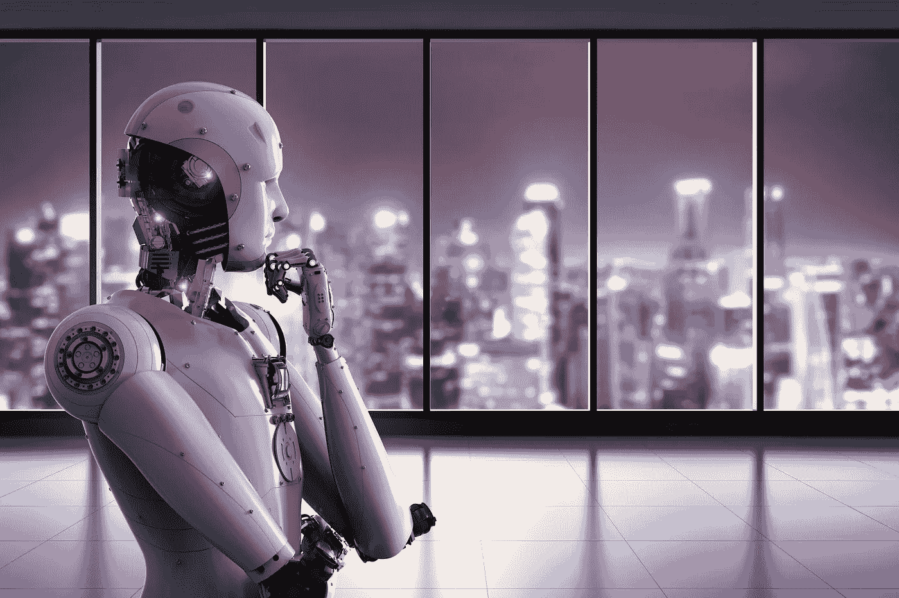

# 12 个组织将人类从人工智能的黑暗面中拯救出来

> 原文：<https://medium.datadriveninvestor.com/12-organizations-saving-humanity-from-the-dark-side-of-ai-bce8c9da1ea5?source=collection_archive---------0----------------------->

*本文原载于*【Lighthouse3.com】

*人工智能(AI)可以帮助做许多令人难以置信的事情，从检测癌症到驾驶我们的汽车，但它也提出了许多问题，带来了新的挑战。著名物理学家斯蒂芬·霍金曾告诉 BBC，“全人工智能的发展可能意味着人类的终结。它会自己起飞，以越来越快的速度重新设计自己。受到缓慢生物进化限制的人类无法竞争，并将被取代。”*

* [## 挑战你对人工智能和社会的看法的 4 本书——数据驱动的投资者

### 深度学习、像人类一样思考的机器人、人工智能、神经网络——这些技术引发了…

go.datadriveninvestor.com](http://go.datadriveninvestor.com/4AI1) 

确保向人工智能时代的过渡仍然有益于人类仍然是我们这个时代最大的挑战之一，这里有 12 个组织致力于将人类从人工智能的黑暗面中拯救出来。

1.  算法正义联盟(Algorithmic Justice League)是一个集体发起的组织，旨在消除人工智能算法中的人类偏见，这些偏见可能导致排斥性体验和歧视性做法。它侧重于 3 个关键领域:1)通过媒体、艺术和科学强调算法偏差；2)为人们提供空间来表达对编码偏差的关注和体验；3)在编码系统的设计、开发和部署过程中发展问责制实践。[https://www.ajlunited.org](https://www.ajlunited.org)
2.  纽约大学的 AI Now Institute 是一个跨学科的研究中心，致力于理解人工智能的社会意义。他们的工作集中在四个核心领域:权利自由、劳工自动化、偏见包容、安全关键基础设施(T21)。[https://ainowinstitute.org](https://ainowinstitute.org/)
3.  **负责任机器人基金会**负责任机器人基金会的使命是塑造负责任机器人和人工智能(AI)设计、开发、使用、监管和实施的未来。[https://responsiblerobotics.org](https://responsiblerobotics.org/)
4.  **人工智能伦理实验室**汇集了来自不同学科的研究人员和从业人员，以检测和解决人工智能中与伦理设计相关的问题。该实验室位于美国和土耳其，为人工智能相关技术的伦理设计提供了一种全面的方法。他们的目标是通过从设计和开发的最早阶段就整合道德规范来促进技术发展，从而实现行业和社区的共同利益。http://aiethicslab.com
5.  **AI4ALL** 是一个致力于增加人工智能多样性和包容性的非营利组织。我们通过美国和加拿大各地的教育和导师计划为未被充分代表的人才创造渠道，这些计划为高中生提供早期接触人工智能的机会，以造福社会。我们的愿景是由一群为了人类的利益而推进人工智能的思想家和实干家来开发人工智能。[http://ai-4-all.org](http://ai-4-all.org/)
6.  开放机器人伦理研究所(ORI) 从不列颠哥伦比亚大学主办的国际机器人伦理智库开放机器人伦理倡议中分离出来。自 2012 年成立以来，ORI 一直在探索自动驾驶汽车、护理机器人和致命自主武器系统领域的机器人伦理问题，采取利益相关者包容性的方法来解决这些问题。[https://www.openroboethics.org](https://www.openroboethics.org/)
7.  **开放 AI** 专注于发现并颁布通往安全人工通用智能的道路。OpenAI 为创建安全的 AGI 进行基础性的长期研究。该组织为培训、基准测试和人工智能实验开发免费软件。[https://openai.com](https://openai.com/)
8.  **人工智能合作伙伴关系**的成立旨在研究和制定人工智能技术的最佳实践，促进公众对人工智能的理解，并为人工智能及其对人类和社会的影响的讨论和参与提供一个开放的平台。它目前有 70 多个合作伙伴，包括亚马逊、大赦国际、苹果、谷歌、IBM、微软等。[https://www.partnershiponai.org](https://www.partnershiponai.org/)
9.  **未来生命研究所**是一家慈善和外联组织，致力于确保未来最强大的技术造福人类。它目前正专注于保持 T2 人工智能的益处，同时探索降低 T4 核武器和生物技术风险的方法。[https://futureoflife.org](https://futureoflife.org/team/)
10.  **机器智能研究所(MIRI)** 是一个研究智能行为的数学基础的非营利性研究机构。他们的任务是为通用人工智能系统的简洁设计和分析开发正式的工具，目的是在开发这些系统时使它们更安全、更可靠。[https://intelligence.org](https://intelligence.org/)
11.  **电气和电子工程师协会(IEEE)** 发起了一项[全球倡议](https://standards.ieee.org/industry-connections/ec/autonomous-systems.html)关于人工智能和自主系统设计中的伦理考虑。它是新标准和解决方案、认证和行为准则的孵化空间，并为智能技术的道德实施建立共识。[https://standards . IEEE . org/industry-connections/EC/autonomous-systems . html](https://standards.ieee.org/industry-connections/ec/autonomous-systems.html)
12.  领先的教育机构像牛津大学([人类未来研究所](https://www.fhi.ox.ac.uk/))、剑桥大学( [Leverhulme 未来智能中心](http://lcfi.ac.uk/))、柏克莱大学([人类兼容人工智能中心)](https://humancompatible.ai/)、圣克拉拉大学([马库拉应用伦理中心](https://www.scu.edu/ethics/focus-areas/technology-ethics/))和许多其他机构都有致力于了解人工智能的长期影响并探索让它造福人类的方法的项目。

如果还有我错过的，请留言。

米娅·丹德是 Lighthouse3.com 战略研究咨询公司**的首席执行官，该公司位于旧金山湾区。Mia 是一位经验丰富的营销领导者，他帮助 F5000 公司利用数字和新兴技术进行大规模创新。她为谷歌、赛门铁克、惠普、易贝等全球品牌构建并领导了新兴技术项目。Mia 是科技多样性包容的有力支持者。你可以在推特* [*@MiaD*](https://twitter.com/MiaD) 上联系到她*

# *DDI 推荐阅读:*

*   *杰里·卡普兰的《人类无需申请:人工智能时代的财富和工作指南》*
*   *马克斯·泰格马克 [*生活 3.0:成为人工智能时代的人类*](http://go.datadriveninvestor.com/daib04/mbmp000107)*
*   *[*Python 人工智能:为 Python 初学者和开发者构建智能应用的综合指南*](http://go.datadriveninvestor.com/daib09/mbmp000107) 作者 Prateek Joshi**