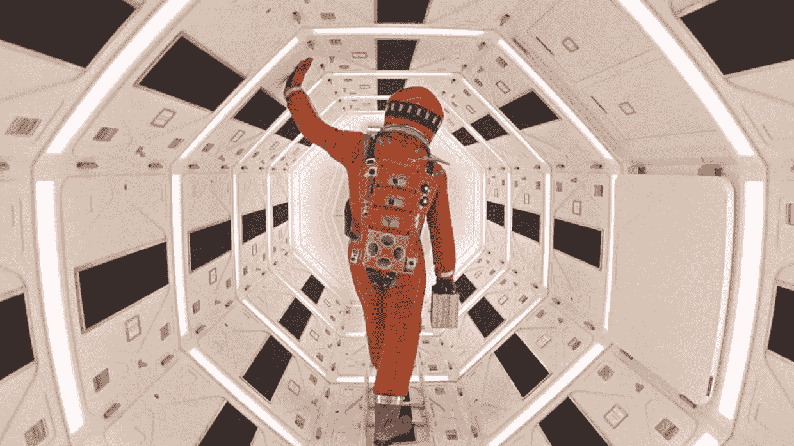

# “对不起，戴夫，恐怕我做不到”

> 原文：<https://medium.datadriveninvestor.com/123-e32aa90ba472?source=collection_archive---------0----------------------->

1968 年，电影史上最令人不安的电影之一上映了。伪装成一部科幻电影，来自斯坦利·库布里克的思想，改编自亚瑟·C·克拉克在 1948 年写的一个故事，名为哨兵，关于人类的未来，技术或人工智能，以及其他主题。逻辑上我们说的是《2001，太空漫游》。

很可能，当时最吸引观众注意的事情之一是电脑的出现，作为剧情中的一个活跃角色。HAL 9000 不仅是一台计算机，在 60 年代是非常不寻常的东西，而且它能够在不使用任何终端的情况下说话和接收命令，你只需要和他说话。哈尔 9000 在电影中向我们展示了一个有思想的存在，当时机成熟时，它能够对抗人类并拒绝服从收到的命令。

就在 1968 年，一群科学家，其中包括文顿·瑟夫、保罗·巴兰、拉里·罗伯特或伦纳德·克兰罗克，正在为后来被称为互联网的东西奠定基础。

五十年后，我在电脑上写下这些文字，同时命令 Alexa 播放“2001，太空漫游”的原声音乐，并让我的 Google Home Mini 打开花园的灌溉系统。很容易看出 HAL 和 Alexa 之间的相似之处，也更容易思考我们将要走的路。

在这五十年里，我们经历了互联网通信领域的一场革命，也经历了图形用户界面的诞生和消亡，它是与计算机通信的一种基本形式。

事实上，此刻我与电脑互动的方式屈指可数，我们已经体验到了第一次令人满意的语音界面。目前，我们只能与位于家中或工作场所特定位置的智能扬声器进行交流，但在未来几个月，各种带麦克风和扬声器的设备将会出现，接受我们的订单。在很短的时间内，我们的汽车、我们的家和我们的办公室将由语音命令来控制。

我敢肯定，未来几年我们看到的并不是一切都是好的，我们会有很多安全问题，人们会把技术用于邪恶或直接用于胡说八道，但我毫不怀疑的是，我们正面临着生活方式的改变，至少，随着网络的发展和互联网的普及，我们生活在 90 年代的水平。

在这部电影的视频序列中，我们看到哈尔如何反抗人类，不再是我们以前见过的有用的机器人/计算机。主宰互联网的大公司控制我们生活的那一天会到来吗？

也许那一天已经到来了……-)