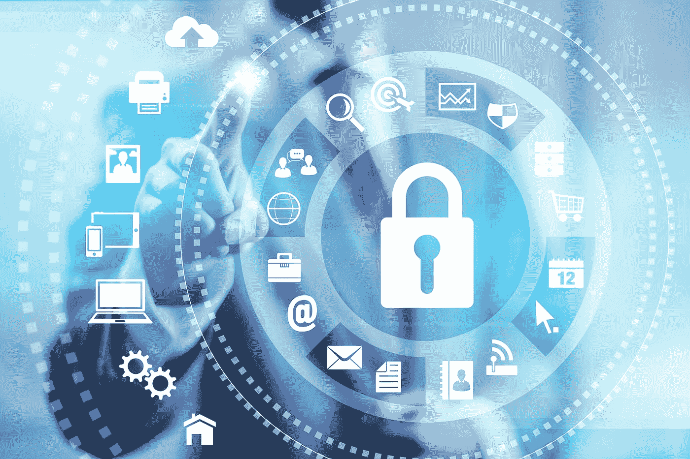
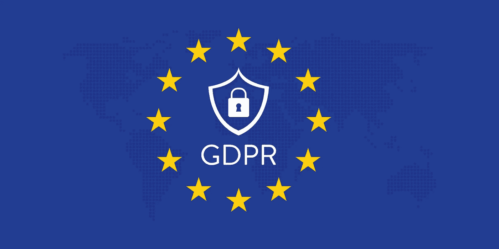

# #15 医疗保健领域的网络安全

> 原文：<https://medium.datadriveninvestor.com/15-cybersecurity-in-healthcare-efe9779d0247?source=collection_archive---------17----------------------->

近年来，网络安全作为一个新闻话题获得了更大的关注。这在很大程度上是由于某些大公司的不良行为以及匿名黑客的便利工作。在 Checkmate 团队，我们认为讨论当前的形势和未来可能的样子是很重要的。去年，脸书因其在剑桥分析公司丑闻中的角色而处于网络安全讨论的风口浪尖。他们的平台允许开发人员从 5000 万人中挖掘数据，为 2015 年美国总统选举建立“心理学”档案。从那以后，一些世界上最大的科技公司，比如谷歌和推特，被带到国会讨论他们的网络安全和数据管理实践。技术在医疗保健中发挥着比以前更大的作用。医院和卫生组织每天都在收集大量的敏感数据，因此人们会认为他们在组织和保护这些数据方面是谨慎的。

 [## 大笔资金和尖端技术:人工智能/人工智能投资将如何革新医疗保健…

### 在过去几年人工智能(AI)和机器学习(ML)的显著发展中…

www.datadriveninvestor.com](https://www.datadriveninvestor.com/2018/03/22/big-money-and-cutting-edge-technology-how-investment-in-ai-ml-will-revolutionize-the-healthcare-industry/) 

根据 Becker 的《医院评论》( Hospital Review ),数据泄露每年给医疗保健行业造成 56 亿美元的巨大损失。**【2】**这个数字表明他们的数据安全实践与当前环境不同步。他们是否在努力追赶其他行业？如果是，他们如何弥补差距？

医疗保健行业不断受到不必要的数据泄露的困扰。连续第八年，美国医疗机构的数据泄露相关成本是所有行业中最高的。平均而言，每张丢失或被盗的唱片要花费 408 美元。这几乎是跨行业平均水平 148 美元的三倍。 **[3]** 由于所收集数据的个人性质，医疗机构特别容易受到网络攻击。但是通常错误不在于技术本身，而在于使用它的人。

波多黎各保险公司 Triple-S 在 2018 年意外将患者信息通过电子邮件发送给了超过 36，000 名会员。这不是第一次三重失误了。从 2010 年到 2014 年，他们的数据被破坏了 8 次。波多黎各当局对此并不满意，对他们处以 500 万美元的罚款。独立蓝十字会将 17000 名会员的个人信息上传到他们自己的网站上，在没有人发现之前，他们在网站上停留了三个月。在当地，数据保护专员一直在调查医院的网络安全措施。去年 5 月，他们发布了一份报告；医院部门的数据保护调查。这似乎是全球趋势，报告发现爱尔兰医院没有适当地保护他们的数据。在被检查的 20 家医院中，发现了 259 个风险，从缺乏适当的审计跟踪到员工“窥探”。一家未透露姓名的医院允许实习医生在未经患者本人同意的情况下访问患者的私人数据。**【5】**由于这种懒散的数据安全方法困扰着组织和个人，欧盟在去年五月引入了 GDPR。

GDPR 的主要目标是允许个人控制他们自己的数据，同时还制定了易于遵循的简单立法。GDPR 大幅加强了欧盟国家的网络安全法律。每个组织都必须遵守这项立法，否则将受到处罚。在健康数据方面，GDPR 在确保充分保护方面更进了一步。与健康、遗传数据和生物特征数据相关的数据被归类为敏感个人数据。**【6】**除非满足明确的条件，否则无法访问或处理这种特定类型的数据。GDPR 实施的额外保护将确保大大减少与健康相关的个人数据的滥用。

我们将军会团队也尽了自己的一份力量。丹尼尔目前正在与 FibroIreland 开发一款医疗保健应用，作为他在三一学院最后一年的一部分。丹尼尔的应用程序结合了健康信息学(管理患者医疗保健信息)和网络安全领域。该应用程序将允许患者通过门户网站跟踪他们的健康记录。数据控制权移交给病人，病人可以看到谁查看了他们的记录，如果有必要，可以报告可疑活动。丹尼尔的应用程序是医疗保健领域提高意识和安全性的主要趋势的一部分。一旦应用程序发布，我们一定会向您提供更多详细信息！

医疗保健行业越来越依赖数据和分析来满足现代患者的需求。我相信，现代患者对他们的医疗保健提供者有一定的期望，令人失望的是，某些做法发展如此缓慢。我希望随着 GDPR 在欧洲的引入和对网络安全的普遍认识的提高，将为医疗保健的未来创造一个安全的环境。

洛坎，

团队将死

# 参考

1.  梅雷迪思，山姆(2018)。*脸书剑桥分析丑闻:你需要知道的一切*【在线】可在:*[https://www . CNBC . com/2018/03/21/Facebook-Cambridge-analytic a-scavenge-Everything-you-need-to-know . html](https://www.cnbc.com/2018/03/21/facebook-cambridge-analytica-scandal-everything-you-need-to-know.html)*
2.  *健康信息学(2019)。网络安全:在医疗保健方面如何提高？[在线]请访问:[https://health informatics . UIC . edu/blog/cyber security-how-can-it-be-improved-in-health-care/](https://healthinformatics.uic.edu/blog/cybersecurity-how-can-it-be-improved-in-health-care/)*
3.  *布莱恩，梅格(2018)。*医疗保健行业在数据泄露成本方面领先*[在线]请访问:[https://www . healthcaredive . com/news/health care-sector-leads-in-costs-for-data-breakes-study-finds/527716/](https://www.healthcaredive.com/news/healthcare-sector-leads-in-costs-for-data-breaches-study-finds/527716/)*
4.  *亚伯拉罕，托尼(2019)。*2018 年 5 大最恐怖健康数据泄露事件*【在线】可在:[https://www . healthcaredive . com/news/5-scarist-health-data-breakes-of-2018/544834/](https://www.healthcaredive.com/news/5-scariest-health-data-breaches-of-2018/544834/)*
5.  *伊莱恩·爱德华兹(2017)。*医院工作人员在未经同意的情况下获得患者研究记录的报告*【在线】可在以下网址获得:[https://www . Irish times . com/news/Ireland/Irish-news/Hospital-staff-given-access-to-patient-records-for-research-report-1.3502857](https://www.irishtimes.com/news/ireland/irish-news/hospital-staff-given-access-to-patient-records-for-research-without-consent-report-1.3502857)*
6.  *趋势科技(2018)。*患者与隐私:医疗保健机构的 GDPR 合规*[在线]可从以下网址获得:[https://www . trend micro . com/vinfo/dk/security/news/online-Privacy/Patients-and-Privacy-gdpr-Compliance-for-health care-Organizations](https://www.trendmicro.com/vinfo/dk/security/news/online-privacy/patients-and-privacy-gdpr-compliance-for-healthcare-organizations)*