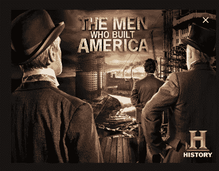

# 从观看《建设美国的人》中学到的 15 条强有力的商业经验

> 原文：<https://medium.datadriveninvestor.com/15-powerful-business-lessons-from-watching-the-men-who-built-america-1bfcc831879a?source=collection_archive---------4----------------------->

不久前，我看了一部名为《建设美国的人》的纪录片。

这部纪录片是任何企业家必看的。

 [## 在创业之旅中，拥抱学习|数据驱动的投资者

### 好像建立一个数百万美元的公司还不够困难，企业家必须额外照顾他们的…

www.datadriveninvestor.com](https://www.datadriveninvestor.com/2018/10/16/on-the-entrepreneurial-trek-embrace-the-learning/) 

以下是我从观看这部纪录片中得到的 15 条重要经验。

# 第 1 课，共 15 课

## 运输行业将永远是**的常青树。**

范德比尔特从航运转向铁路业务，并围绕这一业务建立了一个帝国。

在他之前，许多人靠骆驼和马发了财。

现在，像埃隆·马斯克和布兰森爵士这样的人是运输业的两位亿万富翁。

许多其他人，如优步的创始人和其他形式的运输企业的所有者，已经赚了数百万。

这个市场总是产生高需求和常青的生意。

# 第二课，共 15 课

## 永远把你的生意想在前头。

范德比尔特总是在思考和想象。

他从航运业转向铁路业是出于**T5 的超前思考。**

他进军石油行业也是超前思维的结果。

提前考虑。你的竞争对手在思考。想得更远。

# 第 3 课，共 15 课

## 拥有只有你能控制的资产

有一次范德比尔特击落了通往纽约的铁轨。

这一行动重创了其他企业，并帮助他以极低的价格收购了其他铁路公司。

现在，这可能不会再飞了，因为法规和所有这一切。

但你可以拥有专利或专有技术的权利，这让你比其他公司更有优势。

想想吧。

# 第 4 课，共 15 课

## 见多识广。获取知识

范德比尔特了解了克利夫兰的炼油厂和石油，并计划在那里扩建他的铁路线。

在这个时代，信息仍然是关键。

你所知道的给了你优势。

难怪比尔·盖茨、沃伦·巴菲特和顶级企业家会花费大量的金钱和时间来更新自己的最新知识。

你在看书吗？你在关注你的行业吗？

# 第 5 课，共 15 课

## 为更多的人服务，赚取更多

创业是为了解决问题，服务于人。

范德比尔特围绕服务人们和他们的需求建立了自己的企业。

每个人都需要交通工具。

想想早期的汽车和亨利·福特。

想想埃隆·马斯克和电动汽车。

认为电脑认为比尔盖茨。

想想脸书，想想扎克伯格。

任何公司、产品或服务，只要能服务或接触到大量的人，就会赚很多钱。

# 第 6 课，共 15 课

## 前进总是会遇到困难

每个机会都伴随着挑战。事情不会因为你有一个好主意就迎刃而解。

为了应对困难，你需要正确的心态。范德比尔特失去了他的儿子。他也被骗了钱。

他可能还有其他困难，但他从未放弃。他一直在推。

创业并非没有风险和困难。你的心态让你不断努力并取得胜利。

我看过一个视频，里面埃隆·马斯克一直在说“我永远不能给予。我从不放弃。我宁死也不放弃”

什么态度。你有那种固执吗？

心态决定一切。

# 第 7 课，共 15 课

## 如果你做不到或者没有，那就找个搭档

范德比尔特没有炼油厂，但他想进入这一行业，以维持他的火车业务。

所以他和洛克菲勒达成了协议。苦苦挣扎的石油人。

他知道他可以和洛克菲勒达成交易。

你可以和谁或哪家公司达成交易来拓展你的业务？

# 第八课，共十五课

## 每个问题都是机会

约翰·洛克菲勒需要投资者来扩大他的炼油厂，以达到他与范德比尔特交易的目标。

但是有一个问题。

煤油爆炸并烧毁房屋。

他没有放弃和抱怨，而是将此视为一个机会。

他召集投资者，向他们推销“标准石油”的理念。

投资者报名了。他达到了目标。

***记住问题是伪装的机会。***

# 第 9 课，共 15 课

## 学习如何销售

不会销售的企业家会失败。句号。

洛克菲勒能够向投资者推销他的想法。

如果他失败了，他与范德比尔特的交易就会告吹。

所以要学会亲自推销。印刷和使用其他媒体。

这是一种技能。学会它。

文案是我的强项。所以我想我在路上了。

# 第十课，共十五课

## 总会有出路的

当铁路企业主试图把洛克菲勒逼到墙角并把他打倒的时候。

他想到了另一个办法——*用管道运输煤油。*

他做到了。

在你的生意中，你会面临挑战。只要知道总有出路。

想想吧。想想吧。想想吧。

# 第 11 课，共 15 课

## 承担合理的风险

商业游戏是一场风险游戏。预计风险。

投资的风险。尝试新想法的风险。

尝试新事物的风险。

洛克菲勒通过管道运输煤油的计划很冒险……但如果成功的话，他会变得异常富有。

你厌恶风险吗？

承担适当的风险。报酬丰厚。

# 第 12 课，共 15 课

## 迅速发现可以成为主流的新想法。

JP 摩根想要一个他可以引入并主导的行业。

所以他与发明家托马斯·爱迪生合作销售电力和电灯泡。

他看到了一个新的机会，就开始了。这是一个风险，也是对普通煤油灯的巨大改变。

让你的眼睛和头脑对新的金融投资机会保持开放。

你只需要一个想法。

# 第 13 课，共 15 课

## 寻找可能与你的业务竞争的新想法

电灯泡和电力的发明将直接竞争并扼杀约翰·洛克菲勒的煤油生意。

他注意到并知道这可能发生。所以他采取了行动。

留意即将到来的对你不利的事情，并开始采取新的行动。

# 第十四课，共十五课

## 展示销售

有一次我和一个销售软件的客户一起工作，我向他透露了这个销售/文案的秘密。

*“如果你能演示某样东西是如何工作的，你就能很快卖出去”*

爱迪生的徒弟尼古拉有另一种发电的方法。他产生了交流电。

他辞职了，找了一个合伙人创办了另一家电气公司。

为了让人们相信交流电是无害的，他让电流通过他的身体来证明这一点。

订单开始蜂拥而至。

如果你展示你的产品或服务，你就会创造销售。

# 第十五课，共十五课

## 每一个变化最终都会带来机遇

变化总会到来。人们会产生新的想法和创新。

你无法阻止它。

每当变化来临时……金融机会就会随之而来。

在这部纪录片中，你会看到交通工具是如何从马匹发展到铁路，然后发展到依靠原油产品的汽车。

在这个新时代，我们现在有了电动汽车。很快飞行汽车将成为主流。

每个行业都会有变化。

你会拥抱你所在行业的变化并随之创造财富，还是会与之抗争并最终破产？

谢谢你。

我错过什么了吗？你还从纪录片中学到了什么？

*Mkpouto Usua 是一个帮助企业主创造销售和利润的直复文案。他撰写高转化率的广告、电子邮件和销售信函。*

*点击此链接通过* [*推特*](https://twitter.com/MkAkan) *联系到他。*