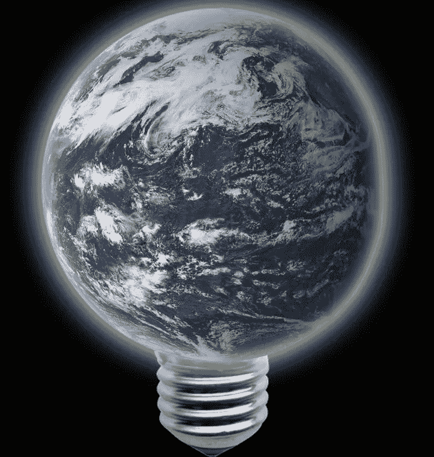
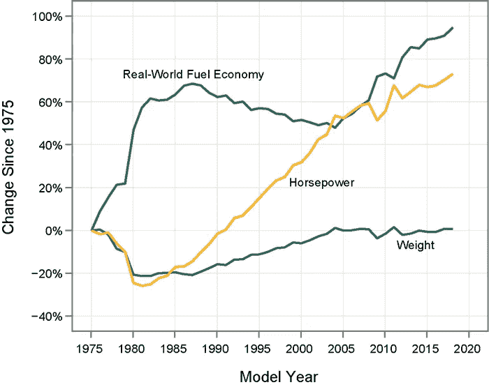
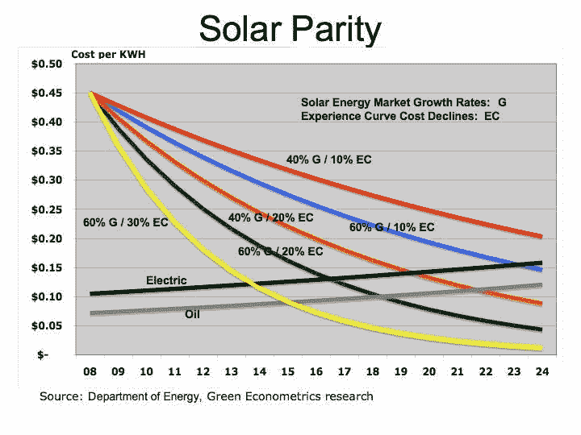
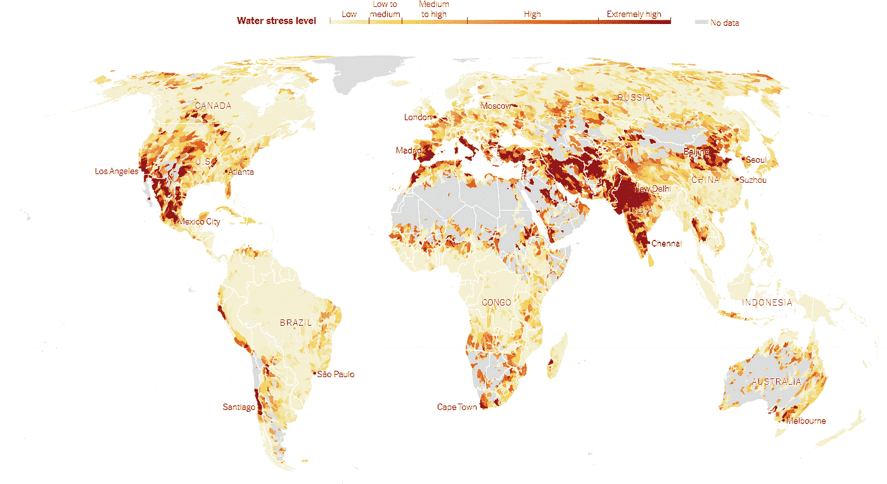

# 15 年来努力实现碳中和:技术对个人的实际应用

> 原文：<https://medium.datadriveninvestor.com/15-years-of-trying-to-be-carbon-neutral-practical-uses-of-technology-for-individuals-8cd325aa922b?source=collection_archive---------19----------------------->

Source: US Military (Air Force District of Washington)

我既是发展中国家的产物，也是发达国家的产物——我在硅谷的成年生涯形成了一个基本信念，即如果我们正确应用技术，它可以带来巨大的好处。我也相信行动比语言更响亮，我的努力之一就是保持碳平衡。这是一项从第一份薪水开始就一直在进行的工作，是一项双赢的工作，特别是从长期来看可以节省资金，并且通过消耗更少的资源来保护环境。技术是实现这一目标的关键。在过去的 15 年里，我已经实施了三个“项目”，我在这里分享这些项目，希望对我有效的项目能够激发其他人的实践洞察力。

 [## 气候变化、ESG 和对更好数据的追求|数据驱动的投资者

### 在地球上许多地方经历了另一个令人难以置信的炎热夏季后，来自 S&P 的最新发现…

www.datadriveninvestor.com](https://www.datadriveninvestor.com/2018/08/24/climate-change-esg-and-the-quest-for-better-data/) 

**1)交通——节能汽车不是未来，而是现在**

节能汽车包括氢、生物质、天然气等等，最受欢迎的是混合动力车。混合动力的定义是使用两种或两种以上不同的能源。在不同的国家，人们会用这个词来形容他们最常见的事物，例如在巴西，混合燃料汽车非常普遍。在美国，混合动力汽车几乎总是意味着汽油和电力的混合。插电式混合动力车是一种特殊的类型，你可以给电动部件充电。我们越来越多地看到纯电动汽车在商业上变得可行。力量不够的神话？今天的混合动力车和电动车可以与内燃机相媲美。

Source: EPA.gov

由于各种原因(石油补贴、进口税等)，混合动力车在世界各地还买不起，但加州至少有足够多的理由成为采纳者。我在 2004 年买的第一辆新车(本田思域)有资格获得联邦政府和州政府的退税，当时的雇主提供了一个匹配，弥补了同等非混合动力车的价格差异。2014 年的下一款车辆(丰田普锐斯)是插电式混合动力车，2018 年是升级版插电式(另一款丰田普锐斯)。旧车交易加上研究和谈判意味着前期零额外费用。这三个案例在当时都符合拼车标签的条件。在该州人口最密集的地区，交通堵塞严重，它可以成为救命稻草——它很容易地每周减少我一个小时的通勤时间。再加上节省的汽油，在插件上的投资在 3 年内就完全收回了。最后，虽然发电有成本，但燃烧更少的化石燃料意味着总体污染更少，这当然是大多数人生活/工作的地方。

**2)能源——现在人们买得起阳光了**

比较太阳能和其他能源的生产成本是复杂的，因为它受许多因素的影响，尤其是地理因素。正如你所料，在阳光明媚的亚利桑那州，太阳能电池板比寒冷的阿拉斯加更具经济可行性。也就是说，我们基本上处于一个太阳能平价的世界，即太阳能产生的能量在经济上与化石燃料相当。

我第一次涉足太阳能电池板是在 2015 年，当时联邦和州政府的退税加上估计的电力节省意味着该系统在 5 年内就收回了成本。当时的供应商(SolarCity，现在的特斯拉)还赠送了一个智能恒温器(Nest，现在的谷歌)，它可以通过控制加热和冷却来提高能源使用效率。此外，使用时间(PG&E)意味着您在一天的不同时间支付不同的电费，这是有意义的，特别是如果您在高峰时间消耗较少的电力，而在价格较高时生产。第二次进军太阳能电池板将在 2019 年进行——更便宜的价格和更高的效率意味着扩展后的系统将在 3 年内收回成本。顺便提一下，2019 年是美国房主获得全部政策福利的最后一年。生产太阳能电池板显然有成本，但与煤炭和石油的外部性相比，这些成本就显得微不足道了。

**3)水——更智能的电器可以设置更智能的默认设置**

带单冲或双冲设置的厕所(尼亚加拉公司)。喷头喷出的液体较少。水龙头里的空气。减少房屋总流量的仪表。这是四个具体的变化(由 CalWater 推动),使我家的用水量减少了近 50%。我们仍然可以选择获得相同水位的水，只需在需要时调高设置，默认设置是较低的。

水越来越成为稀缺资源，三个月前像《纽约时报》这样的权威渠道出现“[四分之一的人类面临迫在眉睫的水危机](https://www.nytimes.com/interactive/2019/08/06/climate/world-water-stress.html)”这样的标题确实是有原因的。如下图所示，发达国家和发展中国家都面临巨大风险。

我们能保护我们的钱包和我们的星球吗？我确实从根本上认为这些住房项目对数百万个人来说是触手可及的，尤其是在世界历史上最大的经济体中。额外的资本在几年内自我赎回，有融资选择，进步政策的范围正在扩大。有其他技术支持的解决方案，个人可以自己实施吗？评论离开。

*原载于:* [*数据驱动投资人*](https://www.datadriveninvestor.com/2019/12/01/15-years-of-trying-to-be-carbon-neutral-practical-uses-of-technology-for-individuals/) *。”我是*[*Tau Ventures*](https://www.linkedin.com/pulse/announcing-tau-ventures-amit-garg/)*的管理合伙人和联合创始人，在硅谷工作了 20 年，涉足企业、创业公司和风险投资基金。这些都是专注于实践见解的有目的的短文(我称之为 GL；dr —良好的长度；确实读过)。我的许多文章都在*[*https://www . LinkedIn . com/in/am garg/detail/recent-activity/posts*](https://www.linkedin.com/in/amgarg/detail/recent-activity/posts/)*上，如果它们能让人们对某个话题产生足够的兴趣，从而进行更深入的探讨，我会感到非常兴奋。如果这篇文章有对你有用的见解，请评论和/或给文章和* [*Tau Ventures 的 LinkedIn 页面*](https://www.linkedin.com/company/tauventures) *点赞，感谢你对我们工作的支持。这里表达的所有观点都是我自己的。*