# 16 种验证和提高你的 MVP 的方法

> 原文：<https://medium.datadriveninvestor.com/16-ways-to-validate-improve-your-mvp-50f077d79af6?source=collection_archive---------6----------------------->

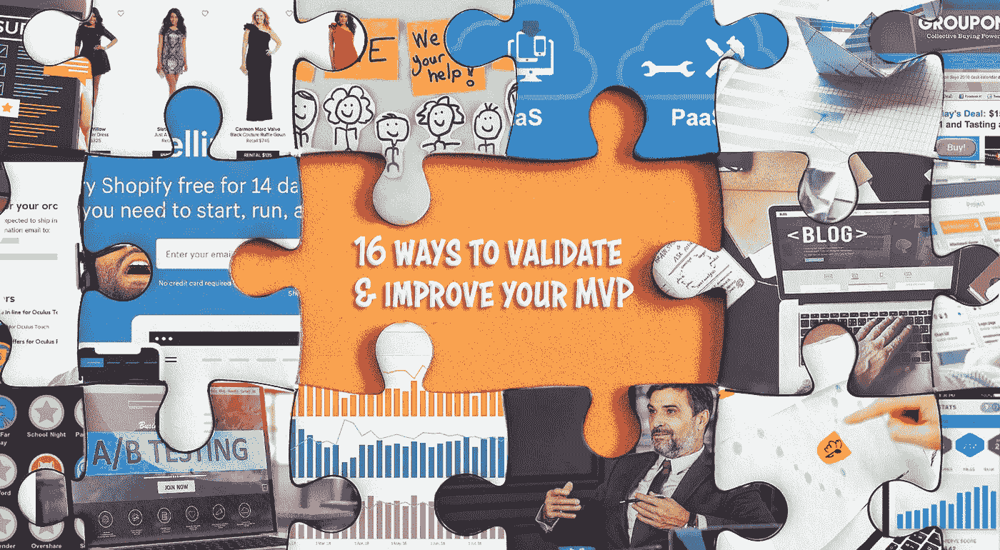

16 ways to validate and improve your MVP

在之前的博客中，我们介绍了如何利用[设计思维](https://perspectives.mobilelive.ca/blog/design-thinking-and-mvp)来创建你的最小可行产品或 MVP 然而，这只是等式的一半。

创建 MVP 背后的原因很简单，但更重要的是在分配资源之前测试和证明你的想法、概念和假设。为什么？因为它会告诉你是否应该从一开始就坚持你的想法！

 [## 2019 年即将改变世界的技术|数据驱动的投资者

### 很难想象一项技术会像去年的区块链一样受到如此多的关注，但是……

www.datadriveninvestor.com](https://www.datadriveninvestor.com/2019/01/17/the-technologies-poised-to-change-the-world-in-2019/) 

下面是过去资源是如何分配的:“我认为这听起来是一个新功能的好主意。这是您的团队、预算和交付时间表。”听起来熟悉吗？

资源应该是这样分配的:“有什么证据证明这是一个花费时间、金钱和人力的好主意？”你看出区别了吗？

构建和测试你的 MVP 是一种确保你不会在一个没有目标市场或者技术上不可行的产品上浪费宝贵资源的方法。但是你如何测试和验证你的 MVP 呢？

以下是发现你正在做的事情是否是你应该做的事情(甚至在你做之前)的最佳方法。

# 客户访谈

测试你的 MVP 的最常见和最有效的方法是从将要使用它的客户那里得到反馈和确认。这不需要一个复杂的过程，相反，简单地与产品的目标人群进行无脚本的访谈，让他们了解你的产品旨在解决的问题。

需要注意的是，这些访谈是探索性的，而不是推销你的产品。你想要诚实的答案，所以试着列出你认为你的产品能解决的问题，并询问用户他们对这些问题的看法，并按重要性排序。

这些访谈可以提供大量有价值的、最重要的、可操作的信息，因为即使你的假设被证明是错误的，而你认为对客户来说重要的并不是错误的，你也可以更好地洞察你的市场，并据此调整你的产品。

# A/B 测试

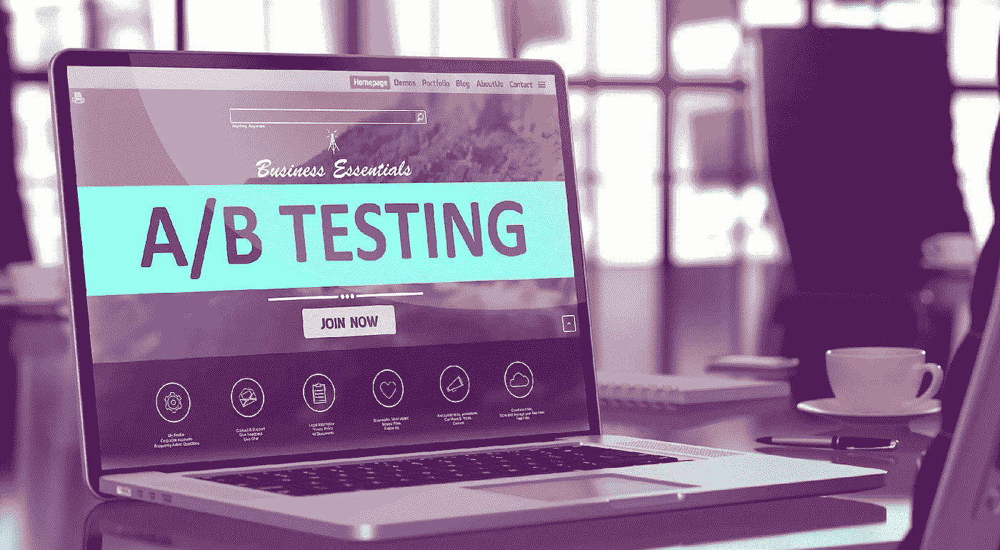

验证你的 MVP 的另一个有效方法是执行 A/B 测试。我们假设你的新产品是一个网页；然而，你有两个选择，发现自己无法决定你更喜欢哪一个。首先，你不应该做决定；相反，你应该寻求那些访问你的网页的人的帮助，来决定哪一个最能引起共鸣。

这个过程很简单，你随机将你网站的访问者引导到两个页面(A 和 B)中的一个，然后使用通过分析工具收集的数据，根据一系列指标(如使用率、网站停留时间、跳出率、转化率等)来衡量每个页面的性能。当该说的都说了，该做的都做了，你应该知道两个版本中哪一个更可取，并能引出你想要的回应；或者是时候重新开始了，除了这次，带着更大的洞察力。

# 广告活动

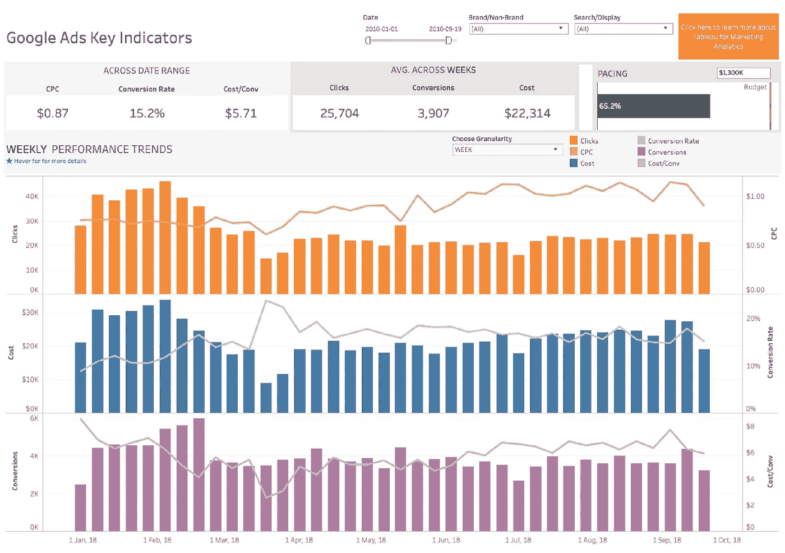

尽管这看起来有些违反直觉，但进行广告宣传是为你的 MVP 赢得认可的有效方法。像*谷歌*和*脸书*这样的平台是这类测试的理想平台，因为它们可以让你获得关于你想要的人口统计和你试图接触的特定客户的非常具体的信息。因此，它允许您运行测试来帮助确定您的产品的哪些特性或方面吸引了您希望它吸引的人。

重要的是要记住，在一天结束时，开展这些活动可能不会给你带来你希望的新产品的最佳曝光率，但就测试你的假设而言，这是无价的。

# 筹资(众筹)

如果你熟悉像 *Kickstarter* 和 *Indiegogo* 这样的网站，那么你已经接触过这种 MVP 验证的方法了。从本质上讲，这些网站只是人们最有价值的产品的集合，而验证和市场反应是通过对活动的贡献以人们的兴趣的形式出现的。

这种方法最大的吸引力之一是它结合了有效学习和产品开发筹资的优点。因此，你不仅在筹集资金(可以说是新产品开发的重要组成部分)，而且你还会发现自己拥有一群对你的产品非常感兴趣(也很投入)的早期采用者，他们也与你的产品的成功有利害关系。这不仅是获得持续反馈的好方法，也有助于传播口碑。

# 预购页面

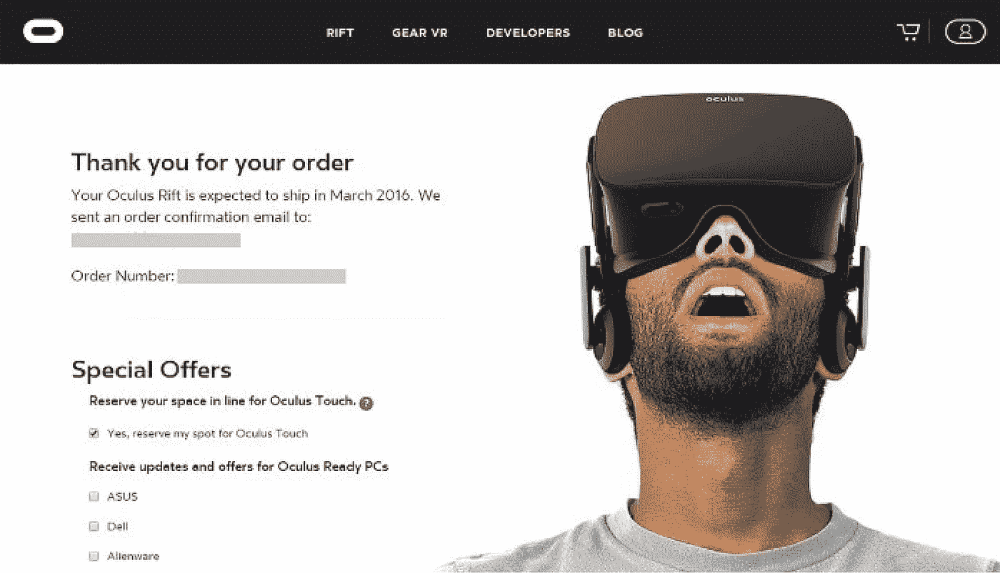

与众筹不同，预购页面已经被证明是一种非常有效的验证你的 MVP 的方式，通常是在你还没有建立它之前。

Oculus Rift 是这种方法的一个典型例子，他们甚至在开始生产之前就发布了开发套件的预购页面。这有助于他们验证他们的想法，向他们展示对产品的需求，甚至在他们制造产品之前。

但是，需要注意的是，这种方法并非没有风险。在某种程度上，顾客就是顾客，总是担心交付的产品可能与承诺给他们的产品不一样。简而言之——没有蒸汽器皿。

# 博客

MVP 验证的一个关键和基础的方面是产品团队和市场之间的开放式沟通，在我们的现代社会中，很少有双向沟通的方法像博客一样有效。

博客不仅能让你验证你的想法，还能让你通过缩小你的目标市场和评估他们的反应来验证你的想法。这带来了从一群追随者那里获得晚餐的额外好处；也就是说，假设你的博客引起了共鸣并被很好地接受。但是最好的部分是，即使它没有，您也将学习和发现有价值的信息，这些信息可以在下一次迭代中支持您的工作。

尽管通常不被人想到，博客本身可以作为产品的早期原型——最好的例子是一本书。请记住，Eric Ries 广受好评的开创性著作 *The Lean Startup* 最初是一个博客，在出版协议签署之前很久就有了读者和需求。

# 社交媒体和微观调查

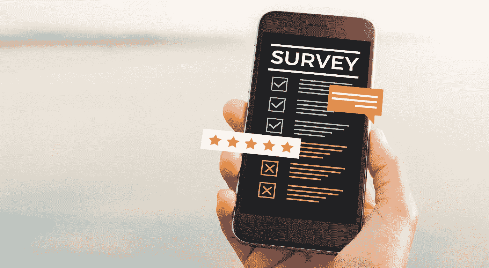

一旦你知道你的 MVP 的目标是谁，下一步就是接触他们。然而，如果你发现自己处于这个阶段，你已经取得了很大的进步——知道谁是你的目标受众是成功的一半，至少，当你利用社交媒体和微观调查时是这样。

一般来说，调查有什么问题？是低回复率、偏见、不可操作的结果，还是只是总体调查疲劳？实际上，以上都是问题，这使得你问什么问题以及问多少问题变得至关重要。

通过利用社交媒体和微观调查，你不仅会发现在你的观众可能会花时间的地方见面会有更高的回应率，而且通过只问几个简短、尖锐的问题，你会进一步发现你的回应率增加了。此外，当你利用像*脸书*调查这样的工具时，你可以让你的观众添加他们自己的选项作为答案，这可以提供一些非常有启发性的反馈。

# 电子邮件

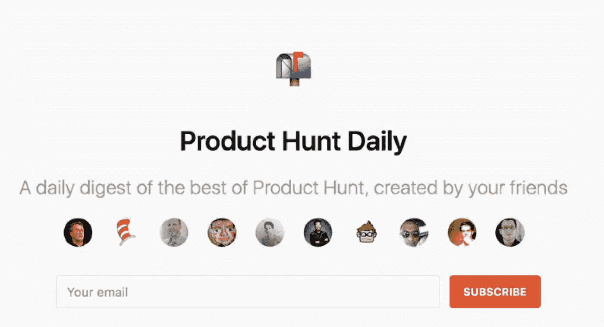

大多数人认为电子邮件是一种交流的方式，但是既然交流是 MVP 验证的核心，那么电子邮件本身也可以作为一种方法。

通常被称为受众建设，前提很简单:发送一封电子邮件，并使用工具和插件跟踪收件人的行为。有多少用户点击了链接？有多少人响应？虽然这看起来像是基本的信息，但实际上，正如这个故事所展示的，这肯定是证明你确实拥有观众的一种快捷方式。

*Product Hunt* ，一个让用户分享和发现最新科技产品的流行网站，最初是一封简单的时事通讯邮件。创始人瑞安·胡佛(Ryan Hoover)只用了 20 分钟就做好了准备，并在两周内拥有了 130 名订户，其中许多人都是硅谷有影响力的人。如果你想知道胡佛继续以惊人的 2000 万美元出售他的网站。

# 登录页面

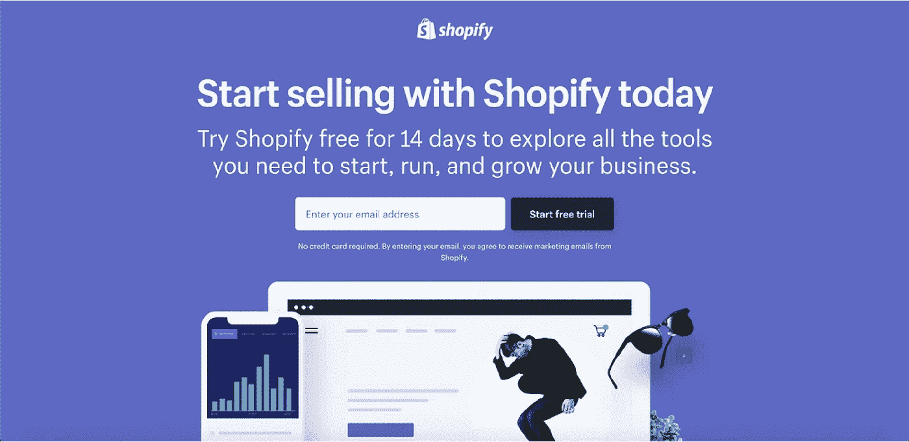

我相信大家都知道，登录页面是潜在客户了解您的产品的页面。然而，更重要的是，这是在现实市场中测试该产品并与实际用户期望相违背的一个很好的方法。

在很大程度上，登录页面似乎被用作一个精心制作的电子邮件捕获页面；然而，不必如此受限。与其用它来建立你的邮件列表，不如用它来衡量需求，甚至可以帮助确定合适的价格。

通过在功能和注册表单之间添加一个间隙页，一个显示价格表的页面(电信的理想选择)，您可以通过分析额外的点击来确定哪个价格更有吸引力，这将帮助您缩小适合市场的价格。这种方法可以与 A/B 测试相结合，帮助您进一步确定哪种“音高”最适合转换。

# 市场上有竞争力的产品

虽然我不想扫大家的兴，但事实是，你要推出的产品很有可能已经上市了；或者至少是一个非常相似的。再说一次，这不是气馁的理由；相反，这是一个以低得多的成本验证你的 MVP 的机会。为什么？因为你已经有一个产品要分析了！

如果你的产品与另一个相似，你验证的第一步应该是分析现有的产品，看看他们有什么是你的产品没有的。这是第一步，但你不应该就此止步。下一个合乎逻辑的步骤是分析你的产品有哪些是他们可能缺乏的，然后，利用这个列表上的一些其他方法，如社交媒体调查、A/B 测试等等，你可以确定你的竞争优势如何与市场产生共鸣。希望你会发现，你自己产品的独特之处正是市场所寻求的；如果没有，你有地方可以依靠。

# 手动优先(又名“绿野仙踪”)MVP

“假装成功，直到成功”这句话在创业公司中很流行；然而，有趣的是，同样的原则也可以用来验证你的 MVP。

手动优先的方法，也被称为 *Wizard of Oz* 来自于给用户一个全功能产品或服务的印象，但实际上，所有的后台工作都是手动完成的。

一个最好的例子就是大型电子商务网站 *Zappos* 。该网站的创始人尼克·斯温穆恩(Nick Swinmurn)过去常常在自己的网站上张贴当地鞋店的鞋子照片，以确定对网上商店的需求。当有人下订单时(记住这是在任何投资或基础设施建立之前)，他会直接去商店，买鞋，然后寄给顾客。

# 礼宾 MVP

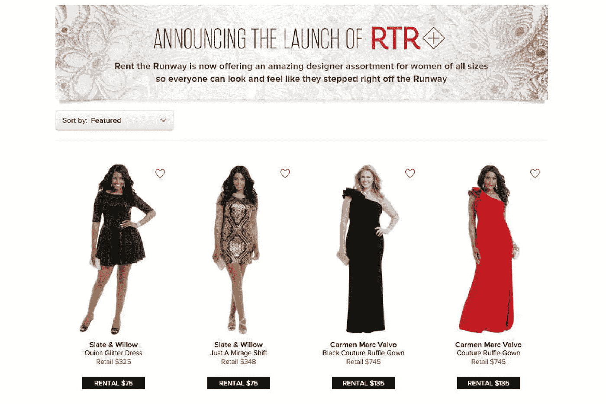

在许多方面，礼宾方法类似于人工优先的方法，除了不是伪造一个有效的产品或服务，而是提前进行人工工作，甚至更进一步，将产品作为高度定制的服务交付给选定数量的客户，因此得名“礼宾”

一家名为*出租跑道*的公司使用了这种方法。作为一家在线服装租赁公司，他们为核心人群(女大学生)提供面对面服务，任何人都可以在租赁前试穿服装。这不仅成功地传播了这个行业的信息，并为他们提供了有价值的反馈，还证实了他们最大的不确定性——女人会不会租裙子。

当你利用这种方法，而不是倾注时间、金钱和资源来构建一个真正的产品，你可以先找到你最重要的问题的答案——你是否在创造一些顾客会真正为之付费的东西。

# 零碎 MVP

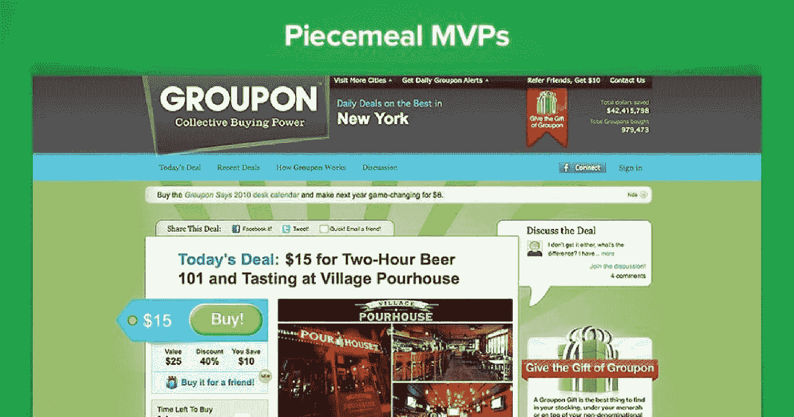

渐进 MVP 混合了手动优先和门房验证方法，需要利用现有的工具和平台来构建产品的演示。这使您能够向客户交付体验，而实际上不必自己构建任何东西。

这种方法的一个最好的例子是一个叫做 *Groupon* 的小网站。在早期，Groupon 只是一个由 *WordPress* 、*苹果邮件、*和*苹果脚本*组成的组合，当订单通过网站时，它会手动生成 pdf 文件。

这样做的明显优势是能够通过不投资创建自己的基础设施所需的时间和金钱来显著降低成本；相反，利用市场上现有的服务和平台作为基础——这个基础将有效地决定你的产品创意是否值得投资。

# PaaS & SaaS 工具公司

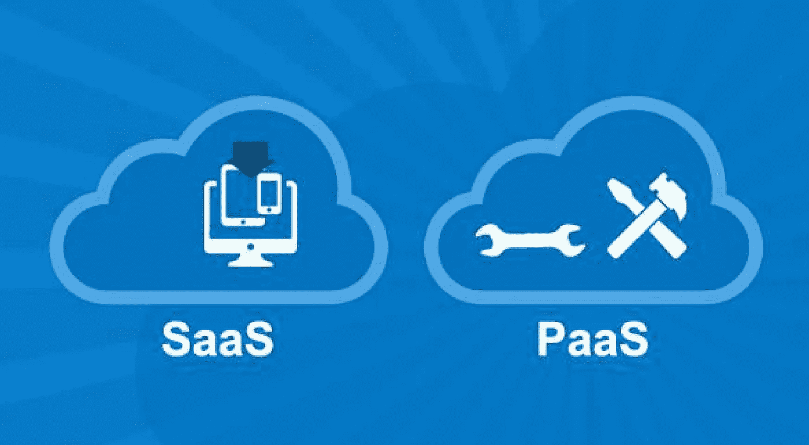

投资于可扩展的服务器技术是昂贵的；尤其是在产品或服务是否值得投资仍存在不确定性的情况下。了解这一点使得依赖云平台如 *AWS* 、 *Heroku* 、 *MongoDB* 和*脸书连接*；像 *Mixpanel* 、 *MailChimp* 、 *LiveChat* 、 *Google Forms* 这样的服务；甚至像 *WordPress* 和 *Drupal* 这样更有吸引力的平台(更不用说经济可行性了)。

上面提到的产品和服务可以极大地帮助你的发展。再来看一下 Groupon 的例子，当他们开始作为一个定制的 WordPress 网站时，创始人只是手工发布交易和给订阅者发送 pdf。从这个例子可以清楚地看出，PaaS 和 SaaS 不仅可以帮助你建立 MVP，事实上，还可以验证它——就像我们看到的 Groupon 所做的那样。这种方法还带来了额外的好处，消除了开发人员面临的许多问题，如兼容性、移动友好设计和基于代码的问题，因为这些工具已经解决了这些问题。

# 数字和纸质原型

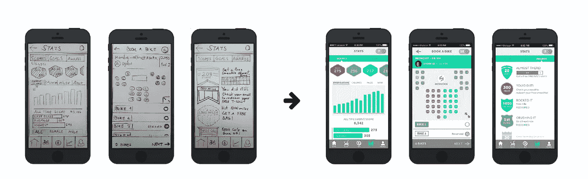

数字原型是验证你的 MVP 的一个很好且便宜的方法。这些可以是任何东西，从一个简单的，低保真度的草图到截图预览；然而，重要的是要记住，目标是收集反馈，这意味着数字模型或“虚拟应用程序”应该是你最大限度地学习的最终目标。

另一方面，纸质原型与数字原型相似，只不过它们是实物，通常由(你猜对了)剪纸制成，旨在模仿你的产品及其给用户的体验。这种方法相对于其他方法的一个关键优势是，它可以被团队中的任何人使用，从产品经理、投资者、开发人员等等。，并且几乎不需要解释，因为它是产品的物理表示。

# 单一功能 MVP

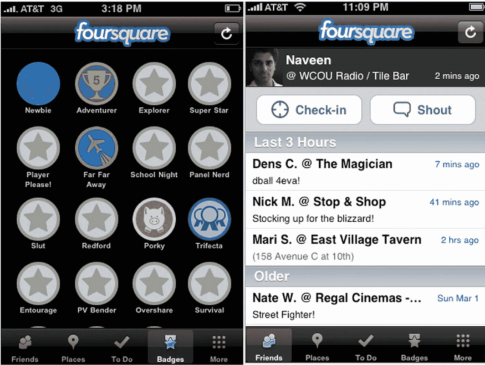

你听过“少即是多”这句话吗？好吧，就验证你的 MVP 而言，这句格言可能比你想象的更有分量。

随着时间和资源越来越宝贵，关注 MVP 的长期特性以节省开发的时间、金钱和精力通常是有利的。不仅如此，通过专注于一个方面，你可以避免让你的用户被产品中其他不需要验证的元素所分散。

通过对您的验证实施这些限制，您可以将注意力集中在您的客户和他们的需求上，同时获得对一个功能而不是多个功能的反馈，这通常会混淆流程，并导致即使是最勤奋的团队也无法集中精力。

创建和测试一个 MVP 总是要花费时间、资源和金钱——但是它不应该被认为是一种浪费。毕竟，如果你最终把一个没人想要的产品或服务推向市场，至少没人愿意为它付费，那该怎么办？

使用上面列出的几种测试技术。一定要结合不同的观点来获得你的认可，无论你做什么，忘记“如果你建立了它，他们就会来”的观念。测试你的 MVP 的目标不仅仅是最小化风险，而是创造人们想要的、需要的和愿意支付的东西；换句话说，构建和测试 MVP 正是您想要的。