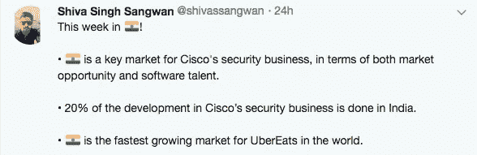
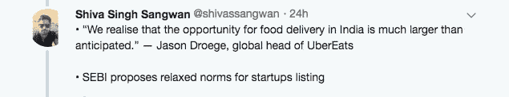
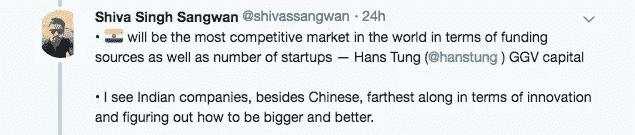
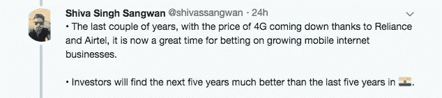
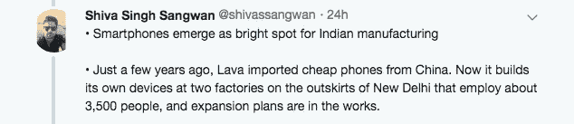
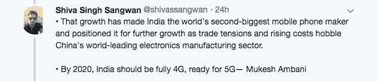
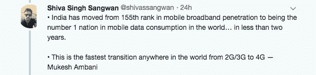
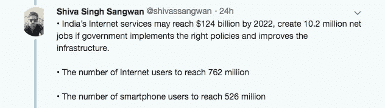
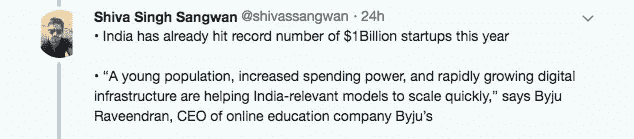

# 1947 年技术—第 43 周时事通讯

> 原文：<https://medium.datadriveninvestor.com/1947-tech-week-43-83f7098133a6?source=collection_archive---------55----------------------->

> 每周一期时事通讯:对印度的技术、市场、初创企业、风险资本和外国投资的见解

## 1.印度的独角兽:印度今年已经创下了 10 亿美元创业公司的记录

印度第一代互联网独角兽改编自国外的商业模式。例如，打车公司 Ola 长得像优步；【在线零售商 Snapdeal】和最近的 [**沃尔玛收购 Flipkart**](https://www.bloomberg.com/news/articles/2018-05-04/flipkart-board-is-said-to-approve-15-billion-deal-with-walmart) **，像 Amazon.com**；**数字钱包龙头**[**pay TM**](https://www.bloomberg.com/news/articles/2018-02-14/paytm-takes-cues-from-alibaba-in-indian-new-retail-experiment)**，像中国的支付宝**。

这一新群体更直接地瞄准了数以亿计的潜在用户，他们不居住在印度的大城市，也不太会说英语(T21)。研究机构 CB Insights 称，去年估值达到 10 亿美元的五家公司中，有四家瞄准了印度教育、物流和住宿行业的一些基本需求。

在线教育公司 Byju's 的首席执行官 Byju Raveendran 表示:“年轻的人口、不断增长的消费能力和快速增长的数字基础设施正在帮助印度相关的模式快速扩展。

 [## 印度创纪录的 10 亿美元创业公司:独角兽崛起的 3 个原因！

### 你知道印度有 14 只“独角兽”吗？等等，什么？如果你不知道这个术语的意思，印度有 14 个…

www.thebetterindia.com](https://www.thebetterindia.com/162834/india-start-up-valuations-investments-paytm-flipkart/) 

## 2.印度的创业前景:投资者会发现印度未来 5 年会比过去 5 年更好

童士豪在福布斯迈达斯排行榜上排名第 20 位，是 GGV 资本的风险投资人，这是一家罕见的风险投资公司，曾投资过美国和中国最有价值的初创公司，如支付公司 **Square** 和打车公司**滴滴出行**，现在也在评估在印度的投资。

**这是汉斯对印度创业生态系统的看法:**

> 就资金来源和创业公司数量而言，印度将是世界上最具竞争力的市场
> 
> 除了中国公司，我认为印度公司在创新和如何变得更大更好方面走得最远。
> 
> 过去几年，由于 Reliance 和 Airtel 的努力，4G 网络的价格正在下降，现在是押注移动互联网业务增长的大好时机。
> 
> 投资者会发现，印度未来五年的情况要比过去五年好得多

 [## 投资者会发现印度未来 5 年比过去 5 年更好

### 就资金来源和创业公司数量而言，印度将是世界上最具竞争力的市场，汉斯…

economictimes.indiatimes.com](https://economictimes.indiatimes.com/small-biz/startups/newsbuzz/investors-will-find-the-next-5-years-better-than-the-last-5-in-india/articleshow/66373953.cms) 

## 3.印度的互联网市场:印度的互联网服务到 2022 年可能达到 1240 亿美元，

如果印度政府实施正确的政策并改善基础设施，到 2022 年，印度的互联网服务可能达到 1240 亿美元，为 T2 创造 1020 万个工作岗位。

> 2020 年互联网用户数量将达到 7.62 亿
> 
> 智能手机用户数量将在 2020 年达到 5.26 亿

 [## 印度互联网服务到 2022 年可能达到 1240 亿美元，创造 12 亿个净就业机会

### 新德里 10 月 23 日电()印度的互联网服务行业有望增长三倍以上，达到 1240 亿美元…

timesofindia.indiatimes.com](https://timesofindia.indiatimes.com/business/india-business/indias-internet-services-may-reach-usd-124-bn-by-2022-create-1-2-cr-net-jobs-report/articleshow/66337311.cms) 

## 4.对印度市场的洞察:要赢得印度，就得赢得文化；文化可以代表很多东西:时代桥首席执行官 Rishi Jaitly

时代集团的战略投资部门**时代桥**正在将一大批**国际公认的**互联网企业带到**印度**。

时代桥的首席执行官 Rishi 向 ***YourStory*** 讲述了时代桥的投资理念、合作伙伴公司、印度不断变化的数字和创业生态系统，以及如何超越“**肤浅的**”市场增长和中国不断增长的需求。

 [## 要赢印度，就得赢文化；文化可以代表很多东西:时代桥首席执行官 Rishi…

### 时代集团的战略投资部门时代桥带来了一系列“国际公认的”互联网业务…

yourstory.com](https://yourstory.com/2018/10/win-india-culture-times-bridge-ceo-rishi-jaitly/) 

## 一周回顾

## 感谢您的阅读。请在 Twitter :)上与我分享任何反馈、问题或评论