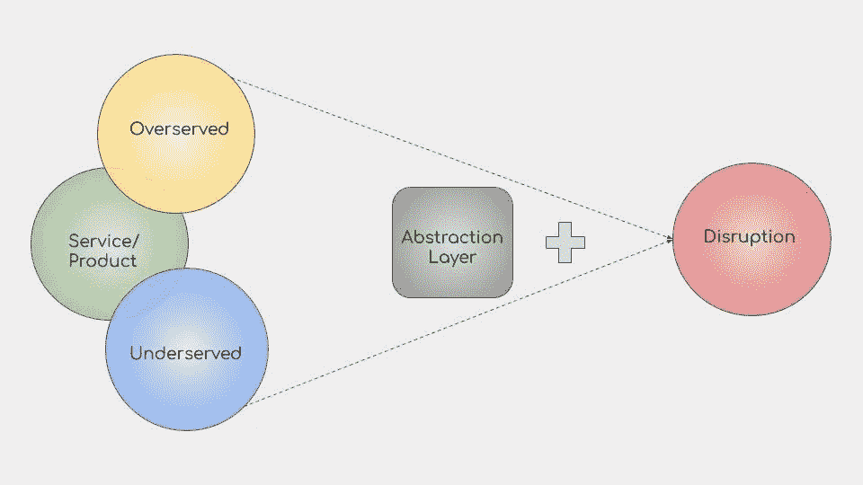
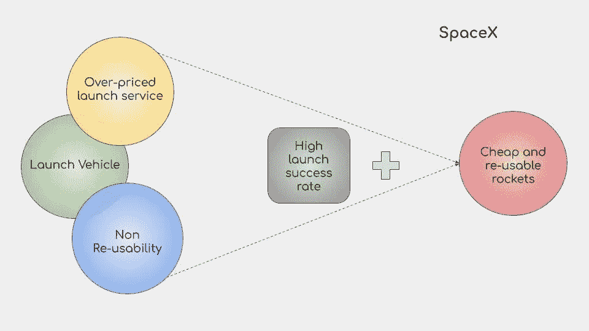
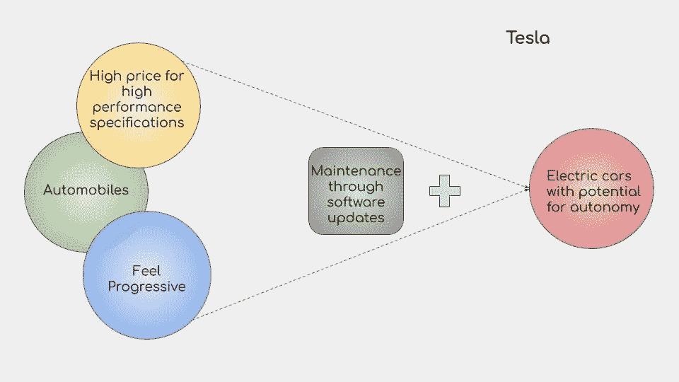
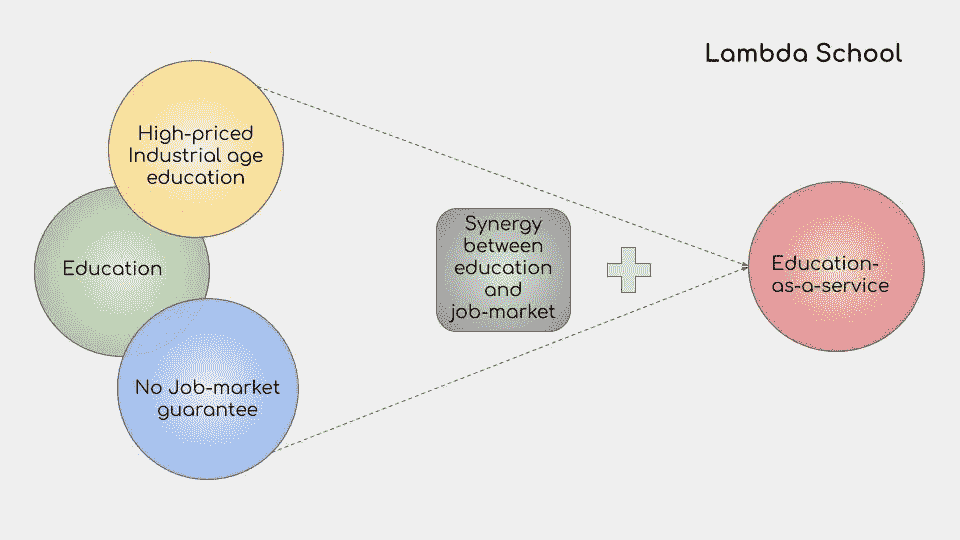
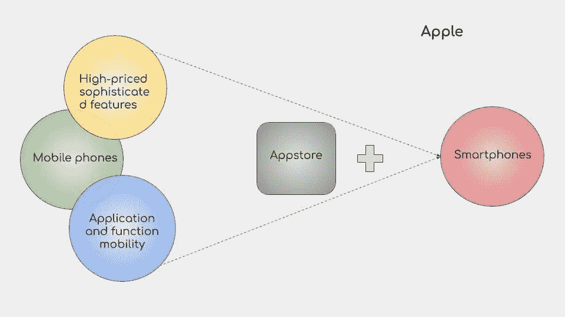
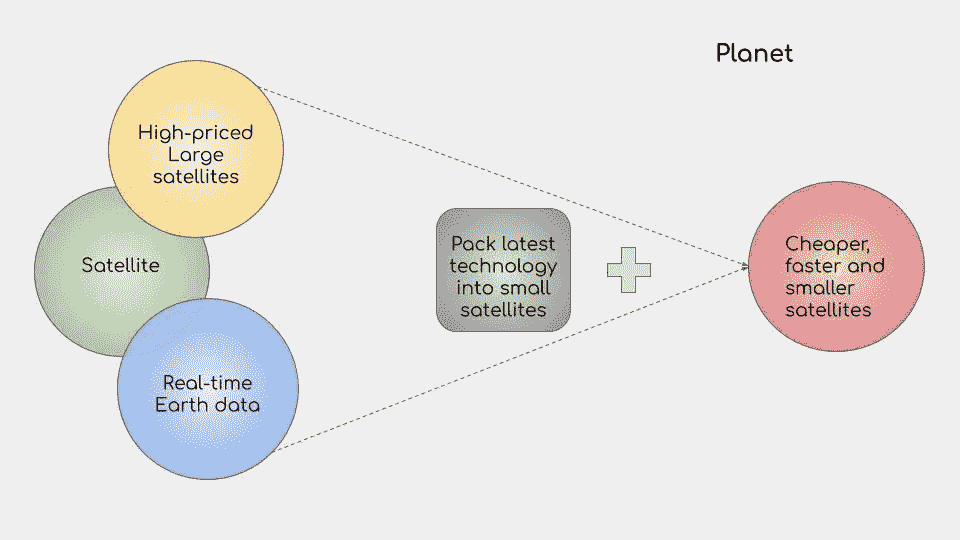

# 2.1 维度 2 —颠覆性市场空间

> 原文：<https://medium.datadriveninvestor.com/2-1-dimension-2-disruption-market-spaces-edd6cc85bb5e?source=collection_archive---------13----------------------->

***回顾:*** *这是一个中型系列，着眼于在理解巨型科技独角兽如何形成中发挥作用的不同因素(以维度表示)。你可以在这里找到* [*简介*](https://medium.com/datadriveninvestor/intro-tech-startup-unicorns-be40ed9ff9c9) *。*

*我们之前谈到了如何创造新的价值机会层(表示为* [*维度 1*](https://medium.com/datadriveninvestor/dimension-1-value-creation-opportunity-at-macro-level-b205a8f05561) *)。*

 [## 波动迫使数据驱动的投资者冷静

### 自然界中很少有东西是直线行进的，尤其是经济。当投资者和消费者希望平静时…

www.datadriveninvestor.com](https://www.datadriveninvestor.com/2019/03/25/volatility-compels-calm-amid-the-storm/) 

***维度回顾:*** *我们介绍了微观层面的颠覆性机会和增长性机会是如何发生的(表示为* [*维度 2*](https://medium.com/datadriveninvestor/dimension-2-disruption-opportunity-at-micro-level-and-growth-e37f078544eb) *)。在本节中，我们将讨论在成熟市场中哪里可以找到颠覆性的机会。*

***免责声明:*** *这个片段再次改编自亚历克斯·丹可的《突现层》。*

在任者主导的市场中的新机会出现在以下两种情况中的任何一种:

I .为客户提供的服务过多:由于公司的竞争性，产品/服务为超出客户需求的客户提供高价服务，即提供 X 个功能，而客户只需要 X-Y 个功能。巨大的利润率是新公司进入市场的一个地方。

二。客户服务不足:当客户的基本需求得不到满足时，要么因为满足需求太难，要么需要克服技术/可行性障碍/监管挑战。
监管进步或技术突破打开新市场。

然而，通常是 I 和 II 的结合提供了大规模破坏的机会，并有助于创造一个技术独角兽。当一家新兴公司进入一个既有服务不足的客户又有服务过度的客户的市场，同时又剥夺了宏观机会([维度 1](https://medium.com/datadriveninvestor/dimension-1-value-creation-opportunity-at-macro-level-b205a8f05561) )。)

示例:

**交通服务:**

**航天工业:**

**汽车行业:**

**学历:**

**接待服务:**

**手机行业:**

**卫星产业:**

***接下来:*** [成长、规模化和创新](https://medium.com/@arvindvairavan/2-2-dimension-2-growth-scaling-and-innovation-81b8d087cbdc)