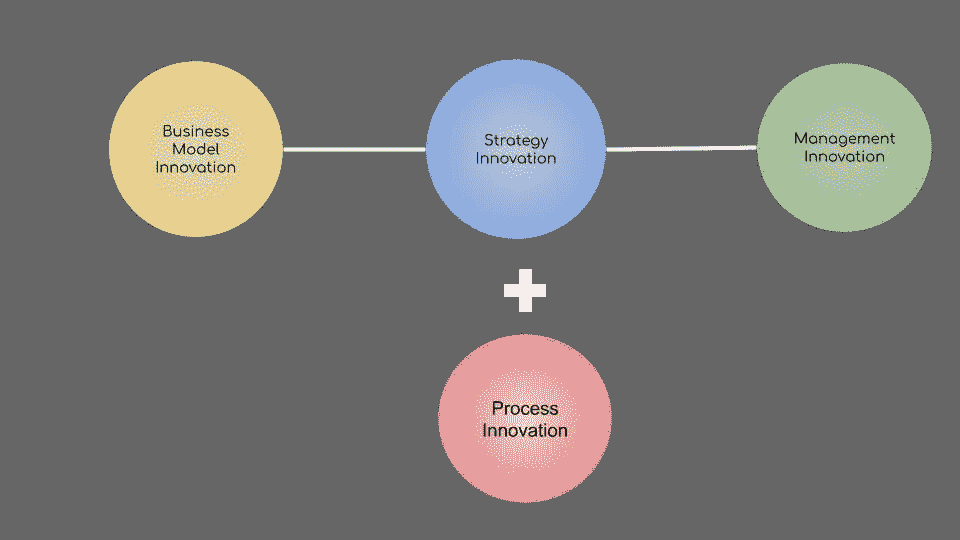

# 2.2 维度 2 -增长、扩展和创新

> 原文：<https://medium.datadriveninvestor.com/2-2-dimension-2-growth-scaling-and-innovation-81b8d087cbdc?source=collection_archive---------7----------------------->

***回顾:*** *这是一个中型系列，着眼于在理解巨型科技独角兽如何形成中发挥作用的不同因素(以维度表示)。你可以在这里找到* [*简介*](https://medium.com/datadriveninvestor/intro-tech-startup-unicorns-be40ed9ff9c9) *。*

*我们之前谈到了如何创造新的价值机会层(表示为* [*维度 1*](https://medium.com/datadriveninvestor/dimension-1-value-creation-opportunity-at-macro-level-b205a8f05561) *)。*

***维度回顾:*** *我们介绍了微观层面的颠覆性机会和增长性机会是如何发生的(表示为* [*维度 2*](https://medium.com/datadriveninvestor/dimension-2-disruption-opportunity-at-micro-level-and-growth-e37f078544eb) *)。我们在这里* *讨论了在已建立的市场* [*中哪里可以找到颠覆的机会。在这一部分，我们将讨论一旦一家初创公司进入市场会发生什么，以及它在过去如何转化为科技独角兽。*](https://medium.com/datadriveninvestor/2-1-dimension-2-disruption-market-spaces-edd6cc85bb5e)

 [## 波动迫使数据驱动的投资者冷静

### 自然界中很少有东西是直线行进的，尤其是经济。当投资者和消费者希望平静时…

www.datadriveninvestor.com](https://www.datadriveninvestor.com/2019/03/25/volatility-compels-calm-amid-the-storm/) 

一旦一家公司在找到产品-市场契合度后开始扰乱市场，它就需要有能力建设和扩大规模。颠覆本身没有好坏之分，但它总是包含着变化。

像谷歌和脸书这样的公司所经历的典型序列是，在建立产品/市场契合度的同时，开始典型的初创增长，然后转变为闪电式扩张，以在竞争对手面前实现临界质量和/或市场主导地位，然后随着业务的成熟，放松下来进行快速扩张，最后当公司成为公认的行业领导者时，转变为典型的规模扩张。

现任者有一些天然的优势，如规模、持续创新的力量和资源、寿命、合并和收购，但劣势包括激励不一致、管理悬置、缺乏风险偏好、公开交易后的公众压力等。

雷德·霍夫曼在他的书《闪电战》中谈到了扩大公司规模所需的 3 个重要创新周期:

1.  **商业模式创新**

有一个可以扩展的商业模式是必要的，否则初创公司可能会在取得主导地位之前崩溃。技术创新是保持商业模式创新收益的关键因素。推动商业模式创新的关键属性如下

*成长因素:*市场规模、分布、高毛利率、网络效应
*成长限制因素:*缺乏产品市场契合度、运营可扩展性
*模式:*数字使能平台、订阅量
*驱动因素:*摩尔定律、自动化、适应性、逆向思维

**微软**
网景公司接受现状，使用可靠的商业模式，而不是开发由自己的技术创新实现的新模式。在第一次“浏览器大战”中，微软在所有新的 Windows 电脑上预装了它的 Internet Explorer，然后赠送了它的 Web 服务器软件 Internet Information Server (IIS)，这实际上摧毁了网景的商业模式。

在谷歌，拉里·佩奇(Larry Page)和谢尔盖·布林(Sergey Brin)构建了伟大的搜索算法，但推动他们取得巨大成功的是他们对搜索引擎商业模式的创新——具体来说，就是在显示广告时考虑相关性和性能，而不是简单地将空间租给出价最高的人。

**特斯拉**

**2。战略创新**
战略是关于要不要闪电战以及什么时候。面对不确定性，Blitzscaling 将速度置于效率之上。闪电战是一种战略创新，只有当公司生存的最重要因素是进入市场的速度时，这种创新才会奏效。虽然 blitszcaling 是策略之一，但另一个策略是拥有足够长的跑道，有助于复合回报

亚马逊网络服务“根据我的经验，如果你发明了一种新的做事方式，通常如果你很幸运，在竞争对手抄袭你的想法之前，你会有大约两年的时间。在一个快速发展的行业中，两年的时间确实很长，所以这是一个很好的开端。不管出于什么原因…在我们面临志同道合的竞争之前，亚马逊网络服务已经发展了七年。”
——杰夫·贝索斯

**特斯拉自动驾驶车队**
特斯拉在整合软件和硬件方面长达 10 年的时间，通过利用其现有的数百万硬件和不断升级其软件以实现自动驾驶的能力，在未来的自动驾驶汽车中具有巨大的优势。

**3。管理创新**
一个公司内部的变化和外部的发展一样快。一个微小的团队变成很多团队，很多团队变成事业部，事业部变成子产品，子产品有自己的事业部。诸如此类。管理团队必须愿意调整和创新公司内部人员的管理和运营方式，就像他们必须调整产品交付一样。

在过去 20 年里，亚马逊在划分和调整创新周期方面取得了关键成功。

将以上三种与史蒂夫·朱韦森(Steve Jurvetson)在一些最具颠覆性的公司董事会中提出的第四种创新结合起来:特斯拉(Tesla)、SpaceX、孟菲斯肉类(Memphis Meats)、Planet 等，这种创新被称为流程创新，是建立颠覆性公司的关键。

**4。过程创新**
一个公司(或有远见的人)设定愿景并逐步实现它以加速不可避免的技术未来的能力。每个行业的创新过程都是独一无二的。

特斯拉推进电动汽车和自动驾驶汽车革命的总体规划——通过制造一款有竞争力的电动跑车来证明电动汽车的效率，然后从制造低产量-高价格的汽车逐渐发展到中等产量-中等价格，最终是高产量-低价格的汽车，同时使软件成为设计良好的汽车的核心。

SpaceX 创造星际生命的方法——通过内部制造火箭并使火箭可重复使用来降低发射成本，从而重新点燃人们的兴趣。

Planet 对通过将尖端创新整合到卫星中来革新卫星行业(更便宜、更快、更小和更先进的卫星)的洞察力。

孟菲斯肉类公司推进实验室培育肉的计划是首先生产昂贵但可行的实验室培育肉，最终以低于市场的价格出售。

亚马逊在不断颠覆新市场和预见价值创造机会方面的框架——电子商务零售、出版业、航运业和云服务。

*接下来:*你可以阅读一下外部因素在创业独角兽中的作用(表示为[维度 3](https://medium.com/@arvindvairavan/3-1-dimension-3-luck-and-timing-2240c222bed6) )。)