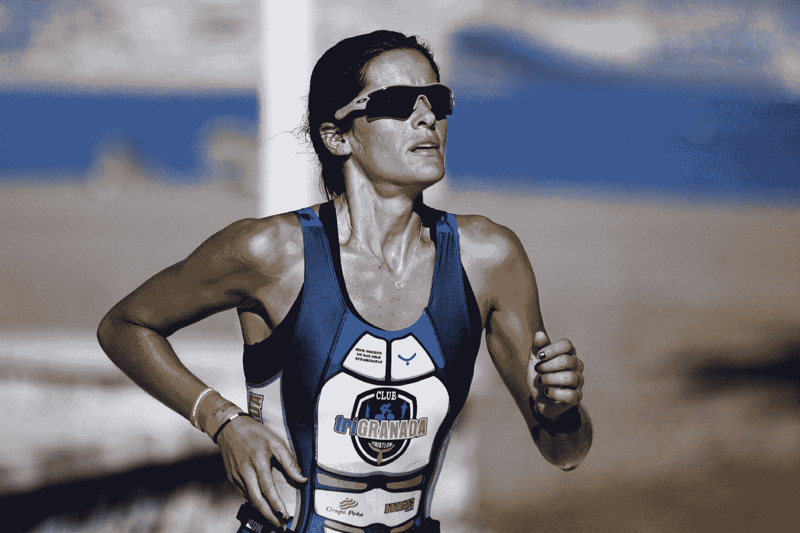

# 成为你想成为的任何技能的专家的 2 个有效技巧

> 原文：<https://medium.datadriveninvestor.com/2-effective-techniques-to-become-an-expert-in-any-skill-you-want-eb48ea35cd85?source=collection_archive---------9----------------------->

> “只有全心全意献身于一项事业的人，才能成为真正的大师。因此，精通需要一个人的全部。”——阿尔伯特·爱因斯坦

# 1.刻意练习——获得专业知识的途径

安德斯·埃里克森(Anders Ericsson)，心理学家，弗罗里达州立大学的研究员，著名的 10000 小时规则(由马尔科姆·格拉德威尔在他的名著 *Outliers】中提出)的原始研究员，*陈述了**三种用于学习的实践。**

> a.幼稚的做法
> 
> b.有目的的实践
> 
> c.刻意练习。

**幼稚练习**是一种普通的练习，你基于你已经知道的东西无意识地去做(没有任何努力或专注去改进)。这种一遍又一遍地做同样的事情，并期待它会有所改善的做法根本不起作用。因为:

> “疯狂的定义是一遍又一遍地做同样的事情，却期待不同的结果”。~阿尔伯特·爱因斯坦

**有目的的练习**好多了。它包括(1)明确而具体的目标，(2)以集中的方式，(3)对你的错误有一个适当的反馈系统，以及(4)不断超越舒适区。

这比幼稚的练习要好，因为这样你会学得更快。

但是，只有刻意的练习才能为你打开精通的大门。

这是什么？

**刻意练习**也被称为**任何练习**的黄金标准。这种练习具有有目的练习的所有要素，但它*还通过既定领域的明确培训计划*增加了辅导或教学的要素。

**刻意练习**包括 ***通过定义明确、具体的目标和有针对性的专业领域来追求个人进步，正如有目的练习*** 所要求的那样，但此外，它还要求教师或教练*能够证明自己有能力帮助他人提高所需的专业领域——比如国际象棋、网球或音乐——并且能够提供持续的反馈。*

*爱立信说:*

> *“这不仅仅是累积时间的问题。如果你在做你的工作，你只是越来越多地做同样的事情，你实际上不会变得更好。”*

*爱立信用下面的话简洁地解释了*大脑内部结构和神经回路如何随着刻意练习而变化*:*

> *专家与我们其他人的主要区别在于，他们多年的实践改变了他们大脑中的神经回路，产生了高度专业化的精神表征，这反过来又使难以置信的记忆、模式识别、解决问题和其他各种高级能力成为可能，这些能力是超越他们特定专业所需的 。你对一个主题研究得越多，你对它的心理描述就变得越详细，你就能更好地吸收新信息。*

*我喜欢他的精彩想法，当他说:*

> *“没有理由不追随你的梦想。刻意的练习可以打开通往一个充满可能性的世界的大门，你可能已经确信这是遥不可及的。打开那扇门。”*

# *2.在学习区和表现区之间穿梭。*

*学习的第二个最佳实践(同时保证速度)是 ***不断在学习区和表现区之间穿梭。****

> ***学习区**是指我们生活中专注于学习提高技能的时间段。**表现区域**是我们正在运用所学技能的区域。*
> 
> ***学习区是我们的目标是提高**的时候。然后*我们做一些旨在提高的活动，专注于我们还没有掌握的东西，*这意味着我们必须做好犯错的准备，知道我们会从中吸取教训。*

*这与我们在自己的性能区所做的完全不同。在**绩效区，我们的目标是尽我们所能做好某件事，执行**。在这个区域里，我们专注于我们已经掌握的东西，并尽量减少错误。*

*最高效的人以更快的速度学习的一个关键要求是不断地在学习区和表现区之间穿梭。*

*在成长型思维训练公司 Mindset Works 的联合创始人兼首席执行官 Eduardo Briceno 的精彩演讲中，他通过引用以下现实生活中的实施，解释了我们如何才能在我们关心的事情上做得更好:*

> *他举了**T21【狄摩西尼】的例子，古希腊的政治领袖、伟大的演说家、律师** 。为了成为一名伟大的演说家和优秀的律师，他并不总是停留在表演领域。相反，他花时间学习技能。他长时间学习法律和哲学。但他也听到了许多伟大的演讲，以学习和掌握他的公共演讲技巧。*
> 
> **他有些* **口齿不清的毛病(一种轻微的言语缺陷)** *，所以为了说话清楚，* **他习惯把石头放进嘴里，然后练习说话** *。他刻意练习，更加强调以正确的方式学习，并通过反馈来提高。 ***这种在学习区和表演区之间的穿梭，让他学得更快，获得了自己领域的专业知识*** 。**

*虽然上述内容对少数人来说可能需要更长的时间。**但我们的目标是真正掌握技能—** 通过以上练习，这是可能的。因为这些练习将 ***通过持续的学习和深思熟虑的练习*** 在你的大脑神经回路中发展强大的智慧层——为你终身服务，所以请放心——无论花多长时间都是掌握的最佳和最短时间。*

*因为，正如正确的说法:*

> *“掌握不是天才或天赋的功能。它是时间和应用于特定知识领域的强烈关注的函数。”~罗伯特·格林*

# *希望你喜欢这篇文章。*

*你介意为此鼓掌吗？*

# *如果你喜欢上面的，你也可以看看我下面的其他文章:*

*[**将你的恐惧转化为兴奋的简单技巧**](https://medium.com/@sombathla/a-simple-technique-to-transform-your-fear-into-exhilaration-68c4e82ea02f)*

*[**一个简单的想法，让你从消极的想法转变为充满力量的状态**](https://medium.com/@sombathla/one-simple-idea-to-shift-from-negative-thoughts-to-empowering-state-17e4c75eb4e3)*

# *想提高你的表现(和结果)吗？*

# *[点击此处下载免费报告，了解 5 种心态转变，在短短 30 天内提升你的表现](https://sombathla.com/mentalshifts/)*

**

*Photo by [Quino Al](https://unsplash.com/@quinoal?utm_source=medium&utm_medium=referral) on [Unsplash](https://unsplash.com/?utm_source=medium&utm_medium=referral)*

# *[Master 5 心态转变，在短短 30 天内提升你的表现——下载你的免费报告](https://sombathla.com/mentalshifts/)*