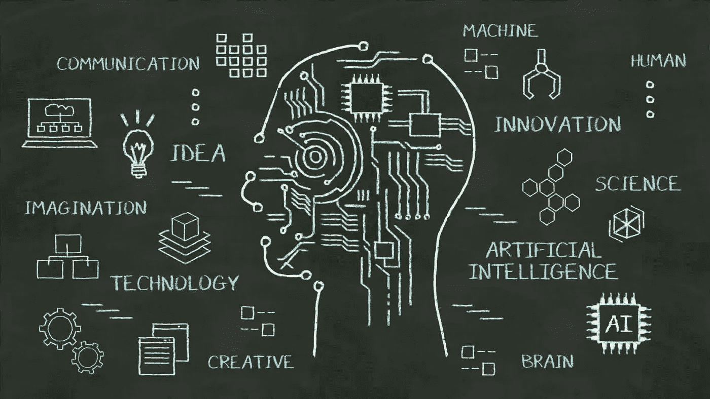
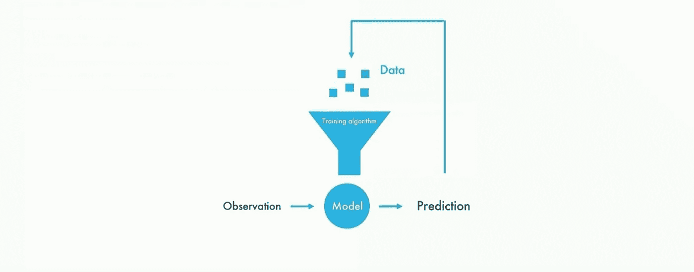
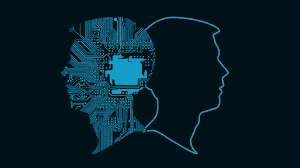

# 2.AI 是如何创造价值的？

> 原文：<https://medium.datadriveninvestor.com/2-how-does-ai-create-value-a0f352167c83?source=collection_archive---------9----------------------->

读: [1。AI 是什么？](https://medium.com/datadriveninvestor/1-what-is-ai-6f8aff4e15d)

**人工智能由两件事组成——学习和推理**

学习——复制人类大脑如何学习
推理——根据我们对训练数据的理解来预测事物

**学习涉及**

1.给出一组输入数据
2。构建算法来训练数据
3。从算法中获得模型

推理是训练模型的实时应用。

**为什么说 AI 是转型的？**

如果一个系统被训练来玩一盘有数百万步棋的国际象棋，或者检测一百万次人类的图片，那么它的下一步棋或下一次检测的准确性会增加，这是可能的，因为存在正反馈回路。

**什么是正反馈回路？**

一旦从一个模型中做出预测，也就是说，当一个系统理解了数据是什么，它就可以预测下一件事，它被反馈到系统中。这有助于人类在模型的指导下做出更好的决策。

越多的数据被分析，越多的预测被反馈到系统中，系统中的知识变得多倍，做出更好的预测化合物的能力和准确性不断增加。

人类有天生的传感器，我们在驾驶时根据从我们的感官接收到的输入做出判断。现在想象一下，如果一辆汽车嵌入了各种传感器——计算机视觉、轮胎压力传感器、位置传感器、速度传感器——并且能够持续收集数据并训练它们做出决定，那么车辆预测的准确性将随着时间的推移而提高。这些知识可以立即与所有其他驾驶汽车共享，从而提高全球无人驾驶汽车的自动驾驶能力。

几十年前，当商业、信息、教育、通信转移到数字基地时，互联网是转移的焦点——谷歌、亚马逊、脸书等。过去十年见证了过多的创新，这些创新将焦点转移到了移动行业 instagram、uber、airbnb 等应用。事情已经转向人工智能应用。现在的趋势已经从互联网转移到移动到人工智能。
这也是现在和未来创造价值的可能性最大的地方。

**人工智能堆栈:**

创造价值的人工智能框架可以分为 4 个部分

**1。计算:**人工智能需要的计算基本上是数学——线性代数。它们主要通过以下方式实现:

中央处理器

CPU 是电子电路，它作为计算机的大脑工作，执行由计算机程序指令指定的基本算术、逻辑、控制和输入/输出操作。

图形处理器

GPU 是一种专门的电子电路，旨在与 CPU 一起渲染 2D 和 3D 图形。GPU 正被用于加速金融建模、前沿科学研究、深度学习、分析和石油天然气勘探等领域的计算工作负载。

TPU，张量处理单元
TPU 是专门为机器学习开发的定制集成电路，为谷歌开源机器学习框架 TensorFlow 量身定制。

GPU 是 10 倍的 CPU，TPu 是 2–3 倍的 GPU。

**2。基础设施**

在云中存储、计算和传输大量数据的能力，如亚马逊网络服务。

**3。算法**
通过 Tensorflow 等平台对数据进行训练和建模以做出预测的能力，tensor flow 是一个开源软件库，用于一系列任务的数据流编程和神经网络等机器学习应用。

虽然以上 3 个已经在堆栈中创造了大量的价值，但最终的边界有潜力在未来创造价值。

**4。应用**
利用数字文档中的非结构化数据的能力。自互联网世界诞生以来，可用的非结构化数据量一直在以指数速度增长。Box 是一家为音频、视频和图像添加智能的公司。应用范围从诊断癌症到自动驾驶汽车，有数百万数据的可用性和专家的参与。

[3。AI vs 人类进化](https://medium.com/datadriveninvestor/3-ai-vs-human-evolution-a778c49896ac)

[4。人类无法理解的人工智能](https://medium.com/datadriveninvestor/4-ai-beyond-human-comprehension-1ec7125b71b)

[5。人工智能的未来——电子人？乔布斯？](https://medium.com/@arvindvairavan/5-future-of-ai-cyborgs-jobs-1b67eeb7400d)

*image credits:*[*伊萨*](https://www.isasa.org/all-things-ai-exploring-artificial-intelligence/) *，* [*美国消费者新闻与商业频道*](https://www.youtube.com/watch?v=NVrxB9TomJM&t=686s) *，* [*曼陀罗拉布*](https://www.mantralabsglobal.com/blogs/solve-real-world-complex-problems-using-ai/) *，* [*美国消费者新闻与商业频道*](https://www.youtube.com/watch?v=NVrxB9TomJM&t=686s)