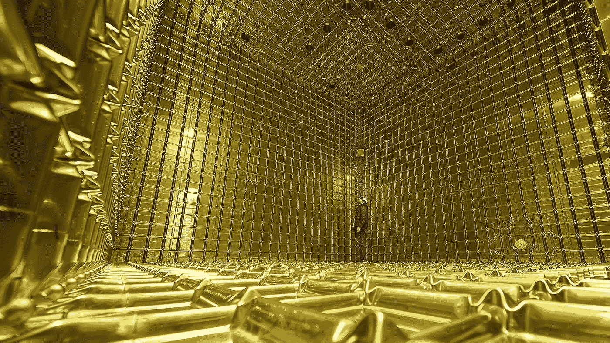
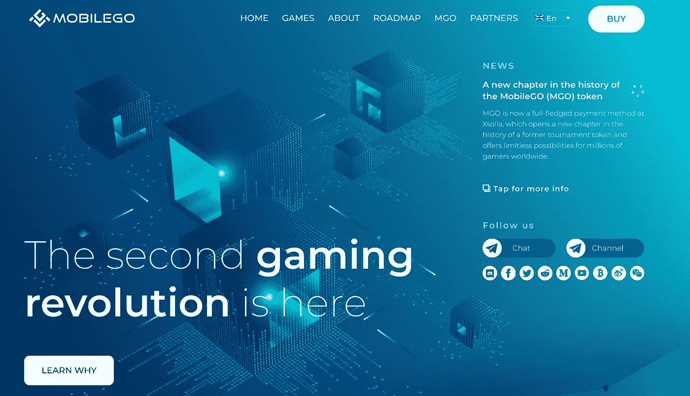
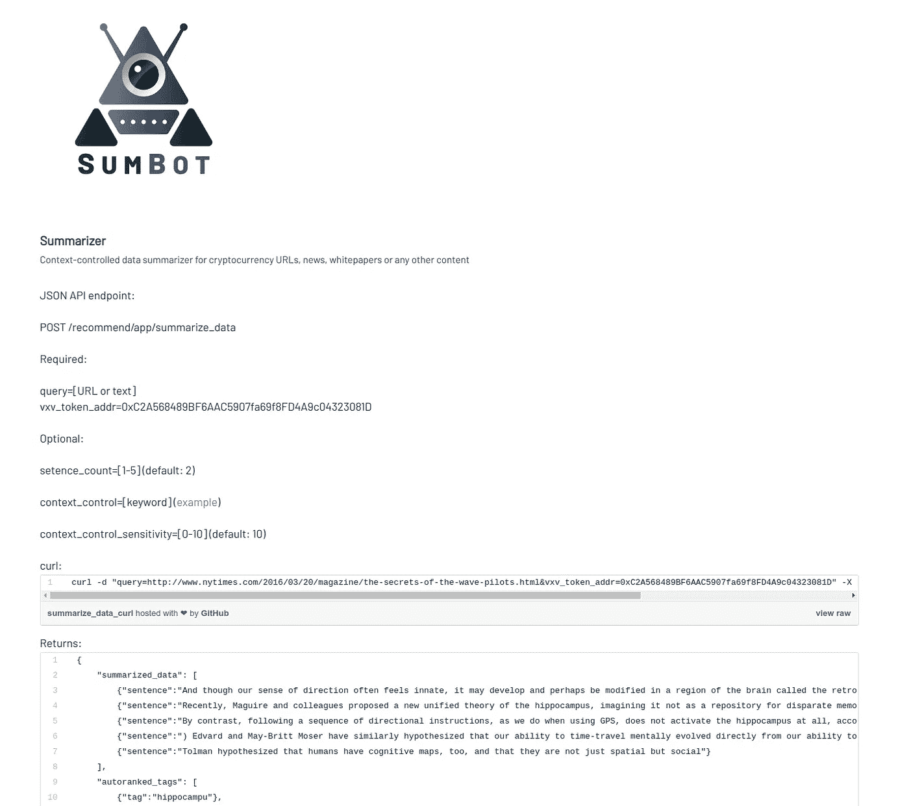
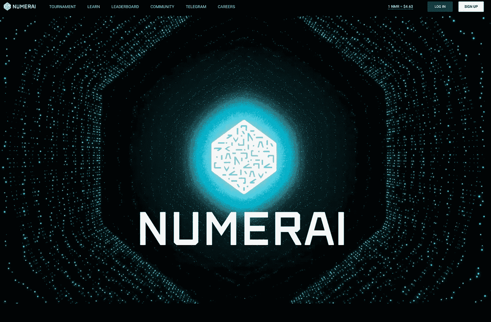
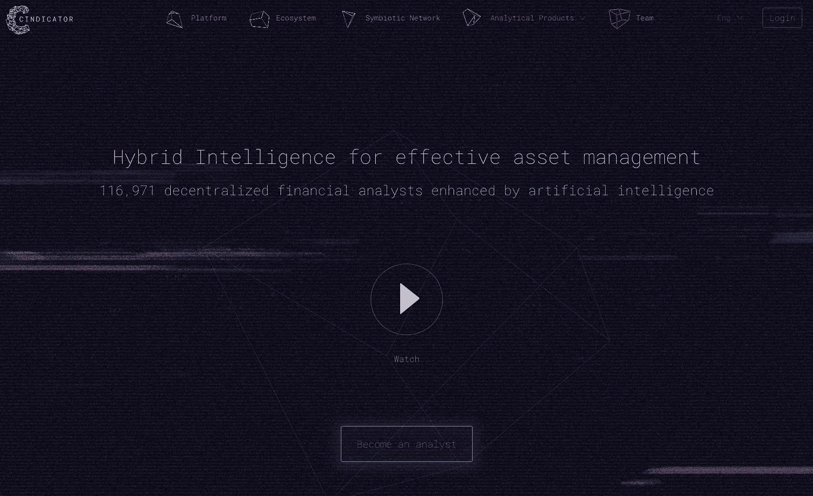
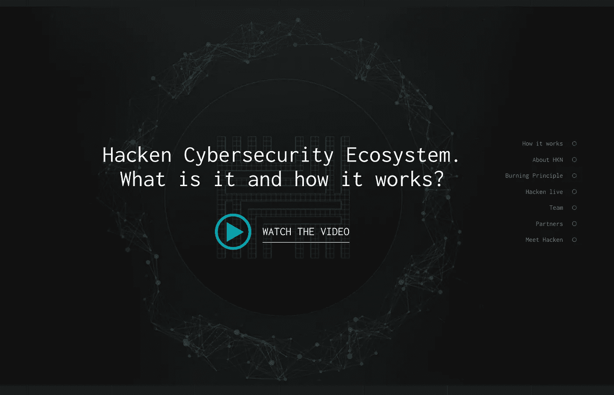

# 具有商业发布产品的深度技术加密资产

> 原文：<https://medium.datadriveninvestor.com/2-interesting-deep-technology-cryptos-on-the-launchpad-b46cefaaf5a0?source=collection_archive---------14----------------------->

**深度技术**公司有后劲。那些已经发布产品的公司可能会成为下一个谷歌、亚马逊或苹果。他们拥有革命性的技术解决方案，可以重新定义或创造新的市场。帮助拯救生命的医疗设备、用于解决世界饥饿的大数据模型以及旨在遏制全球变暖的清洁能源解决方案都是深度技术的例子。深度技术不是建立在商业模式创新或利用现有技术从线下到线上的商业模式过渡上。例如，优步不能称之为深度科技公司，因为它是建立在商业创新基础上的；“共享经济”

深度科技创业公司通常具有以下特质:

> **1。经过多年的研究和实验室测试开发而成**
> 
> **2。知识产权的所有权**
> 
> **3。除业务顾问委员会之外的技术顾问委员会**

深度科技创业公司有能力改变世界，为早期投资者创造不可思议的经济价值。这些新企业为全球问题提出了革命性的解决方案，具有创造全新市场的颠覆性潜力。天使投资者和风险投资基金都在寻找深度技术创业公司的投资机会，因为他们通常拥有高价值的知识产权，可能会产生巨大的回报。一旦建立起来，深度技术企业可以为竞争者建立进入壁垒，从而建立有价值的企业。有眼光的投资者可以通过早期投资这些公司，为世界创造价值，为自己谋利。

以下是一些值得仔细研究的精选案例:

# MobileGo(交易所:most)

MGO 最近很令人惊讶。他们正在积极地在几个不同的交易所上市，并积极表现出对创造与该技术相关的意识的兴趣。

MGO 是一个智能令牌，预示着游戏行业的新时代。它旨在将电子竞技平台游戏化，并通过奖励激励游戏玩家的忠诚度和参与度。此外，我们不断努力扩大我们的地理存在，与世界顶级游戏公司建立新的合作伙伴关系。我们的最终目标是让 MGO 成为真正的全球标志，跨越地理边界，让每个人都可以玩游戏。

MGO 令牌具有极其广泛的应用范围，为不同的人群提供了许多好处。对于游戏玩家来说，它将促进点对点比赛和分散式比赛，既作为比赛奖励又作为入场费。此外，代币持有者将能够获得购买游戏内容的额外折扣。

游戏发行商可以在 MGO 中获得支付，MGO 与法定货币相比有不同的优势，包括处理支付请求的速度。对于加密爱好者来说，这是一项极其有价值的投资:500 亿美元的移动市场和每天在 Google Play 和苹果等平台上注册的大约 1000 款游戏，只需获得一小部分市场渗透率就能带来巨额收入。

# 向量空间 AI(交易所 [IDEX: VXV](https://idex.market/eth/vxv)

再深入一点， [Vectorspace AI](http://vectorspace.ai) 发布了一个 API，并为他们的科学和技术举办了一个[Reddit AMA(Reddit )(阅读评论，太棒了！)在最受欢迎的子网站之一 r/askscience 上，他们也在开发一些与“钱包 API”和 reddit 相关的非常有趣的东西，正如他们在最新的 PR](https://www.reddit.com/r/askscience/comments/9k5i8u/askscience_ama_series_were_team_vectorspace_ai/) 中所描述的:

马耳他瓦列塔/2018 年 10 月 02 日/ Pushshift.io 社交媒体数据工程公司和自然语言处理(NLP)公司 Vectorspace AI 将联合开发一个先进的上下文可控的自然语言处理(NLP)系统和平台，该系统和平台将分析围绕全球趋势、科学话题、概念和实体(如上市公司和加密货币)的人类语言。最初，该平台将用于扩展两家公司基于 reddit.com 等社交媒体公司的数据、元数据和三角数据提供的自动化特征工程服务。此外，生命科学和全球金融市场的替代数据集的生成将通过 API 替代数据集服务业务部门获得许可。[来源。](https://vectorspace.ai/docs/PR-Pushshift-Vectorspace-20181002.html)

# 数字(交易所:most)

[numairi](https://numer.ai/homepage)刚刚发布了一个绝对令人惊叹的东西，“ [**ERASURE**](https://erasure.xxx/) 是一个不可阻挡的分散数据市场，用于由 numaire token(NMR)驱动的预测。”

[擦除](https://erasure.xxx/)允许任何人上传预测，用核磁共振将它们标上，并建立一个每个人都会信任的记录。它解决了预测源的市场崩溃问题，并允许预测市场的形成。

真正令人惊讶的是，它为他们的社区提供了一种新的赚钱方式，同时也让整个全球经济参与进来。他们从对冲基金开始，但我认为他们会被任何人广泛采用。这使得市场对占领和控制敞开大门。[来源](https://medium.com/numerai/numerai-reveals-erasure-unstoppable-peer-to-peer-data-feeds-4fbb8d92820a)。

基本上，我的预测是一个基于核磁共振符号散列到区块链的跟踪记录。向上爆炸是我唯一能描述核磁共振下一步会发生什么的方法。他们已经存在了一段时间，并且已经向公众展示了他们深厚的技术基础。

一个明确的长期投资组合保护者！

# Cindicator(交易所:most)

[Cindicator](https://cindicator.com) 是一家金融科技公司，致力于创建在新经济动荡条件下做出有效决策所需的社会和技术基础设施。

通过将大量不同的金融分析师和一组机器学习模型结合到一个系统中，我们正在开发一种混合智能基础设施，用于在传统金融和加密市场中有效管理投资者的资本。

1.  Cindicator 在移动应用程序中创建问题。
2.  预测者每天都在做出预测，回答一些关于不同金融资产的价格水平、宏观经济指数和对市场有重大影响的事件的具体问题。
3.  就在问题结束后(截止日期)，人工智能系统使用机器学习算法，根据预测者预测积累的统计数据，合成准确的预测。

[机器学习](https://cindicator.com/howitworks)模型动态计算每个预测者的各种权重，识别其误差中的稳定系统，计算误差的修正，消除噪声，生成最终的预测和交易信号。

对于任何希望为其投资组合增加真正价值的人来说，这是一个很好的选择！

# 哈肯(库科恩， [IDEX: HKN](https://idex.market/eth/HKN)

[Hacken](https://hacken.io/#main-screen) 是第一个为网络安全专业人士定制的分散令牌。它基于以太坊平台。Hacken 生态系统是一个社区驱动的商业组织，旨在促进区块链和网络安全社区之间的联系，促进黑客道德，鼓励对计算机网络和软件的合法研究。

我们的生态系统将允许客户获得针对其产品的高质量渗透测试服务和漏洞评估。整个过程，以及他们的发现，都被打上了时间戳，并发布到位于区块链的 HackenProof 漏洞和对策证书上，该证书是为每个项目专门颁发的。

**结论**

为您的投资组合提供一个坚实的基础，一个持续存在并蓬勃发展的深层技术加密货币，这些加密货币已经在商业上发布了产品。这些当然值得你在潜在的 12 月上涨时保持警惕！