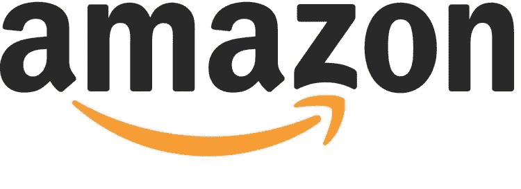
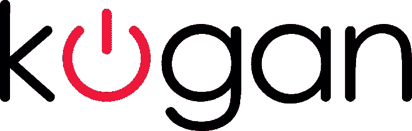

# 澳大利亚的两条新闻#10

> 原文：<https://medium.datadriveninvestor.com/2-nuggets-of-news-in-australia-10-7e71d445ed6a?source=collection_archive---------28----------------------->

# 消费你今天的金块:房地产和科技。

两个精心挑选的信息，用你我都能理解的术语解释。从技术角度切入，从澳大利亚人的角度了解你周围的世界。

**NASDAQ: AMZN**

# **房地产**。

**亚马逊计划搬进目前由安联和加德士占据的新悉尼总部。**

1.亚马逊将取代位于悉尼市场街 2 号的安联和加德士，这两家公司占据了 4 万平方米建筑中的 2.7 万平方米。

2.与此同时，亚马逊提议建立第二个北美总部，容纳 5 万名员工。

3.在澳大利亚，亚马逊一直在快速扩张其房地产，收购了 Bunning 位于墨尔本的 24387 平方米的配送中心和位于悉尼的 43000 平方米的配送中心。

# **谁是赢家和输家？**

如果你希望在悉尼中央商务区获得一个好的办公空间，你最好自己建一个，然后卖掉。

1.亚马逊加入了竞争异常激烈的悉尼 A 级写字楼租赁市场，那里的价格在过去 12 个月里上涨了 8.7%，达到每平方米 1065 美元。

2.WeWork 等其他公司也推高了这一价格。该公司租赁了 2.4 万平方米的空间，作为初创企业和中小企业的共同工作空间出售。

3.随着租金收入的增加，这将有利于商业地产开发商，如德克斯(ASX: DXS)、米尔瓦茨(ASX:经理)和古德曼(ASX: GMG)。

**ASX: KGN**

# **技术**。

全球销售和利润率面临压力，科岗股价下跌近三分之一。

1.Kogan.com 是一家多元化的在线零售和服务企业，因仅通过数字渠道成功销售低成本产品而闻名。

2.它宣布“全球品牌”类别的收入下降了 27%。该品类占 2018 财年毛利(收入——商品销售成本)的 18.3%。

3.这是由于 7 月份以来商品及服务税法律的变化，现在 10%的商品及服务税适用于低于 1000 美元的海外在线订单。

4.因此，科岗不得不降低价格来与外国网站竞争，降低了利润率。

# **是不是所有的希望都没了**？

网上零售正成为一个很难成功的行业，幸运的是科岗着眼于多元化。

1.自 2015 年以来，科岗一直专注于拓展新产品，推出了科岗移动，以及最近的保险、健康、宠物和互联网。

2.科岗移动与沃达丰合作，收入以每年 40%的速度增长，在 3 年的运营中，现在占科岗总利润的 14.9%。

3.科岗移动和科岗互联网计划在 2019 年通过提供低价 NBN 计划继续扩张。

4.与沃达丰的合作伙伴关系意味着科岗只负责营销和客户获取，而没有运营方面的资本投资。

# 今天，你的意见很重要。

你更喜欢哪个鸡块？(下面评论)

1.  团队房地产
2.  团队技术

# 一位业余作家的提问:

如果你想更多地看到我的声音，请订阅我下面的时事通讯。

[https://www . nuggets . space](http://www.nuggets.space/)