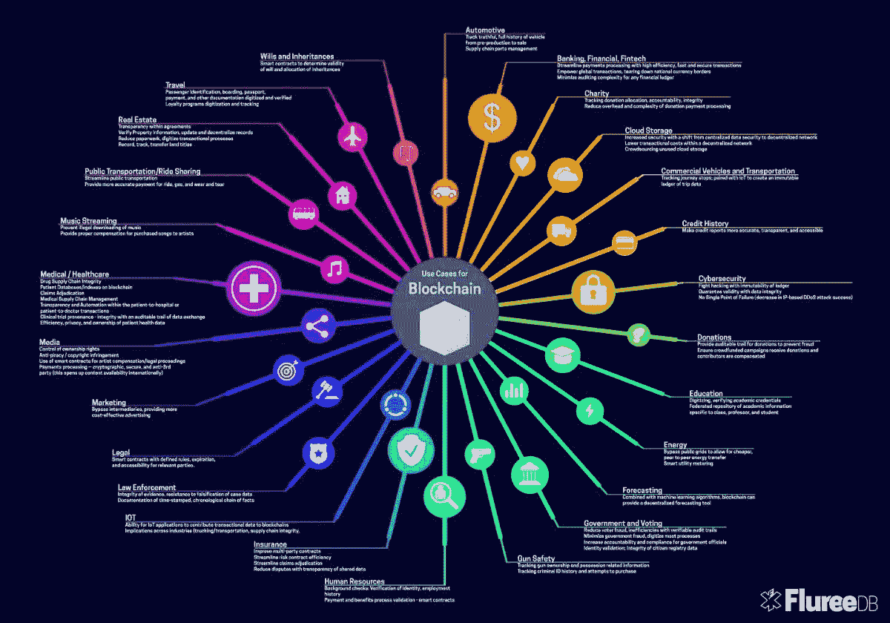

# 2.什么是区块链？

> 原文：<https://medium.datadriveninvestor.com/2-what-is-blockchain-87e7a8932394?source=collection_archive---------28----------------------->

读: [1。为什么是区块链？](https://medium.com/@arvindvairavan/1-why-blockchain-a00012d328a7)

之前的博客文章谈到了我们为什么需要区块链技术，这篇文章将在揭穿所有技术术语后，根据我的理解，思考什么是区块链。

区块链技术涉及公钥加密、点对点网络，最重要的是，它解决了一个古老的计算机科学问题，即拜占庭综合问题。技术术语已经太多了？

让我们把它们分解成简单的词语，试着去理解。

**公钥加密或非对称加密。**

但是首先，**什么是对称加密？让我们假设你有一个保险箱和它的钥匙。你想保留一件贵重物品。如果你想打开保险箱，你需要一把钥匙来锁定(加密)或打开(解密)存放贵重物品(数据)的保险箱。这被称为对称加密。如果别人有你保险箱的钥匙，他们也能打开它。**

**什么是非对称加密？**

与只有一个密钥的对称加密不同，非对称加密有两个密钥——一个公钥和一个私钥。你将持有这两把锁(加密)和打开(解密)你的保险箱的私人钥匙来访问你的贵重物品(数据)。你可以把公钥给我或任何人，但这将只允许我锁定(加密)或解锁(解密)保险箱，而不是两者。例如，如果我解锁(解密)掉一个文档/另一个有价值的项目(数据)，只有你将能够锁定它(加密)，反之亦然。你也会知道是我，而不是别人，把文件/贵重物品放进了你的保险箱。这就是所谓的数字签名。

**对等网络**
一种计算机网络，其中每台计算机都充当客户端和服务器，允许每台计算机与网络中的其他计算机交换数据和服务。

**拜占庭将军问题**
我们来想象一下拥有多个军队派系的拜占庭帝国。所有这些军事派别包围了一座新城并征服了它。每一个军事派别都有一个将军，他需要决定是进攻还是撤退。将军们必须集体决定是进攻还是撤退。一些将军可能更喜欢进攻，而另一些更喜欢撤退。重要的是每个将军都同意一个共同的决定，因为如果进攻或撤退没有充分的力量，那么它只意味着一件事——不可接受的残酷失败。还有一种可能是，一个将军是叛徒，他可以向另一个将军进行攻击，而向另一个将军撤退。区块链通过提供一个基于信任的平台来解决这个特殊的问题。

解决方案是让互不相识的匿名人群建立相互信任。

“一种管理大群体的新方法。相对于民主，贵族，君主，独裁或企业负责。一群人即使互不认识，也可以在网上达成共识。与民主不同，它是基于一个人对网络的贡献。最接近的类比:市场。任何人都可以在合理的范围内参与市场，但受到他们所拥有的资本的限制。但是区块链允许游戏中的技巧——允许投票、共识和将资源聚集到通常不存在这些东西的各种市场中。

区块链给了我们管理网络的新方法。对于银行业来说。为了投票。用于搜索。对于社交媒体。电话和能源网。

这些基于信任的操作通常需要一个集中的权力机构，如银行、政府等。但区块链以分散的方式带来了所有这些业务。

**举例:**
比特币——重塑价值/金钱商店
以太坊——重塑金融合同
block stack——重塑身份网络
风暴——重塑自由职业合同

**钱从哪里来？**

区块链是一场技术革命，金钱革命是这场技术革命的基础。由于区块链可以让人们聚集在一起，贡献资源和创造新的东西，需要有一个跟踪谁贡献了网络所拥有的资源。为了达到这个目的，需要有一个分类账，来追踪这些东西，默认情况下，这就创造了货币。因此，区块链最终与货币密不可分。

从长远来看，区块链可能会重新定义民族国家、投票和经济的运行方式。短期内——重新定义如何建立一个网络公司——创建一个即时的市场经济，包括需求、供应、货币、结算以及跟踪谁在提供带宽和谁在消耗带宽。区块链科技将在没有任何人为中心(没有任何公司为中心)的情况下完成所有这些工作。没有人收集所有的，做税。这将是纯粹的用户对用户。

整个电力、能源、带宽网络都可以使用区块链技术运行。"

海军拉维坎特

[3。钱是什么？](https://medium.com/@arvindvairavan/3-what-is-mone-923ade1f41e8)

[4。区块链是如何运作的？](https://medium.com/@arvindvairavan/4-how-blockchain-works-947dc8124e35)

[5。区块链面临的挑战是什么？](https://medium.com/@arvindvairavan/5-what-are-the-challenges-with-blockchain-6b9e51cec4a4)

[earn.com/dnivrav](http://earn.com/dnivrav)

*image credits:*[*the best VPN*](https://thebestvpn.com/cryptography/)*，* [*Reddit*](https://www.reddit.com/r/CryptoCurrency/comments/7y2zld/infographic_use_cases_for_blockchain/)