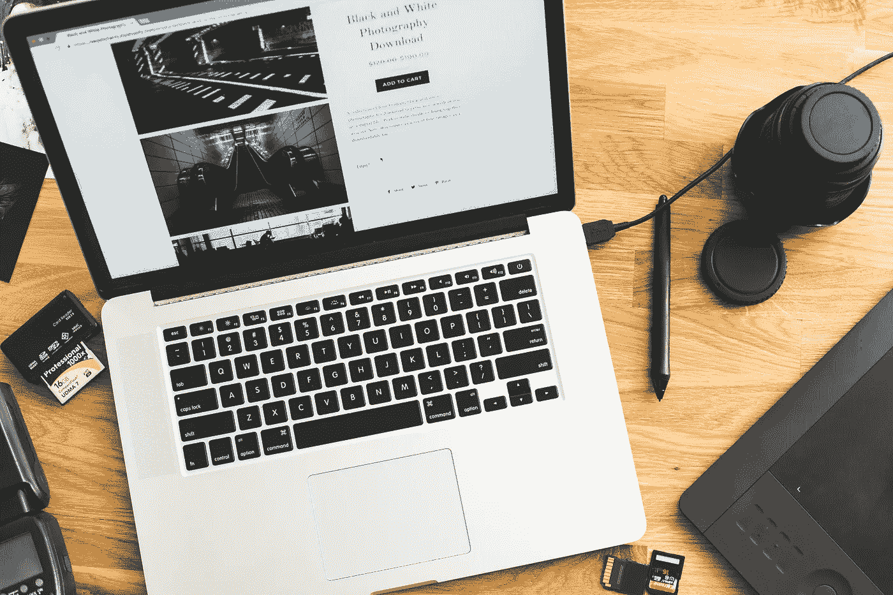
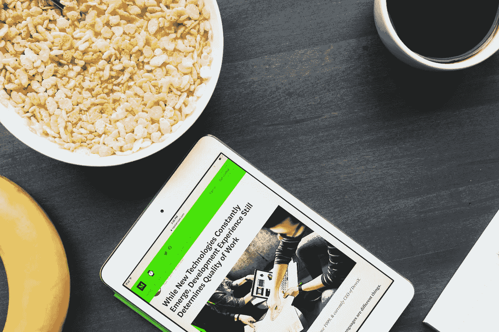

# 用 HTML/CSS 让你的网站更受欢迎的 20 种方法

> 原文：<https://medium.datadriveninvestor.com/20-ways-to-make-your-website-more-welcoming-with-html-css-b302690a3a6f?source=collection_archive---------3----------------------->


## 你的用户会喜欢这种可访问性。

今天，网站应该对每个人都很友好。然而，我注意到许多网站设计者和开发者会忽略这个标记。

由于无意的可访问性障碍，有些网站对一些人来说很难甚至不可能使用。

这对于有视觉、移动、听觉和认知障碍的人，以及那些在互联网速度和带宽方面受到社会经济限制的人尤其重要。

当这引起我的兴趣时，我做了更深入的研究。在这个过程中，我发现了一些简单的技巧，任何人都可以用它们来让他们的网站体验更受用户欢迎。

虽然提高网站内容的可访问性肯定是一个持续的过程，但现在可以肯定的是，你应该认识到是什么阻碍了一些用户访问你的内容。

首先，这篇文章包含了 **20** **个简单的方法**，可以让你的网站对所有人都更加友好&！

# 使用分层内容关系


尽管标题标签(从`**h1**`到`**h6**`)本身具有不同的大小值，但应该有意识地使用它们。就像一本书的标题比它的一个章节标题有更大的意义一样，标题标签也有意义。

```
<**h1**>Book Title</**h1**>
<**h2**>First Chapter</**h2**>
<**h3**>Subtitle of First Chapter</**h3**>
```

你应该尝试每个网页只有一个`**h1**`标签，就这样。标题标签，如果使用不当，会使依赖正确标题标签来筛选内容的屏幕阅读器用户感到困惑。它还会阻止搜索引擎正确识别您页面的主题。

# 给图像添加可选文本

每当你在你的网站上放一张图片时，你应该包括描述图片的`**alt**`文本，如下所示:

```

```

如果图像没有意义或者已经在文本内容中解释过了(但是仍然包括`**alt**`)，则将`**alt**`字符串留空。这方面的一个例子是一个纯粹的装饰图像。这可能是这样的:

```

```

这样，如果你的用户有坏的互联网连接，这个文本可以取代一个不能加载的图像。对于有视觉障碍的人，屏幕阅读器可以大声朗读`**alt**`文本来描述图像。作为一个额外的好处，这有助于搜索引擎将图片包含在正确的搜索结果中。

# 添加日期选择器


如果您的用户输入包含日期，您应该使用类型`date`的输入。当焦点对准时，会出现一个日期选择器，允许用户选择日期。虽然较新的浏览器支持这种格式，但较旧的浏览器将默认使用包含预期日期格式的文本。

```
<label for="birthday">Select your birthday:</label>
<input **type="date"** id="birthday" name="birthday">
```

这个选择器使所有用户填写表单变得更加容易。

# 强调高对比度

在你的网站上，前景和背景之间应该有一个可以接受的对比度。灰度组合和颜色选择的建议标准是 4.5 比 1 的对比度。这可以通过将浅色染成白色，深色染成黑色来实现。

```
<style>
    body {
        background-color: **#1C1C1C**;
        color: **#F5F5F5**;
    }
</style>
```

这是至关重要的。色盲用户需要能够个性化前景和背景，以便轻松地使用你的内容。如果有疑问，您可以随时使用[对比度检查工具](https://webaim.org/resources/contrastchecker/)。

# 有描述性链接文本

网站上的超链接内容应该直接描述它所包含的链接。你可以通过小心使用标签之间的措辞来做到这一点。

```
<p>Click to visit <a href="google.com">**Google**</a>.</p>
```

屏幕阅读器用户可以选择只听到页面上的链接，而不是跳到主要内容，这就是为什么这是必不可少的。屏幕阅读器将阅读此链接文本，为用户提供上下文。

# 使用“主”元素



`main`元素可以用来包围页面的主要内容。更具体地说，内容应该是中心的，不应该在页面之间重复(就像导航链接一样)。它的行为类似于一个`div`元素，但是没有那么模糊。

```
<**main**>
    <h1>Title</h1>
    <h2>First Subtitle</h2>
    <h3>Subtitle of First Subtitle</h3>
</**main**>
```

有了包含在代码中的这一点，使用辅助技术的用户可以轻松地跳转到您的主要内容。

# 包括“标题”标志

与`main`元素相反，`header`标志意味着包含页面间重复的内容，比如介绍性信息和导航链接。记住不要把这个和`head`元素混淆了！

```
<**header**>
    <h1>Page Title</h1>
    <p>Introductory info about the website.</p>
</**header**>
```

使用嵌入式地标功能将使辅助技术能够简单地浏览这种类型的内容。

# 插入“时间”元素和“日期时间”属性

作为包含在内容中的任何日期的一部分，包含一个具有`datetime`属性的`time`标签是很有帮助的。它封装了提到时间的文本，不管是什么格式。

```
<p>It's <**time** **datetime="2020-01-01"**>New Year's Day</**time**>.</p>
```

该`datetime`值仅由辅助技术捕获，以便向用户陈述标准版本的时间。

# 使用“导航”地标

更具体地深入到与`header`地标相关的内容，`nav`地标应该包围你所有的导航链接。

```
<**nav**>
    <a href="#page1">Page 1</a>
    <a href="#page2">Page 2</a>
    <a href="#page3">Page 3</a>
</**nav**>
```

这样，辅助技术可以为用户自动识别导航链接。

# 添加“页脚”地标

`footer`标志意味着在你的页面底部围绕任何版权信息或文档链接。

```
<**footer**>&Copyright 2020</**footer**>
```

有了这些代码，使用辅助技术的人可以很容易地在页面上导航这些链接和信息。

# 创建 HTML 访问键



在您的页面上包含关键链接的`accesskey`属性。你可以把它加在`a`标签之间，然后指定一个快捷键。

```
<p>Click to visit <a href="google.com" **accesskey="g"**>Google</a>.</p>
```

对于只使用键盘的用户来说，使用这些`accesskey`快捷键可以在你的网站上进行高效的链接导航。

# 使用“tabindex”属性

通过提供键盘焦点，`tabindex`属性对任何内容都适用。您可以将它与一个正数、零或负数一起包含在大多数标签中。数字决定了如何访问内容。

[](https://www.datadriveninvestor.com/2019/02/21/best-coding-languages-to-learn-in-2019/) [## 2019 年最值得学习的编码语言|数据驱动的投资者

### 在我读大学的那几年，我跳过了很多次夜游去学习 Java，希望有一天它能帮助我在…

www.datadriveninvestor.com](https://www.datadriveninvestor.com/2019/02/21/best-coding-languages-to-learn-in-2019/) 

1 或更大的数字使内容可以按给定的顺序(1，2，3…)通过键盘访问。默认情况下，编号为 0 的内容会在任何正数内容之后显示。最后，数字为-1 或更少的内容是可聚焦的，但不能通过键盘访问(这种情况不太常见)。

虽然这种技术在某些情况下是必要的，但是要注意，因为定义的`tabindex`顺序会覆盖默认的 HTML 源代码顺序。

```
<div **tabindex="1"**>Part One</div>
<div **tabindex="2"**>Part Two</div>
<div **tabindex="3"**>Part Three</div>
```

对于只使用键盘的用户来说，以你认为最好的精确定义的顺序浏览你的内容是很有用的。

# 包括“文章”元素

用`article`元素包装独立的、自我解释的内容。例如，整个新闻文章和博客条目都是极好的内容。

```
<**article**>
    <h2>Article Title</h2>
    <p>All of the the article content.</p>
</**article**>
```

由于这是有组织的和有意义的，使用辅助技术的人可以浏览这种类型的内容，并更好地理解它所传达的内容。

# 插入“section”元素


与`article`元素分开，`section`元素意在包围相关的内容组。打个比方，如果整本书由`article`元素包装，那么每一章都将由`section`元素包装。

```
<article>    <**section**>
        <h2>Article Title 1</h2>
        <p>All of the the article content.</p>
    </**section**>
    <**section**>
        <h2>Article Title 2</h2>
        <p>All of the the article content.</p>
    </**section**>
    <**section**>
        <h2>Article Title 3</h2>
        <p>All of the the article content.</p>
    </**section**></article>
```

辅助技术依赖于这种类型的有组织的内容，以便为您的网站用户提供最佳服务。

# 使用“图”和“图标题”元素

如果你的网站中有某种图形或图表，最好包含`figure`和`figcaption`元素。`figure`元素和`figcaption`元素包围图像，`figcaption`元素包围解释图像的文本。

```
<**figure**>
    <br>
    <**figcaption**>Chart describes five puppy treats.</**figcaption**>
</**figure**>
```

除了对辅助技术有用之外，写得好的标题可以为有视觉障碍的用户指出结论和趋势。

# 包括“字段集”和“图例”元素

具体到单选按钮，应该有`fieldset`和`legend`标签。当`fieldset`包装器绕过所有按钮时，`legend`标签帮助描述用户的可用选择。如果选项是不言自明的，如是或否，那么这些就没有必要了。

```
<form>
    <**fieldset**>
        <**legend**>Pick one of two items:</**legend**>
        <input id="1" type="radio" name="group" value="1">
        <label for="1">Choice One</label><br>
        <input id="1" type="radio" name="group" value="1">
        <label for="1">Choice Two</label><br>
    </**fieldset**>
</form>
```

通过将这些元素绑定到表单上，可以帮助所有用户理解单选按钮提供的选择。

# 使用“音频”元素


如果你想赋予你的音频内容更多的含义，那么`audio`元素将会帮你实现。您甚至可以添加可选的`controls`属性，以便用户可以与音频进行交互。这个元素应该与页面上描述音频内容的文本结合在一起。

```
<p>**Below is my music sample.**</p>
<**audio** id="drums" controls>
    <**source** src="drums.mp3" type="audio/mpeg"/>
</**audio**>
```

这样，那些听不见或有听力障碍的人可以有一个文本选择，辅助技术将能够迅速处理你的音频。

# 添加“标签”元素

每当你有一个表单控件时，比如姓名或电子邮件的输入框，`label`标签就派上了用场。该元素包含一个`for`属性，该属性标识页面上的输入类型并匹配输入`id`。

```
<form>
    <**label** for="email">Email:</**label**>
    <input type="email" id="email" name="email">
</form>
```

以这种方式赋予你的输入以意义，使得你的表单更容易理解和阅读。

# 使用独有的屏幕阅读器可见性


屏幕阅读器用户可能需要一些替代内容，对此`sr-only`类很有帮助。除了使用屏幕阅读器的用户之外，对所有用户隐藏的内容的位置可以使用 CSS 来定义。

例如，一个`sr-only`类可能被附加到一个隐藏的信息表中，作为通常在页面上的详细图表的替代。

```
<style>
    .**sr-only** {
        width: 10px;
        height: 10px;
        position: absolute;
        top: auto;
        overflow: hidden;
        right: 10000px;
    }
</style>
```

为屏幕阅读器可视地隐藏内容允许所有用户理解您想要传达的信息，而不管其格式如何。

# 慎重选择颜色

目标是用色轮上相反的颜色覆盖你的重要内容，而不是相邻的颜色。这听起来像是常识，但是网页设计师有时会在页面的前景和背景中使用相同的颜色(哎呀！).

```
<style>
    button {
        font-size: 10px;
        color: **#7A00E2**;
        background-color: **#FCD303**;
}
</style>
```

对于色盲用户来说，这是区分前景和背景内容的一部分，因为他们可能对某些颜色的敏感度降低了，或者根本看不到颜色。例如，最常见的情况是对绿色的敏感度降低。为了检查你的选择，你可以随时使用[视觉模拟器](https://www.color-blindness.com/color-blindness-tools/)。

读完这篇文章后，你离**一个更受欢迎的&包容性网站又近了**20 步！

网站设计者和开发者们，我希望你们记住这些易访问性的想法。虽然这是一个很好的开始，但是提高网站可访问性的方法还在不断增加。

下次见！

*有关国际无障碍标准的更多信息，请查看 W3 联盟的网页内容无障碍指南(WCAG)* *。*