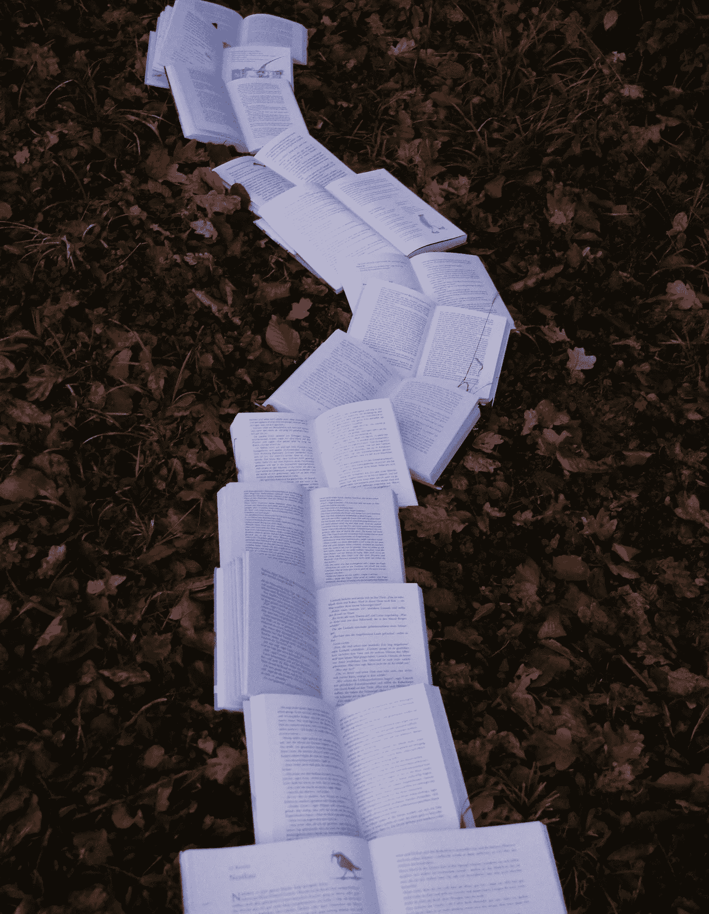

# 200 页。

> 原文：<https://medium.datadriveninvestor.com/200pages-3a6c73255c1c?source=collection_archive---------10----------------------->

播客、视频和文章。

这就是我在周日写的内容。但是，我消费内容的主要方式呢？书籍。

 [## 教科书行业如何最终被颠覆，并将继续改变-数据驱动…

### 就此而言，教科书产业在美国乃至全世界都有着悠久的历史。事实上，他们已经…

www.datadriveninvestor.com](https://www.datadriveninvestor.com/2018/09/25/how-the-textbook-industry-has-finally-been-disrupted-and-will-continue-to-change/) 

为什么是书？

我喜欢他们的深思熟虑。有结构。我可以对一个主题形成一个更完整的画面和更全面的理解。以罗纳德·里根为例，我最近读了一本关于他的书。让我们假设你想了解他的整个生活，了解他在总统任期之前、期间和之后是什么样的人。

听一个关于他的播客可能是一个很好的学习方式。但是，可能只是作为一个好的介绍。可能已经提供了一些好的信息，但可能没有很多后续研究的来源。

看视频可能会很棒。当然，有许多关于罗纳德·里根的精彩视频。但是，我的犹豫是看起来容易。你无法在视频中准确地突出某一两句话。虽然这可能是获取内容的好方法，但如果你只想了解他总统任期的一部分呢？

最后一篇文章，那些有的是。特别是在他执政的 8 年里，他被写了很多，被报道了很多。所以，关于罗纳德·里根的文章并不缺乏。然而，这些可能是更主观的部分，并再次提供较少的全貌。

所以，我相信一本书是去这里的最佳途径。

我的意图是了解广泛的话题和人物。我希望能够与任何人谈论任何事情，并能够为对话做出贡献。

我在学习上的大部分注意力都围绕着如何有效地做到这一点。

我可能对某个政治事件有所了解，因为我读过 3、4 篇关于这个主题的文章。但是，我认为更重要的是能够有效地沟通。

围绕政治和政治事件的对话通常涉及与他们的观点和观点密切相关的人以及强烈的情感。

如果在谈话中，说了一些让谈话方不高兴的话怎么办？如何避免这种情况？

此外，可以假设，虽然人们可能相信同样的事情，但他们会因为不同的原因而相信同样的事情。

没有对信仰背景的充分理解，你可能会处于相当不利的地位。与你交流的人可能很容易简单地认为他们听不到你的观点，因为你不理解。

这很有道理，不是吗？这是个问题。

我从来不想仅仅因为我不能有效地表达我对一种情况或信仰的理解而被“踢出”谈话。你知道吗？

包括我自己在内的人，往往对某件事只有简略的了解。

在读到罗纳德·里根之前，我知道他很受尊敬，是一位 20 世纪末的总统，也是一名基督徒。

但是，如果没有读过这本书，我可能就知道这么多。所以当有人告诉我，他走出了一个高压的国际会议，我不会理解。也许我想知道更多，因为对我来说，这似乎不符合我的性格。但是，与我交谈的人不会或不能提供更多的东西来解释为什么这是里根会做的事情。

这就是书出现的地方——语境。

正如我在[周日](https://medium.com/@harrisonwendland/you-are-only-as-good-as-the-content-you-consume-a3267ed1061a)所写的，“你消费的内容决定了你的好坏。”

如果你所知道的只是其他人——他们可能知道的和你一样多——告诉你的，你有多好？

书籍从写作到出版通常需要一年多的时间。与播客、视频或文章相比，需要更多的时间和精力来提供正确的东西，这些都可以在一天内制作和发布。

因此，人们可能会认为一本书的作者更注重确保真实性和准确性。

他们可能不会，但他们会列出来源，这样我们就可以自己检查和核实所提供的信息。

我现在就把它带回家。

我们可能因为不同的原因而读书。有些人甚至根本不看书。

为什么？

可能有很多原因，

> 我知道人们不读书是因为他们没有时间
> 
> 我知道人们不读书是因为他们认为没有价值
> 
> 我知道人们不读书是因为他们读得慢
> 
> 我知道人们不读书是因为他们不能集中注意力

你的理由是什么？

我读书是因为我想深入了解事物。我想了解人，了解是什么让他们“滴答”(我为什么喜欢传记)。我想了解别人是如何度过艰难时期或失败的，这样我就可以用他们的做法来帮助自己和他人度过类似的挑战。

当你完全理解这个概念时，向别人解释事情就容易多了。

当我们考虑去哪里看牙医时，为什么多年的经验很重要？为什么人们会等到第一次约会后才结婚而不是结婚？为什么运动队给菜鸟的合同比给有经验的球员的少？

人们已经能够塑造自己，能够展示自己，也能够让和他们在一起的人更好地理解他们。

如果我想分享我学到的东西，最重要的是我真的学到了一些东西。如果我反思罗纳德·里根在总统任期内做的一件事，但却不能详细说明为什么我觉得这件事很重要或有影响，那有什么好处呢？

分享我们的想法，为什么，为什么我们认为某些事情是最重要的。

如果我们不能分享我们的想法，为什么人们会听我们的想法？？

不过，这种事经常发生。人们经常分享他们对某件事的想法，却不支持或分享原因。但是，为什么呢？只是为了聊天？也许吧。

但是，如果我们能够理解为什么人们相信他们所做的事情，我们的对话不是会更有成果吗？这不正是我们想说的吗？内在的信仰或价值观？

这就是我读书的原因。人们不得不在书中分享这一点。你不可能写 200 页的东西，而不用一种揭示你的立场的方式，或者不明确地分享你的想法。

我读过的罗纳德·里根传记的作者詹姆斯·罗斯布什经常谈论里根做了什么，从他的角度分享他为什么做某事，并分享这对他作为总统副助理的意义。

如果说我读书有什么原因的话，那是因为它们是有条理的。我读书是因为它们是结构化的。我看书是因为它们容易整理。

我可以看看我的书架(现在由 DDC，杜威十进分类法整理)，看看我缺少哪些学科领域。我可以清晰快速地观察到我需要继续学习和获取更多知识的地方，因为我可以用更广泛的学科领域和主题来填充我的图书馆。

最终，从书中，我可以形成更完整的信念，也可以很快向他人展示我的信念来自哪里。

我读书不是为了好玩，虽然有时候是，我读书是为了学习。