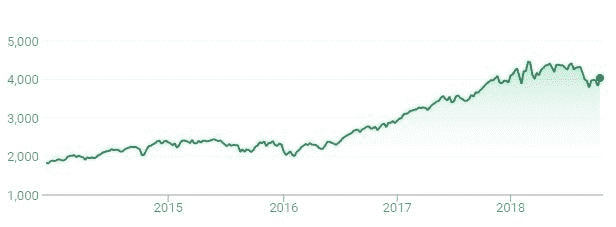
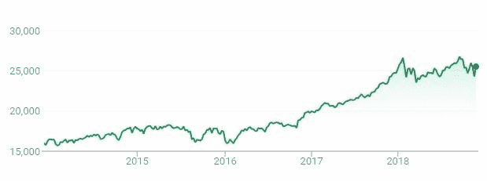
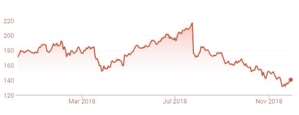
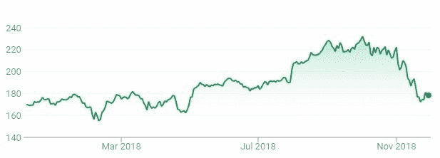
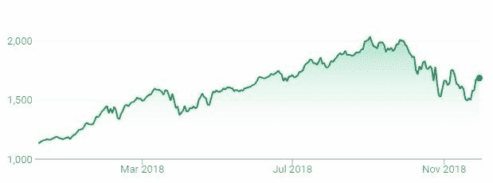
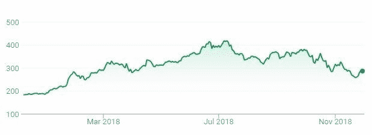
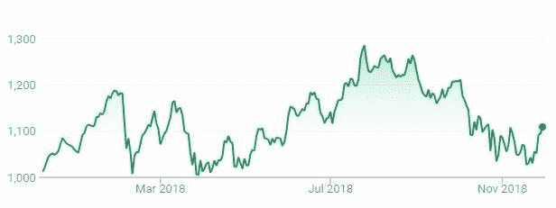

# 2018:科技失败了，倒下了吗？

> 原文：<https://medium.datadriveninvestor.com/2018-did-tech-fail-and-fall-e69eb7324b0d?source=collection_archive---------43----------------------->

2018 年的大部分时间都被科技公司在哪些方面失败以及它们的股票如何下跌的新闻所主导。

不可否认的是，有许多问题是大技术必须解决的，尤其是围绕数据隐私和安全。

如果我们将股价作为衡量成功的标准，今年发生的事情肯定是一次修正，但不清楚这是否是更大失败的一部分。

NDXT ie NASDAQ-100 技术板块指数(更多[此处](https://indexes.nasdaqomx.com/Index/Overview/NDXT))表明，2018 年是一个巨大的增长年，随后的下跌抹去了这些增长，所以我们最终基本上站在了起点。

如果我们用道琼斯指数(DJI)作为代表来看整体经济，我们会看到 NDXT aka tech 的增长要多得多，同期约高出 100%，而 DJI 的增长率为 66%。

*道琼斯*

因此，2018 年总体来说并不糟糕，只是个股的表现参差不齐。这尤其适用于 FAANG，这是美国许多技术和技术新闻的基准。亚马逊和网飞最终整体升值，苹果和谷歌基本回到起点，脸书大幅下跌。

*脸书*

苹果

*亚马逊*

*网飞*

*谷歌*

为什么每家公司表现如此不在本文讨论范围之内，但是网上有很多好的评论。

总体而言，今年科技行业喜忧参半，现在这是一个小问题还是一个长期趋势仍有待观察。对 2019 年会发生什么有什么想法吗？评论离开。

*这些都是专注于实践见解的短文(我称之为 GL；dr —良好的长度；确实读过)。如果它们能让人们对某个话题产生足够的兴趣，从而进行更深入的探索，我会感到非常兴奋。我在三星的创新部门*[*NEXT*](http://samsungnext.com/)*工作，专注于 deep tech 中软件和服务的早期风险投资，这里表达的所有观点都是我自己的。*