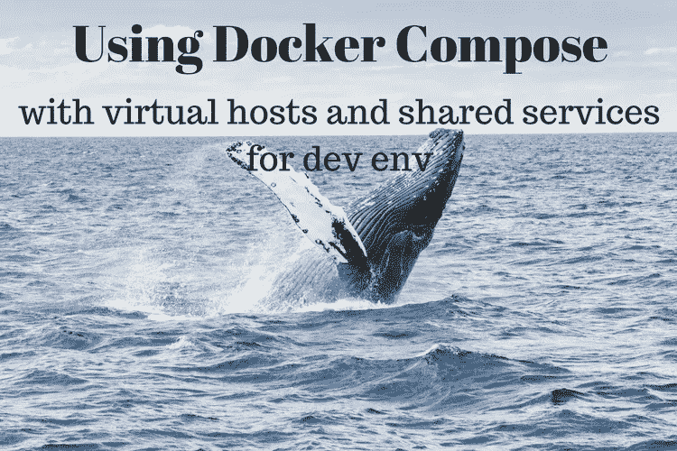
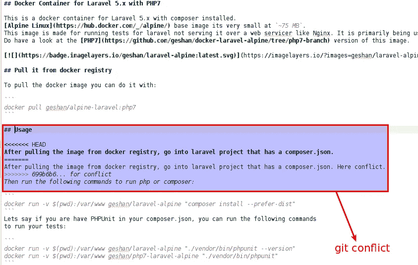

# 2018 年回顾:我的博客上今年观看次数最多的 5 篇帖子

> 原文：<https://medium.datadriveninvestor.com/2018-in-review-5-most-viewed-posts-of-this-year-on-my-blog-c1601285b5e4?source=collection_archive---------9----------------------->

在过去 11 年的博客生涯中，我从未这样做过，这一次会有所不同。我列出了 2018 年这个博客中被观看次数最多的 5 篇帖子。并非所有帖子都来自 2018 年，但它们的浏览量超过了其他帖子。我用我的谷歌分析数据来编辑这个列表。因此，我在这里展示了 2018 年在[Geshan.com.np](https://geshan.com.np/)上最受欢迎的博文:

# 1.[你可以用 SQL 来做，不要再为此写额外的代码了](https://geshan.com.np/blog/2018/12/you-can-do-it-in-sql/)

这篇文章 10 天前才发表，但是我获得了很多人的关注。这篇文章强调了:

> *使用 SQL 做数学，如总和，平均等。利用它对一个或多个关系值进行分组，比如获取产品类别。利用 SQL 进行字符串操作，比如使用 CONCAT_WS 连接名字和姓氏。利用 SQL 按自定义优先级公式排序。*

# 2.在过去的五年里，Docker 改变了软件工程师工作方式的四种方式

另一个来自今年 12 月的帖子在过去几周非常受欢迎。这篇文章是关于在过去的 5 年里 docker 是如何改变软件工程的。该员额可概括为:

> 有了 Docker，您不仅可以交付代码，还可以交付整个堆栈。为容器分配最少的所需资源，然后水平扩展它们。对于容器来说，安全性通常已经包含在内了。有了 Docker 和 Kubernetes，您可以实现零停机和更快的部署，从而带来商业利润。

# 3.[如何将 Docker Compose 与虚拟主机和共享服务(如 Db)一起用于开发环境](https://geshan.com.np/blog/2017/05/how-to-use-docker-compose-with-virtual-hosts-and-services-like-db-for-dev-environment/)

这是另一个关于 Docker 的帖子，是 2017 年 5 月的。这篇文章也收集了大量的观点。《邮报》主张:

> *使用 docker 和 docker-compose with external _ links，像跨多个项目的数据库一样重用服务。对虚拟主机使用 Ngnix 代理可以简化多项目设置和操作。*

# 4. [3 个简单的规则，用于减少或消除 Git 冲突](https://geshan.com.np/blog/2016/04/3-simple-rules-for-less-or-no-git-conflicts/)

这是 2016 年关于 git 的帖子。它今年也获得了很多点击量，可能是由于一些搜索引擎的流量。这篇文章主要可以总结为

> 保持你的变化小。经常把你的工作分支和主要分支重新组合。并且，更快地审查拉取请求，并将它们合并到主分支。

# 5.[不要像整块石头一样编码你的微服务，保持它的可维护性而不是过度设计](https://geshan.com.np/blog/2018/10/dont-code-your-microservice-like-a-monolith/)

这是今年 10 月的一篇关于微服务以及如何不把它编码成一个整体的帖子。这篇文章也从不同的渠道获得了一些观点。帖子主要主张:

> *微服务是小型软件系统。你可以安全地抛弃 MVC。对 ORM 说不，也不要带着微服务的设计模式包袱。关注代码的性能、可读性和可维护性，而不是一些旧的规则和模式。那些模式是在人们不做微服务的时候做的。*

# 结论

> 看来 docker 已经成为今年的热门话题了。也许明年我会写更多关于它的博客。我已经开始在[*dev . to*](https://dev.to/geshan)*和*[*FreeCodeCamp*](https://medium.freecodecamp.org/@geshan)*和*[*HackerNoon*](https://hackernoon.com/@geshan)*等媒体刊物上交叉发布我的帖子。希望这些帖子帮助到越来越多的人。*

*原载于*[*geshan.com.np*](https://geshan.com.np/blog/2018/12/2018-in-review-5-most-viewed-posts-of-this-year/)*。*