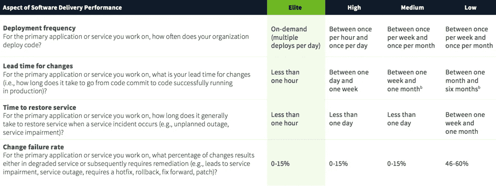
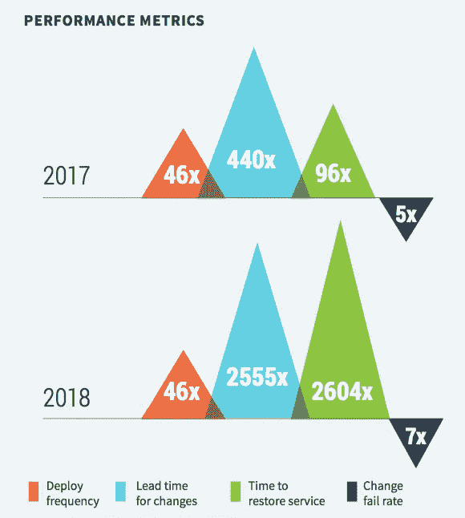
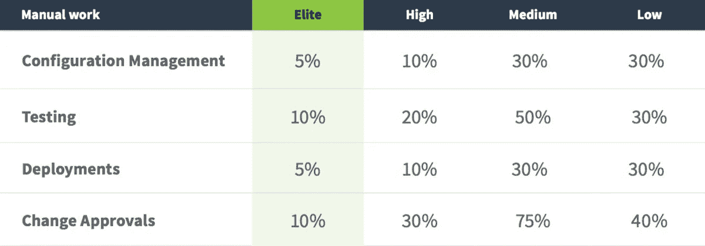
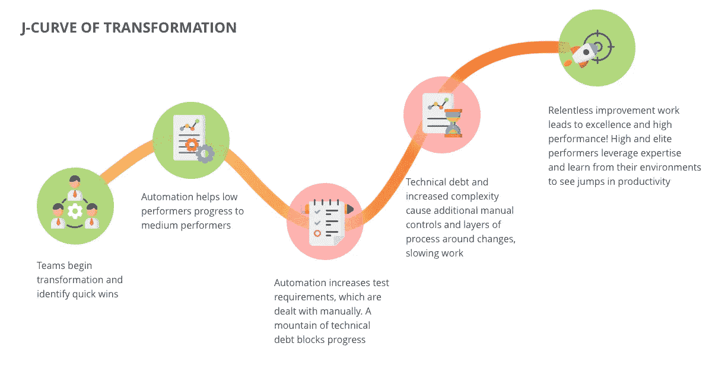
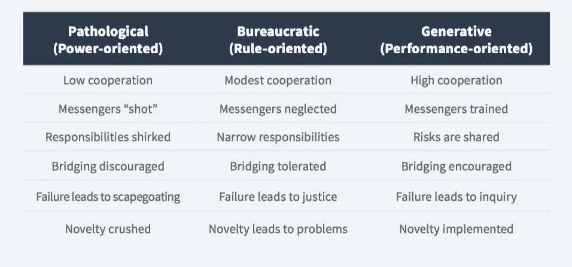

# 2018 年回顾:DevOps 采用情况

> 原文：<https://medium.datadriveninvestor.com/2018-in-review-state-of-devops-adoption-1ce59fb81bd8?source=collection_archive---------5----------------------->

去年，IT Svit 根据 Puppet 和 Atlassian 的调查结果，发布了一份关于 2017 年 DevOps 采用状况的报告。现在我们将它与最新的关于发展状况的[多拉报告](https://cloudplatformonline.com/2018-state-of-devops.html)进行比较。

虽然 DevOps 实践正在成为 IT 行业的主流，但不同的公司在采用它们时会得到不同的结果:

*   首先，有顶级的[托管服务提供商](https://clutch.co/it-services/msp)。这些公司生活和呼吸着 DevOps 文化，拥有丰富的实践经验，可以通过各种方式过渡到 DevOps。他们是**精英执行者**，能够通过应用 DevOps 工具和工作流来实现客户的业务目标，从而获得最惊人的结果。
*   一些企业决定雇佣外部[开发运维即服务](https://itsvit.com/our-services/devops-service-provider/)提供商，以获得顶尖的技术、技能和最佳开发运维实践。这些公司构成了高绩效员工的主体。
*   许多其他人试图采取更慢、更谨慎的方法，建立内部开发运维专家。这是[开始为中小企业和大企业](https://itsvit.com/blog/starting-using-devops-enterprise-vs-startups/)使用 DevOps 的标准方式，一旦他们的内部 DevOps 专业知识成熟，他们就会成为**中等绩效者**并发展成为高绩效者。
*   最后，仍然有公司认为他们不需要 DevOps。他们运用久经考验的工作流程，并不试图创新，他们只是以他们认为可行且足够划算的方式为客户服务。由于这些企业根本不使用任何 DevOps 实践，他们可以被视为**低绩效者**，因为与市场上的其他企业相比，他们的软件交付和更新速度要慢得多。

下面是这些组在软件开发生命周期参数方面的不同之处。

正如您所看到的，在软件交付生命周期的多个方面存在着非常显著的差异。下表列出了 2017 年 Puppet 和 Atlassian 报告的关键要点，以及 DORA 在 2018 年提供的更新数据。

也就是说，在软件交付的两个关键方面有非常显著的改进。为什么这样我们认为这些结果是由于去年发生的两个重大突破:

1.  [在日常 IT 运营中应用 AIOps 的第一个切实成果](https://itsvit.com/blog/aiops-next-level-devops-services/)。当系统监控工具能够了解故障正在酝酿并做出相应反应时，发生严重故障的可能性接近于零。更确切地说，当事件报告掌握了问题的根本原因以及建议的解决方案时，从事件中恢复所需的时间会大大缩短，确切地说是**的 2，604 倍**。
2.  当精英们采用[谷歌的方式来做 CI/CD](https://itsvit.com/blog/monorepo-google-way-ci-cd/) 并开始使用 monorepo 时，软件交付过程变得简单多了。当所有的资源都是现成的，并且容易配置时，在成功的测试之后，每个代码提交都变成了一个新的发布。数字不会说谎，这种实践提供了比软件交付快 2555 倍的速度！

# DevOps 采用成果:手动任务的自动化

采用 DevOps 有很多很好的结果。有些不能用简单的数字来衡量，比如部门间沟通和团队协作的改善。或者从**“把代码扔过墙去做别人的问题”**过渡到**“你建了，现在你运行”**原则。然而，[过渡到 DevOps](https://itsvit.com/our-whitepapers/transition-to-devops-the-reasons-methods-and-results/) 的一些结果可以很容易地测量，这些结果包括在[数字化转换](https://itsvit.com/our-whitepapers/how-to-perform-a-successful-digital-transformation-guideline/)前后 IT 部门执行的手动任务的数量。

很明显，转向使用 [DevOps 工具](https://itsvit.com/blog/must-have-devops-tools-make-things-right-get-go/)有助于节省大量时间和精力，并消除多个运营瓶颈，如变更批准或设置测试环境。然而，最好的结果是在配置管理和部署自动化领域取得的，这是由于利用了强大的自动化工具，如 [Kubernetes](https://itsvit.com/our-whitepapers/kubernetes-the-cornerstone-of-the-modern-cloud-infrastructure/) 、 [Terraform](https://itsvit.com/blog/use-terraform-kubernetes-manage-worlds/) 、Jenkins 和 Ansible。能够有效使用这些工具的团队，可以构建持续集成/持续部署(CI/CD)软件交付管道，从过程中消除几乎所有的浪费(意味着，手工工作)。

# DevOps 采用之路的起伏

我们谈了很多关于数字化转型和采用 DevOps 实践和工作流的问题。这可能看起来是一种平稳而不费力的方式……但事实并非如此。

当公司决定迁移到 DevOps 工作流时，一般期望很高。该公司设计了一个路线图，并开始对其工作流程和运营进行必要的更新。一旦一些明显的问题得到解决(比如测试环境供应和设置的自动化)，上表中的**低**执行者就变成了**中等**执行者。一切似乎都很好，是吗？

然而，测试环境的自动化供应不能加速手动测试的过程。随着时间的推移，管理层明白需要自动化单元测试，否则数字化转型计划将在技术债务的压力下失败。然而，引入单元测试需要对整个软件交付管道进行深入的重新设计和重新配置。

如果公司没有动摇，并在问题出现时不断解决问题——请注意，不是通过增加手动任务的数量，而是通过结构改革和在可能的情况下实施 DevOps 实践和工具——只有这样，公司才能成为一个**高**的执行者。

然而，在过渡到 DevOps 的过程中获得的转型经验有助于企业克服多种运营和组织挑战，更快地实现业务目标，花费更少，并为客户提供更多价值。这是漫长道路和艰苦工作的结果，但结果充分证明了这一点。

要成功实现开发运维，必须采用哪些实践？

*   使用[敏捷实践](https://itsvit.com/blog/agile-vs-devops-merging-fail-fast-agile-with-well-planned-devops/)而不是瀑布方法
*   使用[公共云或私有云](https://itsvit.com/blog/to-cloud-or-not-to-cloud-long-term-perspective/)，而不是本地或专用服务器
*   通过使用 [Kubernetes 和 Terraform](https://itsvit.com/blog/use-terraform-kubernetes-manage-worlds/) 作为中间层，选择[多云战略](https://itsvit.com/blog/digital-transformation-multi-cloud-strategy/)，以创建云无关的弹性基础设施
*   为核心产品构建[云原生系统](https://itsvit.com/blog/cloud-native-vs-lift-shift-way-choose/)，同时选择提升和转移不太需要可伸缩性的系统。无论如何，事实证明混合云方法并不是一个太好的选择，所以向云的迁移必须是完全的
*   将 [monolith 应用拆分成微服务](https://itsvit.com/blog/the-monolith-microservices-and-serverless-computing-pros-and-cons/)并在通过 Kubernetes 集群管理的 Docker 容器中运行。Docker 和 Kubernetes 一起使用在软件交付的本质上提供了一个结构性的转变，就好像用特斯拉自动汽车代替马车一样。
*   将部分业务外包给值得信赖的 IT 外包提供商。许多公司都有外包给印度的负面经历，但是现在东欧和乌克兰是主要的 IT 外包目的地，而且由于使用了他们的廉价和高技能的服务，IT 产业正在蓬勃发展。[雇佣专门的团队](https://itsvit.com/blog/5-benefits-dedicated-team-developers-vs-house-one/)来执行内部 IT 部门技能范围之外的任务，有助于公司将精力集中在关键任务上，并为客户创造更多价值。

这些是数字化转型的关键部分，但如果不彻底改革企业文化、创新态度和协作方式，这些都是不可能的。

# DevOps 文化:混合的主要部分

虽然以上几点看起来令人生畏，但是向一种新的思维方式的转变是最重要的部分。[Gartner 2015 年的报告](http://www.gartner.com/newsroom/id/3032517)指出，如果他们不接受 [DevOps 文化](https://itsvit.com/blog/devops-culture-huge-step-mankind/)，到 2018 年，10 个旨在采用 DevOps 工具的计划中有 9 个会失败。反过来，接受这种文化对许多公司来说是一个巨大的冲击，因为它导致管理层失去大量的执行和批准权，破坏孤立的任务和责任，采取积极的创新态度。

DevOps 文化的主要原则可以表述如下:

> **失败并不意味着想法不好，它意味着系统可以改进。这是一个为团队学习的机会，而不是责备任何人。快速失败，经常失败，吸取有价值的教训，前进，不断提高。**

这正是采用 DevOps 的意义所在:使用云虚拟机、DevOps 工具和自动化 CI/CD 管道来激励开发人员进行试验并找到更好的方法。当一个新的服务器用一个命令在 5 分钟内配置好，测试一个想法几乎不需要花费时间和资源，开发者也不害怕创新。

这导致不断的学习和自我发展，从而更快地提交更干净的代码，更少的错误，更快地实现客户反馈，更大的创造力和生产力，增加公司的忠诚度，等等。最重要的是，这会带来更好的最终用户体验、积极的结果和口碑品牌宣传，这是任何企业都可以拥有的最佳广告。

# 关于 2018 年 DevOps 采用情况的最终想法

以上数字证明了各种规模的公司采用 DevOps 的效率。Forrester 宣布 [2018 年是企业开发运维](https://go.forrester.com/blogs/2018-the-year-of-enterprise-devops/)年，因为**超过 50%的企业业务**现在都在积极使用内部或外部开发运维服务。在一系列文章中，我们描述了 DevOps 如何帮助极大地改善诸如[金融服务](https://itsvit.com/blog/devops-financial-services/)、[医疗保健](https://itsvit.com/blog/devops-healthcare-benefits-case-studies/)、[保险](https://itsvit.com/blog/devops-insurance-industry/)、旅游、电子商务等行业的业务流程。

因此，每家公司都可以自由选择最佳的 DevOps 采用方式。如果谨慎的实验和缓慢的发展最适合你的公司战略——试着在内部培养 DevOps 人才，祝你好运。但是，如果你想快速看到好的结果，雇佣一个专业的 DevOps 服务提供商是必须的。如果您希望 IT Svit 为您的 DevOps 之旅提供帮助，请[轻推我们](https://itsvit.com/contacts/)，我们随时准备为您提供帮助！

*原载于 2018 年 10 月 16 日*[*itsvit.com*](https://itsvit.com/blog/state-devops-adoption-2018/)*。*