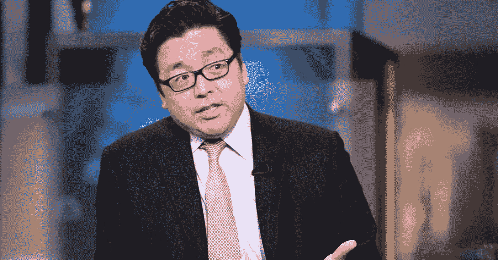
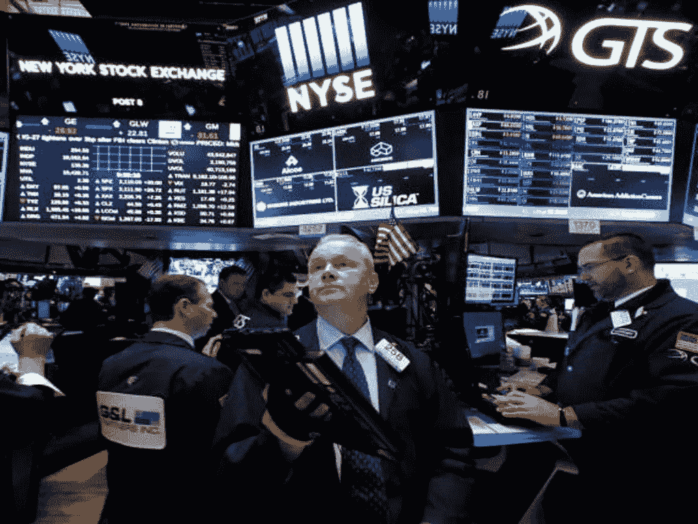

# 2018 年——加密对冲基金宁愿忘记的一年

> 原文：<https://medium.datadriveninvestor.com/2018-the-year-crypto-hedge-funds-would-rather-forget-a9207e306003?source=collection_archive---------4----------------------->

Hedge fund manager’s version of Netflix and chill was decidedly not.

事情不应该是这样的。随着成千上万消息不灵通、装备不良的“投资者”(我松散地使用这个词)将数十亿辛苦赚来的美元投入 2017 年的首次硬币发行(ICO)热潮，让自己一夜暴富，职业经理人稳健、受过教育甚至双手被认为可以照亮无知的人。随着加密货币炒作周期在 2017 年的最后几个月达到极限速度，华尔街的专业分析师、经理和金融家开始涌入加密货币，此前一些名人如 Blythe Masters(衍生品的创造者和前摩根大通高管)、Mike Novogratz(前对冲基金交易员和高盛合伙人)和 Dan Morehead(前 Tiger Management 宏观交易主管)在加密货币前所未有的增长和乐观时期引领了潮流。你还没来得及说，“什么时候的月亮？”各种各样的加密货币对冲基金正在建立店铺，但他们很快就会面临双重打击:即将到来的加密崩溃，以及支持机构级投资机构的基础设施的严重缺乏。从托管解决方案到基金管理，华尔街人士都不熟悉他们的环境，而且无论好坏，他们可以依靠的声誉(或跟踪记录)有限，他们留下来开店。在经历了肮脏的 2018 年后，许多这些基金，特别是那些在大肆宣传时成立的基金，现在呼吁投资者保持耐心，坚持到底。

在 2017 年底成立的众多专注于加密的对冲基金中，那些长期持有偏见的基金受到的打击尤其严重，因为投资者在 2017 年将资金投入交易比特币和其他加密货币的基金，并希望依靠整个行业的繁荣。但比特币去年暴跌了近 75%，无数其他加密货币也出现了类似的下跌，许多投资者一直在叫嚣着要退出——这促使基金敦促他们坚持到底，在某些情况下甚至依靠门控条款(由于极端的市场条件，投资者无法赎回其在基金中的股份的条款)来锁定投资者。

遭受重创的尤其是总部位于旧金山的潘迪拉资本公司，该公司成立于 2013 年，可以说是最早的加密货币对冲基金之一。在 12 月给投资者的一封信中，潘迪拉资本承认，2018 年对“所有加密货币和代币来说都是艰难的一年”但由丹·莫尔黑德(Dan Morehead)设立的该基金拥有超过 5 亿美元的资产，一直在敦促客户关注加密货币的长期商业案例。潘迪拉资本可能是比较成功的加密基金之一，最近在去年 7 月报告了 10，000%的终身回报率。虽然该基金截至去年第三季度亏损 40.8%，但对于提前套现的投资者来说，投资潘迪拉资本会被认为是非常成功的。正如生活中的所有事情一样，时机至关重要。莫尔黑德和联席首席信息官乔伊·克鲁格写信给投资者，

> “在市场经历了如此长时间的下跌后，反思并重新评估公用事业代币背后的理论非常重要。”

在经济形势好的时候，潘迪拉资本也不是没有为投资者带来收益。一只专注于 ico 的独立基金在 2017 年回报率为 350%，但在 2018 年第三季度下跌了 75%。许多其他基金，尤其是那些在繁荣时期开店的基金，甚至没有那么幸运获得成功，其中许多基金从一开始就亏损。平心而论，由于许多基金的净资产值(NAV)现在已经严重缩水，如果你从总体上长期看好加密货币，就可以以巨大的折扣购买这些基金。加密货币的长期成败在很大程度上取决于采用和价值创造。莫尔黑德和克鲁格对加密货币的长期采用持乐观态度，他们写道，

> “我们坚信代币将在现实世界中得到使用。事实上，在本轮熊市的最深处，这种情况已经开始发生了。”

莫尔黑德和克鲁格的观察并不都是公关用语。因为许多骗局和失败的 ICO 项目后来都被搁置了，那些致力于创造价值以及区块链和加密货币生态系统长期可持续性的人有机会做好准备，继续努力发展。莫尔黑德和克鲁格认为，区块链网络可能需要两到三年的时间才能达到规模，但鉴于手头问题的复杂性，有理由相信这些估计充其量是保守的。尽管一些最优秀和最聪明的开发者已经进入区块链生态系统，但鉴于所有加密货币和区块链项目面临的固有政治和技术挑战，五年可能是一个乐观的时间表，十年的时间范围可能过于保守。

FundStrat founder and man telling you that you should get back in line, Thomas Lee.

虽然加密基金可以押注价格的上涨和下跌，但在加密热潮的早期，做空的选择并不容易获得。经理们也不愿意卖空数字资产，因为 2017 年加密货币出现了前所未有的增长，许多人受到了市场崩溃的冲击，对冲工具有限，其中一些经理是受加密货币长期成功的意识形态驱动的。根据数据集团 HFR 的数据，2018 年加密对冲基金平均下降了 70%。

就连迈克·诺沃格拉茨的银河数码也未能幸免。银河被动管理的基准加密指数基金是一家专注于加密货币和区块链的商业银行，每年收取 2.5%的管理费，从 2018 年 5 月到 10 月下降了 50.6%。该基金持有一篮子加密货币，包括比特币、Ripple、以太币和莱特币，其操作类似于指数基金。在 11 月致投资者的一封信中，诺沃格拉茨写道:

> “(加密货币)资产类别继续显示出成熟的迹象，因为曾经导致疯狂交易时段的头条新闻已经让位于耐心的市场参与者，他们希望看到结果并做出反应，而不是头条新闻。”

不幸的是，对于 Novogratz 和 Galaxy Digital 的投资者来说，2018 年的大多数头条新闻都是关于加密货币价格的惊人下跌。但 Novogratz 仍然具有弹性，预计今年金融机构将从投资加密基金转向直接投资加密货币，从而实现复苏。但许多最大的金融机构去年宣布成立探索团队调查加密货币交易(大张旗鼓)，也悄悄地关闭或缩减了这些业务。从高盛(Goldman Sachs)到摩根大通(JP Morgan)和巴克莱(Barclays)，华尔街的许多大公司都在悄悄关闭加密货币交易部门，或让员工离开探索性业务。

## 熊赚钱，牛赚钱，猪被宰杀

但并非所有人都度过了艰难的 2018 年。在给定的市场条件下，采取市场不可知方法的加密货币基金也是表现最好的。尽管投资者在千百分之一的投资者中回避两位数的回报，但像纽约系统阿尔法管理公司(SAM)这样的机构的保守做法可能会笑到最后。Systematic Alpha Management 的加密货币基金在 2018 年前 11 个月的回报率为 4.3%，鉴于几乎所有其他基金在 2018 年全年都取得了两位数的高命中率，这是一个重大成就。SAM 的算法基金交易比特币期货，并试图从价格上涨和下跌趋势中获利，是少数几家能够在 11 月比特币兑美元暴跌 38%期间获利的机构之一。但鉴于 SAM 的利润微薄，该基金很可能在 2018 年结束时也出现赤字，SAM 的首席执行官 Peter Kambolin 也承认这一点-但综合考虑，SAM 的损失与整个加密基金相比可能不算什么。

“I hate it when the intern mixes up the sandwich orders.”

部分问题在于，加密货币的美元价值充其量只是波动性的，普通投资者很少了解这些货币。由于加密货币的制度结构很少，监管环境也不确定，只做多的方法极具挑战性。然而，内在的波动性意味着，能够以风险管理和市场不可知的方式利用这种波动性的投资者，将有可能在中长期实现阿尔法。也许不是在百分之几千的回报水平，但高两位数。这也是加密基金面临的最大挑战之一。秘密基金的部分吸引力(至少在早期)在于它们对投资基金超常回报的承诺。在其他任何地方，你都不可能获得成千上万的回报。但现实是，任何承诺数千%回报的工具都必须用挑剔和怀疑的眼光来看待——如果它不是一个骗局，它就不会持续。随着加密货币市场的成熟，1000%回报的日子很可能已经成为过去，这意味着加密基金不再是一个特殊的联盟，而是与传统的对冲基金竞争，后者也在寻求两位数的回报。在这种情况下，对投资者来说，投资加密技术的存在理由似乎不那么有吸引力了。鉴于不确定的前景、缺乏保障以及监管的不确定性，投资者的风险回报比可能至少目前是不同步的。展望未来，像系统性阿尔法管理这样的算法基金可能会继续存在，但长期偏好的加密基金可能很难在管理下筹集更大的资产池，因为投资者的动机(贪婪)可能不再能够满足。