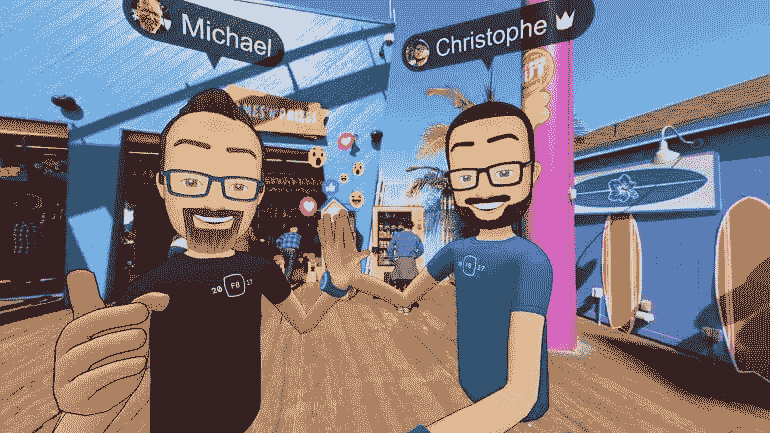
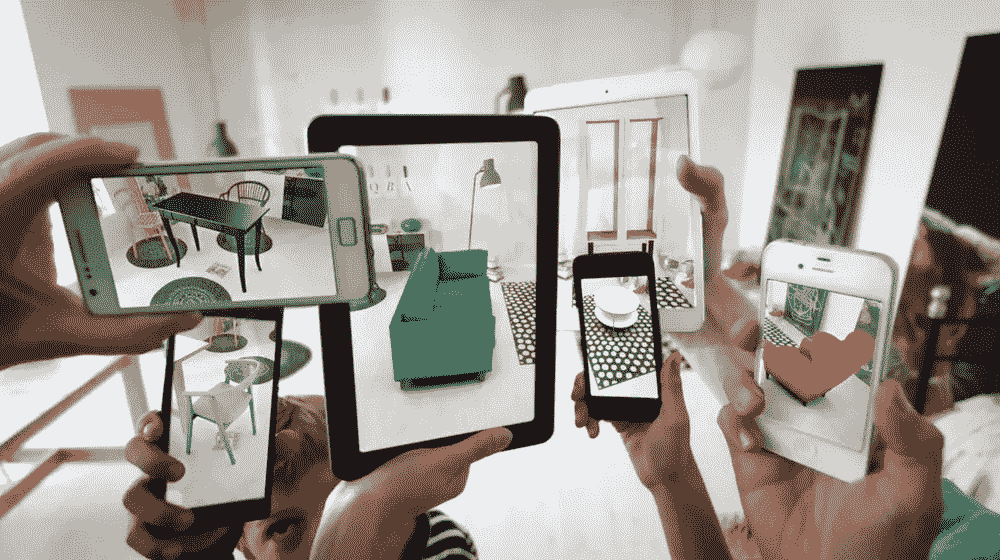
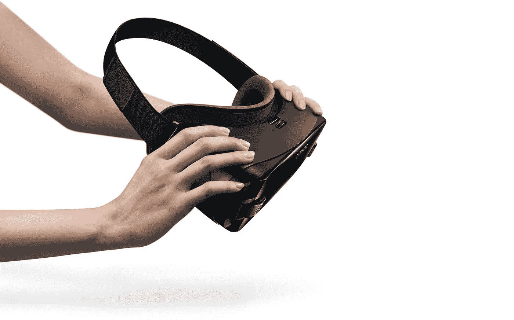
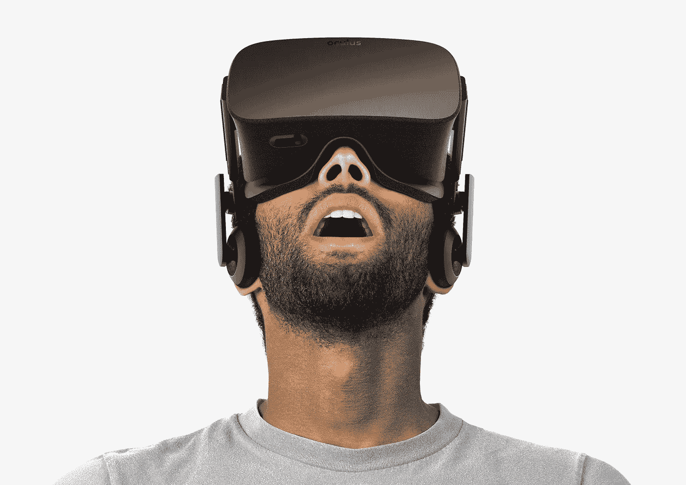
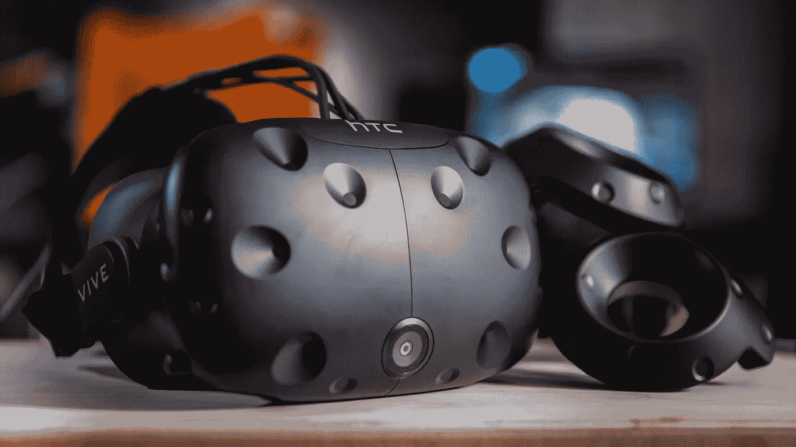
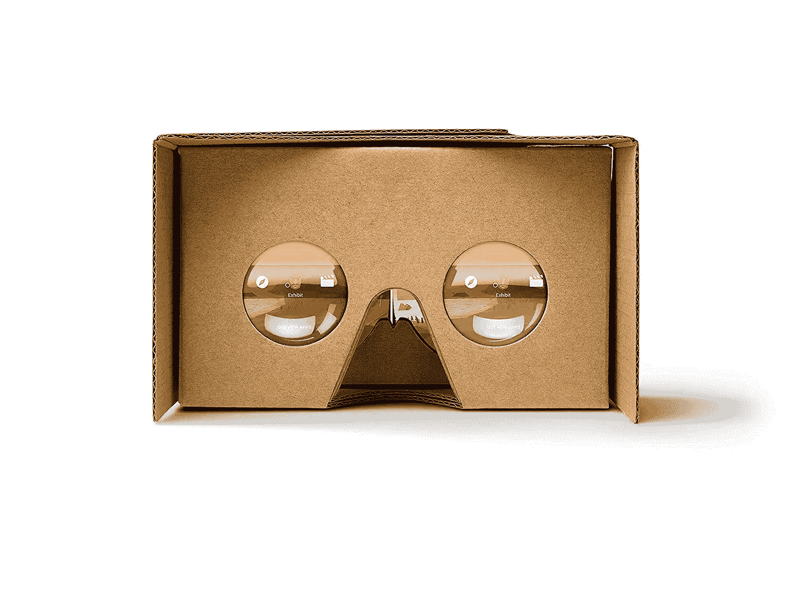
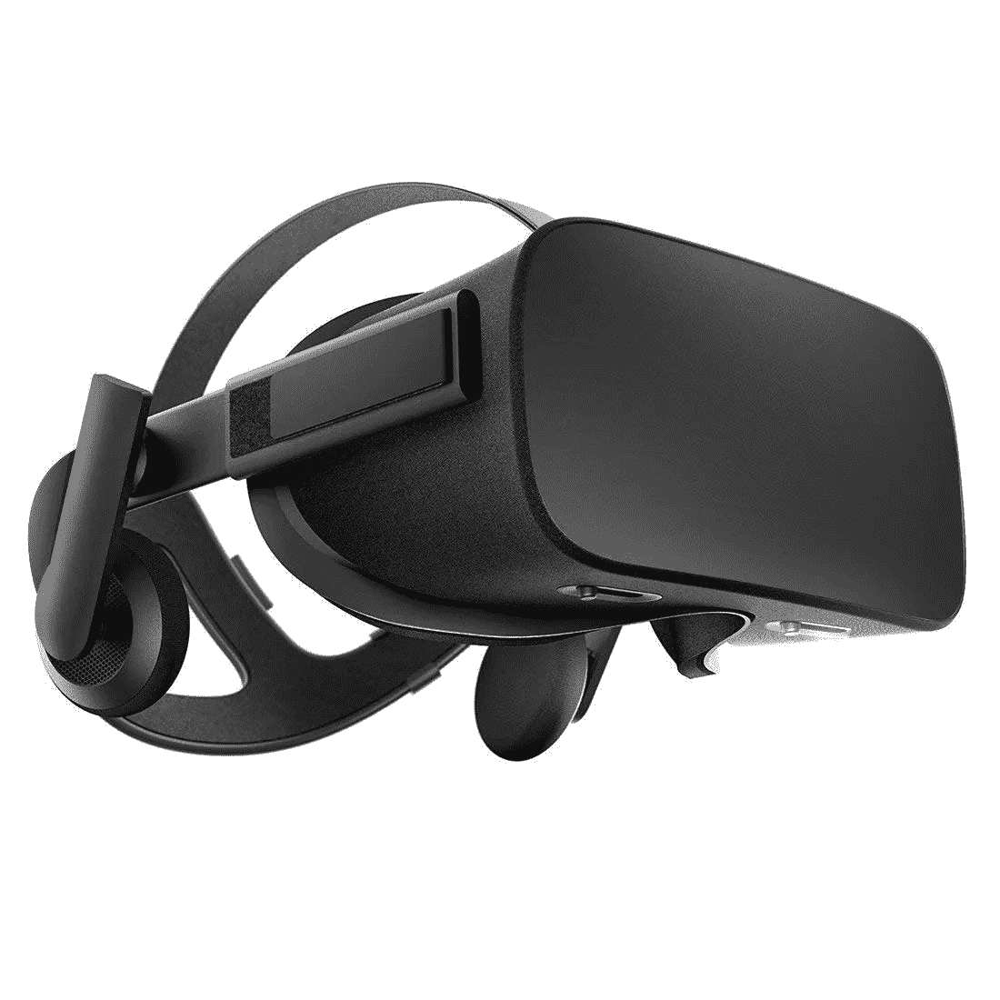

# 2018: VR 项目/设备/问题

> 原文：<https://medium.datadriveninvestor.com/2018-vr-projects-devices-issues-d6350edea941?source=collection_archive---------6----------------------->

虚拟现实(Virtual reality)(**VR**)是一种发生在模拟环境中的交互式计算机生成体验，主要包括听觉和视觉，但也包括其他类型的感官反馈，如触觉。

VR 不应该与**模拟现实**混淆，后者是一种假设，即现实可以被模拟——例如通过量子计算机模拟——达到与“真实”现实无法区分的程度。

1962 年，Morton Heilig 建造了一个**sensor ama**——一个机械设备，包括立体彩色显示器、风扇、气味发射器、立体声系统和一把运动椅——以改变观众在剧院的体验。

今天，虚拟现实不仅在娱乐业非常受欢迎，而且在不同的行业也获得了越来越大的空间:

Stéphane Surowka 将 5 个领域定义为教育、交流、分析、商业和休闲，他是完全正确的。他在 2017 年发表了一篇关于它的[伟大文章](https://arvrjourney.com/five-application-fields-of-virtual-reality-60920b25020c)。

## 2018 年有什么新鲜事？

如今，虚拟现实应用于:

**1)汽车行业** —虚拟现实允许设计师和工程师检查模型的外观和功能。复制外部环境实际上也允许安全试验。

> 福特、沃尔沃和现代等主要品牌不仅在制造过程中，而且在销售中使用虚拟现实。从尝试不同的功能到试驾，客户可以获得整个汽车系列。随着虚拟现实技术的使用，经销商展厅的需求可能会过时。

**2)医疗保健—** 虚拟现实帮助学生和医生更多地了解我们的身体，并模拟高风险程序。这也意味着现在机器人手术可以用 VR 进行。如今有许多基于虚拟现实的疗法:康复、焦虑症治疗、疼痛管理。

**3)社会科学和心理学—** 研究人员利用虚拟现实的沉浸感来研究数字刺激如何改变人类的感知、情感和生理状态，以及它如何改变社会互动，此外还研究了数字互动如何在物理世界中实现社会变革。

有一些社交网络:

*   **脸书空间—**Oculus Rift 的应用程序—它允许您观看视频，检查 360 度照片，在 3D 中绘图，并与多达 3 个脸书朋友共享您的空间。
*   你可以邀请朋友在月球上喝咖啡:)
*   **SlotsMillion VR** —全球首个真钱虚拟现实赌场。
*   **娱乐室—**HTC Vive 的免费 Steam 应用程序，是一个“虚拟现实社交俱乐部”,专注于多人游戏。在这里，你可以参与各种体育风格的游戏，从乒乓球到篮球到圆盘高尔夫，但让每个人都如此兴奋的游戏是虚拟现实彩弹游戏。
*   **Sansar**——一个“平台”，允许用户创建自己独特的虚拟空间，其他用户可以探索这些空间。
*   **高保真度—** 用户可以在元宇宙进行虚拟空间跳跃，参加活动，逛商场，并查看其他人在做什么。该平台假装用于品牌推广、教育和社区管理。
*   **AltSpaceVR**——最早也是最大的社交 VR 网络之一，由 NBC 支持，被微软收购。它代表了许多虚拟现实空间，你总是可以选择一个适合你的。

**4)建筑—** 建筑师可以尝试建筑的所有方面，如照明、材料和布局，而他们的客户可以虚拟参观他们的新家或建筑，并了解其外观和感觉的每个细节。

**5)航空航天—** 第一批飞行和军用模拟器出现在 70 年代。但虚拟现实也有助于建立和维护技术。

> Thomas A. Furness III 是最早将虚拟现实用于军事训练的人之一，1982 年，他向美国空军展示了他的虚拟飞行模拟器的工作模型，即视觉耦合机载系统模拟器(VCASS)

**6)金融—** 美国银行富国银行成为首批开始测试虚拟现实的银行之一，它在 2014 年开设了一个数字实验室来测试脸书的 Oculus Rift 耳机。其目的是让顾客“虚拟地”进入分行。

多年来，各种虚拟银行应用程序也已推出，以提供新的数字银行体验。2017 年 6 月，法国巴黎银行(BNP Paribas)推出了 VR 应用，部署该应用是为了让零售银行用户能够在 VR 环境中访问他们的账户活动和交易。

VR 还用在资金和投资上。

**7)电子商务和零售**

逛逛虚拟商店，试试你喜欢的东西！你可能听说过甚至测试过宜家的室内设计应用程序:使用 AR，你可以在家里摆放家具，并在购买前看看它会是什么样子。

**8)营销—** 最早通过活动和广告探索虚拟现实的行业之一。

*   2014 年，沃尔沃展示了其 XC90 SUV 的“VolvoReality”试驾，该公司使用谷歌的 Cardboard VR 耳机以应用程序的形式交付了这款车。最近的项目包括三星在某些商店发布其虚拟现实耳机，以推广其产品。
*   中国电子商务巨头阿里巴巴[承诺将虚拟现实技术](https://techcrunch.com/2016/03/17/alibaba-is-working-to-bring-virtual-reality-into-its-e-commerce-services/)融入其客户的购物体验。今年，电子商务公司[为其客户增加了一个新的购物选择](https://www.pymnts.com/news/retail/2017/alibaba-promotes-arvr-ecommerce-via-virtual-stores-on-singles-day/)——虚拟商店。

[HubSpot](https://medium.com/u/8732e73183e5?source=post_page-----d6350edea941--------------------------------) 发布了 [9 个 VR 营销实例](https://blog.hubspot.com/marketing/vr-marketing-examples)——值得一看。

**9)电影和娱乐**

**水滑道—**2018 年 3 月，VRSlide 系统在德国耳钉银河推出。这种 VR 系统的耳机是防水的，能够潜入水中大约几米。它们由三星 Galaxy S8 提供动力，并使用定制的软件系统

**Sundance 2018** 向世界开放了许多有趣的基于 VR 的[电影，其中:](https://www.theverge.com/2018/1/26/16919236/sundance-2018-best-virtual-reality-augmented-vr-ar-new-frontier)

*   这部多章惊悚片讲述了一个名叫泰德的幻想破灭的警察调度员接到了一系列来自被同一个杀手威胁的人的电话
*   韦斯·安德森的定格电影*狗岛*也有自己的 VR 版本。

*   《墙里的狼》(根据尼尔·盖曼的同名儿童读物改编)讲的是一个名叫露西的女孩，她坚信她家的墙里住着狼。为了阻止他们，她与扮演假想朋友的玩家组队。

## 根据 XRDC 的 2018 年 AR/VR 创新报告，视频游戏和娱乐仍然以 70%的比例位居开发者关注的项目之首，而培训和教育获得了 36%的投票。

需要说的是，虚拟现实不仅为社会提供了一种逃避现实的可能性，也提供了一个拓展业务的机会:科技巨头发布了虚拟现实设备和服务，广告公司有更多的选择来推广客户，从而赚钱。

VR 设备通常连接到您的手机或 PC，可以用于游戏、电影、纪录片、教育节目、音乐会。

## 哪些 VR 设备值得购买:

1.  三星 Gear VR —仅适用于三星手机。

Gear VR 有一个控制器，并获得了用户的许多积极评价。

他们非常欣赏制作精良的控制器、非常详细和清晰的视觉效果、创新的语音命令、易于使用的界面、出色的头部跟踪，最后是价格(亚马逊上的 119.90 美元)。

App 目录这里是。我们需要提到的是，Gear VR 只能与 Oculus 的移动 Gear VR 软件库配合使用。

2.**Oculus Rift**——更贵的竞争对手(亚马逊上 399 美元)。

TechSpot 和亚马逊的评论指出了许多优点:

*   强烈支持坐姿和站姿体验
*   比前代产品更好(更坚固)的设计
*   内置的 3d 音频让虚拟现实体验更加引人入胜
*   巨大的沉浸感
*   功能性平台，有多种游戏可供选择
*   耳机的卓越品质
*   直观的界面
*   轻巧的耳机
*   大跟踪量

但是，用户也提到，Oculus 需要一台功能强大的游戏 PC，你不能通过耳机安装游戏，耳机会有轻微的声音泄漏，Xbox controller 充其量只是一个权宜之计，而且没有穿透式摄像头，正如我们在开始时所说的那样，它非常昂贵。

> **性价比最高—**Oculus Rift 以更实惠的价格提供了卓越的性能，轻松赢得了我们的最佳购买奖(亚马逊)。

有趣的事实:脸书在 2014 年夏天收购了 Oculus Rift。

3. **HTC VIVE —** 一款极具沉浸感和互动性的 VR 耳机，在亚马逊上获得了最高分。

价格:499 美元至 1702.27 美元

*   高质量、视觉上身临其境的交互式 VR 体验和图形
*   准确的运动跟踪。头部追踪优于 Oculus Rift
*   大型虚拟现实内容库
*   触摸控制器易于使用，适应性强

用户还是不喜欢很多游戏还是觉得意犹未尽，没有内置音频，它的重量，需要的大量占地面积以及 Vive 的价格。

根据 XRDC 的 2018 年 AR/VR 创新报告，45%的开发者选择 HTC Vive 作为他们的首选平台。

4.**官方谷歌纸板——亚马逊上仅售 15 美元和 4.5 英镑！**

*   Cardboard 支持大部分 Android 或 iOS 手机，屏幕尺寸从 4 到 6 英寸。
*   纸板组装只需三个简单的步骤。

其中一篇评论说:

> 这是一个很好的耳机，任何人都想看看虚拟现实，而不是支付接近 1000 美元的整个耳机系统。它与 Oculas 或 HTC Vive 平台相去甚远，但你可以获得相当多的应用程序。
> 
> 优点:
> -不贵
> -易于设置
> -测试 VR 的简单方法
> -用于控制与 iPhone 兼容的一些应用程序的“开关”
> -适合戴在眼镜上
> -灯
> 
> 缺点:
> -显然不是完美的身临其境
> -鼻梁架可能会有点不舒服
> -必须把它举到你的面前
> 
> 总而言之，这是一笔划算的买卖。

5.**索尼 PlayStation VR (PS4)**

价格:512 美元

**优点:**

*   HDMI 端口可以连接 VR 与 PS4、Xbox1 和 PC。
*   WiFi 和蓝牙允许您下载许多应用程序，如 NIBIRU 系统、2D/3D 应用程序、Google play、Youtube、第三方应用程序等。
*   t 形头带
*   2D/3D/全景模型
*   分辨率为 2560x1440P
*   高灵敏度陀螺仪
*   节能模式
*   TF 卡
*   轻量

**缺点:**

*   一些用户在连接 HDMI 时遇到了问题和延迟
*   与 PC 不兼容
*   PS4 控制台迫切需要另一个 USB 端口来为所有控制器充电

## 2018 期:

然而，VR 仍然需要解决一些问题。2016 年是虚拟现实在消费市场上爆发的一年，但 2018 年也会如此吗？

> “每个人都还在等着看我们应该用耳机做什么，”爱德华·卡斯特洛娃说

1.  2018 年，VR 不再是为了娱乐，而是为了商业和工业。其中一家顶级公司 VisionThree 正在为劳斯莱斯、陶氏农业科学和其他大公司开发培训项目。

随着千禧一代步入职场，这种技术尤为重要。

> 年轻员工不想被交给厚厚的手册，他们需要阅读理解他们的工作；他们不想坐在教室里。从长远来看，虚拟现实培训更便宜。

2.VR 耳机应该更舒服。

如果他们在虚拟世界中移动，但在现实生活中静止不动，一些用户会感到头晕目眩，仍然会挣扎。

专家们正试图用电子鼻来解决这个问题。研究表明，数字鼻子减少了大约 13%的虚拟现实运动病。

3.头戴式耳机仍然体积庞大，许多是拴着的，好的是昂贵的，大多数人看不到这项技术的实际需要。

4.需要更多的实验和测试。

5.道德问题:

*   用户保护和隐私

> 2017 年 12 月下旬，一名莫斯科居民在虚拟现实(VR)中玩耍后受了致命伤。据报道，该男子绊倒后撞上一张玻璃桌子，受了致命伤，因失血过多而死在那里。据我们所知，这是有史以来第一个与虚拟现实相关的死亡记录。

*   用户的孤立和社会影响，
*   暴力内容，毫无疑问 IR 色情有[一个重要的投资和活动水平](https://www.vrfocus.com/2017/12/will-vr-porn-be-a-success-or-a-potential-failure/)。
*   太现实的虚拟世界可能会改变精神状态的方式，使人们看不到它们之间的区别。

6.延迟、声音、兼容性等技术问题

7.费用

我们需要明白，虚拟现实现在还年轻，还在发展中，我们不知道它是如何工作的，因为我们的良心仍然沉迷于一个现实。

如果你需要推广你的产品或获得更多的关注，或者你想创造一些特别的东西，你可以联系一家专门从事虚拟现实的公司，与 Mercedez 合作，为 IPhone，商店，在线平台等创建应用程序。它们在世界各地都有！以下是由 [ThinkMobiles](https://medium.com/u/47916fa60977?source=post_page-----d6350edea941--------------------------------) 发布的[25 强](https://thinkmobiles.com/blog/virtual-reality-companies/)。