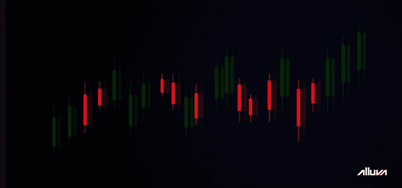
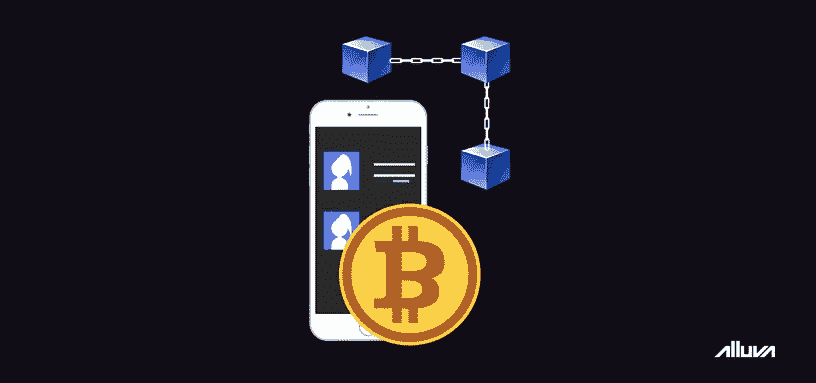

# 2019:区块链领域重大事件回顾

> 原文：<https://medium.datadriveninvestor.com/2019-a-look-back-at-the-major-events-in-the-blockchain-space-7a70c2f77858?source=collection_archive---------10----------------------->

今年早些时候，加密货币市场庆祝了成立十周年。2009 年 1 月，一群密码学爱好者开创了世界上第一个以比特币形式的分散货币供应，这是“密码”和“货币”的融合。

从那时起，加密货币和区块链技术已经在许多行业找到了独特的用例，包括金融、娱乐和物流。如今，每天都有价值数十亿美元的加密货币易手，而且这个数字只会随着时间的推移而增长。

 [## Azbit 旨在连接传统金融和加密货币|数据驱动的投资者

### Azbit 是下一个提供交易平台的加密项目，该平台提供保证金和算法交易。一样多…

www.datadriveninvestor.com](https://www.datadriveninvestor.com/2019/03/20/azbit-aims-to-connect-traditional-finance-and-cryptocurrency/) 

在本文中，我们探讨了自 2019 年初以来加密货币市场的发展以及区块链领域的一些重大事件。

# 2019 年:市场完全逆转

虽然加密货币市场在 2018 年的大部分时间里经历了大规模抛售，但就估值和采用情况而言，今年对该行业基本上是积极的。作为世界上最大的加密货币，比特币今年年初的每枚代币价格约为 3700 美元。然而，今年 6 月，它突破了 13，000 美元，此后一直在 10，000 美元的区间内交易。所有加密货币的累计市值目前为 2710 亿美元。

许多人将比特币 2019 年的价格飙升归因于脸书和摩根大通等公司。六月，社交媒体巨头揭开了天秤座的面纱，这是一个有争议的稳定硬币项目，与美元挂钩。摩根大通还[提出了](http://bit.ly/33AVM7Y)一种被称为 JPM 币的稳定硬币，专门为银行的批发支付客户制造。

据市场分析师和专家称，这些大公司采用区块链技术有助于提高比特币在大众中的可信度。然而，由于脸书在处理用户安全和隐私方面的记录，Libra 本身也受到了广泛的批评。国际监管者、最终用户、各种政客，甚至美国总统都对脸书对待天秤的方式表达了[的不满](http://bit.ly/2ZcrN31)。

# 移动领域的区块链之年

话虽如此，今年其他大公司也在加密货币市场留下了印记。今年 3 月，韩国电子巨头三星[宣布其最新旗舰智能手机系列 Galaxy S10 将搭载一款加密货币钱包应用。这款名为三星区块链钱包的应用程序支持以太坊和 ERC-20 令牌。钱包还允许用户直接从智能手机上与分散式应用程序(DApps)进行交互。在大多数其他设备上，用户必须手动下载第三方扩展或应用程序才能与 DApps 进行交互。](http://bit.ly/33CQ6dP)

三星进入区块链市场很快受到了竞争对手智能手机制造商 HTC 的挑战。Galaxy S10 发布一个月后，HTC 继续在[发布](http://bit.ly/33HaBpJ)Exodus 1S，这是一款 300 美元的智能手机，可以兼做比特币节点和硬件钱包。该设备预计将于今年第三季度推出。与此同时，LG 在 7 月份申请了“ThinQ Wallet”商标。根据提交给[的文件](http://bit.ly/2Zf1mxE)，该商标将用于手机上的数字支付应用。

# 分散的网络

曾经无处不在的网络浏览器 Opera 也公布了 2019 年的大规模区块链推送。4 月至 6 月间，该公司在所有主要平台上的 Opera 中集成了加密钱包功能，包括桌面、Android 和 iOS。该公司还宣布与 TRON 合作，并致力于引入多个区块链生态系统。据 Opera 开发者称，互联网的未来将是去中心化的，所有的浏览器最终都将内置钱包作为标准功能。

[Alluva](http://bit.ly/alv_md_01) ，免费的去中心化价格预测 web app，也于今年 7 月发布。Alluva 为用户提供了通过简单预测各种数字货币的增长潜力来赚取高额回报的能力。DApp 不要求用户直接购买或投资加密货币，从而提高了金融包容性和加密的采用，即使是在生态系统的新手中。它还整理所有数据，使其可供该领域的新的长期投资者使用，以促进该领域的机构投资。

仅在过去几年里，加密货币领域就见证了大量的创新。随着政府和监管机构发现自己在数字经济的货币含义上存在分歧，机构和投资者纷纷将加密货币加入他们的投资组合。2019 年很可能迎来了一个接受区块链技术的新时代。

更多关于区块链和密码产业的有趣内容，请点击这里关注我们的媒体简介[。要在 Alluva 上赢取您的第一笔奖励，请在此](http://bit.ly/alluva_mdm)注册[。如果您想与 Alluva 团队取得联系，请随时访问我们的电报组](http://bit.ly/alvsignup)[这里](http://bit.ly/alv_telgrp)。