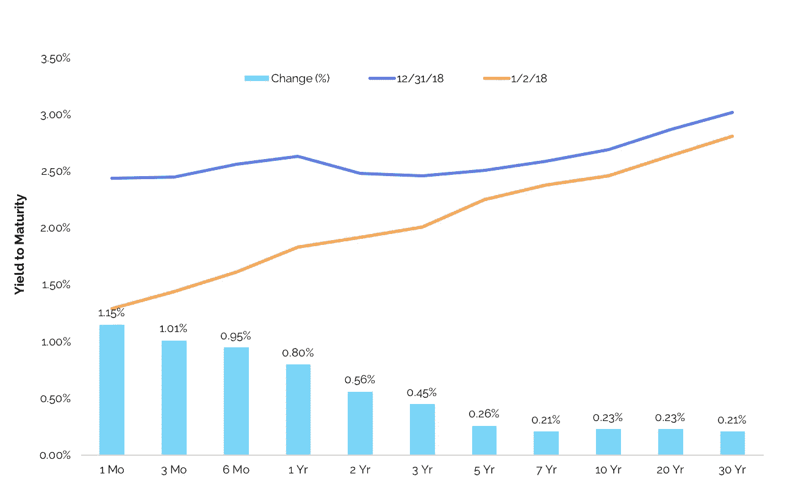
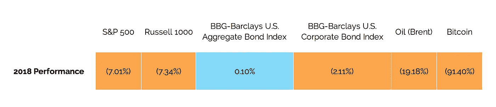
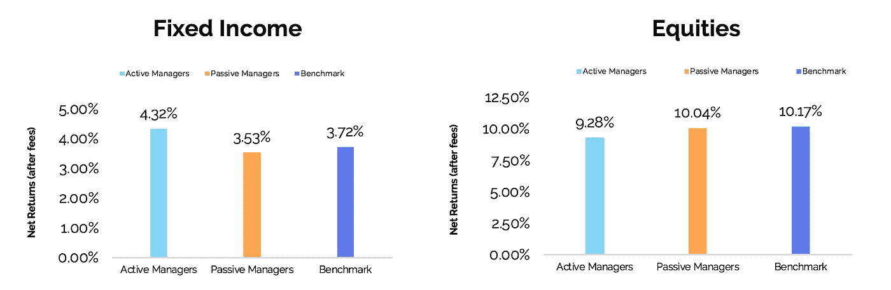
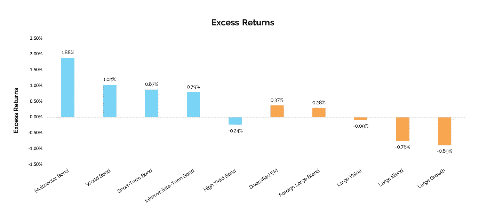
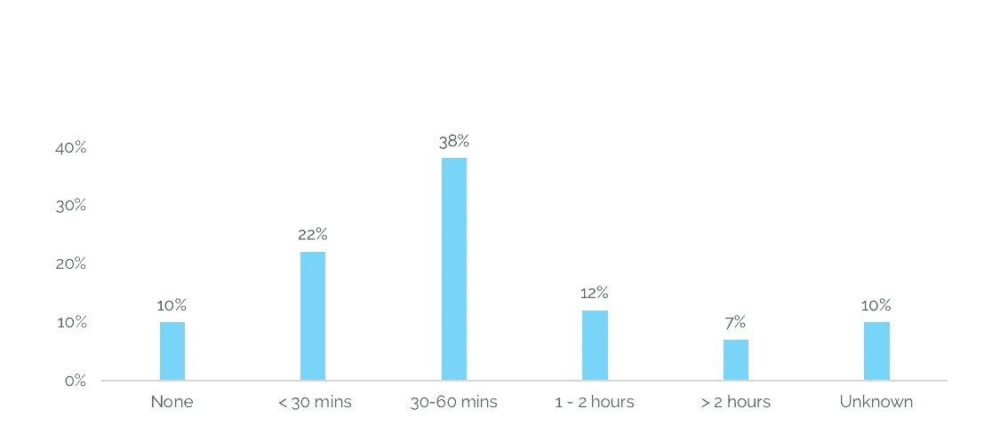

# 2019 行业展望:主动经理人之年

> 原文：<https://medium.datadriveninvestor.com/2019-industry-outlook-the-year-of-the-active-manager-dae57f8a4183?source=collection_archive---------41----------------------->

我总是试图在假期中后退一步，反思之前的 12 个月。人们很容易忘记一年能发生多少事情。2018 年也不例外，充满了值得关注的头条新闻和一些值得注意的第一次。法国赢得了世界杯，老鹰队赢得了他们的第一个超级碗，苹果公司成为了世界上第一家市值过万亿美元的公司，密执安州和明尼苏达州同时选举出了第一位穆斯林女性国会议员，一个儿童足球队在泰国的一个山洞中被营救出来，一场皇家婚礼以及维珍银河首次载人太空探险，等等，不一而足。然而，随着假期的结束，我不可避免地开始展望未来，思考 2019 年将会发生什么。

以下是我对 2019 年市场表现、投资者偏好和行业趋势的思考……特别是对固定收益投资者而言。

从货币政策预期和波动的股市、发达市场不稳定的经济指标以及技术进步来看，我认为投资者需要在投资和管理业务方面采取积极的态度，才能在 2019 年取得成功。

**1。** **美联储政策**

如果不回顾当前的利率环境，任何关于固定收益市场的讨论都是不完整的。在 12 月中旬的最新一次 FOMC 会议上，美联储主席杰罗姆·鲍威尔(Jerome Powell)宣布了 2018 年的第四次加息。25 个基点的加息将联邦基金利率带到了 2.25%-2.50%的区间。

声明发布后，S&P 和 DJIA 分别跌至 15 个月和 14 个月低点。根据 Leuthold Group 首席市场策略师詹姆斯·保尔森(James Paulson)的说法，回调是因为投资者认为“美联储将在未来加息中过度”，而不是市场没有适当反映这次加息。[【1】](https://www.cnbc.com/2018/12/19/stock-markets-dow-futures-edge-higher-federal-reserve-rate-decision.html)显然，正如特朗普总统最近的推特活动和 12 月加息所表明的那样，美联储和白宫在货币政策上存在脱节。

在市场下跌的情况下，鲍威尔表示，官员们“现在认为经济增长的方式更有可能要求明年加息两次”，比最初的预期要少。尽管如此，市场分析师预测 2019 年美国经济增长将放缓。高盛(Goldman Sachs)预计，到今年年底，经济增长将放缓至 1.75%，摩根士丹利(Morgan Stanley)的经济学家预测，2019 年的增长率为 1.7%，为 2012 年以来的最低水平。

包括特朗普总统在内的市场参与者已经变得依赖美联储的政策来支持持续的、尽管微不足道的经济增长。与鲍威尔的政策相反，鉴于美国经济活动的预期放缓，很容易主张在可预见的未来不加息。然而，市场专家似乎认为，一个独立的美联储将回到危机前的政策目标，让自然市场周期自行发展，美国最大的银行在当前市场表现方面将采取较少的被动措施。

【2018 年国债收益率曲线的移动[【4】](https://www.treasury.gov/resource-center/data-chart-center/interest-rates/pages/TextView.aspx?data=yieldYear&year=2018)

如上所示，美联储政策导致收益率曲线在 2018 年大幅平坦。短期收益率曲线[【5】](https://www.treasury.gov/resource-center/data-chart-center/interest-rates/pages/TextView.aspx?data=yieldYear&year=2018)已经上升了约 100 个基点，而 30 年期的收益率为 21 个基点。

展望 2019 年，《华尔街日报》对经济学家的一项调查为美联储在 2019 年仅加息两次的观点提供了额外的支持。虽然数据可能表明 2 年期和 10 年期美国国债之间收益率曲线反转的可能性越来越大，但我们不认为 2019 年的反转一定是许多投资者所表示的即将到来的衰退的迹象。正如 LPL 金融公司的 Ryan Detrick 指出的，“在过去的五次衰退之前，标准普尔 500 指数在收益率曲线反转后平均 19 个月见顶。”在收益率曲线反转时卖出的投资者错过了这五个时期 22%的平均收益。[【7】](https://www.cnn.com/2018/12/09/investing/stocks-week-ahead-inverted-yield-curve/index.html)根据 Oppenheimer 的首席投资策略师约翰·斯托尔茨福斯的说法，“2018 年股票经历的最糟糕的下跌已经过去”，倍数扩张可能会导致“未来一年全球股市反弹”[【8】](https://www.cnbc.com/2018/12/31/stock-market-wall-street-stocks-eye-us-china-trade-talks.html)我们同意奥本海默的观点，并敦促投资者保持耐心，并在 2019 年市场(有望)反弹时收复最近的损失。

**2。** **全球经济形势青睐高质量的美国资产**

2018 年第四季度，市场表现偏离了一贯积极的美国经济指标。看看最新的就业报告，2018 年 12 月和 2018 财年分别增加了 312，000 和 268 万个就业岗位，这表明 2019 年美国经济不太可能出现大规模萎缩。然而，现在还很难说美国的信贷周期是否已经进入尾声，或者还有一些剩余时间。

没有人能确定第四季度市场低迷的主要原因，特别是在经历了过去几周的市场动荡之后——感觉暴风雨还没有过去。虽然各主要资产类别在年底都出现赤字，但整体经济继续表现稳健，预计公司收益仍将在 2019 年达到 1Q 的创纪录高位。JP 摩根首席执行官杰米·戴蒙(Jamie Dimon)表示，12 月的回调是没有根据的，“市场对一系列复杂问题的短期情绪反应过度。”我们同意戴蒙的观点，在过去的 8-10 年里，投资者除了良好的表现之外，几乎没有经历过其他事情。正如 VIX 在 2018 年上涨 160%所证明的那样，波动性已经重新引入市场，因此预期会出现波动性。[【11】](http://www.cboe.com/products/vix-index-volatility/vix-options-and-futures/vix-index/vix-historical-data)很明显，当这个巨大的牛市最终结束时，没有人希望被抓到背黑锅。

**某些可投资资产在 2018 年的表现**[【12】](https://us.spindices.com/indices/commodities/dow-jones-commodity-index-brent-crude)

尽管美国经济增长强劲，但 2018 年市场表现不佳。2018 年美国实际 GDP 增长有望超过 2017 年，2018 年第三季度的年化增长率为 3.4%，而 2017 年全年的增长率为 2.3%。[【13】](https://www.bea.gov/data/gdp/gross-domestic-product)美国劳动力市场在 2018 年继续改善，11 月份失业率降至 3.7%，为 1966 年以来 11 月份的最低水平。[【14】](https://www.bls.gov/news.release/empsit.nr0.htm)同期，名义工资同比增长 3%，为 2008 年以来最大增幅。[【15】](https://www.bls.gov/news.release/empsit.nr0.htm)2018 年录得的强劲增长至少可以部分归因于最近的财政政策变化，其初步影响预计不会在 2019 年持续。虽然企业利润的增长率可能会下降，但工资的增加应该会导致消费者支出的增加，至少可以部分抵消这种下降。

尽管如此，除了美国，没有一个发达或新兴市场看起来特别引人注目。随着 2018 年第三季度欧洲年化 GDP 增长率达到 1.9%，欧盟的表现明显逊于美国 [[16]](https://ec.europa.eu/eurostat/documents/2995521/9378018/2-14112018-BP-EN.pdf/b4fd131d-8938-4ef6-9cb5-9c2f73d2809d) 欧洲人将需要就几项迫在眉睫的政策决定达成一致，这些决定如果得不到妥善解决，将会造成严重的经济问题。即围绕英国退出欧盟的不确定性和对欧洲出口到美国的汽车征收 25%关税的潜在威胁，加上日益加剧的地缘政治紧张局势和劳动人口中的抗议活动(如黄背心运动)。尽管动荡不可否认地令人不安，但似乎权力将使欧洲继续保持缓慢但稳定的经济稳定之路。

新兴市场可能是一个不同的故事。鉴于各新兴市场经济体的经济驱动因素存在显著差异，很难对它们进行总体评估。美元走强、货币政策收紧、保护主义贸易政策以及技术进步降低劳动力需求，都是新兴市场繁荣的结构性障碍。由于上述不利因素，摩根士丹利(Morgan Stanley)估计，新兴市场经济体的增长将放缓，但仍高于趋势水平。[【17】](https://www.morganstanley.com/ideas/2019-global-macroeconomic-outlook)油价下跌(2018 年收于 2017 年年中以来的最低水平)构成了拖累新兴市场信贷表现的最大风险。

我们同意贝莱德[【18】](https://www.blackrock.com/investing/insights/blackrock-investment-institute/outlook)的观点，相对于欧洲或新兴市场投资，我们更青睐高质量的国内资产。虽然 2018 年的最后三个月可能让你感到悲观，但现在可能是时候“买入下跌”，并利用 2019 年出现的复苏机会。从超卖的欧洲市场和精选的新兴市场经济体中可以赚钱，但谨慎的投资者将在美国股市的上游得到最好的服务。

**3。** **主动管理应该跑赢**

在固定收益领域，我们提倡相对于被动策略的主动管理。尽管这与股票投资者普遍持有的被动策略表现更好的信念背道而驰，但债券市场的规模和结构为主动经理提供了创造阿尔法的更大机会。

**美国主动和被动经理人 10 年收益中位数**[【19】](https://www.pimco.com/handlers/displaydocument.ashx?wd=Fund%20Brochure&fn=50652%20Bonds%20are%20Different%20Trifold_secured.pdf&id=LzXyctbTr4YLWoAl%2Bcs9QhrJxMjlDmG8wTOW1roD0IpH1n5UxI%2FjFlpRgxGDrSh9JpkNdWMjrfbC0uELmRB%2BmxlVjffcG%2BLMW29yj7jJcS%2F3RBPlYQoyIPkQd4PIbNxerQynuKgsPIjurWcSit%2Byl30eJ09zPRGQ%2F7KVF8xPZmOU927UOORm%2Ffr4GrPDxUpf0s%2BysIg6ed41rNNPb5NCcTh4G6T7nbNASNIfGL7Elm0G4w%2BmGZRYrgdfm9Hn2oVrQzczeRb24%2BTpjwFHm5%2BnlzS3mLpztBVE0u490v0CBavDUJdMpcU95rP46Xrkugnk)

**按基金类型划分的 10 年平均超额收益**[【20】](https://www.pimco.com/handlers/displaydocument.ashx?wd=Fund%20Brochure&fn=50652%20Bonds%20are%20Different%20Trifold_secured.pdf&id=LzXyctbTr4YLWoAl%2Bcs9QhrJxMjlDmG8wTOW1roD0IpH1n5UxI%2FjFlpRgxGDrSh9JpkNdWMjrfbC0uELmRB%2BmxlVjffcG%2BLMW29yj7jJcS%2F3RBPlYQoyIPkQd4PIbNxerQynuKgsPIjurWcSit%2Byl30eJ09zPRGQ%2F7KVF8xPZmOU927UOORm%2Ffr4GrPDxUpf0s%2BysIg6ed41rNNPb5NCcTh4G6T7nbNASNIfGL7Elm0G4w%2BmGZRYrgdfm9Hn2oVrQzczeRb24%2BTpjwFHm5%2BnlzS3mLpztBVE0u490v0CBavDUJdMpcU95rP46Xrkugnk)

最近蔓延至全球市场的不确定性和波动性增加，只会加剧积极型固定收益基金经理的表现。鉴于被动投资者可能期望获得与彭博-巴克莱综合指数约 3.3%的收益率相当的业绩，[【21】](https://www.bloomberg.com/markets/rates-bonds/bloomberg-barclays-indices)即使是主动管理带来的中等表现(每年复利)，也可能对长期回报产生重大影响。

对主动型固定收益基金经理有利的另一个有利因素是，与跟踪基准的被动型基金经理相比，他们能够投资于更广泛的固定收益市场。例如，彭博-巴克莱美国综合指数排除了约 21 万亿美元的固定收益证券市值。拥有更广泛授权的积极型基金经理处于有利地位，可以利用债券市场覆盖较少的领域中有吸引力的投资机会。

**4。** **技术基础设施成为 Alpha 的来源**

固定收益投资者必须为 2019 年的行动做好准备。今年，资产管理公司将面临债券市场的日益电子化，更严格的监管，客户对详细报告的更大需求，以及市场波动的可能性。这些逆风可能导致投资业绩的预期回报较低，然而，技术可以减轻投资者承担的运营成本，最大限度地提高总回报，而不管市场表现如何。鉴于市场数据和发行人信用信息的极大丰富，决策增强工具和数字交易场所将为具有前瞻性思维的债券经理提供独特的投资机会，以产生 alpha。

数字基础设施将比以往任何时候都更具竞争力。

直到最近，固定收益行业一直回避在过去几十年里彻底改变了股票市场的技术创新水平。例如，80%的债券交易仍然通过电话进行，相比之下，只有不到 25%的股票交易通过电话进行，债券交易的交易成本几乎是同等规模股票交易的 9 倍。TABB 集团最近调查了北美和欧洲的资产管理公司，以评估利用过时系统的负面影响。TABB 报告称，超过 30%的北美资产管理公司表示，他们无法使用现有的技术系统为投资组合生成准确的现金状况详细信息。这非常令人不安。大量客户资本由盲目投资者管理。

随着云技术、大数据分析、机器学习和人工智能的进步，我们预计 2019 年将是数字化先进团队开始利用创新技术实现公司运营效率的一年。从决策增强和风险分析到数据验证和交易对账，固定收益资产管理公司比以往任何时候都更有能力利用软件平台在扩大业务的同时为客户创造价值。

继续依赖过时技术的成本不容忽视。上面提到的同一个 TABB 调查发现，58%的资产管理公司前台员工每天花费超过 30 分钟进行人工错误处理，并且“五分之一的资产管理公司每天花费超过一个小时进行非自动化任务”，这是一个非常昂贵的提议。只有 10%的受访者在投资运营工作流程中没有手动流程。将这些损失的时间换算成美元，20%的调查受访者表示，花费在手动解决错误上的时间相当于总收入的 10%以上的机会成本。[【22】](https://www.google.com/url?sa=t&rct=j&q=&esrc=s&source=web&cd=1&ved=2ahUKEwi_h_ePr4ngAhWuT98KHTT4D_8QFjAAegQIBBAC&url=https%3A%2F%2Fwww.simcorp.com%2F-%2Fmedia%2Ffiles%2Fresources%2Freport%2Fthe-buyside-legacy-it-hangover_tabb_group.pdf%3Fla%3Den&usg=AOvVaw20kFIMt7ToLTzKIQY4Lsgc)

**花费在人工错误处理上的时间**[【23】](https://www.google.com/url?sa=t&rct=j&q=&esrc=s&source=web&cd=1&ved=2ahUKEwi_h_ePr4ngAhWuT98KHTT4D_8QFjAAegQIBBAC&url=https%3A%2F%2Fwww.simcorp.com%2F-%2Fmedia%2Ffiles%2Fresources%2Freport%2Fthe-buyside-legacy-it-hangover_tabb_group.pdf%3Fla%3Den&usg=AOvVaw20kFIMt7ToLTzKIQY4Lsgc)

新技术的应用不仅能提高运营效率，还能解决众多合规问题，这些问题既有客户驱动的，也有新法规(如 MIFID II)带来的。Wavelength Capital Management 的首席信息官安德鲁·达索利(Andrew Dassori)表示:“在下一代固定收益投资中，决定赢家的不是你认识谁，而是你如何从噪音中分离出信号。”[【24】](https://www.investmentnews.com/article/20180904/blog09/180909987/three-disruptions-reshaping-fixed-income-markets)**更进一步，我们认为技术将是帮助资产管理公司识别这些信号的关键。**

****结论****

**事实证明，2018 年是充满挑战的一年。动荡的市场伴随着政治分歧和来自华盛顿的许多混杂信号。固定收益资产管理公司将需要提高警惕，以实现投资者的目标回报。随着货币政策收紧预计将以更温和的速度继续，风险型资产的表现优于风险型资产，积极型经理受益于更大的波动性，以及技术进步，经理们在 2019 年有很多机会脱颖而出。**

**虽然长达十年的牛市可能即将结束，但美国经济增长仍将保持强劲，这将导致中短期内资产表现温和。为了在未来一年取得成功，投资者需要耐心、彻底地进行尽职调查，并将技术视为阿尔法世代的来源，而不是成本中心。**

**一些挑战正在为债券市场在 2019 年及以后的重大创新做准备。固定收益技术产品终于赶上了股票市场的同类产品。如果说资产管理公司还没有意识到他们传统运营方式的低效率，那么不断增加的监管要求已经让他们敏锐地意识到维护人工投资运营功能的负担。无论是市场、监管机构还是客户需求作为驱动力，债券经理都需要做好准备，在未来一年取得优异表现。幸运的是，有工具可以直面这些挑战。在应用适当的金融技术中可以找到解决办法。**

**认识到现有的技术仍有许多不足之处，我们开发了 CBXmarket OASIS 平台，专门满足固定收益资产经理的需求。我们作为技术专家和固定收入专业人士的综合经验使我们的团队能够为买方社区中这个被广泛忽视的部分提供强大、灵活的软件工具。今天，我们与具有前瞻性思维的经理合作，重新设想他们如何与技术互动，以解决他们最迫切的问题——在竞争日益激烈的世界中提供 alpha。通过为这些公司提供先进的技术套件来增强投资决策并降低运营成本和时间表，我们能够优化其整体业务的绩效。**

**我们期待在 2019 年继续推动固定收入群体的进步。祝大家好运，因为我们开始了将肯定是有趣的一年。**

**最初发表于 [CBXmarket Insights](https://www.cbxmarket.com/2019/01/23/5-reasons-youre-working-late-and-how-to-get-your-time-back/) 。**

**[1] [“道指跳水 350 点，收于美联储加息后的年内新低”美国消费者新闻与商业频道。2018 年 12 月 19 日。](https://www.cnbc.com/2018/12/19/stock-markets-dow-futures-edge-higher-federal-reserve-rate-decision.html)**

**[2] [《美联储利率决策——实况分析》华尔街日报。2018 年 12 月 19 日。](https://www.wsj.com/livecoverage/federal-reserve-december-meeting-2018)**

**[3] [“投资者押注美联储暂停加息。”华尔街日报。2018 年 1 月 2 日。](https://www.wsj.com/articles/investors-are-betting-that-the-fed-hits-pause-on-rate-hikes-11546449520)**

**[4] [美国财政部截至 2018 年 12 月 31 日的数据。](https://www.treasury.gov/resource-center/data-chart-center/interest-rates/pages/TextView.aspx?data=yieldYear&year=2018)**

**[5] [到期日不到一年。](https://www.treasury.gov/resource-center/data-chart-center/interest-rates/pages/TextView.aspx?data=yieldYear&year=2018)**

**[6] [“经济学家下调了他们对美联储加息的预测。”华尔街日报。2018 年 12 月 13 日。](https://www.wsj.com/articles/economists-scale-back-their-projections-for-fed-rate-increases-11544713200)**

**【7】[“收益率曲线趋平。但是派对还没有结束。2018 年 12 月 9 日。](https://www.cnn.com/2018/12/09/investing/stocks-week-ahead-inverted-yield-curve/index.html)**

**[8] [“随着标准普尔 500 指数在 2018 年下跌超过 6%，美国股市创下十年来最糟糕的一年。”美国消费者新闻与商业频道。2018 年 12 月 31 日。](https://www.cnbc.com/2018/12/31/stock-market-wall-street-stocks-eye-us-china-trade-talks.html)**

**[9] [“美国强劲的就业和工资增长为经济提供了保证。”华尔街日报。2019 年 1 月。](https://www.wsj.com/articles/u-s-december-nonfarm-payrolls-grew-by-312-000-jobless-rate-rose-to-3-9-11546609016)**

**【10】[“杰米·戴蒙称股市反应过度，未来不会衰退”美国消费者新闻与商业频道。2019 年 1 月 8 日。](https://www.cnbc.com/2019/01/08/jamie-dimon-says-the-stock-market-overreacted-no-recession-ahead.html)**

**[11] [基于 CBOE VIX 波动率指数的收盘值。](http://www.cboe.com/products/vix-index-volatility/vix-options-and-futures/vix-index/vix-historical-data)**

**[12] [基于 2018 年 1 月 2 日至 2018 年 12 月 31 日期间资产表现计算的回报。布伦特原油基于 2019 年 3 月合约。](https://us.spindices.com/indices/commodities/dow-jones-commodity-index-brent-crude)**

**[13] [根据经济分析局(BEA)截至 2018 年 12 月 21 日的数据。](https://www.bea.gov/data/gdp/gross-domestic-product)**

**[14] [根据劳动统计局(BLS)截至 2018 年 12 月 30 日的数据。](https://www.bls.gov/news.release/empsit.nr0.htm)**

**[15] [Et。](https://www.bls.gov/news.release/empsit.nr0.htm)**

**[16] [欧盟统计局截至 2018 年 11 月 14 日的数据。](https://ec.europa.eu/eurostat/documents/2995521/9378018/2-14112018-BP-EN.pdf/b4fd131d-8938-4ef6-9cb5-9c2f73d2809d)**

**[17][“2019 年全球展望:前方拐点。”摩根士丹利。2018 年 12 月 7 日。](https://www.morganstanley.com/ideas/2019-global-macroeconomic-outlook)**

**[18][《2019 年全球投资展望》贝莱德。2018 年 12 月 10 日。](https://www.blackrock.com/investing/insights/blackrock-investment-institute/outlook)**

**[19] [截至 2018 年 6 月 30 日的数据。基于晨星美国中期债券固定收益类别和美国大盘股混合股票类别。机构股份类别。固定收益基准是彭博巴克莱美国综合指数，股票指数是标准普尔 500 指数。](https://www.pimco.com/handlers/displaydocument.ashx?wd=Fund%20Brochure&fn=50652%20Bonds%20are%20Different%20Trifold_secured.pdf&id=LzXyctbTr4YLWoAl%2Bcs9QhrJxMjlDmG8wTOW1roD0IpH1n5UxI%2FjFlpRgxGDrSh9JpkNdWMjrfbC0uELmRB%2BmxlVjffcG%2BLMW29yj7jJcS%2F3RBPlYQoyIPkQd4PIbNxerQynuKgsPIjurWcSit%2Byl30eJ09zPRGQ%2F7KVF8xPZmOU927UOORm%2Ffr4GrPDxUpf0s%2BysIg6ed41rNNPb5NCcTh4G6T7nbNASNIfGL7Elm0G4w%2BmGZRYrgdfm9Hn2oVrQzczeRb24%2BTpjwFHm5%2BnlzS3mLpztBVE0u490v0CBavDUJdMpcU95rP46Xrkugnk)**

**[20] [截至 2018 年 6 月 30 日的数据，根据晨星 direct。基于每只基金各自基准的超额回报。](https://www.pimco.com/handlers/displaydocument.ashx?wd=Fund%20Brochure&fn=50652%20Bonds%20are%20Different%20Trifold_secured.pdf&id=LzXyctbTr4YLWoAl%2Bcs9QhrJxMjlDmG8wTOW1roD0IpH1n5UxI%2FjFlpRgxGDrSh9JpkNdWMjrfbC0uELmRB%2BmxlVjffcG%2BLMW29yj7jJcS%2F3RBPlYQoyIPkQd4PIbNxerQynuKgsPIjurWcSit%2Byl30eJ09zPRGQ%2F7KVF8xPZmOU927UOORm%2Ffr4GrPDxUpf0s%2BysIg6ed41rNNPb5NCcTh4G6T7nbNASNIfGL7Elm0G4w%2BmGZRYrgdfm9Hn2oVrQzczeRb24%2BTpjwFHm5%2BnlzS3mLpztBVE0u490v0CBavDUJdMpcU95rP46Xrkugnk)**

**[21][2018 年 12 月 28 日巴克莱公布的彭博-巴克莱综合指数的最差收益率。](https://www.bloomberg.com/markets/rates-bonds/bloomberg-barclays-indices)**

**[22] [“买方遗留的 IT 后遗症:寻找阿尔法、合规和增长障碍的治疗方法”TABB 集团。2016 年 6 月。](https://www.google.com/url?sa=t&rct=j&q=&esrc=s&source=web&cd=1&ved=2ahUKEwi_h_ePr4ngAhWuT98KHTT4D_8QFjAAegQIBBAC&url=https%3A%2F%2Fwww.simcorp.com%2F-%2Fmedia%2Ffiles%2Fresources%2Freport%2Fthe-buyside-legacy-it-hangover_tabb_group.pdf%3Fla%3Den&usg=AOvVaw20kFIMt7ToLTzKIQY4Lsgc)**

**[23] [Et。](https://www.google.com/url?sa=t&rct=j&q=&esrc=s&source=web&cd=1&ved=2ahUKEwi_h_ePr4ngAhWuT98KHTT4D_8QFjAAegQIBBAC&url=https%3A%2F%2Fwww.simcorp.com%2F-%2Fmedia%2Ffiles%2Fresources%2Freport%2Fthe-buyside-legacy-it-hangover_tabb_group.pdf%3Fla%3Den&usg=AOvVaw20kFIMt7ToLTzKIQY4Lsgc)**

**[24] [“三次破坏重塑固定收益市场”投资新闻。2018 年 9 月 4 日。](https://www.investmentnews.com/article/20180904/blog09/180909987/three-disruptions-reshaping-fixed-income-markets)**

***本文仅供参考和讨论。本出版物中包含的信息来源于 CBXmarketto 认为可靠的来源所获得的数据，并且是善意提供的，但 CBXmarketto 对所提供信息的准确性、完整性或适用性不做任何保证。本文中的任何内容都不应作为投资建议，也不应授予您或您的任何员工、债权人、证券持有人或其他股权持有人或任何其他人权利或救济。表达的任何观点反映了本文作者的当前判断，并不一定代表 CBXmarket 的观点。CBXmarketexpressly 拒绝任何明示、暗示、法定或其他形式的陈述和保证，包括但不限于:(I)适销性、特定用途适用性、适用性、用途、所有权或非侵权性的保证；㈡本白皮书的内容没有错误；以及(iii)此类内容不会侵犯第三方权利。***

***本文中包含的信息是*[*cbx market*](https://www.cbxmarket.com/)*的知识产权，本文的任何进一步传播都应将权利归于*[*cbx market*](https://www.cbxmarket.com/terms-of-service/)*并包括此免责声明。***