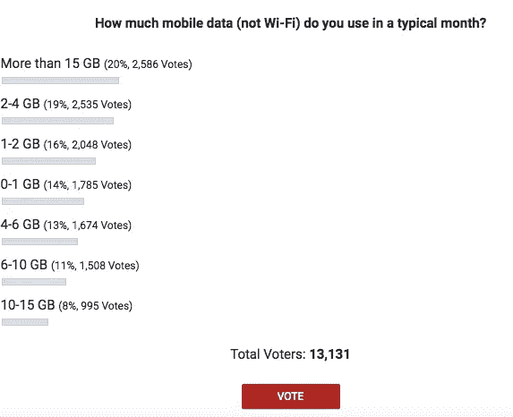

# 2019-数据世界的崛起

> 原文：<https://medium.datadriveninvestor.com/2019-the-rise-of-the-data-world-c657e5fc21b6?source=collection_archive---------12----------------------->

Photo by [Steve Johnson](https://unsplash.com/@steve_j?utm_source=medium&utm_medium=referral) on [Unsplash](https://unsplash.com?utm_source=medium&utm_medium=referral)

在 12 月份，我花了很多时间坐公交车上下班。事实上，我真的很喜欢坐公交车。这是一个很好的提醒，我们都在一个忙碌、忙乱的世界里竭尽全力做好事。至少，我希望人们早上起床时希望做好工作。

我在乘坐地铁时注意到的一件事是，有很多人每天都在无意识地消耗数据。神圣的！

有一天，我在公交车上看书，当我抬起头，看到我视线范围内的每个人都在用手机，拇指滚动着，就像是在用他们的手机打拇指战。

这是我突然想到的。如果人们继续以消费数据的方式消费数据，数据将成为 2019 年最强劲的单一商品。不是手机本身，甚至不是互联网。数据！

想想看，人们比以往任何时候都更忙，每个人都有一个数据计划。他们每天上下班，成群结队地消耗数据。我们现在几乎已经习惯了沉浸在手机中。

这就是为什么我认为 2019 年数据将是北美最强劲的单一商品。

## 如果我是商人，我会用数据推动消费者支出。

## 如果我是一名家长，我正在使用数据监控我的孩子在学校，做我的银行业务，检查我的宠物…更不用说当我不在家时房子的安全监控。

## 如果我是投资人，我投资的是移动第一，桌面第二的互联网公司。

## 如果我在政府部门，我会努力找出我们的政府如何从数据中挖掘更多的信息，以了解我的人民，他们的需求和愿望。如果我知道这一点，它会推动我的选票！

不相信我？那很好。但是看看你自己的数据计划。目前，北美人均移动数据套餐使用 7GB 左右的数据。

Courtesy: [www.statisa.com](http://www.statisa.com)

还是不相信我？看看安德里奥警察局的调查:

Courtesy: Android Police

在过去几年中，北美的数据消费一直保持相当稳定，每年都有所增长，但我相信我们正处于进入一个新的数据时代的尖端。互联网已经从一个孩子成长为一个青少年，这个青少年现在怀了一个名为 data 的孩子，这个孩子在 2019 年才进入第三个三个月。我们最好准备好这个新的孩子在新的一年里会带来什么。

我希望你能“深入”自己的生活。关于如何在生活和职业中变得更自信、更有条理、更有效率和更成功的其他策略，我鼓励你在亚马逊上拿起我的新书:[思想领导力](https://www.amazon.com/dp/1981080147/ref=olp_product_details?_encoding=UTF8&me=)。→

