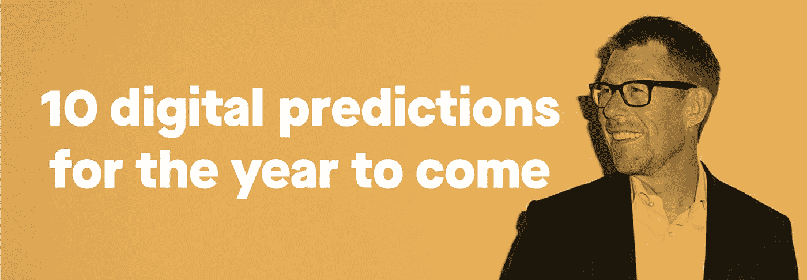

# 2019 年-技术革命继续

> 原文：<https://medium.datadriveninvestor.com/2019-the-tech-revolution-continues-571f1e5aec7b?source=collection_archive---------13----------------------->

## 对未来一年的 10 个数字预测

首席数字官蒂姆·弗兰克·安德森@ [查理·探戈](https://www.charlietango.dk/insights/2019-the-tech-revolution-continues)

**5G 网络即将亮相。可折叠屏幕和增强眼镜将冲击市场。医疗保健和智能家居正在融合。我们甚至可能看到世界上第一个商业飞行汽车出租车服务。这些只是我对未来一年的一些预测。对于技术来说，2019 年看起来将是非常令人兴奋的一年。**

一句经典名言说:“变化从未发生得如此之快，也绝不会如此之慢。”

对于我们生活的时代来说，这很可能是真的。然而，2019 年会发生什么？好吧，下面是我对来年的一些建议。

# 1.我们所有人都会意识到中国的技术领先地位

尽管我已经把它放在了我清单的首位，但它实际上是我后来想到的。

当我浏览这份预测清单时，我惊讶地发现，有多少预测是由中国或亚洲其它国家的公司主导的。在阅读了 Christina Boutrup 的《T4:大技术革命》和李开复的《人工智能超级力量》这两本书后，我非常确定 2019 年将是全球技术领导地位从西方向东方转移的一年。

中国已经在太阳能、智能手机、无人机、高速列车、移动支付等技术领域占据主导地位，很快，甚至还有人工智能。

我认为，对于 2019 年，我们所有人都将清楚地看到，要预测技术的未来，我们应该少看硅谷，多看北京。

# 2.世界上第一款可折叠屏幕的智能手机

这几乎不是一个预测，但仍然非常有趣，因为我们谈论柔性 LED 屏幕已经超过十年了。现在，终于看起来第一个消费产品将在 2019 年上架。我说的是三星即将推出的配备 Infinity Flex 显示屏的手机。然而，他们不会是唯一一个推出这一新类别产品的公司。我预计，在 2 月份的巴塞罗那世界移动通信大会上，我们将看到 LG、华为等品牌的大量可折叠机型，或许还有即将到来的中国制造商 Oppo。谷歌已经宣布新版 Android 支持尺寸动态变化的可折叠屏幕。

虽然可折叠手机肯定会受到小工具爱好者的欢迎，但我预计它在相当长的一段时间内影响甚微，部分原因是它将非常昂贵。然而，底层技术非常迷人。它将导致更多的屏幕出现在不熟悉的地方。我们将开始看到新的屏幕概念，可滚动、可折叠，甚至可拉伸。一家值得关注的公司是来自中国的 [Royole](http://www.royole.com/flexible-display) ，该公司于 2018 年开始量产 0.01 毫米的柔性屏幕。想象一下窗帘后面有一个大屏幕。或者看看 [LG 的 65 英寸可卷曲 OLED 电视](https://www.youtube.com/watch?v=A-Yumjyd-Fs)，想象这对你未来的智能手机或电视意味着什么。

# 3.5G 网络将首次亮相

既然我们都已经习惯了 4G，是时候更新了。5G 已经酝酿了很长时间，但 2019 年将是我们看到第一次商业部署的一年，很可能是在华为所在的亚洲。目前，他们是 5G 基础设施技术和设备无可争议的世界领导者。然而，美国所有的大型网络运营商都同样致力于在 2019 年开始推出。

5G 的优势是显著的。这种新网络比 4G 快大约 100 倍，并有望消除延迟，对无人驾驶汽车来说将至关重要。物联网是另一个将受益于更好更快网络的领域，因为 5G 每米支持多达 1000 多台设备。然而，这将非常昂贵，因此全球推广将需要很长时间。此外还有未知的健康因素，因为 5G 需要更多的天线。

幸运的是，对于我们这些斯堪的纳维亚人来说，诺基亚和爱立信在提供网络设备方面也处于世界领先地位。尽管人们对华为是否值得信任心存疑虑，但这可能意味着斯堪的纳维亚电信行业的回归。

# 4.消费者物联网将最终开始智能家居

多年来，[飞利浦 Hue](https://www2.meethue.com) 已经向我们展示了用联网的智能物体取代家中的哑物体所能带来的好处。他们的灯泡的开关取决于房子里的人。颜色会根据你的心情或一天中的时间而变化，如果你在旅行，灯光会像在家里一样。

接下来是门锁、安全解决方案、家用电器和传感器，所有这些都与我们的保险相关。如果检测到管道泄漏或冒烟，我们会收到警报。越来越多的实物库存将增加一个数字层，为启动、停止和补充等自动操作铺平道路。物联网广泛成功的关键是可靠性、安全性、可用性和便利性。由于大多数新产品都符合这些条件，我们越来越接近于不需要有工程学位的人就能让它们运转的生态系统。

# 5.自动驾驶汽车服务将投入商用

经过多年的尝试和测试，2019 年将是自动驾驶汽车服务成为现实的一年。

事实上，我们已经看到了商业服务的开始。2018 年 12 月， [Waymo One](https://waymo.com/) 在美国凤凰城地铁区向一批早期乘客推出。未来几年，Waymo 计划向其车队添加多达 20，000 辆捷豹 I-PACE 车辆，足以满足每天约 100 万次出行。

虽然优步和 Lyft 正在努力追赶，但我预测下一个公共商业自主出租车服务将出现在中国。公司[滴滴出行](https://www.didiglobal.com/about-didi/about-us)是当今世界上最大的叫车服务公司，每天有 3000 万次出行(是优步的两倍)，这使得他们可以访问大量淫秽的数据。他们已经在四个城市测试自动驾驶服务，因此我预计他们将在年内推出商业服务。

# 6.中东或新加坡将提供有限的飞行汽车出租车服务

随着自动驾驶汽车撞上并杀死行人的风险，还有另一种方法来解决全球交通拥堵。那就是飞向天空。一个长久以来的梦想，能够在空中运输自己，正在越来越接近现实。2019 年，我们可能会看到第一个基于商业无人机的单人运输服务。

奥迪和空客正在合作一项商业飞行机器人出租车服务。这个概念叫做[波普。接下来的](https://www.audi-mediacenter.com/en/press-releases/audi-italdesign-and-airbus-combine-self-driving-car-and-passenger-drone-9900)于 2018 年 11 月现场演示。

总部位于英国的垂直航空航天公司是另一个竞争者。

有许多监管问题，因此要实现这一点，我们必须着眼于这些问题可以轻松解决的国家，这些国家愿意大力投资必要的基础设施，并且有许多农村空间。中东几个国家的情况正是如此。迪拜长期以来一直声称，它将是第一个推出基于中国出租车的空中出租车服务的城市。然而，该公司最近的问题意味着市场现在更加开放。

首先是新西兰，拉里·佩奇(Larry Page)资助的初创公司 Kitty Hawk 已经与当地政府达成协议，将尽快推出一项服务( [cora.aero](https://cora.aero/) )。它已经开始试飞了。

另一个赌注是新加坡，基于德国公司[的 Volocopter](https://www.volocopter.com/de/) ，新加坡的空中出租车试验将于 2019 年开始。

这可能有点过于乐观，但随着竞争的升温，我仍然预测我们将在 2019 年看到第一个有限的商业空中出租车服务的推出。

# 7.人工智能将击败电子竞技中最好的团队

人工智能是 2018 年的热门词汇，并将在未来几年继续如此。

这项技术已经在几个领域发挥了相当大的作用，体育就是其中之一。人工智能帮助高尔夫球员完善挥杆动作。它可以预测一名足球运动员是否有受伤的危险，甚至可以根据比赛情况预测比赛结果。

我们大多数人都知道人工智能是如何击败最好的国际象棋和围棋选手的。然而，玩一个战略性的棋盘游戏，即使是像围棋这样复杂的游戏，仍然与在现实世界中互动有很大的不同。那么我们如何更接近人工通用智能呢？

一个赌注来自一家名为 [OpenAI](https://openai.com/) 的非营利人工智能研究公司。他们正在努力击败最受欢迎的多人电子竞技游戏 Dota 2 中的最佳团队。他们在去年最大的锦标赛中非常接近，奖金池超过 2500 万美元。

为了达到这一点，他们训练了五个不同的人工智能作为一个团队一起工作，使用一个运行在 256 个 GPU 和 128，000 个 CPU 核心上的系统。它每天都在和自己玩 180 年的游戏！

尽管围棋中的每一步都可以用 400 个数据点来描述，但 Dota 2 中的游戏由 20，000 个数据点组成，每个数据点每秒更新 30 次。所以，它更接近真实的情况。以 AI 内部的发展速度，我预测 [OpenAI Five](https://openai.com/five/) 会战胜挑战，成为 2019 年 Dota 2 世界冠军。

# 8.质量未知的 AR 眼镜和成熟的第一代 VR

虽然对我们大多数人来说，增强现实(AR)仍然意味着 Snapchat 和 Instagram 面部滤镜或玩 Pokémon Go，但幕后发生了许多事情，将推动 2019 年的发展。

苹果(Apple)和安卓(Android)的标准平台现在都已就位。几个新产品和解决方案将上市，它们的成功将有力地表明我们将如何快速地走向一个 AR 将更多地融入我们日常生活的世界。

一个必然会产生影响的事件是美国军方价值 4.8 亿美元的 AR 合同，该合同被微软拿下。这无疑将推动专业 AR 解决方案的发展，我预计我们将在 2019 年期间看到 HoloLens 2 的强劲推出。

然而，HoloLens 仍然是一个相当笨重的耳机，它让你看起来像太空电影中的东西。对消费者更友好的是来自[北部](http://www.bynorth.com)的 AR 眼镜，它将于 2019 年首次亮相。它们实际上看起来像真的眼镜，我每天戴着都不会有问题。其他几家公司，如 [Vuzix](https://www.vuzix.com/) 和 [Waveoptics](https://enhancedworld.com/) ，也在朝着相同的方向努力，而像 [Varjo](https://varjo.com/) 和 [LetinAR](https://letinar.com/) 这样的公司则专注于镜头。因此，这一领域有很多创新，一些产品已经准备好商业化。

在软件方面，我非常期待 Niantic 与华纳兄弟合作并根据哈利波特传奇([www.harrypotterwizardsunite.com](http://www.harrypotterwizardsunite.com))制作的[新 AR 游戏](http://www.harrypotterwizardsunite.com)。如果它变得像 Niantic 以前凭借 Pokémon Go 取得的成功一样受欢迎，它将进一步推动 ar 的使用和理解。

说到虚拟现实，我很兴奋地看到下一波无线耳机，如 [Oculus Quest](https://www.oculus.com/quest/) 和 [Pico Neo](https://www.pico-interactive.com/neo) 如何提供六个自由度以及在不连接电缆的情况下自由移动的能力。

AR 和 VR 可能不会在 2019 年获得大的商业突破，但这一时刻肯定越来越近了。

# 9.语音界面将更加普遍，智能数字代理将继续流行

智能扬声器的巨大成功为语音界面的广泛接受铺平了道路。截至 2018 年底，安装数量达到 1.5 亿以上，亚马逊 Echo 和谷歌 Home 是两个主要竞争者，三星 Bixby 和苹果 Homepod/Siri 是挑战者。对更多本地语言的支持将在未来一年进一步拓宽这一领域，而大公司正在努力实现其服务的语音功能，并找到推动采用和使用的杀手级应用。

与此同时，在 2019 年，我们将更加习惯于通过智能手机与数字代理和人工智能聊天机器人进行互动，因为这些服务已经成熟，变得更有价值，并扎根于我们的日常生活中。我预计今年至少会有一个解决方案成为全球热门，展示这种与服务和公司互动的方式的潜力。

# 10.可穿戴健康工具走出实验室

2017 年，一个家庭团队([罗勒叶技术](http://www.basilleaftech.com) [)](http://www.basilleaftech.com)) 通过开发一款名为 DXter 的单一产品，赢得了 470 万美元的星际迷航灵感 Tricorder XPRIZE，该产品可以准确检测 13 种健康状况，并通过良好的用户体验实时捕捉 5 种重要的健康体征。然而，该产品仍在实验室中。

然而，当苹果推出 Watch 4.0 时，它展示了该设备可以测量非常准确的心电图(ECG)。它获得了美国食品和药物管理局的批准，现在该设备已获准在美国进行商业使用。其他国家有不同的规定，所以在斯堪的纳维亚被允许还需要一段时间。然而，我的预测是，它将于 2019 年在几个国家公开发售。它不会是今年推出的唯一一款可以测量脉搏、呼吸频率、血氧饱和度、血压和血糖(葡萄糖)水平的产品。

来自 Beddr 的 FDA 批准的 Sleeptuner 就像有一个小型睡眠实验室贴在你的额头上。它可以测量所有与睡眠相关的数据，并以医院级的精度帮助您改善氧合和夜间呼吸，同时检测您是否有患睡眠呼吸暂停的风险。

一个有竞争力的产品是你戴在手指上的[奥拉戒指](https://ouraring.com/)，它也能追踪你的活动。

再比如 [DFree](https://www.dfreeus.biz/) 。这有助于老年人在太晚之前预测他们什么时候要去厕所。

三星正与 Insulet 公司合作推出一款手机控制的胰岛素输送系统。

Airesone 正在为患有哮喘的孩子的父母开发一款支持手机的设备。它测量孩子的心率、呼吸频率和睡眠质量。

未来几年将会有一长串有益健康的新产品上市。我们会越来越习惯于衡量自己。我们将加强对自身健康的控制，并将医疗保健转变为家庭护理。