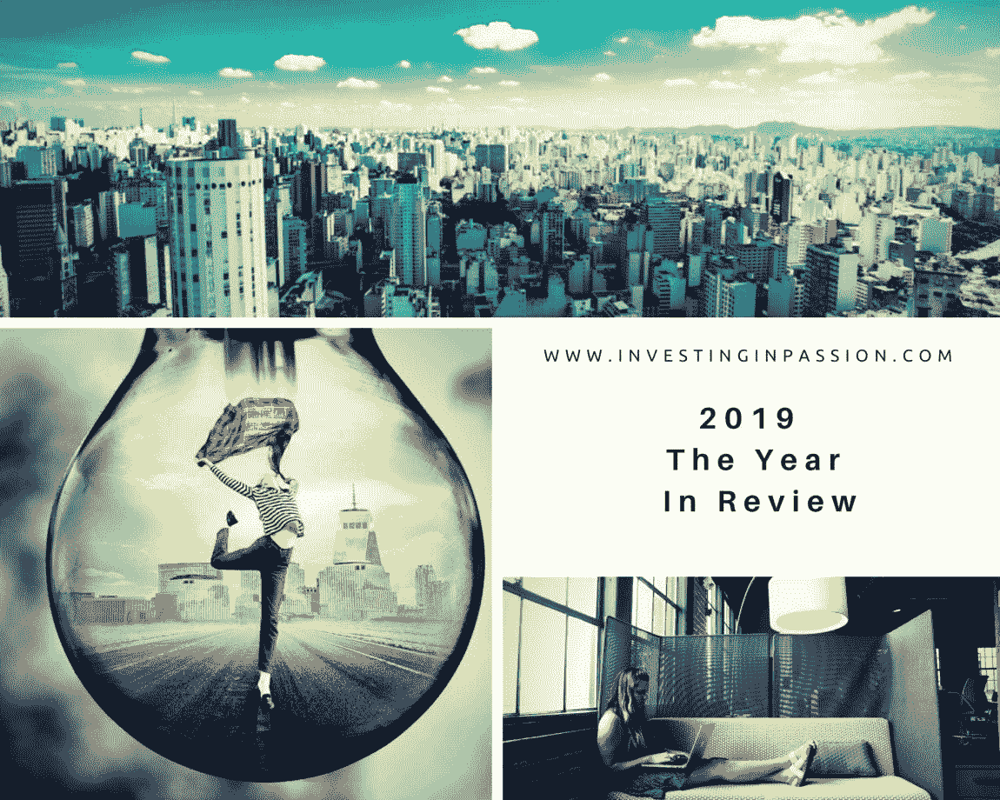

# 2019:回顾之年

> 原文：<https://medium.datadriveninvestor.com/2019-the-year-in-review-7c38f5a02aa8?source=collection_archive---------12----------------------->

[灵感](https://investinginpassion.com/category/inspirations/)[MBA](https://investinginpassion.com/category/mba/)[资源](https://investinginpassion.com/category/resources/)[风险投资](https://investinginpassion.com/category/venture-capital/)

# 2019:回顾之年

这是令人惊奇的一年！是的，我每年都这么说，这都是真的，但 2019 年很特别，充满了变化和挑战，回忆这一年中发生的这些特殊时刻真好。这是为了提醒自己我是多么快乐，每天都要感谢周围所有的人，并为即将到来的事情感到兴奋！

我搬到了波士顿(另一个我可以称之为家的地方)，我喜欢这里！
我开始攻读 MBA，在过去的 4 个月里，我与来自 42 个国家的了不起的人们在一起，我体验到了前所未有的多元化价值！它只是停留在你的脑海中，你甚至没有注意到你每天吸收了多少对人类行为的理解！

我开始在 [Ground Up Ventures](https://www.groundup.vc/) 工作，担任风险研究员/校园合伙人，我喜欢寻找初创公司，与创始人交流，写投资备忘录。我遇到了来自不同校园的了不起的人，我们一起工作，发现当地的创业生态系统，一路上互相学习。感谢乔丹和绍拉夫给了我这么好的机会(以及其他 Ground Up Ventures 的工作人员)！洞察到你是如何工作的，以及如何为真正处于早期阶段的初创公司写一张支票，这是一件令人惊讶的事情，这些初创公司除了出色的想法、有远见的创始人之外别无其他，而你只是在帮助他们发展概念并成为重要的市场参与者。

 [## 风险投资家在给创业公司播种时会考虑什么标准？数据驱动的投资者

### 2017 年，风险投资资金攀升至十年来的最高水平。你的创业公司目前吸引风险投资的机会是…

www.datadriveninvestor.com](https://www.datadriveninvestor.com/2018/04/20/what-criteria-do-venture-capitalists-consider-when-seeding-a-startup/) 

我做了我的第一笔天使投资

[**build stream**](https://www.crunchbase.com/organization/buildstream)(prop tech)——建筑行业设备和劳务的按需市场。
**(fin tech)——美国欢迎国际人士的数字银行**

**我完成了伯克利风险投资大学的学业，因为我需要深入了解风险投资的法律和技术知识。**

**我参加了由 Brad Feld、Kauffman Fellows 和 Techstars 组织的[风险交易学院](https://www.kauffmanfellows.org/journal_posts/venture-deals-online-course-spring-2019-registration-is-open)。**

**我加入了 [**Hack。多样性**](https://hackdiversity.com/) **作为导师**。我真心支持#femalefounders，我也很荣幸能致力于为市场带来平等。**

**我们已经确定了 2020 年 75 位杰出人士的队列。值得注意的亮点:
职业轨迹:67%的工程师，24%的 IT 专业人员，9%的数据分析师
性别:33%的自我认同的她/她的形容词，67%的自我认同的他/他的形容词
种族/族裔:64%的黑人，27%的拉丁人，5%的混血儿(黑人&拉丁人，黑人&亚洲人)，4%的中东/北非人(全是女性)
人才来源:27 人(高于 2019 年的 20 人)；人才来源包括 2 年制项目、4 年制项目、硕士项目和训练营
83%的人表示，他们将在 2020 Hack 经历第一次科技实习。多元化参与度
85%的人分享他们是家庭中第一个学习 STEM 领域的人
71%的人分享他们或他们的父母是第一代移民
9%的被接受者申请了 Hack。前几个周期的多样性**

**我做了很多志愿者，这是我回报社区的一种方式**

**我在创业波士顿周期间帮助 [**创业波士顿**](http://startupbos.org/) (敬请期待 2020 版！)我在剑桥的 [**创业咖啡馆**](https://venturecafecambridge.org/) 帮忙(明年也会有很棒的阵容)。我遇到了一些了不起的人，他们做着自己喜欢的事情，分享他们在创业之旅中帮助他人的经验。**

**我在 [F10 孵化器&加速器](https://www.f10.ch/)组织的黑客马拉松期间进行了辅导。这是我去美国前在瑞士的最后一次活动。瑞士拥有巨大的潜力，越来越多的创新项目涌现在市场上，加速了创新进程。**

**我在巴黎花了几天时间作为挑战者参加即将到来的比赛。了解法国初创企业和风险投资生态系统非常棒。对于即将到来的风险投资者和创始人来说，这是一个很好的计划，可以让他们热身，感受一下如何会见几十个充满激情的人，然后只选择一个人，这可能是向合作伙伴介绍的最佳想法。**

**我审查了 300 多个项目，感谢你们所有人的信任和邀请我了解你们的想法。**

**我交谈过的最喜欢的创业公司:**

**[Qwerky](https://www.qwerky.co/)
[对称](https://symmetrical.ai/media/)
[Tapple](https://about.tapple.io/)
[SEEDiA](https://seedia.city/)
[PartRunner](https://getpartrunner.com/)
[SFUSO](https://sfuso.club/)**

**我读了一些非常好的书。下面几个推荐:
1。[风险交易](https://amzn.to/397tPra):比你的律师和风险投资家更聪明。[困难的事情中的困难:在没有简单答案的时候创业。](https://amzn.to/2SoPx4a)[沙丘之路的秘密](https://amzn.to/2QezTpmhttps://amzn.to/2QezTpm):风险投资以及如何获得风险投资斯科特·库波尔
4。[你只需说对一次:](https://amzn.to/2tOoHbo)Spotify、Airbnb、WhatsApp 和其他 13 家令人惊叹的初创公司背后的瞬间亿万富翁的崛起。黑客式增长:当今发展最快的公司如何取得突破性成功，作者肖恩·埃利斯和摩根·布朗。[风险投资心态](https://amzn.to/2PSNX8L):成为每个风险投资公司都想雇佣的候选人。[敢于冒险的女人:](https://amzn.to/2rpAewZ)你不能成为你看不到的人雷娜塔·乔治
8。[零到一:](https://amzn.to/2PVgRoV)创业笔记，或彼得·泰尔《如何打造未来》
9。《精益创业:今天的企业家如何利用持续创新来创建彻底成功的企业》作者 Eric Ries。《恶感》:约翰·卡瑞鲁的《硅谷创业公司的秘密与谎言》。真实:我们看错世界的十个理由——以及为什么事情比你想象的要好，作者汉斯·罗斯林，安娜·罗斯林·伦伦德。《走在曲线的前面:在哈佛商学院的两年》菲利普·德尔维斯·布劳顿著**

**呃，我差点忘了，我辞掉了银行工作**

****个人生活:****

**我搬去和我的男朋友住了，这是我们幸福生活的下一步**

**我在美丽的瑞士山区徒步旅行了几次。**

**我在富尔特文图拉度过了美妙的一周。**

**我已经爱上了跑步，我希望永远坚持每天跑 5 公里！**

**我成了大妈！(人生第一次，谢谢姐姐！:))**

**我觉得我以某种方式帮助了很多人，我对自己是真实的。**

**这是变化的一年，学习，重新定义，做决定，澄清我真正的使命**

**还有很多事情要做，但是我很高兴我现在在这里。**

**感谢大家参与今年的活动，你们让这一年变得如此特别，我从你们身上学到了很多！等不及 2020 会带来什么了！**

****我对来年的想法:****

***“重要的不是达到目标，而是享受追逐梦想的过程，认可小的成功！”***

**最初发布在 www.InvestingInPassion.com[的](http://www.InvestingInPassion.com)**