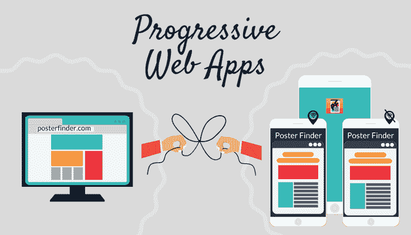
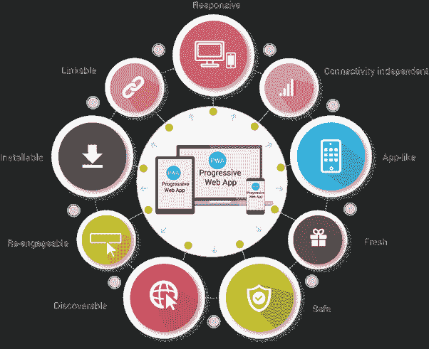

# 渐进式网络应用是未来

> 原文：<https://medium.datadriveninvestor.com/2019-the-year-of-progressive-web-apps-3027aea291f9?source=collection_archive---------1----------------------->

多年来，移动应用社区一直与两个平台捆绑在一起，Android 和 iOS。这两个平台已经形成了双头垄断，有效地阻止了其他移动平台的竞争。然而，未来将会不同。它必须是不同的。我们正在进入进步网络应用的真正时代。

# 什么是渐进式网络应用？

What are Progressive Web Apps?

根据维基百科，渐进式网络应用程序(PWAs)是“像普通网页或网站一样加载的网络应用程序，但可以为用户提供离线工作、推送通知和设备硬件访问等传统上只有本地移动应用程序才能使用的功能。”换句话说，它们是在网络上制作的应用程序，但可以在手机等设备上离线使用。

这项技术并不新鲜。这件事已经酝酿多年了。事实上，在 2007 年的 Macworld 大会上，当史蒂夫·乔布斯第一次介绍 iPhone 时，拥有标准网络技术的想法是最重要的。在 2007 年 1 月宣布的时候，还没有一个应用商店，也没有一个面向开发者的 SDK。乔布斯在评论中说:

> “完整的 Safari 引擎在 iPhone 内部。因此，你可以编写出惊人的 Web 2.0 和 Ajax 应用程序，其外观和行为与 iPhone 上的应用程序完全一样。并且这些应用可以与 iPhone 服务完美集成。你猜怎么着？没有你需要的 SDK！如果您知道如何使用最现代的 web 标准编写应用程序，以便为今天的 iPhone 编写令人惊叹的应用程序，那么您已经拥有了所需的一切。所以开发者们，我们认为我们已经为你们准备了一个非常甜蜜的故事。你现在就可以开始开发你的 iPhone 应用了。”

Steve Jobs at Macworld 2007

不用说，这并没有发生。同年 11 月，史蒂夫·乔布斯宣布了 SDK 和 App Store。这就是我们所知的原生应用的诞生和史蒂夫·乔布斯所预见的网络应用的死亡。嗯，不完全是…

快进到今天，现在已经有 Twitter、Forbes、Fandango 和阿里巴巴等公司利用了渐进式网络应用的力量。在阿里巴巴的案例中，pwa 让该公司弥合了原生应用和网络用户之间的差距，从而增加了 iOS 和 Android 用户。Flipkart 等其他公司已经注意到，参与度和转化率都有了很大提高。同样，这是由于进步的网络应用。

# 易于开发

让我们考虑一下*公司 A* 。*公司 A* 有一个网站和 iOS 和 Android 手机应用程序。对于网站来说，他们必须确保它能在台式机、平板电脑和手机上运行。在*公司 A* 的案例中，需要多个团队，每个团队都有不同的编码背景，以弥补 iOS (Swift)、Android (Java)和 web (HTML、CSS、JavaScript 等)的不足。).

公司 B 使用渐进式网络应用。他们维护一个类似于应用程序的、反应灵敏的、独立于连接的、可安装的平台。编码团队将由 web 开发人员组成，他们将以平台无关的方式构建 web 应用程序。

虽然*公司 A* 和*公司 B* 将向用户呈现相似的功能，但对于*公司 B* 来说，开发和维护将容易得多。此外，内容将保持最新、安全和一致，因为只有一个单一的入口点。

# 渐进式网络应用背后的原则

pwa 必须遵循以下指导原则:

**渐进式** —适用于所有用户，无论他们选择何种浏览器，因为他们以渐进式改进为核心原则。

**响应式** —适合任何外形规格:台式机、手机、平板电脑或尚未出现的外形。

**独立连接** —服务人员允许离线或在低质量网络上工作。

**类似应用的** —给用户一种应用的感觉，具有应用风格的交互和导航。

**新鲜** —由于服务人员的更新过程，始终保持最新。

**安全** —通过 HTTPS 提供，以防止窥探并确保内容未被篡改。

**可发现的**——由于 W3C 清单[6]和服务人员注册范围允许搜索引擎找到它们，它们可以被识别为“应用程序”。

**可重新参与** —通过推送通知等功能轻松重新参与。

**可安装的**——允许用户在主屏幕上“保留”他们认为最有用的应用程序，而没有应用程序商店的麻烦。

**可链接** —通过 URL 轻松共享，不需要复杂的安装。

# 打破双头垄断

Apple and Android

随着公司利用 PWAs 及其背后技术的成熟，相信在正确的支持下，用户和制造商会对这一想法产生兴趣并不是一个疯狂的想法。一方面，Android 和 iOS 用户享受到了应用商店下载应用的便利。但这扼杀了移动领域的公司，如微软、黑莓和 Palm，它们无法竞争应用程序的差距。

渐进式网络应用将帮助移动操作系统世界出现第三个玩家。所有迹象都指向一直在戏弄 Surface Phone 的微软。如果缺乏一个可行的应用程序商店是唯一让人们远离的原因，那么使用 PWAs 的选项应该会邀请人们回到 Windows Mobile 操作系统。

# 然后还有未来

当谈到渐进式网络应用时，是什么让未来变得如此重要？以下是我保持乐观的主要原因:

1)微软和谷歌在 2018 年一直大力支持 PWAs。原因很明显，微软和谷歌甚至称之为应用程序开发的未来。如果 Chrome 70 的发布预示着未来，那么渐进式网络应用似乎将成为未来的一大焦点。

2)苹果终于接受了 PWAs。曾经有一段时间，他们似乎不会。毕竟他们的 AppStore 是最好的。但是趋势表明人们对这项技术很感兴趣。苹果无法在其他产品上获得更好的体验，因此被迫接受这种增长趋势。通过现在采用它，并使其在包括 Safari 在内的所有平台上工作，他们可以保持新鲜，并处于市场的顶端。此外，他们对 PWAs 的投资将促使其他公司效仿。

3)越来越多的公司转向 PWAs，并取得了成功。与之前的移动网站相比，Pinterest 的 PWA 用户在网站上花费的时间增加了 40%。广告收入也增长了 44%，核心业务增长了 60%。在撰写本文时，移动营销人员报告称，在线零售商 Luxmart 在引入渐进式网络应用程序后，其移动转化率从 0.6%翻了一番，达到 1.24%。现在，根据谷歌基准工具的测量，Luxmart PWA 的表现排名从 PWA 推出后的 67%跃升至 99%。据谷歌称，PWA 标准合规性现在达到了 100%的满分。

4) Web 开发人员现在正在从事渐进式 Web 应用程序开发。这不再是一个概念验证或附带项目。PWAs 已经被证明是有效的，业界正在为此付出努力。在苹果、谷歌和微软等主要科技公司的支持下，开发人员现在认为有必要遵循 PWA 指南进行开发。现在，他们不再构建在特定平台上运行的应用程序，而是编写一次代码，然后部署到所有平台上。

渐进式网络应用是未来。更大的问题是它何时会被完全接受。如果过去几年有任何迹象的话，那就是很快了——可能最早在 2021 年。这就是我所期待的，我认为你也应该这样做。