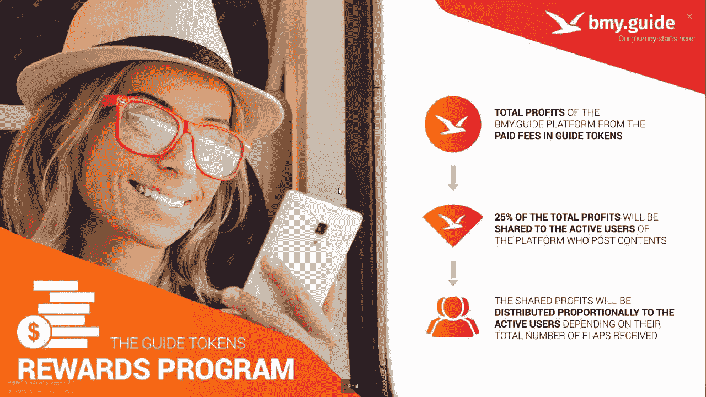

# 2020 年:令牌化将如何颠覆旅行和旅游业

> 原文：<https://medium.datadriveninvestor.com/2020-how-tokenization-will-disrupt-the-travel-and-tourism-industry-2499b859e80?source=collection_archive---------4----------------------->

Photo by [JESHOOTS.COM](https://unsplash.com/@jeshoots?utm_source=unsplash&utm_medium=referral&utm_content=creditCopyText) on [Unsplash](https://unsplash.com/s/photos/travelling?utm_source=unsplash&utm_medium=referral&utm_content=creditCopyText)

## bmy.guide 等平台已经在利用你的社交圈对你未来旅行的影响了！

众所周知，旅游和环球旅行确实会带来快乐，没有什么能比人类大脑在一个新环境和不熟悉的风景中导航时所经历的过程更重要。

当与家人和朋友分享过去旅行冒险的故事、照片和明信片时，甚至还有重新体验旅行刺激的额外好处。

 [## 5 行业转型区块链应用|数据驱动投资者

### 除非你一直生活在岩石下，否则我相信你现在已经听说过区块链了。而区块链…

www.datadriveninvestor.com](https://www.datadriveninvestor.com/2019/02/13/5-real-world-blockchain-applications/) 

不可否认的事实是，在过去的 3 年甚至 5 年里，区块链一直是最具颠覆性的概念之一。作为一项技术，区块链已经在金融、医药、银行和医疗保健领域得到了应用。就目前而言，区块链通过利用其竞争优势，在增强参与旅游行业的初创公司的能力方面处于核心地位，即:消除中介、欺诈缓解人性化用户体验，以及提高服务质量。

当作为一个单独的单位部署时， ***【区块链】和*** 旅游局有潜力转变为一股极具破坏性的力量，因为这项技术可以为关键点提供更多的安全性和透明度。例如，在旅行社代表旅行者预订航班和酒店的情况下，区块链可以使不同关联方之间的客户数据处理更加安全和透明，因为责任分散到所有各方的网络中。

[Try the Checkpoint Magazine App and Get a chance to win some LOAD tokens](https://wn.nr/YQBpCF)

## 区块链在旅游业中的应用

区块链技术的特点和可能性使其成为在旅游业部署的理想工具。就商业金融而言，区块链的主要优势在于加密货币支付更加安全和可追踪，因为在区块链上进行的所有交易都在链中注册，无法修改。

由于区块链是一个分散的系统，不会有任何中介机构可以干预或延迟付款，因为这是目前旅游行业的规范，国际银行系统经常给游客带来不便。

当旅行到其他国家时，对外汇货币的需求可能变得多余，同时旅行者可以免受这些外汇操作的波动性的影响。

分散管理系统使大公司和机构摆脱中间商成为可能，从而节省大量资金。同样，信息可以安全地流动，同时随时可供访问，从而减少管理时间并提供对信息的普遍访问。

随着社交媒体时代的到来，当我们想要旅行时，浏览论坛和阅读用户撰写的评论变得越来越常见。然而，在服务提供商自己没有雇佣他/她来写正面反馈的最坏情况下，不能保证写评论的人没有偏见。有了区块链，网络中显示的所有信息都是公开的、可靠的和安全的，实现了更好的透明度并增加了消费者的信任。

区块链在旅游业中的另一个可能的使用案例是，在整个旅行过程中，从登记柜台跟踪旅行者的行李。

区块链可以用来增强大多数旅游服务提供商使用的会员卡系统。旅游服务提供商为他们的客户创建忠诚度计划，目的是把他们变成回头客。区块链可以促进这些过程，并允许客户跟踪他们的积分，在更高级的情况下，将积分兑换成加密货币。

## [bmy . guide](https://ico.bmy.guide/)；区块链旅游业的真实例子

Image Credit: [bmy.guide](https://ico.bmy.guide/)

[bmy.guide](https://ico.bmy.guide/) 平台为用户提供了即时连接定制内容和真正与他们相关的社区评论服务的能力。

该平台寻求解决的问题是需要在一个平台上提供精确的旅游信息。网上关于旅行和旅游的信息经常误导人，在不同的平台上都有，而且在某些情况下已经过时。有记录的案例表明，游客和旅行者由于在信息不足的情况下做出决定，或者被网上的*吹捧评论*误导，最终对他们的最终目的地、住宿或交通不满意。

为了缓解上述问题， [bmy.guide](https://ico.bmy.guide/) 推出了一个自然环境和地理位置的搜索引擎，并将其与一个社交平台相结合，以支持其用户的互动。

这就产生了一个社交媒体平台，潜在游客可以在这个平台上与经验丰富的游客互动，以便:

1.  节省时间，因为**研究**可以在一个地方完成。
2.  用户在开放平台上分享他们的**体验**，节省资金。
3.  提供**改进的搜索**体验，因为该平台没有广告，因此尽可能保持真实。
4.  用户也有机会建立自己的**定制社区**，与其他用户分享共同的兴趣和目的地。

在 bmy.guide 平台上，鼓励用户上传和分享相关的高质量内容，以高分辨率照片和目的地简要评论的形式，告知和激发其粉丝和研究新旅游目的地的人。在平台上发布内容的用户(被称为*向导*)是整个系统的基石，因为他们的输入对于旅行者做出明智的决定至关重要。

> 注意我在 [bmy.guide](https://bmy.guide/user/7509) 上的帖子

作为 guiders 系统的结果，bmy.guide 提出了一种利润分享模式，即以 Guide tokens 支付的费用的 25%将与平台上发布内容的活跃 Guiders 分享。利润按比例分配，这取决于引导者从他们的帖子中获得的奖励(某种荣誉)的数量。在这个社交平台激烈争夺用户注意力的时代，这一天才之举更有可能确保该平台留住优质用户。

Image credit: bmy.guide

平台上 exchange 的效用是 Guide token，这是一种 ERC20 令牌，可以实现用户和服务提供者之间的交易。该平台的用户将使用导游令牌获得特殊旅行和旅游以及所有与旅行相关的服务和产品。此外，bmy.guide 将允许所有感兴趣的企业控制和管理他们已经创建的官方页面，并使用 Guide tokens 支付服务费用。bmy.guide 平台用户之间的资金移动也可以通过使用 Guide token 以及激励用户为平台生成高质量内容来完成，如前所述。这意味着向导令牌在 bmy.guide 生态系统内执行价值转移，这意味着令牌在基于平台构建的服务网络内具有效用和价值转移功能。

## 关于向导令牌和 bmy.guide 平台的重要信息

[网站](http://bmy.guide) || [推特](https://twitter.com/bMy_Guide) || [脸书](https://www.facebook.com/bmyguide) || [电报](https://t.me/bmyguide) || [INSTAGRAM](https://www.instagram.com/bmy.guide/) || [媒体](https://medium.com/@bmyguide) || [YOUTUBE](https://www.youtube.com/channel/UCfxqAOsCZz4zOE-BU6Rpy5g/featured)

这位[**bmy . guide**](https://ico.bmy.guide/)IEO 现[住](https://www.livecoin.net/en/trading/GUIDE_BTC)在 Livecoin.net 交易所！

*作家详情:||Btalk 用户名—邓培||* [*简介*](https://bitcointalk.org/index.php?action=profile;u=1418412) *链接||以太地址 0x 395 fdb DC 021 b 5615 E3 cf 5 daffdbc 6895d 29 b 19d 1*

> 请留意我在 [bmy.guide](https://bmy.guide/user/7509) 上的帖子

区块链技术仍处于早期阶段。虽然对其潜力有共识，但该技术的早期采用者需要做更多的工作，使其更符合市场的当前需求，并进行宣传，使其成为主流。

我们目前正处于这样一个阶段，大多数人对区块链采取了观望态度，但那些将在旅游业和其他许多行业中率先拥抱它并围绕它构建实际应用程序和用例的人将获得最丰厚的回报。

*上面这篇文章是从独立的角度写的。上述内容不构成财务建议，在决定是否投资任何金融产品之前，应寻求独立的财务建议。*

*如果你喜欢这篇文章，请关注我的*[*Twitter*](https://twitter.com/Tendy263)*/*[*Linkedin*](https://www.linkedin.com/in/tendai-tomu-75903612/)*。*

*最好还是买我的书:* ***非洲的天秤座，脸书的天秤座将如何颠覆*** ***非洲****(***)**