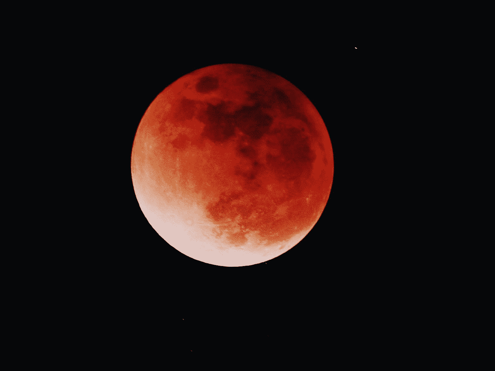
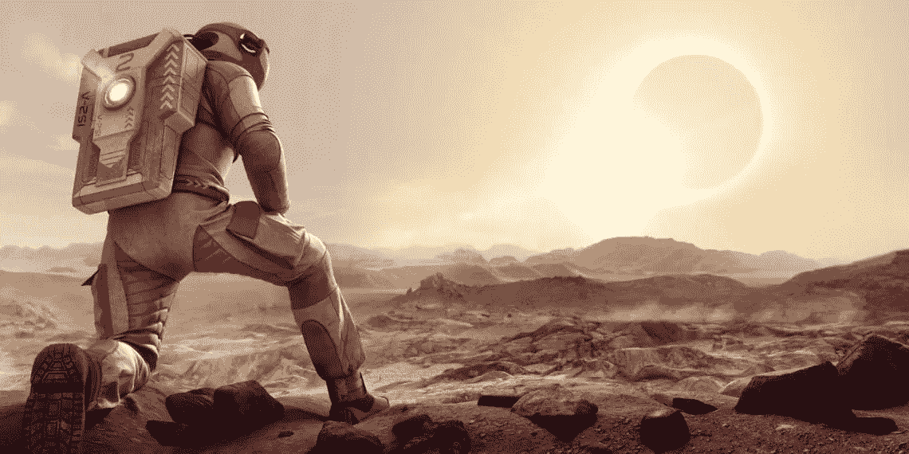

# 科幻小说想象的 2020

> 原文：<https://medium.datadriveninvestor.com/2020-imagined-by-science-fiction-467e8721cdf5?source=collection_archive---------1----------------------->

## 科幻小说和电影如何想象 2020 年。

Photo by [Jay](https://unsplash.com/@filmape?utm_source=medium&utm_medium=referral) on [Unsplash](https://unsplash.com?utm_source=medium&utm_medium=referral)

科幻小说把我们带入了一个复杂的未来世界，这个世界通常看起来是不现实的。但人类近年来取得了令人难以置信的技术进步，尤其是在上个世纪，科幻小说中预言的许多想法都成为了现实。

一些预测，如自动驾驶汽车，仍处于开发和运行的早期阶段，但世界各地的科学家已经实现了许多其他首先在小说中描述的里程碑，例如我们亲爱的 Julio Verne 在*“从地球到月球”*中描述的将人类带到月球的事实。令人惊讶的是，在 1865 年，凡尔纳已经表达了三个美国人驾驶宇宙飞船登陆月球的使命。更令人惊奇的是，这部小说的某些部分与第一次真正的登月相似，那次登月发生在凡尔纳写下他的标志性小说 104 年之后。

这也证明了科幻小说对未来的预测并不陌生。

出于好奇，在亚瑟·C·克拉克 1990 年的小说中，**【大浅滩的幽灵】* 2012 年是历史上最著名的轮船泰坦尼克号将从海底升起的一年。然而，2012 年过去了，泰坦尼克号的残骸继续沉睡在北大西洋 3800 米深处。*

* [## 幸福的算法？数据驱动的投资者

### 从一开始，我们就认为技术正在使我们的生活变得更好、更快、更容易和更实用。社交媒体…

www.datadriveninvestor.com](https://www.datadriveninvestor.com/2019/03/08/an-algorithm-for-happiness/) 

因此，尽管科幻小说的一些预测没有实现，就像这个案例一样，如果我们必须根据推理小说(以科幻和幻想两种类型的作品为基础)制作一个未来事件的日历，很明显我们会有一点复杂，特别是因为一些作者在为他们脑海中的想象设定具体日期时会感到某种自然的不情愿。我们可以举奥森·斯科特·卡德的《安德的游戏》或玛丽·雪莱的《最后一个人》为例，它们讲述了一个被瘟疫摧毁的未来世界的故事；都没有具体日期。

确实，通过不指定具体的年份，作家们允许他们的预测有可能在某个时候成为现实。

但是今天，我们将把注意力集中在那些作者确实正式确定了具体年份和世纪的书上。我们或远或近地旅行，取决于视角，2020 年。

## 2020 年殖民金星

Photo by [Yu Kato](https://unsplash.com/@yukato?utm_source=medium&utm_medium=referral) on [Unsplash](https://unsplash.com?utm_source=medium&utm_medium=referral)

电影《史前行星之旅》设定在 2020 年，于 1965 年首映，由柯蒂斯·哈灵顿执导，它告诉我们一个场景，即月球殖民已经完成，人类有一个更有吸引力的目标:从月球出发殖民金星。不寻常的是，他们跑进了一个不太平的史前世界，到处都是恐龙，居住着一个奇怪的文明。

## 这个人踏上了火星

Photo by [Elaine Casap](https://unsplash.com/@ecasap?utm_source=medium&utm_medium=referral) on [Unsplash](https://unsplash.com?utm_source=medium&utm_medium=referral)

我们许多人都认为这一时刻越来越近了，但是，在金·斯坦利·罗宾逊 1993 年出版的小说《红色火星》中，美国人约翰·布恩成为第一个在火星上行走的人。

## 大脑永远与互联网相连

Photo by [jesse orrico](https://unsplash.com/@jessedo81?utm_source=medium&utm_medium=referral) on [Unsplash](https://unsplash.com?utm_source=medium&utm_medium=referral)

这是最近的贡献之一。2004 年，作家杰夫·莱曼(Geoff Ryman)在他的小说《空气》(Air)中预测，到 2020 年，我们的大脑将永久连接到互联网。埃隆·马斯克和其他人一起参与了 Neuralink 项目。

## 巨大的生物

Photo by [Daniele Levis Pelusi](https://unsplash.com/@yogidan2012?utm_source=medium&utm_medium=referral) on [Unsplash](https://unsplash.com?utm_source=medium&utm_medium=referral)

这部由吉尔莫·德尔·托罗《环太平洋》于 2013 年上映的电影描述了一个未来，即 2020 年，可怕的海洋生物将离开海洋，结束我们所知的生命。谁能面对？显然，只有巨大的机器人。

## 心灵感应和心灵运输

移动研究所的创始人迈克尔·j·奥法雷尔在他的书《2020 年的转变》中预言，2020 年将是“纳米移动时代”的开始。“在纳米移动的时代，我预测心灵感应和传送将在 2020 年成为可能，”他说。显然，我们离这两种能力都有些远。

## 2020 愿景

Photo by [Riccardo Annandale](https://unsplash.com/@pavement_special?utm_source=medium&utm_medium=referral) on [Unsplash](https://unsplash.com?utm_source=medium&utm_medium=referral)

在 70 年代，杰里·波尔内勒编辑了一部名为《2020 年愿景》的作品，作者保罗·安德森、哈尔兰·艾莉森、拉里·尼文、艾·范·沃格特、诺曼·史宾拉德、本·博瓦等人试图想象 2020 年的世界会是什么样子。他们都同意那些在 2020 年仍然活着的人将会在那一年的*世界大会*上会面，讨论他们的预言。(其实会举办，他们会在新西兰办)。除此之外，他们谈论未来的食物和机器人厨师，一个每个人都永久连接在一起的巨大世界大脑，一个终身的性伴侣，或者一个成年人的游乐场，在那里法律通过远程控制来实施。

## 公司到权力

Photo by [Sean Pollock](https://unsplash.com/@seanpollock?utm_source=medium&utm_medium=referral) on [Unsplash](https://unsplash.com?utm_source=medium&utm_medium=referral)

Greg Rucka 在 2005 年出版的小说《完全黑暗:初始向量》中，2020 年呈现了一个超级公司控制和支配一切的世界，招募自己的军事力量进行秘密战斗，以获得权力。DataDyne 现在是世界上最强大的组织。

## 赛博朋克世界

Photo by [Denys Nevozhai](https://unsplash.com/@dnevozhai?utm_source=medium&utm_medium=referral) on [Unsplash](https://unsplash.com?utm_source=medium&utm_medium=referral)

《赛博朋克 2020》是一款赛博朋克流派的角色扮演游戏，由迈克·庞德史密斯(Mike Pondsmith)编写，由 R. Talsorian Games 于 1988 年发行。再说一次，大公司的特征主导着一个科技与人性融合的社会。游戏的很多技术在现实世界中已经被超越，但不是植入物或飞行汽车。

## 回到火星

Image — Mission to Mars

2000 年由布莱恩·德·帕玛执导的电影《火星任务》将我们置于火星的焦点，一个救援队外出寻找在前一次任务中失踪的宇航员。轨道上的地球空间站是为营救任务准备飞船的空间站:火星二号。他们的发现非常有趣，与火星表面的最新发现无关。

## 外星人和临时循环

Photo by [Diego Marín](https://unsplash.com/@diegosmarines?utm_source=medium&utm_medium=referral) on [Unsplash](https://unsplash.com?utm_source=medium&utm_medium=referral)

电影《明日边缘》讲述了一名士兵在 2020 年与入侵的外星人作战时阵亡的故事。这个士兵进入了一个临时循环，他试图从外星人手中拯救这个星球。

## 而 2021 年呢？

Source — Pixabay

在 PD 詹姆斯 1992 年出版的《人类的孩子》中，我们看到了 2021 年，很明显，最后一个婴儿是在 25 年前出生的，因为女人不能再生育。人类的暗淡前景。我们也不能忘记，“机器人会梦见电羊吗？”因为在这本书里，菲利普·K·蒂克说人类开始猎杀有有效期的“比人类更像人类”的复制机器人。*