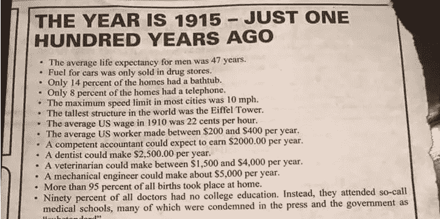

# 2118:百年后的世界

> 原文：<https://medium.datadriveninvestor.com/2118-world-in-a-hundred-years-2dd6d4bf723f?source=collection_archive---------2----------------------->

岁末将至，历史悠久的传统是窥视水晶球。

一个[有趣的问题](https://www.quora.com/How-will-the-world-be-100-years-from-now-How-will-civilization-be-and-how-will-people-behave-What-will-the-world-map-look-like-What-kind-of-lifestyle-will-people-be-living)最近出现在我的 [Quora](https://www.quora.com/) feed 中:

*100 年后的世界会是什么样子？文明会怎样，人会怎样表现？世界地图会是什么样子？人们将过着什么样的生活方式？*

让我们逐一解决这些问题。

# 100 年后的世界会是怎样的？

总之，*多样*。

不完美。也不可怕。

简单的部分:人类文明不会消亡。自从他们是一群赤裸的、愚蠢的猿类动物以来，人类幸存于超级火山爆发(可以说，其中一些人创造了[基因瓶颈](https://en.wikipedia.org/wiki/Toba_catastrophe_theory))、冰河时期和[小冰河时期](https://en.wikipedia.org/wiki/Little_Ice_Age)、干旱、洪水、海啸、严寒期、热浪、地震、野火、巨大流星、流行病、龙卷风、战争(包括那些使用大规模杀伤性武器的战争)、种族灭绝、疯狂的独裁者等等。今天，人类是“多样化”的:人类无处不在，生活方式差异很大。科学与工程相结合被成功地用来解决古老而棘手的问题。政府和基层[创造了多重防故障“装置”](https://en.wikipedia.org/wiki/Svalbard_Global_Seed_Vault)。有很多方法可以消灭大量的人。但是很难提出一个能够彻底消灭人类的原因(至少，一个起源于地球的原因)。

气候变化已经是一个挑战。但并不是统一的，一些气候寒冷的国家甚至可能受益并获得经济机会(如[北极航海](https://en.wikipedia.org/wiki/Transpolar_Sea_Route)，西伯利亚和加拿大的新耕地面积等)。).几乎可以肯定的是**地球工程将被用来减轻气候变化的不利影响。最有可能的是，大部分实验将是区域性的。我们已经看到了大规模的修复环境破坏的尝试，比如建造巨大的空气净化器，中国的“反污染战争”和海洋清理。就像任何技术一样，一些项目会产生不好的，甚至是灾难性的后果。其他人会成功。一些与气候变化无关的气候挑战也将得到常规解决(如洪水)。一百年后，这些机器不会让任何人感到惊讶。**

# *文明与人*

**少打架，多发牢骚**。常规的全面战争已经减少；能从中受益的当事人越来越少。发动一场战争需要公众的支持，而用演讲来激怒公众要困难得多。然而，与准军事组织的不对称战争不会很快消失，除非所有中央政府学会阅读并满足所有少数民族的需求。尽管如此，即使在这里，只有在少数地方，人们会认真对待一个电话死(某人的？)自由，宁愿满足于一个中间立场。另一方面，经济战已被证明是一种有效的胁迫工具。它将成为 21 世纪现实政治中最受欢迎的“极端措施”。

人们会抱怨，甚至比现在更多。这是发达经济体在快速增长阶段结束时通常会发生的情况。

**少一些理想主义，多一些思维和生活方式的多样性**。随着更多的物质财富和可负担得起的全球传播网络，更多的想法和社会结构将被创造和尝试。“接受教育，找到一份好工作，找到配偶，生孩子”的老路不再被认为是必须的。可接受的界限被越推越远，这种情况还会继续。

我们现在看到的新兴趋势将获得更强大的追随者，尽管它们不会被大多数人采纳。无人之地的小型无政府主义/自由主义社区；社会主义公社；数字游牧者；住在漂浮和飞艇房屋里的人；离网或大部分离网的社区；也许，首先实验一下多状态概念。

随着全球人口老龄化，社会将变得更加稳定和成熟。

## 加密货币和智能合约

今天，我们见证了工具的出现，这些工具将使这些替代的生活方式。加密货币就是其中之一。不幸的是，如今，加密货币运动是由思想僵化的狂热者和投机者推动的。在拥抱遗留结构更强的方面的同时，没有试图去了解遗留结构的问题，遗留结构被狂热地抛弃了。更糟糕的是，狂热者显然不知道传达这个概念的真正价值。数量惊人的密码持有者认为，密码的最终目的是使资金转移更便宜、更快捷。即使在恶性通货膨胀的国家——这是密码的教科书使用案例——加密货币也没有被大多数人采用。

然而，尽管它们的价值在 2018 年的大部分时间里一直在暴跌，但加密货币永远不会跌至零，这与许多人的预测相反。它们仍然广泛应用于暗网市场，不管我们喜欢与否，这就是经济，即使是黑色经济。**他们是跨国分布式社区的未来支柱**。

加密货币更重要的特点是经常被忽视的**智能合约**。这是潜力更大的地方；这是一种解决(或者扰乱，如果你愿意的话)正义的方式。

任何与合同协议打过交道的人都知道，它的大部分内容都不值得写在那张众所周知的纸上。任何一方都可能对零件有争议或干脆忽略；根据律师的熟练程度，整个合同或部分合同可能在正式的争议法庭上无效；争议解决的费用高得离谱，以至于大多数争议都变成了讨价还价和恐吓的过程。

如果这值得争论的话。在更小的情况下，无论是朋友不还他们借的钱，还是租客不付，都是简单的无视。

智能合约可能会通过自动化执行来改变这一切。除了，在他们目前的形式不会！现有系统的设计师似乎忽略了一个简单的事实，即软件容易出现漏洞，因此没有智能争议解决就没有智能合同，无论是旧的笨重的司法系统(讽刺的是，目前的加密欺诈受害者的避难所，无论他们多么自由)还是争议解决方的市场。任何质疑教条的尝试都会遭到嘲笑，说出“分散化”这个词，并在“啦-啦-啦-我听不到你”的成熟水平上否认。

然而，这种情况将会改变。需求是真实的，基础设施是存在的，而且有很多钱可以赚。

到 2118 年，**智能合约将成为事实上的标准**。对今天的人来说，有些方面可能看起来令人毛骨悚然和具有侵犯性，因为合同将确实是一个合同，几乎不可能规避。然而，它将会更加透明，而且大部分将会自动化。它可能与其他“契约”的共享库挂钩，比如法律(就像今天的契约一样)。这将使法律职业远不如现在有利可图。人类律师不会完全消失，但他们的工作范围会小得多。他们将被分成精英“法律哲学家”和“法律 oompah-loompahs”，前者承担挑战现有法律逻辑的任务，后者用类似乐高的组件起草快速合同。

Rule of acquisition #109: A contract is a contract is a contract

# *世界地图*

国界将不再重要。**更重要的新特征将是** [**经济集团**](https://en.wikipedia.org/wiki/Trade_bloc) 的边界。欧洲的欧盟和欧洲经济区。[中东海合会](https://en.wikipedia.org/wiki/Gulf_Cooperation_Council)。南美洲的南方共同市场。北美自由贸易协定的北美继承者，不管它将被称为什么。在 APAC(美国的退出可能是川普最具历史意义的行动)。因为国界的重要性会降低，到 2118 年，它们将基本保持不变。另一方面，经济集团将是高度动态的。它们都将被不同地治理，并且在其成员之间具有不同的共性。

南极洲将不再是一个空旷无人居住的地方。[麦克默多](https://en.wikipedia.org/wiki/McMurdo_Station)将成为一座繁华的城市。

从地形上看，世界地图将会非常不同。

随着轨道空间和大气层上层的商业探索将成为主流，**世界地图将变成 3D** 。有趣的事实:截至 2018 年底，[一个国家的主权领土没有法定上限](https://en.wikipedia.org/wiki/Airspace#Vertical_boundary)。在接下来的十年或二十年里，这种情况将会改变。

第一批永久性的外星球前哨基地将被临时的“势力范围”所分割，就像新大陆的早期欧洲殖民地和今天的南极站一样。这些**太空前哨也将成为“世界地图”**的一部分。考虑到太空探索的商业欲望，资源丰富的地区将成为国际冲突的爆发点，尽管这涉及到更多对昂贵基础设施的破坏，而不是老式的杀戮。

# *生活方式*

不用说，生活方式的最大变化将由新技术引起。自太空时代的乐观主义和阿瑟·克拉克的“技术与魔法无异”以来，情况发生了很大变化。许多通信和计算机技术的发展速度超过了 20 世纪 70 年代人们的想象；它们都会损坏、出现故障，需要某种智能操作才能正常工作。最重要的是，它们不会变得更简单；它们变得越来越复杂，工程变得越来越专业化。至少在未来一百年内，技术将与魔法和不完美区分开来。

## 医学和生物技术

对包括大脑在内的人体如何工作的更好理解，将是下一个世纪变革的最大驱动力。今天，两个重要的趋势是:

*   R&D 在投机性和新颖的生物技术领域进行了大量投资，如抗衰老研究、大脑研究(人脑项目、大脑倡议等)。)、[合成生物学](https://en.wikipedia.org/wiki/Synthetic_biology)，以及基因操纵。
*   草根自我实验被称为生物黑客，就像今天一样粗糙。

随着越来越多的知识和工具变得可用，更多的努力将被投入到寿命延长研究中。由于人们的寿命比以往任何时候都长，目前的退休模式已经面临压力，延长寿命的能力将需要新的激进解决方案。毫无疑问，有些人想要禁止它；有些人会想取消退休的权利，如果返老还童。

然而，随着发达国家出生人口的减少，寿命延长能力可能会因祸得福。**一个可能的争议解决方案可能是国家资助的返老还童治疗，以换取退休 X 年以上的资格**。(当然，接下来还会有丑闻，声称返老还童并没有返老还童那么多年。)这将确保中国有足够的(有经验的)劳动力，但社会保障体系不会紧张。

## 人工智能

大部分构建 AI 软件的人，包括我自己，都没有把抢饭碗、厌恶人类物种的超智能的到来当成一个值得认真讨论的话题。我会站在罗德尼·布鲁克斯[一边，他声称人类级别的人工智能不会在他的有生之年](https://rodneybrooks.com/my-dated-predictions/)出现，我也会站在机器学习和人工智能权威一边，如朱迪亚·珀尔、弗朗索瓦·乔莱、柳文欢·埃齐奥尼和其他人，他们相信目前占主导地位的方向是一个有用的工具，但从长远来看是一个死胡同。

事实上，我会更加极端。没有理由也没有可用的先决条件去发明一个通用的人工智能系统，尽管会有很多模拟的“感知”系统。

但是…但是…但是…埃隆马斯克！DeepMind！中国！奇点！

没有；不。人工智能到底是什么？

今天，人工智能一词在媒体、广告和脑残的 LinkedIn 帖子中使用时，可能意味着以下任意组合:

*   科幻中想要毁灭人类的智能软件
*   机器学习
*   推荐引擎(就像亚马逊 20 年前部署的那些)
*   [中国手机相机中的照片滤镜](https://www.oppo.com/en/smartphone-f7_youth/)
*   聊天机器人
*   波士顿动力机器人([使用硬编码算法](https://towardsdatascience.com/how-does-boston-dynamics-use-ai-68c432d60c6f)

我更喜欢的简单定义是，“让计算机解决一度被认为是人类能力专属领域的任务的技术”——向谷歌的埃里克·张致敬。

今天，大量的资源被投入到解决这些任务中。一个接一个。如通过单独的软件组件。其中许多已经足够好，可以用于生产。想象一下 20 年后他们会被磨砺得多么彻底。**如果行得通，为什么要改变它？**

为什么要用一个通用的、通用的组件来代替它呢？这个组件很可能是一个黑匣子。如果硬编码、可调试的 Atlas 机器人可以翻筋斗和开门，谁还需要一个可以随时熄火而没有任何解释的自学装置呢？

你可能会问，但是千变万化的世界呢？没有预料到的复杂现实和挑战呢？事实是，今天没有自学可以解决这个问题。看看自动驾驶汽车。他们在概念层面上工作，但正是这些微小的细节阻止了它进入生产。对完美学习机器的整个[追求开始提醒对魔法石的追求](http://www.sciencemag.org/news/2018/05/ai-researchers-allege-machine-learning-alchemy)(这是根据谷歌研究员，不是我)。

分割的、部分硬编码的“智能”软件进展缓慢。非常慢。但它正在发生，这些组件的库在不断增长，而根据几乎每个人工智能研究人员的说法，AGI 的进展可以忽略不计。

谁决定智能软件必须模仿人类思维？你是否为飞机不像鸟儿那样扇动翅膀而烦恼，或者你的 CPU 不像学校教你的那样使用长除法？

## 空间探索

太空探索是 20 世纪中期最大的希望之一。结果证明这是一项昂贵的努力，进展缓慢，失败代价高昂，工程复杂得离谱，商业前景大多不明朗。不幸的是，现在仍然是这样，而且在新的启动模式被证明可行之前也将是这样。今天，有几个方向正在探索，太空开始获得商业和军事意义，私人团体开始向投机项目投入资金。

虽然谈论真正的太空竞赛 2.0 还为时过早，但迹象已经出现。有一些关于美国和俄罗斯的核火箭设计的有趣消息；太阳帆正在探索中；替代设计正在进行中。

尽管如此，进展将会非常非常缓慢。其他星球上的永久前哨站很可能在 2118 年存在，但它们不会自我维持，也不会更接近今天南极研究站的状态。