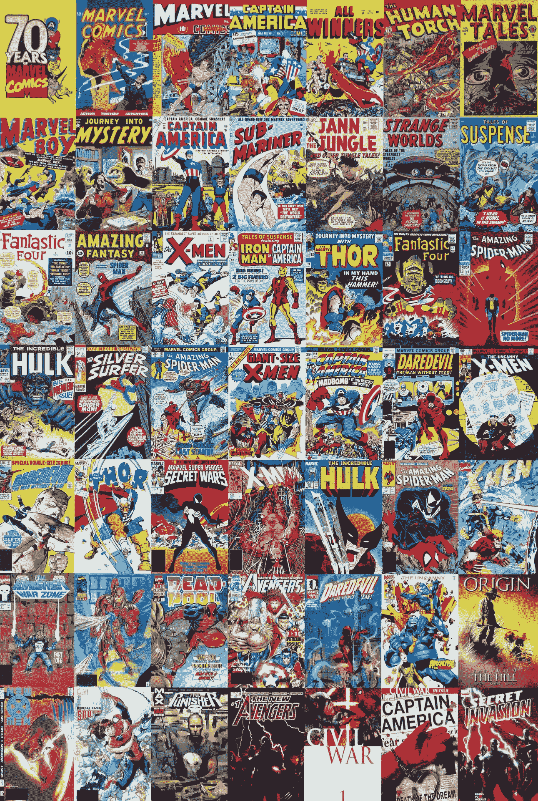

# 21 世纪福克斯为迪士尼增值

> 原文：<https://medium.datadriveninvestor.com/21st-century-fox-adds-value-to-disney-4ca4d25baa60?source=collection_archive---------3----------------------->

收购 21 世纪福克斯增加了迪士尼的价值，并证明了鲍勃·伊格尔是当今最聪明的首席执行官之一。事实上，迪士尼收购 21 世纪福克斯公司(纽约证券交易所代码:Fox)比许多人怀疑的要划算得多。

解释一下，**华特·迪士尼公司(纽约证券交易所代码:DIS)** 在避开问题儿童的同时，获得了福克斯最有利可图的资产。值得注意的是，此次收购不包括福克斯奄奄一息的广播和有线新闻业务。

此次收购将于 3 月 19 日星期二结束，并于 3 月 21 日星期四生效，*综艺* [报道](https://variety.com/2019/biz/news/disney-march-20-close-21st-century-fox-acquisition-1203161135/)。独特的是，福克斯股东将获得每股 38 美元的现金和股票。此外，迪士尼计划为福克斯股东发行 3.43 亿股新的 DIS 股票。

 [## 为什么包容性财富指数比 GDP 更能衡量社会进步？-数据驱动…

### 你不需要成为一个经济奇才或金融大师就能知道 GDP 的定义。即使你从未拿过 ECON 奖…

www.datadriveninvestor.com](https://www.datadriveninvestor.com/2019/03/08/why-inclusive-wealth-index-is-a-better-measure-of-societal-progress-than-gdp/) 

# **21 世纪福克斯如何为迪士尼增值**

以下是迪士尼以 713 亿美元现金和股票以及 138 亿美元债务收购的福克斯资产:

历史悠久的 20 世纪福克斯电影和电视工作室可以追溯到 20 世纪 30 年代。因此，迪斯尼将最终控制黄金时代最大的好莱坞电影公司之一。此外，20 世纪福克斯的前身；福克斯电影公司，可以追溯到好莱坞的无声时代。

主要漫威超级英雄的电影和电视权利；包括金刚狼、x 战警、死侍、新变种人、星际干扰器、凯布尔、神奇四侠，可能还有绿巨人。因此，金刚狼、绿巨人和风暴可以出现在第五部《复仇者联盟》电影中——如果他们制作一部的话。

电影和电视的权利，主要漫威超级反派包括博士厄运，险恶先生，黑色女王乐团，万磁王。注意，我认为末日博士、[阴险先生和](https://en.wikipedia.org/wiki/Mister_Sinister)[黑色女王乐团](https://en.wikipedia.org/wiki/Selene_(comics))是赚大钱的角色。因此，钢铁侠可以在他的下一部电影中与末日博士战斗。

包括《吸血鬼猎人巴菲》、《人猿星球》、《掠夺者》、《异形》、《阿凡达》、《X 档案》和一些我可能忘了的电影和电视版权。

迪士尼可以流式播放或翻拍的经典电视节目和电影的资料库。特别是，像《布奇·卡西迪》和《圣丹斯小子》、《X 档案》、《T1》和《T2》中的《杜利特尔医生》等经典电影都迫切需要重拍。

Hulu 流媒体服务的另外 30%，根据 Variety 的数据，该服务拥有 2500 万用户。因此，迪士尼将拥有 Hulu 的股份，Hulu 在 2018 年产生了 15 亿美元的广告收入，*综艺* [估计](https://variety.com/2019/digital/news/hulu-25-million-subscribers-2018-ad-revenue-1203102356/)。独特的是，Hulu 在 2018 年以 45%的速度增长，但在 2018 年第三季度亏损 4.4 亿美元。

因此，迪士尼首席执行官鲍勃·伊格尔从 851 亿美元中获益匪浅。令人印象深刻的是，Iger 能够在没有最麻烦的资产的情况下收购 Fox。

# **没有福克斯新闻频道，21 世纪福克斯为迪士尼增值**

有趣的是，迪士尼避开了最差的福克斯地产，因为它们正被分拆成一个名为福克斯公司的新实体。令人印象深刻的是，伊格尔收购福克斯时没有触及其最糟糕的资产福克斯新闻频道。

据《卫报》报道，备受争议和憎恨的福克斯新闻频道频道很难留住广告客户。事实上*综艺* [报道](https://variety.com/2019/tv/news/tucker-carlson-fox-news-mob-tv-advertising-1203160994/)福克斯新闻频道在今晚的一个旗舰节目*塔克·卡尔森*上销售广告有困难。

例如，主要的广告商拒绝购买卡尔森节目的播放时间。广告商正在避开福克斯新闻频道，因为它与不受欢迎的特朗普政府关系融洽，一些主持人采取了有争议的立场，以及涉嫌种族主义和性别歧视的言论。

尤其是卡尔森，他用[抨击](https://www.salon.com/2019/01/26/salon-interview-tucker-carlson-bashes-capitalism-says-he-might-vote-for-elizabeth-warren/)反对资本主义来冒犯政治走廊两边的观众；以及被许多批评家视为种族主义者的言论。毫不奇怪，福克斯新闻频道正面临来自左派和一些保守派的抵制和批评。

在这种情况下，我认为伊格尔拒绝接触福克斯新闻频道是一个非常明智的举动。

# **21 世纪福克斯通过倾销广播为迪士尼增值**

此外，伊格尔还在回避一个潜在的更大的问题，即福克斯奄奄一息的广播电视网络和体育运营。像福克斯新闻频道一样，福克斯电视网和体育将成为福克斯公司的一部分。

不幸的是，关于福克斯公司资产的细节很少，但是它的网站还在运行。根据网站判断，我猜测福克斯公司将拥有体育、广播和福克斯新闻频道。

然而，收视率显示，福克斯电视网正在迅速衰落。例如，在 2017-2018 和 2018-2019 电视季之间，福克斯的旗舰剧《T2 帝国》的收视率下降了 11.32%。

# **收视率证明迪士尼拒绝福克斯电视网是明智之举**

此外，*TVseriesfinale.com*[估计](https://tvseriesfinale.com/tv-show/fox-2018-19-season-ratings/) *帝国在至关重要的 18 至 49 岁人口中的收视率同期下降了 17.5%。*

与此同时，福克斯五大节目中只有一个节目的总体收视率；传奇的《辛普森一家》在上两季之间成长。事实上，《辛普森一家》的收视率增长了 6.02%，然而这一增长可能来自于围绕这部卡通片 25 周年的大肆宣传。

很明显，在 2019 年 3 月 14 日结束的一周内，福克斯的顶级节目*帝国*仅吸引了 501.6 万观众。此外，《帝国》只吸引了 152 万 18 至 49 岁的观众。

甚至 NFL 橄榄球；传统上收视率很高的电视台在吸引观众方面遇到了困难。奇怪的是，美国橄榄球联盟的收视率显著上升，但广告收入却在下降，The Wrap [声称](https://www.thewrap.com/why-nfl-ad-revenue-is-down-despite-improved-tv-ratings/)。事实上，NFL 的广告收入在 2018-2019 赛季的前两个月下降了 19%。

值得注意的是，据 SportsMediaWatch [估计](https://www.thewrap.com/why-nfl-ad-revenue-is-down-despite-improved-tv-ratings/)，2018 年 NFL 的平均收视率增长了约 5%。然而，增长不足以弥补 2016 年和 2017 年两季 16%的收视率下降。

# **21 世纪福克斯让迪士尼成为更好的价值投资**

我认为 21 世纪福克斯公司为迪士尼增加价值的方式让一项好的价值投资变得更好。事实上，我相信迪士尼将从 21 世纪福克斯资产中赚钱，同时避免公司的问题。

例如，迪士尼可以通过不拥有两家广播网络来避免与反垄断监管机构和政客的昂贵法律冲突。值得注意的是，迪士尼已经拥有美国广播公司，所以它不需要第二个广播网络。

这些数字表明，迪士尼是一个很好的价值投资，随着 21 世纪福克斯的到来，这一投资将会变得更好。例如，迪士尼 2018 年第四季度的毛利为 63.02 亿美元，营业收入为 34.18 亿美元，净收入为 27.88 亿美元。

# 没有 21 世纪福克斯，迪士尼赚了很多钱

此外，迪士尼的收入从 2018 年第三季度的 143.07 亿美元增长到 2018 年第四季度的 153.03 亿美元。因此，在没有 21 世纪福克斯资产的情况下，迪士尼已经赚了很多钱，收入也在增长。

毫不奇怪，迪士尼从其娱乐业务中产生了大量现金。例如，迪士尼报告 2018 年第四季度的运营现金流为 20.99 亿美元，自由现金流为 9.04 亿美元。此外，迪士尼在 2018 年 12 月 31 日拥有 44.55 亿美元的现金和等价物以及 101.23 亿美元的应收账款。

这些数字显示了迪士尼在娱乐资产货币化方面有多好。因此，收购 21 世纪福克斯给迪士尼带来了更多的娱乐资产来赚钱，从而增加了迪士尼的价值。例如，迪士尼可以制作大预算的《绿巨人》或《星际迷航》电影，从这些角色身上赚钱。

# **迪士尼是一只高股息股票**

最后，收购 21 世纪福克斯公司让一只高派息股票变得更好。

特别是，迪士尼股东在 2019 年 3 月 14 日享有 1.55%的股息收益率，1.76 美元的年化股息，25.4%的派息率和两年的股息增长。此外，迪士尼股东在 2019 年 1 月 10 日获得了 88 英镑的股息。

令人印象深刻的是在过去的两年半中股息增长了 10。为了澄清，DIS 于 2017 年 7 月 27 日支付了 78 英镑的股息，2018 年 7 月增加到 84 英镑，2019 年 1 月增加到 88 英镑。因此，我认为 DIS 在 2019 年 3 月 18 日的价格是每股 113.30 美元。

因此，迪士尼是一只优秀的股息股，可能会因为 21 世纪福克斯的交易而变得更好。在这种情况下，获得股票报酬的 21 世纪福克斯股东是此次收购的真正赢家。