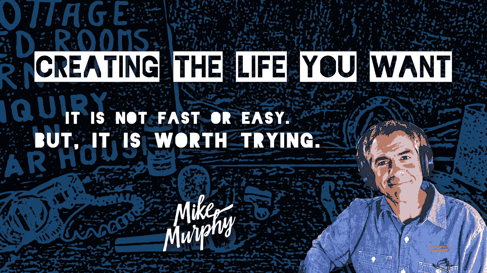

# 255:继续走

> 原文：<https://medium.datadriveninvestor.com/255-keep-going-78d164ce5d0c?source=collection_archive---------33----------------------->

创造你想要的生活的现实。

## **这个故事的寓意:**

继续走。

> 去蒂珀雷里很远。"

## **这篇文章的灵感来源:**

在简化和组织我的数字资产时，我偶然发现了这个大约 3 年前制作的定格视频，它触发了我的一些想法，因为我清楚地记得我的思想状态。我作为一名在线内容创作者开始了我的旅程，不知道我应该专注于什么，也不知道我应该如何将我的创造力转化为商业，但我会尝试并找出答案。**注:**我仍在努力破解密码，但我每天都在各方面进步，我对自己的努力感到非常自豪。

## 创造和实验

我认为自己是一个技术和创造性的疯狂科学家。我并不真的关心成品或赞美。这是我最喜欢的制作、做和尝试的行为。你会听到人们一直在网上谈论这个过程。创作过程是最让我兴奋的。冲洗并重复。

> 给自己空间和允许去探索你的创造力和想法。

我一直很喜欢定格视频，所以我学会了如何制作。他们在很多方面都很糟糕，但那对我来说过去和现在都不重要。我只是想学习如何为我的创作工具箱制作定格视频，并满足我的创作好奇心。

我最喜欢的一个概念是安妮·拉莫特创造的“第一次糟糕的草稿”。创意人员在发布他们认为是杰作的东西之前，总是沉迷于让事情变得“完美”,但事实上，你的早期作品将会在很长一段时间内变得糟糕。我喜欢创建每日内容的原因是因为你限制了校对或编辑的时间。质量来自实践和时间。

以下是为本文提供素材的定格剪辑。
**这里有个视觉:**我住在佛罗里达。我会在一个 90 多度的旧棚子里呆上几个小时，没有空调，没有隐形眼镜夹住我的腿，而我则玩着装备和微型道具来制作一个 30-60 秒的视频。我每天都做这样的事情来培养我的技能，并找到我的创造性和教学的声音。我会停下来一会儿，然后继续做别的事情。

‘The Pod-shed Sessions’

**寻找我的声音**

当我踏上建立个人品牌和在线业务的旅程时，我擅长很多事情，但不知道自己擅长什么。我不知道自己想做什么，也不知道是否能通过在网上创作内容来实现目标和支付账单。我知道我的脑袋里充满了技术和创新知识，我喜欢教书。我从那里开始。

> 我想建立一个网上业务，所以它是由我来解决。

我每天都致力于学习和创造，直到我找到自己的声音。我一生都在努力理解我擅长什么，或者我被‘召唤’去做什么，但我并不缺乏价值观念和决心。

> 感觉自己有天赋、有才华、有动力，但总觉得自己的“天赋”未被开发或不为人知，这非常令人沮丧。继续走。跟着线索听。

# 开始

> 你不需要知道从哪里开始，做什么，或者如何开始。你只需要开始。

我决定找出我擅长什么和我的在线业务的最佳方式是试水和尝试我感兴趣的一切。一遍又一遍地做事情，直到你开始认识到你自然倾向的模式。做那些让你脸上带着微笑的事情，做那些对你来说感觉如此简单和容易的事情。对自己要非常诚实。如果感觉很好，而且你很擅长，那就多做一些。如果感觉你宁愿去看牙医也不想做某事，那就消除它。你将会在很长一段时间里在很多事情上表现不佳。重要的是迈出第一步。

## 摸清底细

我看了一个 Ted 演讲，它对我产生了很大的影响，因为我一直在努力找出自己擅长什么，应该把精力集中在哪里。我曾经痛骂自己是个万事通。我只想知道我的“东西”是什么。

我从这个视频中得到的启示是，你不需要知道所有的答案，也不需要“挑选”一件事情。尝试做很多事情，相信如果你忠于自己并投入工作，会有好事发生，你从未期待或计划的机会会出现。

## 选择自己的冒险:事业！史蒂文·汤姆林森

TedX: Choose Your Own Adventure

当我需要一些鼓励的话时，这个视频来的正是时候。这给了我一些肯定或希望。我不是一个怪胎，因为我有如此多的兴趣，我很快对事物失去兴趣也没关系。继续创造东西，直到它成功或者有人比你更进一步认识到你的能力并打开机会之门。如果你不停地一遍又一遍地做事情，你会开始减少你的兴趣清单，因为你开始做更多你喜欢的事情。

## 权威

你通过一遍又一遍地练习和做同样的事情而成为专家。重复和练习。耐心和勤奋，你会取得进步。即使不完美也要按上传或发布。你会好起来的。分享你的声音和知识，你会因某事而出名。目标不是被贴上你所在行业的专家或权威的标签。目标是成为你的手艺的专家，因为你投入了工作和努力去变得真正擅长某事并与他人分享你的东西。你的手艺越好，你就会越自信。

## 我的行动

1.  2015 年的前 6 个月令人深思。我参加了像 StrengthsFinder 2.0 这样的测试(非常有帮助)来变得更有自知之明。在我开始上网之前，自我意识不在我的字典里。这是关键。
2.  2015 年 9 月，我不假思索地开办了一个播客,寻找自己的声音，教导和激励他人。我每周五连续出现 150 集。我没有赚到一分钱，也没有庞大的观众，但我在沟通和教学方面变得更好了。
3.  连续 900 多天，我至少创作并发布了一篇内容。我从未错过一天。有时候很糟糕。照片，视频，停止运动，时间流逝，媒体文章。每一天。我做了很多让我回想起来都畏缩的事情。我不会为了荣誉每天都出现。我每天都出现，因为我知道这是成为伟人的必要条件。
4.  2017 年，我开始学习特效和动画，连续 365 天每天制作一个视频。是的，这是一个很大的痛苦(有时令人筋疲力尽)。我每周 7 天花 4-8 小时(有时更多)制作教程、动画，并提高我的创作技能。事后看来，我把自己逼得有点太紧了，但我知道我正在发展的技能是未来的技能:创造力、解决问题、教学、视频/音频…我热爱的一切。

## **这需要时间。**

没有捷径可走。有几个晚上，我把头埋在键盘上睡着了。朋友和家人认为我是疯了，因为我一直在免费提供服务。爱你的人会给你压力，因为他们觉得你追求梦想的时间太长了。你必须忽略这一点。他们是好意，但他们不知道要付出什么代价。只要你能负担得起就坚持下去，如果你没钱了就想办法坚持下去。不要让别人用他们自己的怀疑填满你的脑袋，愚弄你，让你认为那是你自己的怀疑。要自信，不断提醒自己，努力工作会带来机遇和机会。继续走。

## 不要比较

不要将你的道路或进步与他人比较。每个有技能、有才华、成功的人都经历过和你一样的磨砺和挣扎。同样的过程有时似乎永无止境，毫无意义。每个人都有疑虑，可能会一次又一次地想要放弃。真的很难。你在网上仰视的那些似乎什么都懂的人和你没什么不同。他们不断出现。

> 日复一日的出现并不容易。尤其是当没有人在听或者关心的时候。

## 这段经典视频说明了一切:

## 创造你想要的生活

如果你想创造你想要的生活，你必须愿意付出努力，为自己赌一把。诚实而实际，但要全力以赴。

替代方案是什么？

你真的想满足于一种你不喜欢的生活，或者仅仅因为它变得太难而感到受鼓舞吗？

坚持下去，抬起头来。

学习，创造，前进。

开始，不要停止。如果机会来敲门或者一扇门为你打开，那就走进去探索吧。会有障碍和阻碍，自我怀疑和不确定性会伴随你的每一步。也会有令人难以置信的时刻，有人评论说你激励了他们或者你帮助了他们。积极是你前进的动力。多微笑，享受旅程。没有比现在更好的时间去追求一些特别的东西，即使你不完全确定你的东西是什么。开始吧。

你值得。

# createthelifeyouwant

— — — — — — — — — — — — — —

你在旅途中处于什么位置？有什么事情是你在纠结的吗？留下回复，这样比我聪明的人可以帮助我，或者如果有什么我能做的，可以亲自联系我。

干杯，迈克·墨菲