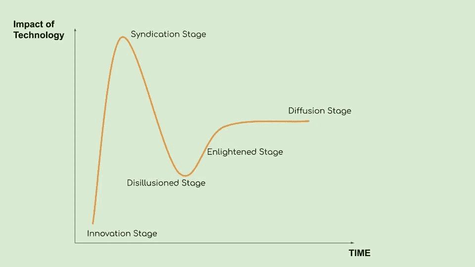

# 3.2 维度 3 —阿马拉定律

> 原文：<https://medium.datadriveninvestor.com/3-2-dimension-3-amaras-law-556288c7e887?source=collection_archive---------8----------------------->

***回顾:*** *这是一个中型系列，着眼于在理解巨型科技独角兽如何形成中发挥作用的不同因素(以维度表示)。你可以在这里找到* [*简介*](https://medium.com/datadriveninvestor/intro-tech-startup-unicorns-be40ed9ff9c9) *。*

*我们之前谈到了如何创造新的价值机会层(表示为* [*维度 1*](https://medium.com/datadriveninvestor/dimension-1-value-creation-opportunity-at-macro-level-b205a8f05561) *)。我们介绍了微观层面的颠覆机会和增长机会是如何出现的(表示为* [*维度 2*](https://medium.com/datadriveninvestor/dimension-2-disruption-opportunity-at-micro-level-and-growth-e37f078544eb) *)。*

 [## 金融科技初创公司正在扰乱世界各地的银行业-数据驱动的投资者

### 传统的实体银行从未真正从金融危机后遭受的重大挫折中恢复过来…

www.datadriveninvestor.com](https://www.datadriveninvestor.com/2018/10/20/fintech-startups-are-disrupting-the-banking-industry-around-the-world/) 

***维度重述:*** [*维度 3*](https://medium.com/datadriveninvestor/3-1-dimension-3-luck-and-timing-2240c222bed6) *讲的是对创业独角兽的成功起塑造作用的外部因素。这篇文章讨论了技术趋势在过去是如何形成一种模式的，以及这种特殊的趋势通常是由创业独角兽产生的。*

过去有一个反复出现的主题，它是由 Amara 提出的，后来由 Bill Gates 根据技术的适应性进行了调整和重新构建。但这不一定是未来的模板。

已经发生的阶段如下:

1.  **创新阶段**:远见者或研发人员为创新技术或产品奠定基础的阶段。这个阶段是创业者愿意承担高风险的阶段。最初的产品或技术未能成功，在找到产品-市场匹配之前，后续的改进需要迭代。例如:比特币、Airbnb、特斯拉等。
2.  联合阶段:最初的成功故事会引起更多的关注，吸引更多的公司和资金。随着假阳性的潜在涌入，公司或个人试图快速赚钱或欺骗人们，出现了一个膨胀预期的高峰。增加的期望创造了短期内过高回报(金钱、应用和技术影响)的希望。在 2017 年底的加密热潮中，似乎突然冒出来的加密专家和诈骗 ico 的数量就是这样一个例子。本世纪初电动汽车公司的数量可能是另一个例子。
3.  **幻灭阶段**:错误的预期通常会导致市场上 90%的玩家出局，从而引发一波对技术的悲观情绪。随着公众认知的消退和短期参与者的离开，真正的进步开始形成。在足够长的时间内持续的改进和发展。互联网后 90 年代的繁荣:亚马逊，谷歌等维持了这些时期。
4.  **启蒙阶段**:随着技术/产品找到更好的应用，以及针对不同骗子的法规不断形成，早期主流采用出现在这个阶段。像印度这样的发展中国家采用电话和互联网
5.  扩散阶段:一旦主流采用开始出现，技术就不像创新阶段那样令人兴奋了。随着经历了整个周期的早期参与者现在成为主导者，市场变得饱和。新技术/产品的诞生很可能进入循环。当前行业:AI，区块链，量子计算。每个行业的持续时间不同。

通常的趋势是由

1.  早期采纳者:远见者或 R&D 人，他们预见到不可预见的事情，通常能够建立创业独角兽或创新新技术。乔布斯、马斯克、小渊惠三
2.  企业家、开发人员和工程师使持续发展成为可能
3.  转让者和消费者:姐妹公司的诞生，即公司将现有的技术趋势/服务转移到邻近的市场，或在地理位置上转移到广阔的市场。

例如:亚马逊到 Flipkart
优步到 Ola，滴滴
电动汽车到电动滑板车和自行车
比特币到以太坊和 0x

**接下来:** [黑天鹅](https://medium.com/@arvindvairavan/3-3-dimension-3-black-swan-dd3b8eabd96c)