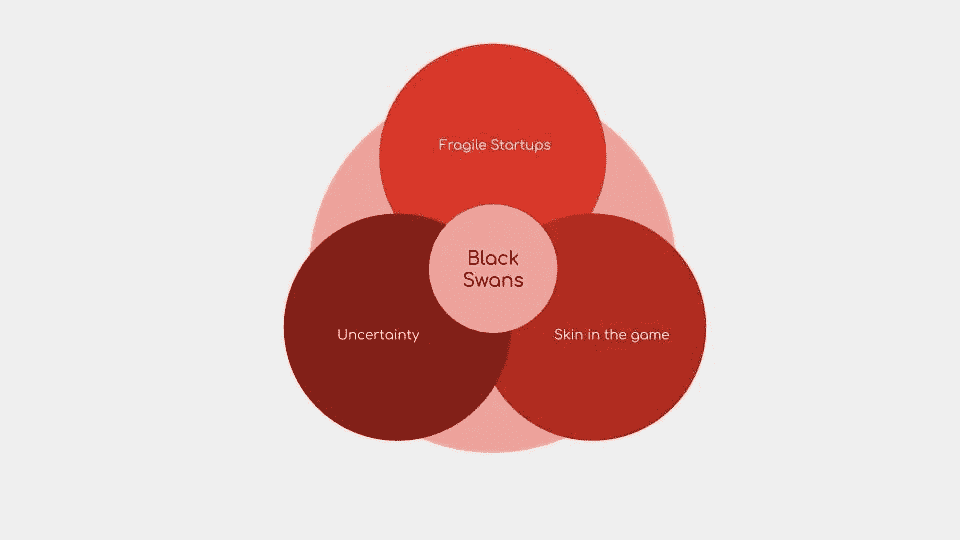

# 3.3 维度 3 —黑天鹅

> 原文：<https://medium.datadriveninvestor.com/3-3-dimension-3-black-swan-dd3b8eabd96c?source=collection_archive---------7----------------------->

***回顾:*** *这是一个中型系列，着眼于在理解巨型科技独角兽如何形成中发挥作用的不同因素(以维度表示)。你可以在这里找到* [*简介*](https://medium.com/datadriveninvestor/intro-tech-startup-unicorns-be40ed9ff9c9) *。*

*我们之前谈到了如何创造新的价值机会层(表示为* [*维度 1*](https://medium.com/datadriveninvestor/dimension-1-value-creation-opportunity-at-macro-level-b205a8f05561) *)。我们介绍了微观层面的颠覆机会和增长机会是如何出现的(表示为* [*维度 2*](https://medium.com/datadriveninvestor/dimension-2-disruption-opportunity-at-micro-level-and-growth-e37f078544eb) *)。*

 [## 睁大眼睛冲破多样性壁垒——数据驱动的投资者

### “科技女性”是蒂芙尼·霍兰的激情之一，最初她在 Twitter 上主持“科技女性”聊天。她也是一个…

www.datadriveninvestor.com](https://www.datadriveninvestor.com/2019/03/20/hurtle-diversity-barriers-with-eyes-wide-open/) 

***维度重述:*** [*维度 3*](https://medium.com/datadriveninvestor/3-1-dimension-3-luck-and-timing-2240c222bed6) *讲的是对创业独角兽的成功起塑造作用的外部因素。这篇文章讨论了不确定性的作用，黑天鹅事件如何在科技初创公司中发生，以及为什么科技生态系统是反脆弱的。*

每一个成功的创业公司，都会有成百上千的公司失败。一个更小的数字将会获得巨大的成功。更有甚者，每个优步都有一些失败的另类优步和成功的地域优步(Ola，Didi)。

但比成功更重要的是，规模是不可预测的。记住纳西姆·塔勒布的黑天鹅理论，谷歌和苹果是真正的黑天鹅。这两家初创企业的巨大成功和影响是完全不可预见的。事后合理化和解释成功是一个死胡同。

黑天鹅是塔勒布给一个极不可能发生的事件的术语，它有三个主要特征:

a.不可预测性——这超出了正常预期的范围。极端影响——这个事件改变了我们所知道的世界。事后合理化——回想起来，想让事情看起来不那么随机，比实际情况更容易预测。

未来是不可预测的，这同样适用于科技领域的黑天鹅事件。这就是为什么构建包含黑天鹅的框架让我们做好准备并接受不确定性。凭借后见之明，我们可以观察到由重大事件塑造的人类历史涉及技术——火、轮子、电、互联网等。

人类历史上一些最重大的事件都要归功于这些技术的发展，从轮子一直到万维网。如果我们能更好地理解这些发展是如何发生的，那么我们就能更好地抓住它们的潜力。黑天鹅事件标志着大规模的破坏。无论是区块链、人工智能还是电动汽车革命，如果科技教会了我们一件事，那就是期待意想不到的事情。

因此，尽管这个框架提供了科技创业公司黑天鹅事件的线性化描述，但它不是预测未来的模型。

塔勒布在他的《黑天鹅》一书中对市场做了两个分类:

“极端主义”的策略——因为在这个市场的成功取决于成为“热门人物”,所以你必须努力提高自己的胜算。“在‘极限运动’中取得成功就像中彩票一样，你买的彩票越多，胜算就越大。这意味着如果你是一个作家，写更多的书。如果你是歌手，多写歌。如果你是一家初创公司，做许多事情，任何一件都可能导致成功。提高胜算。”

“中等收入者”的策略——“另一方面，在这个市场上，你只需要做一只缓慢而稳健、步履沉重的骡子。你不需要成为“热门”医生或“热门”律师，就能赚很多钱，过上美好的生活。你只需要每天“出现”并做好工作，在 10-20 年内，如果你没有搞砸，你会有一个相当好的生活。“中产阶级”的成功是一种累积效应，而不是等待“成功”。它给人一种不受极端影响的安全和繁荣的生活。运气因素也没有《极限斯坦》中那么重要。如果你的雄心是合理的，这是一个好地方。你永远成不了《Mediocristan》里的‘摇滚明星’。”

毫无疑问，科技初创企业生态系统属于极端范畴。但我们要记住的重要一点是，大多数成功都是运气的问题，然后用成功公式来解释。在“极端”市场，机会因素尤为重要，在这里，初创企业需要获得成功。正如彼得·泰尔在他的著作《从零到一》中所说:“托尔斯泰在《安娜·卡列尼娜》开篇写道:“所有幸福的家庭都是相似的；每个不幸的家庭各有各的不幸。“商业恰恰相反。所有快乐的公司都是不同的:每一家都通过解决一个独特的问题而获得垄断地位。所有失败的公司都是一样的:他们没能逃脱竞争。”

对于一家科技创业公司来说，要成为独角兽，不仅仅是垄断，还需要具备无限数量的因素——价值机会、市场颠覆机会、时机、运气、正确的生态系统等等。

部分问题在于我们忽略了不可观察和不可观察的“沉默证据”，这是一本记录无数创业失败的书。我们根据幸存者的成功来计算概率——没有人会写或读一本名为《我如何损失了一百万美元》或《我如何未能建立谷歌》的书另一个问题是，我们无意识地修正自己的预测和意图，以符合实际发生的情况。我们假装自己是对的，以此来掩饰自己的错误。这就是“确认偏差”

塔勒布的想法与创新完美契合。“每家初创企业的脆弱性是经济抗脆弱的必要条件，这也是创业成功的原因之一:个体创业尝试的脆弱性及其必然的高失败率。”

反脆弱性是对塔勒布最初描述的黑天鹅问题的一种解决方案。科技创业生态系统是脆弱的。科技创业生态系统得以幸存，是因为 100 家创业公司的失败，在某个地方会产生一家成功的创业公司独角兽。单个科技创业公司的脆弱性使得创业生态系统变得脆弱。

人工智能、量子计算、合成生物学、区块链可能……可能，很快在某个地方，推动一些我们见过的最大、最黑的天鹅。

***接下来:*** *你可以在这里找到科技创业生态系统***(表示为维度 4。)**