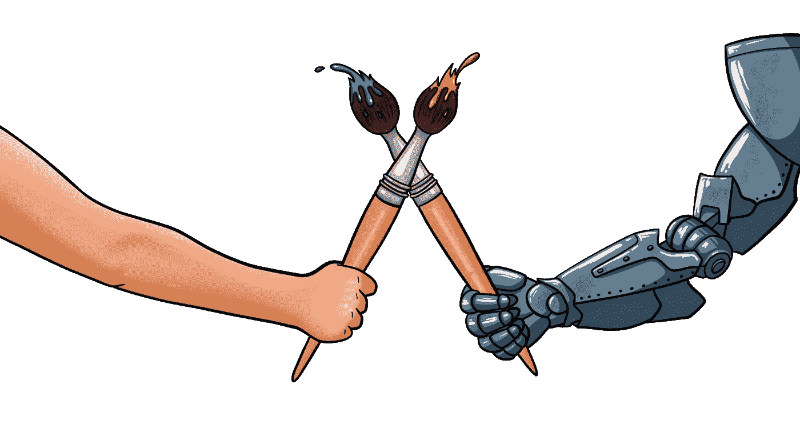
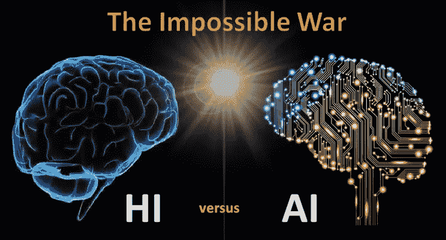
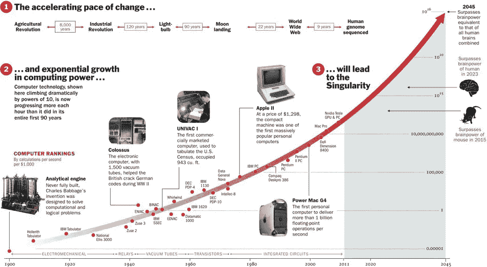
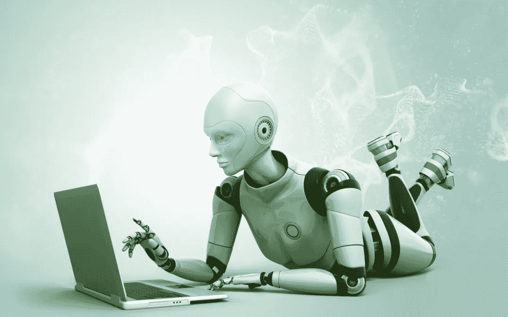

# 3.人工智能 vs 人类进化

> 原文：<https://medium.datadriveninvestor.com/3-ai-vs-human-evolution-a778c49896ac?source=collection_archive---------10----------------------->

读: [1。AI 是什么？](https://medium.com/datadriveninvestor/1-what-is-ai-6f8aff4e15d)

[2。AI 是如何创造价值的？](https://medium.com/datadriveninvestor/2-how-does-ai-create-value-a0f352167c83)

包括人类在内的动物超集具有解决问题的天性，我们将其归因于智力。这包括从自然传感器获取输入，使用我们的大脑计算潜在输出的概率并采取行动。随着时间的推移，我们大脑的计算能力自然进化，帮助我们识别面孔和理解语言。尽管含糊不清，但目前我们比计算机更有效。

我们理所当然地认为，作为人类物种和生命体，我们已经进化到了现在的样子。经过数百万年的反复试验。将人类几十万年的进化与不到一个世纪的人工智能进行比较是不公平的。然而，两种情况下的增长率也不一样。

对我们来说容易的对人工智能来说很难，对人工智能来说容易的对我们来说很难。我们很容易快速区分猫的图片和狗的图片，而人工智能不具备像人类一样快速区分自然特征的编程技能。另一个例子涉及自然进化如何帮助我们适应数百万年，如行走、面部识别或做不同的任务。但是一个人工智能需要通过所有复杂的现象来平衡自己，但却没有效率地行走。相比之下，使用我们人类最近开发的工具，如微积分或搜索数据库，对人工智能来说要容易得多，只需对它进行编程，使其遵循特定的序列。想想看，当我们眨眼时，我们很少考虑如何走路或什么肌肉在运动，因为我们已经被自然地编程了几千年来自然地学习它。我们没有意识到我们执行的每项任务有多复杂，只是因为我们天生就能自然地执行基本任务，而将这些任务编程到计算机中则非常复杂。

人工智能是通过研究人类大脑如何思考，以及人类在试图解决问题时如何学习、决策和工作，然后使用这项研究的结果作为开发智能软件和系统的基础来实现的。所有这些都完全与计算能力有关，而计算能力又依赖于硬件和软件。

**从阿尼到 AGI** —硬件和软件

**硬件:**

基于摩尔定律的技术进化。摩尔定律是英特尔联合创始人戈登·摩尔的观察结果，即芯片上的晶体管数量每年翻一番，而成本却减半。这是什么意思？

这大致可以理解为，随着硬件尺寸和成本的降低，计算能力增加，计算时间减少。这意味着人工智能在处理能力方面正在慢慢赶上大脑。

快速对比人工智能对更高计算能力的需求如何试图缩小差距。
统计
大脑— 10 万亿次运算
1985 —万亿分之一
1995 —十亿分之一
2005—百万分之一
2015—千分之一
2025？
一步之遥。也许吧。

也许到 2050 年，整个人类物种的能量可以装进一个口袋。

**软件:**
更难的部分来了。如何让一台机器变得聪明或者如何灌输一般智能？

**1。逆向工程:**使用的主要技术是通过创建神经网络来对大脑进行逆向工程，神经网络由许多具有不同可能解决方案的神经路径组成，基于一些选定的协议，例如:对于每个正确的解决方案，特定神经路径的权重年龄增加，对于每个错误的解决方案，权重年龄减少。这有助于构建一个系统，该系统在运行中学习并为输出选择概率最高的路径组合。只是方式，我们的大脑似乎在大多数情况下工作。(关于神经网络的更多内容将在下一篇文章中讨论)

一个令人着迷的假设未来过程是全脑仿真(WBE)，维基百科将其定义为一种思维上传或大脑上传的形式(有时称为“思维复制”或“思维转移”)，扫描特定大脑基底的精神状态(包括长期记忆和“自我”)，并将其复制到计算机。然后，计算机可以运行大脑信息处理的模拟模型，使得它以与原始大脑基本相同的方式做出响应(即，出于所有相关目的与大脑无法区分)并体验具有意识思维。

**2。自然进化:**另一种技术是让计算机自然进化。执行一组不同的可能方法以到达下一步，并且存储最佳方法，而丢弃其他方法。没错，自然进化的方式。

**3。元学习/递归自我改进:**这是天生的，最令人兴奋、最具挑战性和可能性最大的技术。创建一个 ANI，其唯一的任务就是学习和提高自己。换句话说，ANI 的目标是成为 AGI。

**4。贝叶斯学习:**从一组假设开始，用概率量化你对每个假设的相信程度。你在没有任何证据的情况下有先验概率，如果证据与假设一致，你对假设的信念就会发展。希望有一两个假设能脱颖而出。

**5。符号学习:**机器的学习方式与魔术师、数学家和科学家基于一组给定的数据假设假设，然后用新数据进行测试的方式相同。这种机制已经帮助合成了一种治疗疟疾的药物。

**6。举一反三**——把以前的经验推断成新的经验。这是一个幼稚但非常强大的机制。

“人工智能可以获胜的自由度正在增加。因此，围棋的自由度比国际象棋多得多，但如果你玩像《英雄联盟》这样的即时战略竞技游戏，它的自由度比围棋多得多，所以它还不能赢。但是它将能够。然后是现实，它有终极的自由度。”

蒂姆·厄本

[4。超越人类理解的人工智能](https://medium.com/datadriveninvestor/4-ai-beyond-human-comprehension-1ec7125b71b)

[5。人工智能的未来——电子人？乔布斯？](https://medium.com/@arvindvairavan/5-future-of-ai-cyborgs-jobs-1b67eeb7400d)

*image credits:*[Steemit](https://steemit.com/teammalaysia/@veenang/artificial-intelligence-ai-vs-human-brains)[Reddit](https://www.reddit.com/r/singularity/comments/2xu2sx/moores_law_2015_mouse_brain_has_been_reached/)[Sociable](https://sociable.co/technology/5-facts-machine-learning-ai/)