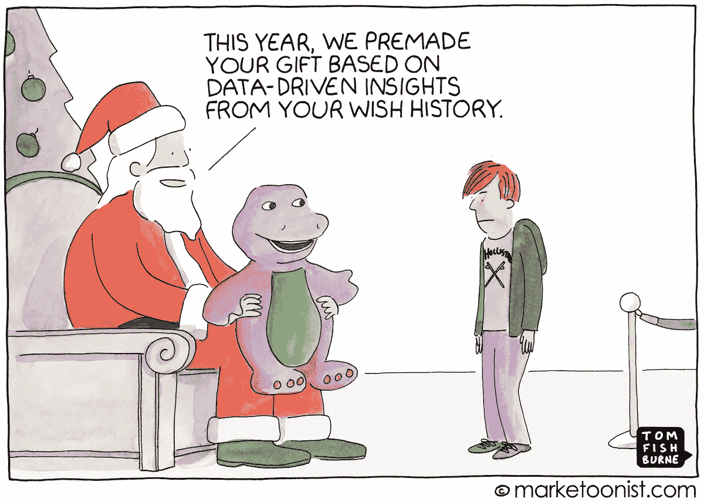

# 3 机器学习在电子商务中的应用

> 原文：<https://medium.datadriveninvestor.com/3-applications-of-machine-learning-in-e-commerce-da6497e4e288?source=collection_archive---------4----------------------->

Illustration by [Marketoonist](https://marketoonist.com/2016/12/predictive-analytics.html)

你有没有想过电子商务网站是如何猜测你能给自己买的最好的圣诞礼物是什么？你猜，这都是用机器学习完成的！

## 关于机器学习

先说什么是机器学习。机器学习是人工智能(AI)的一个子集，它使计算机能够自动学习并根据经验进行改进，而无需人类显式编程。机器学习用于各种领域:金融服务、医学、体育分析、商业分析等。此外，电子商务公司严重依赖他们的机器学习算法来改善客户的体验。机器学习算法通常需要大量的数据，输入系统的数据越多，系统的学习体验就越准确。这就是为什么电子商务企业可能会从机器学习中受益匪浅。

在这里，我提出了机器学习在电子商务中的意义，以及它如何帮助改善在线环境中的客户体验。

## #1.产品推荐

当购物者走进实体店时，一名销售人员走近他们，开始询问他们对什么产品感兴趣，并为购买者提供最佳选择。但是在电商购物的情况下就没有这种奢侈了。在这里，机器学习就派上了用场。统计数据显示，约 31% 的电子商务商店收入来自个性化产品推荐。

 [## DDI 编辑推荐:5 本让你从新手变成专家的机器学习书籍|数据驱动…

### 机器学习行业的蓬勃发展重新引起了人们对人工智能的兴趣

www.datadriveninvestor.com](https://www.datadriveninvestor.com/2019/03/03/editors-pick-5-machine-learning-books/) 

推荐引擎根据一些规则对在线商店中的产品进行过滤和分类，例如特定产品的销售、产品的浏览和评论数量。另一方面，机器学习算法由用户特定的数据驱动，如购买历史、愿望列表中的商品和最常查看的类别。这使得推荐引擎能够推荐最好的产品，设计个性化的广告和自动化的电子邮件营销活动。

## #2.价格优化

Illustration by [Marketoonist](http://pptstudios.nl/brand-loyalty-powerpoint-template/elegant-brand-loyalty-cartoon-marketoonist/)

除了产品推荐，机器学习还提供了动态定价的机会。对于网购者来说，比较不同电子商务网站的价格并找到最佳交易是很常见的。这就是电子商务商店选择动态定价选项的原因。机器学习模型会考虑一些因素，如竞争对手的价格、一周中的某一天、一天中的某个时间、产品需求、客户偏好和其他特征，从而相应地调整价格。

## #3.优化的搜索结果

每个买家的旅程都是从在电子商务网站上搜索开始的。有时，糟糕的搜索结果可能会让购物者望而却步，从而导致低转化率。换句话说，优质的搜索结果可能会增加销售额。机器学习算法通过确保客户找到他们想要的东西来接管这里。

智能机器学习算法会搜索你在搜索栏中提供的同义词，以及其他购物者搜索到的带有所需商品的页面的短语。最重要的是，搜索引擎定义规则，如点击率和高客户评级，以优先搜索结果。

## 摘要

博文中讨论的含义只是机器学习可以为电子商务做些什么的一小部分。还有其他选项，如客户细分、情感分析、流失预测、产品分类、库存预测等。您可以通过下面的链接进一步熟悉该主题:

*   [*电子商务将受益于机器学习还是面临新的威胁？*](https://neilpatel.com/blog/will-e-commerce-benefit-from-machine-learning/)
*   [*人工智能革新网购/电子商务趋势的 12 种方式*](https://towardsdatascience.com/top-12-ways-ai-is-revolutionizing-the-online-shopping-ecommerce-trends-9c3e98ef519c)