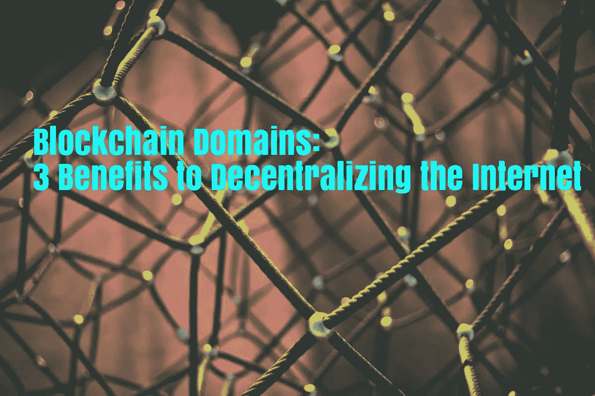
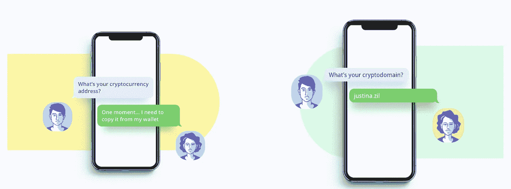

# 互联网去中心化的 3 个好处

> 原文：<https://medium.datadriveninvestor.com/3-benefits-to-decentralizing-the-internet-ca4887ce6853?source=collection_archive---------2----------------------->

17.2 亿人。这是每天估计有多少人受到互联网审查的影响。不幸的是，情况越来越糟。据亲民主智库[自由之家](https://freedomhouse.org/)称，全球互联网自由正在急剧下降，六年来一直呈下降趋势。对一些人来说，受限制的网络言论是一种不便，对另一些人来说，则是死刑判决。

提示区块链域名——一种新颖的、抵制审查的、不可改变的、新兴的资产类别，在政府过度干预和限制的时代，授权网站和互联网的持久性。

 [## 创新警报:区块链 3.0、Terra 协议、ICO 门户和更多数据驱动的投资者

### 尽管过去几个月加密货币的价格波动很小，但这项技术并没有停止发展…

www.datadriveninvestor.com](https://www.datadriveninvestor.com/2019/03/16/innovation-alert-blockchain-3-0-terra-protocol-an-ico-portal-more/) 

而且，这还不是全部。抵制审查并不是区块链上的域名为高度审查和难以浏览的在线景观带来价值的唯一方式，他们还在解决链上加密货币支付、过高的域名注册成本和未经许可的域名扩展创建。

简而言之，区块链上的域名是我们目前对困扰 2019 年狭隘定制、高度审查、集中的互联网和域名生态系统的几个系统性故障的答案。

在这篇文章中，我们将带您了解什么是区块链域名，它们提供的三个核心好处，以及[一个区块链项目领导互联网和网站安全和审查阻力的收费](https://unstoppabledomains.com/)。

# 什么是区块链域？3 个基本好处

认为区块链领域是你的典型。com '和'。“net”域名扩展通过智能合同在区块链获得安全保护。区块链上的域名使域名所有者和注册人能够收回之前放弃的所有权和在线监管权，因为他们不受政府干预、 [ICANN](https://www.icann.org/) 延期限制和审查。

最值得注意的是，区块链的域名利用分散域名系统服务，用户现在不仅仅是租用域名，而是完全拥有和控制自己的域名。

让我们来看看区块链域名给潜在域名持有者和用户带来的三个核心好处。

# 审查阻力和网站持久性

正如我们上面提到的，政府审查正处于历史最高水平——刚刚超过 25%的人在使用互联网时反对至少一种形式的在线审查，无数民族国家甚至拥有在其国家运营的 ISP。

以同样的方式，加密 HODL 的安全和存储他们的加密货币，区块链域也通过加密钱包存储。请记住，区块链域只是智能合约平台上的资产，这意味着获得访问或控制域的唯一方式是通过私钥。另一方面，传统域名在高度集中的注册服务商(如 GoDaddy、Bluehost、Namecheap 和 HostGator)的遗赠和控制下运营，可以很容易地被查封、删除或阻止。

此外，分散式域名服务认可高度的用户/所有者隐私，因为它们不需要提供高度个人化和可识别的信息，这些信息随后可被政府用来追踪个人和实体，以使其保持沉默。

独裁政权和其他希望控制内容和信息传播的政府现在无法做到这一点，因为数据是通过点对点网络存储的，而且没有中央故障点。

# 未经许可创建新域扩展

[是“互联网名称与数字地址分配机构”的简称，ICANN 是一个非营利性组织](https://www.icann.org/)，有效控制着互联网的全球 DNS 系统和名称空间/数字数据库。作为负责全球 DNS 系统的首选国际监管组织，ICANN 负责新域名扩展审批，这是一个缓慢而昂贵的过程。

因此，寻求推出新扩展的个人和实体经常被搁置一旁，为不确定的在线未来花费过多的资源。

当涉及到域名扩展批准时，区块链域名的发行是没有许可的，也没有限制，因为区块链上的域名不受 ICANN 缓慢而昂贵的批准程序的约束。

区块链上的域名不仅允许快速部署新域名，使个人和企业能够立即开始保护他们的在线存在/内容，而且他们也不会仅仅为了保护一个域名而将你赶出家门，因为注册无需支付过多的第三方费用。

如果你能梦想它，你可以把它创造成区块链上的一个名字。

# 加密支付变得简单

有多少次，当发送或接收加密货币时，朋友或家人会问你:“你的[在此插入加密货币]地址是什么？”然后，你疯狂地在过去的交易和区块链探索者中搜寻，找到你的十六进制加密货币地址，看起来像这样；04d 2z 261 f 455866 ce 93 fdad 1309 ag 4 AC 7 c 21 l 38 e。

*好记？*不完全是。由于交易时地址配置不正确，数量不可估量的加密货币已经丢失并被永久烧毁。看看这位 [BTC 用户将 2600 多个比特币](https://bitcointalk.org/index.php?topic=50206.0)发送到一个格式不正确的 BTC 地址，导致他们无法挽回的损失。

在 crypto 中进行交易时，验证一个人的十六进制地址可能是一项令人畏惧和困惑的任务——尤其是对区块链新手而言。此外，[加密恶意软件已经被证明在操纵和改变目的地钱包和地址方面](https://www.investopedia.com/news/new-bitcoin-malware-changes-destination-wallets/)非常有效，导致[不知情的用户被吸走巨额资金](https://ethereumworldnews.com/careful-copying-pasting-ethereum-wallet-address/)。

由于区块链上的域名易于记忆和使用，发送加密支付就像输入网址一样简单。例如，如果有人想给我发送[在此插入加密货币]，他们需要做的就是把它发送到我的区块链域名——“blockchainseo . zil”。验证收件人的信息和地址是非常简单的区块链域。

与密码交易相关的一度很大的误差，现在已经通过易于人类阅读的地址被最小化了。

# 不可阻挡的域:用可读的名称替换加密地址

[unstopped Domains 是一个平台，也是通往区块链域分散世界的网关](https://unstoppabledomains.com/)，它解决了总域名资产类别行业约 200 亿至 800 亿美元的问题，用人类可读的名称取代了传统的十六进制加密货币地址，并以不变的形式保护了信息的自由流动。

通过不可阻挡的域名平台，用户可以购买，转让和管理区块链域名。如果一个人试图覆盖他们在网络所有权领域的所有基础，不可阻挡的域名[使用户能够通过他们的平台注册一个名字](https://unstoppabledomains.com/trademark)来获得。zil，。加密，以及所有未来的区块链域名。

此外，[unstopped Domains 提供了一套全面的工具](https://unstoppabledomains.com/transfer),使管理您的区块链域名变得轻而易举，代表您执行交易，因此您不再需要花费汽油来更新它们。

你可以通过[前往他们的网站](https://testnet.unstoppabledomains.com/)建立一个 testnet 钱包、testnet ZIL 和区块链域名来测试无法阻挡的域名。

# 关于区块链领域和不可阻挡的领域的最终想法

区块链领域出现在技术进步处于历史巅峰的时候，但同时也是我们的民主渠道正在迅速侵蚀的时候。区块链域名不仅为自由传播信息和抵制审查提供了一个避难所，也为当今的秘密领域提供了一种新的交易方式。

*对可用的区块链域名感兴趣？前往 UnstoppableDomains.com 查看他们的产品目录。Zil 域名。此外，确保[关注他们的 Twitter，了解最新的更新](http://twitter.com/unstoppableweb)和公告。*

确保[关注我们的区块链博客](https://blockchainseo.net/blog/)以获取所有最新的加密更新、新闻和信息性文章。请让我们知道您希望我们在 2019 年报道的任何话题。我们希望收到您的来信！

-地下墓室

*原载于 2019 年 4 月 6 日*[*blockchainseo.net*](https://blockchainseo.net/blockchain-domains-benefits-decentralizing-internet/)*。*