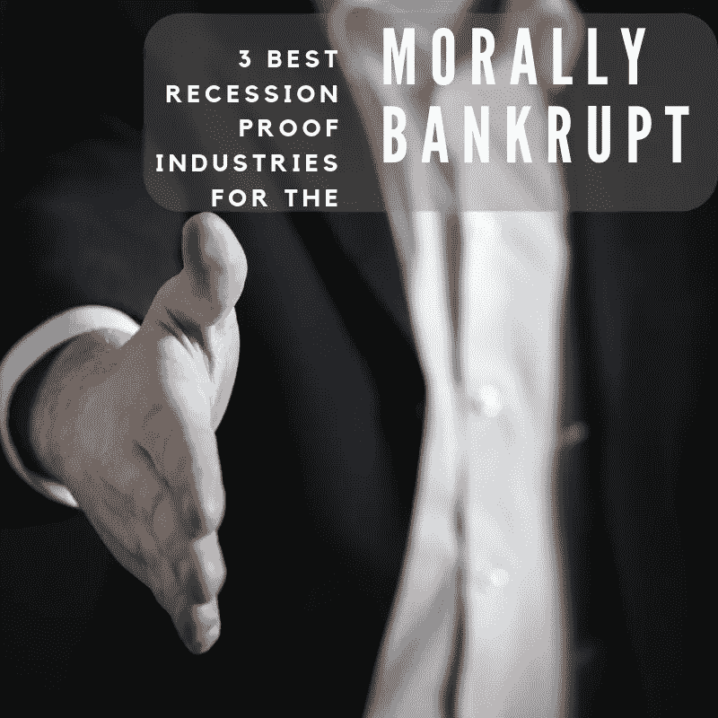

# 道德沦丧者的 3 个最佳抗衰退行业

> 原文：<https://medium.datadriveninvestor.com/3-best-recession-proof-industries-for-the-morally-bankrupt-688fabbe8331?source=collection_archive---------14----------------------->

# 这不是你的典型列表

经济开始显示出接近衰退的迹象。收益率曲线再次反转。美国和中国之间的 T2 贸易战仍在继续。欧洲一片混乱。有很多潜在的催化剂可以让摇摇欲坠的市场彻底震动。许多人意识到了这一点，并对下一次衰退越来越担忧。然而，一些人看到了以经济困难者为代价赚钱的机会。事实上，我毫不怀疑有商人急切地等待着即将到来的崩溃。你想知道哪些人对利润前景垂涎三尺吗？下面我将为道德沦丧的人分享 3 个最好的抗衰退行业。

# 1.政府说客

在上一次衰退期间，政府游说在一年内(2007—2008 年)增长了 32 亿美元。随着华盛顿准备动用救市资金来支撑经济，游说者来到首都为他们的客户辩护。恰好他们的努力是有效的。最大的游说银行接受了最大的救助。此外，登陆华尔街的前政府官员本身也是救助计划的巨大受益者。罗伯特·鲁宾，克林顿政府的前财政部长，在 2007 年成为花旗集团的主席。

 [## 医疗保健的未来正在被一场大型技术入侵所塑造|数据驱动型投资者

### 过去十年，全球经济的所有部门都经历了大规模的数字颠覆，而卫生部门现在…

www.datadriveninvestor.com](https://www.datadriveninvestor.com/2018/11/02/the-future-of-healthcare-is-being-shaped-by-a-big-tech-invasion/) 

作为一名政府官员，鲁宾在解除银行监管方面发挥了重要作用。放松管制被认为是市场最终崩溃的原因。这无关紧要，因为鲁宾的花旗集团接受了大约 450 亿美元的纳税人资助的救助资金。在花旗集团任职期间，鲁宾赚了 1.2 亿美元。对于搞垮经济来说，这是一个不错的改变。

游说者还被雇来帮助恢复银行的形象。在危机后成为贪婪的典型代表后，高盛向游说者支付了丰厚的报酬，让他们执行损害控制。到 2010 年，高盛的游说支出比 2005 年增加了 4 倍。不过，这些成本帮助高盛避免了进一步的政府调查和监管监督。当这个国家继续蹒跚前行的时候，政府游说者却迎来了辉煌的一年。第二年开始的占领华尔街运动被证明是游说公司的又一笔横财。这就是为什么对于道德沦丧的人来说，政府游说是抵御衰退的最佳行业之一。

# 2.快餐

快餐行业在衰退期间表现良好。麦当劳的股票在 2008 年实际上增值了。凭借其庞大的规模，麦当劳有能力在熊市和牛市中保持低价。这就是为什么那些在经济衰退期间渴望牛肉的人倾向于用巨无霸来充饥，而不是菲力牛排。不幸的是，那些勒紧钱包的人也可能感觉到他们的腰带在收紧，因为健康食品在你当地的快餐店是买不到的。

快餐店的激增导致了肥胖症的流行。聪明的营销创造了全球高碳水化合物和高热量消费的儿童。那些渴望吃鸡块的孩子长大后会倾向于吃高碳水化合物和高热量的食物。

他们会给他们的孩子喂同样的快餐，然后看着这个循环重复。我们不要忘记，那些在快餐店柜台后面工作的人只能勉强维持生活。无论经济景气与否，快餐是他们为数不多的选择之一。然而，吃了一段时间快餐后，他们开始做鬼脸。

我还必须提到，快餐业游说团体全国餐馆协会已经花费了数百万美元游说反对提高最低工资。直到今年，麦当劳才表示，他们将停止支出，以反对最低愤怒水平的提高。所以，我们要感谢快餐业，因为肥胖和最低工资的降低导致了医疗保健成本的上升。但是金融危机对这个行业是有好处的，这就是为什么对于道德沦丧的人来说，快餐业是最好的抗衰退行业之一。

# 3.烟草

2008 年，三家最大的卷烟制造商表现极佳。菲利普·莫里斯公司、英美烟草公司和日本烟草公司都保持着可观的利润。事实上，随着全球各地的人们变得囊中羞涩，卷烟销量也在增加。有人可能会说，尼古丁的成瘾性及其镇静作用有助于让那些担心金钱的人更加放松。这种满足感只是暂时的，因为健康问题往往会困扰长期吸烟者。

当然，烟草业的名声并不好。它不断地被征税，并且是持续的负面广告宣传的主题。也就是说，它将这些成本以更高价格的形式转移到上瘾的消费者身上。然而，人们对价格上涨的抱怨充耳不闻，因为很少有人同情吸烟者。

你可能已经猜到我接下来要写什么了。是的，烟草业每年花费数百万美元游说政府。这些金钱上的贡献是烟草仍然合法的唯一原因，尽管事实证明它是导致癌症的主要原因。政府可能会讨论我们如何降低医疗保健费用，但烟草业已经设法保持不可触及。

事实上，随着朱尔等 vape 笔的出现，该行业经历了某种复兴。青少年市场更有可能尝试 vape 笔，因为他们已经接触到了水果口味，而且营销表明这种效果比香烟危害更小。这些青少年对尼古丁上瘾，久而久之成为回头客。对大型烟草公司来说，这项业务仍然很好。有了新产品和新市场，烟草业被证明是道德沦丧者最好的抗衰退产业之一。

# 金钱让世界运转(直到它结束)

政府游说者在运作时没有考虑被统治者的利益。相反，他们以纳税人为代价来促进自身利益。快餐业一直困扰着美国，其医疗体系在肥胖人口的重压下不堪重负。行业内的运营商只是希望我们的钱包瘪瘪的，这样他们就能看到自己的股价上涨。最后，烟草业已经设法找到一种方法来减轻吸烟带来的耻辱，并使下一代沉迷于其最新产品。这个行业很有弹性，它当然不害怕下一次衰退。

从这些行业的规模来看，它们不会很快消失。他们都有经历起伏的持久力。钱让他们活着，但这些行业摧毁了我们的社会。政府游说、快餐和烟草业将继续从我们身上榨取利润。我只是希望我们能够在没有被榨干的情况下走出下一次衰退。

最初发布于[https://bunkerbasics.com/best-recession-proof-industries/](https://bunkerbasics.com/best-recession-proof-industries/)