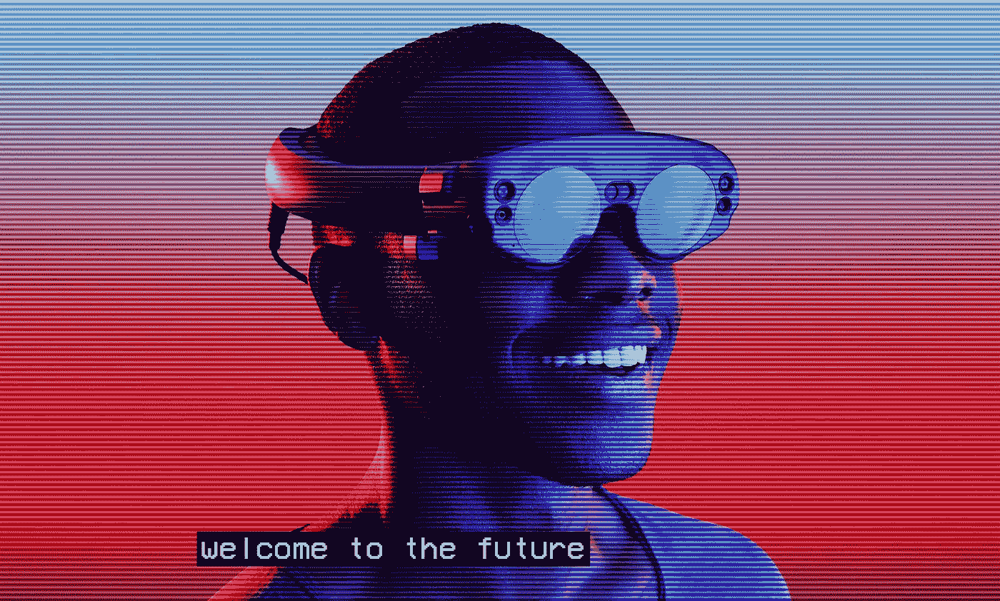
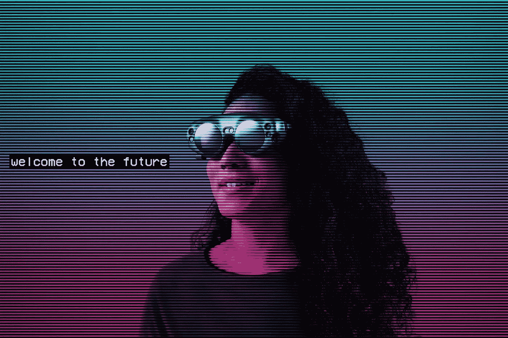
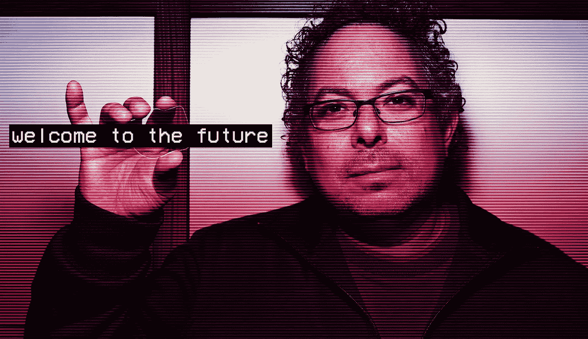

# 3 个常见的增强现实错误

> 原文：<https://medium.datadriveninvestor.com/3-common-augmented-reality-mistakes-6ff5c08fa3cf?source=collection_archive---------12----------------------->

以下是我看到的第一次接触增强现实时人们会犯的三个常见错误。正如你将看到的，一旦你知道要寻找什么，就很容易避开它们。

# 尝试做 2D 的应用，但是是 3D 的

在这第一轮内容中，我看到的最常见的错误是试图将 2D 应用程序的想法强加到 3D 范式中。通常，这涉及到将一些标准的平板智能手机应用程序想象成你在 AR 中贴在墙上或桌子上的东西——本质上只是从 PC 或电话中提起和转移。常见的例子包括冰箱上的动画日历应用程序或一墙的推文。挑战在于要在这些标准设计之外冒险，探索一下这个概念。不要简单地在数字领域重建实体物品，而是尝试开发一种体验，创造一种全新的方式来完成任务。你现在有空间，所以好好利用它！将某人日程安排或待办事项列表的无聊议程视图变成一个虚拟的糖果乐园，用不同的老板类型来代表不同的会议类型。同样的技术也适用于你在智能手机上发现的所有开箱即用的东西。电话？创建一个未来的视频聊天墙。短信？向代表对方的头像扔表情符号。应该为你通常使用手机完成的每一项普通任务创建新的交互。

# 混合控制/参与模型

另一个常见的陷阱是迷失在 AR 的各种参与模型中。这是自最初的智能手机开始推出以来，消费技术的最大进步。人们已经迷失在现有的交互模式中。你使用控制器的光线投射吗？凝视呢？控制器上的触摸板怎么样？应该用手势吗？有很多新的选择可以考虑。业余爱好者会尝试在一次体验中同时使用所有这些模式，而不是选择一两种对一次体验或目标最有意义的模式。当有人专注于面对和注视容易成为目标的大型虚拟物体时，凝视是非常有用的。当您想要快速发送输入时，可以有效地利用手势，例如切换播放列表中的歌曲或视频。老式的光线投射是许多交互的可靠方法，但要避免强迫人们尖锐地瞄准目标，如键盘、复选框或小按钮。

# 不拥抱媒体

我个人对 AR 的总结是“感官的盛宴。”HoloLens 和 Magic Leap One 等现代平台提供了广泛的输入和反馈机制，使增强世界更加真实，将人们吸引到你试图沟通的虚拟世界的框架中，并将他们的情感与内容和环境联系在一起。输入机制的范围可以从控制器到凝视、眼睛跟踪以及手势、语音命令，甚至图像识别。除了像灯光和音乐这样的环境线索之外，声音效果、视觉效果或触觉等反馈机制有助于将用户融入到您的体验中。粒子效果和着色器可用于为成功的动作提供一些视觉效果，或减少繁忙地区的认知负荷。寻找灵感的好地方是视频游戏关卡设计和游戏内教程。观察每一种体验是如何被用来为那些不熟悉正在探索的世界的人提供关注和指导的。

如果你已经走了这么远，你就不再有犯这些错误的借口了。现在前进，建造令人惊奇的东西，避免这些陷阱，创造一些奇迹！

