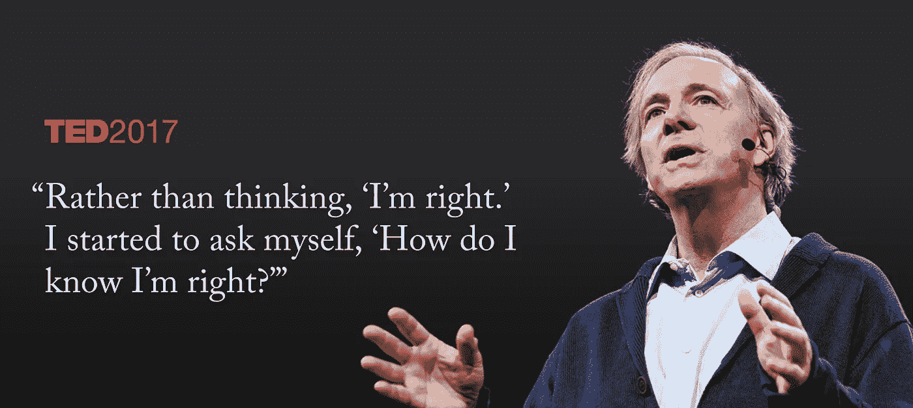

# 你预测未来做得很糟糕的三个重要原因

> 原文：<https://medium.datadriveninvestor.com/3-crucial-reasons-why-you-do-a-terrible-job-predicting-the-future-75eddc5f108?source=collection_archive---------13----------------------->

你曾经对天气感到惊讶吗？

我们都有过结果不尽如人意的时候。然而，我们不禁要问，我们是否可以做更好的准备。

我们可以通过做一些改变来更准确地预测，这种想法合理吗？

 [## 决策的移情设计方法如何工作——数据驱动的投资者

### 移情设计是一种产品设计方法，首先由多萝西·伦纳德和杰弗里·雷波特在哈佛大学提出

www.datadriveninvestor.com](https://www.datadriveninvestor.com/2018/07/18/how-the-empathic-design-method-of-decision-making-works/) 

那些看似擅长预测结果的人知道哪些你不知道的事情？

这篇文章将探讨三个关键因素，你需要正面面对，看看有什么改进。

你会同意，能够更好地预测未来是生活和工作中的一项宝贵技能。我们开始吧。

# 两个赌注的故事

[fotografierende](https://www.pexels.com/@fotografierende) **on Pexels**

大约是四年前。

当我看到一篇推荐科技股的文章时，我还在学习股票市场。这只股票激起了我的兴趣。我的科技背景让我对这家公司有所了解，所以我做了进一步的研究。

在以一个价值投资者的眼光通读了公司的财务报表后，我以每股 30 美元的价格购买了这只股票。

三年后，该股交易价格接近每股 250 美元。谈论有利的结果。

就在这个时候，我正在为我的梦幻橄榄球选秀做准备。

进入赛季，一个特定的四分卫引起了我的注意。我在季前赛中看到了足够多的东西来锁定这个球员，尽管他从未开始过一个完整的赛季。

正如我所希望的那样，我在选秀的最后阶段选了他。

他继续传球，50 次触地得分，超过 5000 码。这让他获得了国家足球联盟最有价值球员奖，也让我获得了联盟冠军。

另一个有利的结果。

然而，尽管结果相似，但如果认为第二次押注与第一次类似，那就错了。

你能发现一些线索吗？

# 走自己的路

到底是什么阻碍了做出正确的预测？

有三个突出的因素

*   无法区分运气和技巧
*   学习过程中的重大差距
*   对风险和不确定性的理解有限

这三个因素是一种精神障碍，导致决策过程中的盲点。

让我们一次看一个。

# 运气 vs 技巧

第一个因素凸显了我们经常区分运气和技能的困难。

如果你回想一下我之前分享的两个赌注，你可能会对运气在其中的作用有强烈的看法。

从外表看，你更容易显得客观。这是许多人经常崩溃的地方。

[mentatdg](https://www.pexels.com/@mentatdgt-330508)t on Pexels.com — **When It All Goes Well**

当结果有利时，我们倾向于相信自己的技能。我们假设一些内在的属性在我们对赌注的信心中扮演了一个角色。

相反，当结果不尽如人意时。我们把它归咎于运气不好或一些外在因素。

[Gratisography](https://www.pexels.com/@gratisography) on Pexels.com — **When It Doesn’t Go Well**

这种把我们的成功归功于技能，把失败归功于坏运气的模糊观点极大地阻碍了我们更好地预测未来。

在我的梦幻足球联赛中，看到结果对我是多么有利，我很可能会对再次下类似的赌注充满信心。

这将是一个巨大的错误。

一个更好的姿态是回顾过去，评估运气在多大程度上影响了结果。**一些自省会帮助你认识到你的一些成功中有多少运气，你的一些失败中有多少无能。**

这让你收集知识，帮助你形成或调整你的心理模型，为未来做出预测。

从中得出的一个有趣的观点是，我们倾向于将这一点反过来应用于他人。

这有一个名字:**基本归因错误**。

> 人们倾向于过分强调对他人行为的倾向性或基于个性的解释，而不强调情境的解释。—简单的心理学

人们很容易认为别人的成功是因为运气，而他们的失败是因为无能。你可能需要重新评估这个脚本，以便在你的生活中选择正确的榜样。

你所敬仰和追随的人仅仅是运气好还是真的技术好？

简单地说，承认运气在你个人结果中的作用是更好预测的第一步。然而，你如何评估运气在多大程度上是一个因素呢？

# **学习经历中经常缺失的元素**

> “经验不是发生在一个人身上的事情，而是一个人如何对待发生在他身上的事情。”——阿尔多斯·赫胥黎

没有比实际结果更好的预测反馈了。然而，事实证明我们经常浪费这种反馈机制。

这是因为当你在听或做的时候，学习不会发生。它发生在反思的时候。

**Reflection is Key to Learning**

雷伊·达里奥会同意这一点。据他说:

学习=痛苦+ **反思**

变得更擅长预测所需的学习发生在反思中。你需要为每一个结果做些什么。

这对于决定运气在你的结果中起了多大作用以及你如何调整你的未来预测来说是一件大事。

这里的要点是留出时间来思考你的预测结果，以及有利于特定结果的过程。

但是，如果你不能完全控制运气因素，你会怎么做呢？还是可以？

# 误解风险和不确定性

> “你应该学习冒险，而不是风险管理”——纳西姆·塔勒布

即使你开始更好地反思你的学习，并在你的结果中看到一丝运气，你处理风险和不确定性的能力最终会限制你的上限。

这个话题有太多的切法了。

从理解处理过度自信的心理学方面，到管理过度反应，到处理损失厌恶。关于这个话题，可以写一整本书，而且已经写了很多。

出于我们的目的，我们将只关注一个你可以立即开始应用的核心思想。

如果你想在预测方面做得更好，你必须承认有很多事情是你无法控制的。面对这个问题的方法是从概率的角度思考。

这是什么意思？

imgur.com

首先，你需要看到你的预测或观点不是非黑即白的，而是灰色的。

你需要把你的信心水平看成是概率性的:小于 100%但大于 0%。

所以，你可能会说我对这只股票上涨的信心水平是 70%左右。

这种思维框架为你做了两件关键的事情:

*   它帮助你认识到你对未来的描绘并不是 20/20
*   它迫使你对新信息持开放态度，并愿意调整你的观点和信心水平

然后你开始问问题，寻找信息来验证或否定你的思维框架。

想要更好的预测未来，就离不开这种思维方式。对于倾向于数据的观点，你甚至可能开始看到这一概念中的*贝叶斯思维*的思路。

关于这第三点，有很多内容需要充实。

# 摘要

我们在这篇文章中已经涉及了一些内容，但只是众所周知的冰山一角。

我们都有一个核心愿望，那就是对我们决策的结果更有信心。在许多方面，我们不擅长持续预测有利的结果。

通过采取这三个步骤，你可以提高自己的正确率

*   学会理解运气在结果中的作用，并将其与技能区分开来
*   永远不要浪费一个结果。这是一个反馈循环，在此基础上进行反思并带着收获离开
*   开始用概率性思维来应对风险和不确定性

关于这个话题还有很多要讨论的，所以期待更多关于这个话题的帖子。

**喜欢这篇文章吗？单击下面❤，在您的订阅源中查看更多内容，并确保其他人也能看到它！**

感谢你的阅读，祝你未来预测一切顺利。还有，在 LinkedIn 上关注我【https://www.linkedin.com/in/shofola/ 

最美好的祝愿！