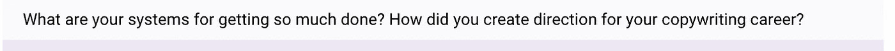

# 3 个日常习惯让我的生意在两年内增长了 236%

> 原文：<https://medium.datadriveninvestor.com/3-daily-habits-that-grew-my-business-236-in-2-years-6d7b6e30a9e0?source=collection_archive---------6----------------------->

你不会明白习惯的重要性，直到你意识到你拥有的习惯糟透了。

在你生活的所有领域都是如此。

最近，我强迫自己通过这个镜头来审视我在生活和工作中所做的一切。

在我生活的某些方面，我有着令人难以置信的习惯。

在其他方面，我很糟糕。

以我的饮食为例。我有一个可怕的习惯，就是在周末让车轮从马车上掉下来。所以我的体重不会移动。因为即使我一周都吃得很健康……那 1-2 天无规律的营养完全阻碍了我的进步。

这都是我的错，我承认。我意识到问题是我有一个需要改正的坏习惯。

纠正你的习惯，获得更好的结果。

# 大多数人都有糟糕的商业习惯

我是一名文案、顾问、演讲者，不久将成为作家。

我是做结果生意的。

我和我客户的生意合作，让它下雨。

我拿工资就是干这个的。

成为那个人。

但是当我开始的时候，我分心了。很多。

有一百万种不同的策略、技术和方法，我可以用来获得更多的客户和发展我的业务。

然而在那天结束时，我意识到如果我能做三件事，我就不会挨饿。

唯一的问题是，他们三个我都搞砸了。那是因为我没有每天花时间去提高这三个关键领域。

我没有任何习惯能让我更接近我一直想要的那种生意。

# 你需要关注的三件事

一旦我开始实施这些习惯，一切都变得容易了。

我可以更专注。

我能做的更少。

我的收入开始增长。

**那是因为过了一段时间，我开始只关注这三件事:**

1.  吸引客户
2.  达成交易
3.  交付成果

我开始审核我每天做的每一项活动。

如果他们没有完成这三个目标中的一个，这个任务就会从我的待办事项列表中删除。

# 消除、自动化、委派…然后只做剩下的事情

几个月前，我对我的清单进行了一次调查。我问人们有什么问题要问我。

这是一个有趣的回答:

我做了很多事情。

*   今年我成为了一名演讲者。
*   我正在出版一本书。
*   我有多个固定客户。
*   我还有很多其他的客户。
*   我有一系列产品，目前正在推出新的旗舰产品。
*   我每周都发布内容。
*   我经常在播客上接受采访。
*   我去参加活动。
*   我向客户咨询。
*   我每天早上一边喝咖啡，一边看一两集《办公室》,暖暖脑子。

我能够做到所有这些(甚至更多),是因为我已经在每天和每周的例行工作中养成了习惯。

以下是我的大“生产力黑客”:

**如果我正在做的事情不能为我带来客户、达成交易或为我的同事带来成果，我就不会去做。**

属于这三个类别的东西会被尽可能地自动化和利用。

如果我不能自动完成这些事情，我会委派。

如果我不能授权，我就自己去做。

所以，当你完成了减少待办事项清单上的任务时，就没剩下多少了。

# 习惯只是给你想要的结果的系统

自 2016 年以来，我在日常生活中建立了以下三个习惯。这从根本上改变了我的生意。

## 习惯 1:每天写作

信不信由你……作家是写作的人。

如果我想成为世界上最好的，那么我需要每天都进行这项活动。

成为一个不可思议的作家不是一周五天的工作。

一周七天。直到你死的那一天。

文案是拿工资写作的人。

所以，如果你没有得到报酬…你没有写作，你就不是一个文案。

甚至在我拿到写作的报酬之前，我就开始每天至少写几个句子的原文。

是的。

你没看错。

我每天都写一些原创的新东西。

你也应该这样。

如果写作是你给客户的“东西”……你怎么能在晚上睡觉知道你那天没有做任何事情来变得更好？

还记得我之前说过你需要更好地向客户“交付结果”吗？

尤其是这个习惯，是满足这一点的。

即使在周末我“离开”的时候…我仍然会在我的 iPhone 的“笔记”部分潦草地写下几段文字。它散落着复制位，挂钩，大想法和大纲。

**你如何在生活中养成这个习惯？**

IDK。我猜你只是开始他妈的写作，从不停止。

我们不要把这个问题复杂化。

拿起一支笔开始。

期待你的屎开始会很烂。

因为会的。

但是你继续前进。

你会好起来的。

事情就是这样的。

## 习惯 2:拓展你的人际网络

生意就是关系。

与客户的关系。

与客户的关系。

与朋友和盟友的关系。

与其他能帮助你并提供建议的企业家的关系…反之亦然。

因此，我每天都在努力拓展自己的人际网络，与人交流。

我的业务很大一部分来自推荐，尽管我正在采取措施，在 2019 年实现客户获取方式的多样化。

**除非人们认识你并喜欢你，否则你不会得到推荐。**

把最后一句再读一遍。

所以第一步是认识人。第二步是让他们喜欢你。

我已经到了这种地步，几年来我没有一个星期没有得到推荐。而且这一趋势并没有放缓。

那是因为在我生命中的每一天，我都尽力去帮助别人。可能是我认识的人。也可能是我不认识的人。

我参加了许多团体、会员和论坛。

每天我至少花 10 分钟看人们问的问题，并帮助他们解决问题…通过实际解决他们的问题。

这种复合随着时间的推移，像复利。

最终，你开始一遍又一遍地给出同样的答案……你意识到这个答案可以变成一篇文章。

现在你不必再回答这个问题了，因为你把它印成了不朽。

它将作为帮助人们的内容永远存在于互联网上。

通过证明你是能够帮助解决他们问题的人，它将永远吸引新的人进入你的世界。

如果你只做这一件事…你就可以建立一个不可思议的企业。这一直是我获取客户的主要方法，而且非常有效。

**如何将这个习惯融入你的生活:**

开始寻找需要帮助的人，并帮助他们。

有人问一个你知道答案的问题？给他们一个解决他们问题的答案。

这样做的次数足够多，人们就会把你当成专家。

一旦有足够多的人把你当成专家，你就开始拥有这个头衔，你的关系网就扩大了……你再也不用担心获得客户了。

## 习惯 3:改善你的转化过程

我每周都要接潜在客户的电话。

我提前几个月就预约满了，这没关系。

我接电话。

我练习。

我通过电话练习结束。

我已经为我的营销代理做了成百上千的呼入电话。

我继续打电话，完善我的流程。此时我可以闭着眼睛打电话。这并不是因为我是什么特别的人。这是因为在经历了前几百次通过电话与客户达成交易的糟糕经历后，我最终把弄清楚整个过程作为我的使命。

我学会了如何问正确的问题。

我知道人们会提出什么样的反对意见。

我很清楚我应该和什么样的人打电话……以及我不应该浪费时间和谁在一起。

例如:我知道我可以和有大量邮件列表的客户一起完成令人难以置信的工作。

但是，如果一个客户刚刚起步，没有清单和未经测试的报价…我可能根本帮不了他们什么。如果我不能帮助这个人，为什么还要花时间进行销售对话呢？

你需要非常清楚你能帮助谁，你能为他们得到什么结果，你如何能得到那个结果…以及他们的痛点是什么。

一旦你知道了这些，将潜在客户转化为顾客就很容易了。

即使你没有每天和潜在客户通电话，你仍然可以研究他们。你可以研究一下。你可以想出新的方法来公开展示你的价值，这样人们就可以和你通电话并被预售。

**如何将这个习惯融入你的生活:**

做一些事情——任何事情——让你更好地销售你的服务。无论是练习您的销售脚本…还是创建预售您的潜在客户的内容…或者只是与需要您产品的客户交谈和交流。

至少做一件事来更好地推销你的东西。

# 你不应该期望一夜之间看到结果

我花了两年时间实现了我的增长。

但我相信，随着时间的推移，增长将继续加快。

所有这些策略都依赖于混合你的日常习惯来创造对你有用的关系和资产。

你可能是一个文案，或顾问，或作家或演讲者。

或者你可能有一个销售实物的生意。

这其实并不重要。

最后，你的主要精力需要放在吸引、成交和交付上。你从这三件事中赚到的钱可以用来雇人做你生意中需要做的任何事情。

开始每天做这三件事，你会对发生的事情感到惊讶。

# 如果你喜欢这篇文章，请按住“拍手”按钮，直到它达到 50。

请随意与任何能从中受益的人分享。谢谢！