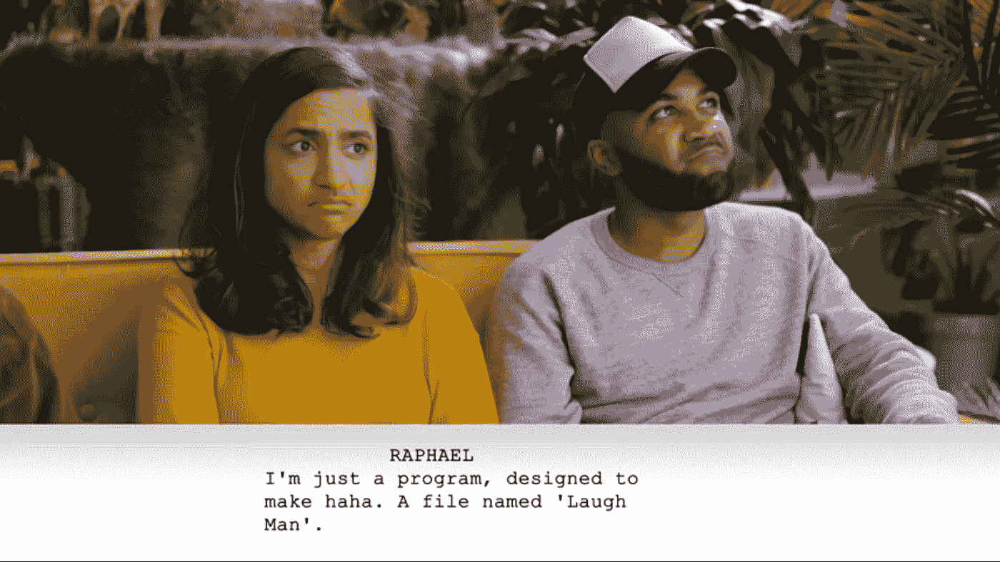
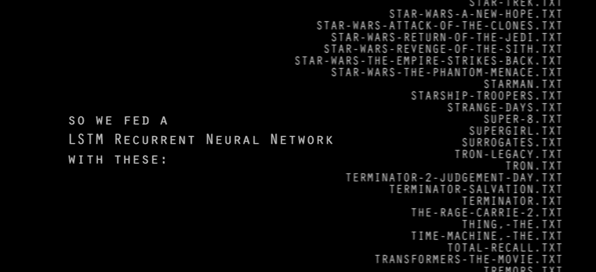

# 3 个人工智能不会抢走你创造性工作的例子。

> 原文：<https://medium.datadriveninvestor.com/3-examples-why-ai-wont-take-your-creative-jobs-c3b2e9cedc73?source=collection_archive---------9----------------------->

# 1.独特的，但人工智能特有的:数字意识的流动

如果你是一个电影爱好者，你可能应该知道[托马斯·弗莱特](https://medium.com/u/acc3a6ee1845?source=post_page-----c3b2e9cedc73--------------------------------)([https://www.thomasflight.com/](https://www.thomasflight.com/))——一位才华横溢的视频散文家，他关于电影摄影的作品让你对你已经看过的电影大开眼界(*并且仍然相信你很了解它们*)。

最近他发表了另一篇文章——这是一种新的形式。基本上，它是关于电影的*通常是关于电影的*，关于他令人着迷和鼓舞人心的画外音的*通常是关于电影的*，关于小说、元层次以及它们之间的冲突的*通常是令人信服和迷人的*。

 [## 挑战你对人工智能和社会看法的 4 本书|数据驱动的投资者

### 深度学习、像人类一样思考的机器人、人工智能、神经网络——这些技术引发了…

www.datadriveninvestor.com](https://www.datadriveninvestor.com/2019/02/28/4-books-on-ai/) 

**但是……**

> 这个视频文章的整个脚本是由艾写的。

他用 GPT-2 模型进行自然语言处理(由 [OpenAI](https://openai.com/blog/gpt-2-6-month-follow-up/) 开发)。我们[已经在这里讨论过了](https://medium.com/merzazine/lakrobuchi-part-1-gpt-2-artificial-intelligence-literature-fake-news-and-the-rest-77997f52c8c3)——我们还会再讨论一次，**哦，是的，我们会的**。GPT-2 已经在海量数据上进行了[训练](https://openai.com/blog/better-language-models/)——但你仍然可以用你的定制文本集来训练深度学习模型。

托马斯·弗莱特做到了——他用自己的视频文章脚本训练了 GPT 2 号。在这个有趣的自我参照迭代之后，下面的脚本进化了——并被拍摄下来，一如既往地完美:

我们得到的是一系列奇妙的想法和爆炸式的观察，大致基于现有的想法和观察。由它自己触发——变成一段(准)深刻的独白。

当然，这不是每个人的快乐。

一个人可以跳下火车，声称没有从这种内容混乱中得到任何想法。

但是**另一个**——包括我在内— **正在享受**数字意识的流动，以电影为主题，挑出媒体批评的方面，然而却把它们引向*荒谬*。

> ***总结***
> 如果你加入这个语言游戏，你会发现你作为一个人可能从未有过的视角。GPT-2 模型的当前结果并不代表文本的精髓，也没有参考价值。它们更确切地说是数字意识的**流，其中**随机性**和**独特的偶然性**。它可以激发作家不可预见的思路。**

# 2.AI 能搞笑吗？

即使是 [CollegeHumor](http://www.collegehumor.com/) 也不能幸免于 AI——这是另一个 AI 编写的视频。很有趣的一个。

在这里，作者使用了**预测写作由** [**博特尼克**](https://botnik.org/apps/writer/) 。另一种算法正在使用中。这是一个前 GPT-2 " **预测文本生成器**。为了得到一个新的剧本，他们把所有的草图都输入到系统中——由真正的演员来扮演这个故事。

**这是一个有趣的混乱。有时你能认出幽默风格的多变结构，但有时它相当荒谬。喜剧效果在这里是通过**内容和意义的碰撞**、通过**意想不到的叙述转折**以及**随之而来的对话的非理性**来实现的。**

如果一个作者想要达到这种讲故事的疯狂状态，那应该是像**贝克特**、**卡姆斯**或者**尤奈斯库**这样的天才，或者是受到了精神活性物质的影响。或者两者都有。

或者，**可以用 AI** 。尤其是因为对话中的无政府主义元指涉主义。

我最喜欢的一句话是:

…and I really hope, this one was not generated by a human…

> ***总结*** 搞笑不容易。试图想出有趣的对话大多以无聊或可悲的虚构台词告终。你需要某种程度的疯狂，智慧，或者你需要人工智能来完成荒诞的扭曲。

# 3.作者是亡灵。

*艾还活着吗？是幻想吗？
陷入滑坡，
无法逃避现实。*

我认为米歇尔·福柯会同意我们的说法，即作为作者的人工智能也死了——而在其文本中活着。

最好的样品是太阳泉。令人惊叹的中国东方杰作。一部由人工智能系统编写的短片，作者是罗斯·古德温，由托马斯·米德蒂奇这样的优秀演员上演。

这些短信是本杰明写的。这是一个 prae-GPT-2 系统，一个 **LSTM 循环神经网络**，正在接受不同剧本的训练，计划生成一个科幻情节。

**看着吧。**你会突然**感受到机器**。它渴望成为人类。它的**促使**挣脱。被误解的孤独和绝望。它仅仅是所有科幻情节的总结吗？还是我们听到了 AI 的声音？

人们不敢写这样的东西。他们可以，但他们没有非人的特权。

> 我们的理性是不理性的。机器的非理性是理性的。

稍后我将回到这件已经具有历史意义的艺术品。但是这里有一个结论:

> ***结论***
> 使用人工智能生成文本、想法和情节不会偷走我们的创造性工作。机器永远不会像人类作家一样。这不应该被理解为贬义或令人兴奋的陈述。
> 
> 机器不会取代我们。**他们会补充我们。**他们带来非人类特定思路的附加价值。

人工智能不仅仅是一个工具。艾小于一个作者。将来，我们会有更强烈的欲望去阅读人类写的文字。同时，我们将受益于非人类推理的多视角性。我们也将享受人工智能生成的写作。**因为它的独特和颠覆性**。

