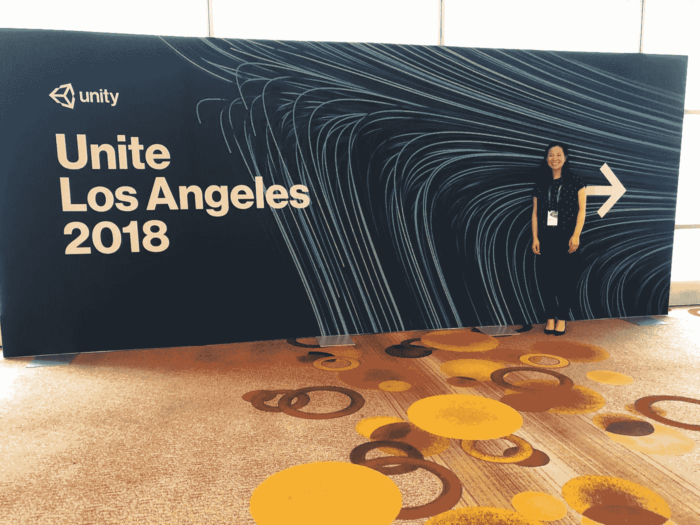

# # AR/# VR/#混合现实的 3 大教训

> 原文：<https://medium.datadriveninvestor.com/3-greatest-lessons-within-ar-vr-mixed-reality-from-sol-at-rewind-e6c4b78b2ab7?source=collection_archive---------36----------------------->

#UniteLA

我最近参加了[我今年的第一次#UniteLA](https://medium.com/@carolynblogs/3-life-lessons-learned-from-my-first-unitela-192df907a474) 。在观看了 REWIND 的创始人兼首席执行官[索尔展示了#UniteLA 的实时虚拟现实销售工具](https://www.linkedin.com/in/solrogers/) [Salesdrive](http://rewind.co/news/rewind-reveals-salesdrive-real-time-vr-sales-tool-unite-la/) 后，我见到了他。我很幸运后来和他聊了聊，听听他对增强现实/虚拟现实的想法。

*问:AR/VR/混合现实内部最大的挑战和机遇是什么？*

答:我认为最大的挑战是这项技术还没有普及，你没有让每个人都掌握它。人们真的不明白硬件、软件和内容之间的区别。内容本身非常具体，必须具有娱乐性和吸引力。但是硬件，直到你穿上它，你才明白它有多棒。

对我来说，未来是混合现实。我认为物理和数字的融合将会发生。我们在 [Magic Leap](https://www.magicleap.com/) 、 [META](https://www.metavision.com/) 、 [HoloLens](https://www.microsoft.com/en-us/hololens) 的一瞥中所看到的，确实是人类的未来，让它在这样一副眼镜上始终保持连续的数字层，将会扰乱和改变我们的生活方式。

想象一个用例。因此，目前电视本身是一个安装在墙上的黑盒子，是一个物理硬件。通过我的混合现实眼镜，我可以在任何表面上看到任何尺寸、任何分辨率的电视。所以突然之间，电视机本身再也不会以同样的方式销售了。

想象一下，我有机会打开我汽车的引擎盖，戴上眼镜观察我的引擎。它会告诉我该做什么以及如何修复它。它将使教育的理念民主化，它将改变我们对智力的理解。所以对我来说，混合现实是人类的未来。

完整的采访最初发布在我的 [LinkedIn 上。](https://www.linkedin.com/feed/update/urn:li:activity:6460619580615331840)

感谢 Sol at [REWIND](https://medium.com/u/d445db6fbbb?source=post_page-----e6c4b78b2ab7--------------------------------) 抽出时间在#UniteLA 与我交谈，非常感谢！