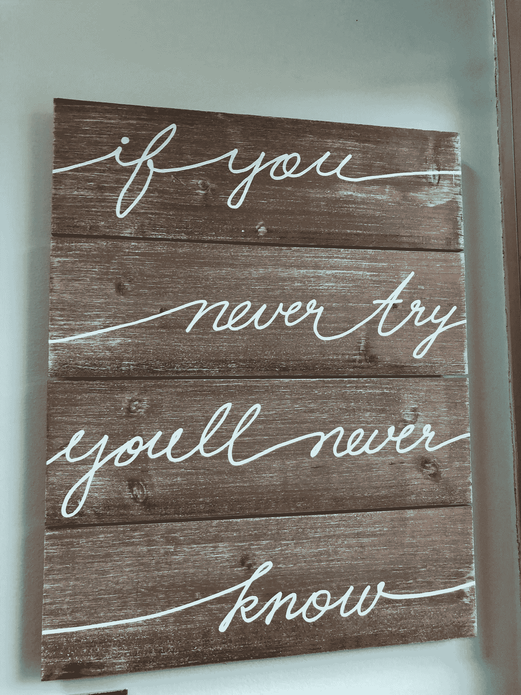
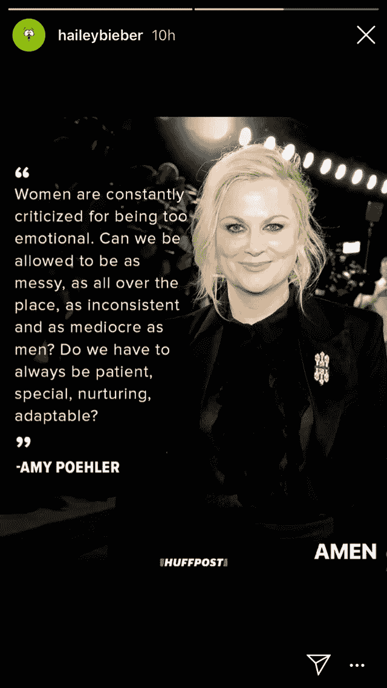

# 记住你的观点很重要的 3 个想法

> 原文：<https://medium.datadriveninvestor.com/3-ideas-to-remember-that-your-opinion-matters-f79647db29b?source=collection_archive---------5----------------------->

担心别人对你的看法是什么感觉？

每个人都有自己的看法。

一天下来最重要的意见是属于你的意见。听到和相信对你来说最好的事情可能会很棘手，尽管要相信你是谁，你能为这个世界做些什么。

 [## 摔倒不是失败。-数据驱动型投资者

### 你只有在放弃的时候才会失败。每个英雄都会倒下，我们活着就是为了失败者出现的时刻；上升到…

www.datadriveninvestor.com](https://www.datadriveninvestor.com/2019/01/17/falling-isnt-failing/) 

你如何保持对自己的信任，尤其是在你不确定和不自信的时候？

1.  当你和自己联系时，听第一件出现的事情。听自己说话，直觉上是好还是不好的感觉？即使这会让其他人不开心或生气，也要尊重你的真实感受。
2.  顺其自然吧。如果别人想生气，那是他们的责任，不是你的。你不能控制别人的反应，你只能控制你如何回应他们。
3.  验证你自己。给自己一个喘息的机会，尊重你真实的感受，承认你正在经历的事情。海莉·比伯的 [#instastories](https://www.instagram.com/explore/tags/instastories/?hl=en) 中的这句话引起了我的共鸣:

