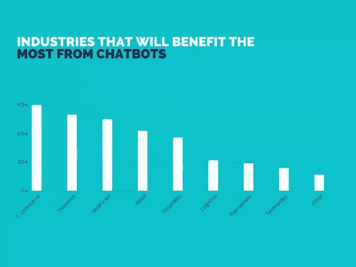

# 受益于聊天机器人的 3 个行业

> 原文：<https://medium.datadriveninvestor.com/3-industries-that-are-benefitting-from-chatbots-b2fbf2e58a25?source=collection_archive---------9----------------------->

让生活变得更容易是科技发展的主要原因之一。作为技术的一部分，人工智能，也称为 AI，自诞生以来一直在极大地改进这一概念。

聊天机器人技术是人工智能的产物，自从它的想法诞生以来，用户体验社区一直在探索这种面向消费者的技术。这就是为什么无论你在 UX 社区的什么地方，总会有关于这个或那个聊天机器人公司的话题。

聊天机器人正被用于许多不同的领域、企业组织和市场。考虑到他们已经展示了巨大的能力，能够增加销售额，降低商业成本，转化游客流量，以及提高客户参与度，他们已经赢得了作为一支重要力量的权利。

为了让事情变得更好，每个利用聊天机器人功能的行业都有能力定制它，确保它满足特定行业的要求。但这里的问题是，虽然每个行业都可以定制聊天机器人应用程序来满足自己的要求，但有些行业会享受更多好处，并通过这些直接消息传递机器人的功能、智能和扩展能力彻底变革。

让我们来看看其中的一些，好吗？

**零售**

聊天机器人在这个行业产生巨大影响是很自然的。零售业一直在努力跟上移动转化的步伐。虽然网上购物确实比实体零售店多，但能够将访问者转化为客户，并为客户提供量身定制的用户体验以满足他们的需求，是该行业很大一部分人未能做到的一个方面。直到聊天机器人出现。

有了机器人，品牌现在可以享受一个渠道，为他们提供扩大在线存在的能力。T2 聊天机构 T3 的创始人 Ryan Dearlove 说“零售业最好的机器人体验融合了客户服务、销售和市场营销”。

**现场活动**

总有必要去看现场比赛；无论是音乐会、体育赛事、节日还是商务会议。对于这些直播活动，参与者通常会被要求下载一个应用程序。你甚至有可能在过去下载过这些现场活动应用程序。那么，对那些暂时占用你手机空间的应用说再见吧，因为聊天机器人可以让事情变得更简单。

活动组织者现在使用聊天机器人来帮助购买门票，并向与会者传达活动信息。节目和时间表、最近的停车位、活动中心的方向、WiFi 密码、平面图等信息都可以通过聊天机器人获得。参加现场活动的任何人都可以很容易地访问所有这些信息，便利不是唯一的优势；高效停车、方便购买食品和其他商品、提前到达、了解天气情况等等，都是与会者将享有的其他优势，从而增加了活动成功的机会。

**银行业和金融业**

这是另一个因聊天机器人带来的好处而升温的行业。鉴于大多数银行任务本质上都是事务性的，银行和金融部门可以被视为聊天机器人和人工智能界面的完美用例之一。

当聊天机器人被编程为包含简单命令和相应动作的明确定义的特定任务时，它们工作得最好。通过银行部门的机器人，用户能够完成简单的任务，如查看交易历史，进行现金转账，检查余额，以及找到最近的自动柜员机(ATM)。

已经开始在该行业推广使用聊天机器人的机构的一个例子是美国银行。他们推出了一款名为 Erica 的聊天机器人/虚拟助手，它可以帮助实现上述大部分功能。

再比如西联信使 bot 一个为用户提供再次转账、跟踪转账以及汇款等选项的机器人。