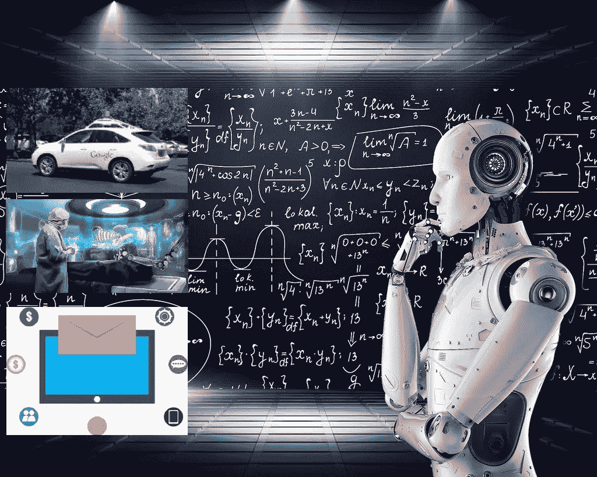

# 未来 5 年将受到人工智能显著影响的 3 个行业

> 原文：<https://medium.datadriveninvestor.com/3-industries-that-would-be-dramatically-impacted-by-ai-in-the-coming-5-years-e3c863a705c0?source=collection_archive---------9----------------------->

**人工智能**简单来说，就是计算机程序或机器思考和学习的能力。这也是一个试图让计算机变得“智能”的研究领域。我们都听说过人工智能、机器学习、深度学习和其他相关领域以及它越来越大的影响；我们看到它是如何在各种领域中使用的，但我们仍然“还没有”，无论是在一些领域中人工智能预测的准确性方面，还是在更多行业中实施这些方法方面。好消息是，人工智能领域的进展速度越来越快，随着收集的数据越来越多，预测的准确性越来越高，因此看起来更多的行业将能够利用人工智能实现实际收入增长。在这篇文章中，我想提一下我认为会受到人工智能领域发展高度影响的 3 个行业。我是根据我最近与这些领域的几位专家的讨论，以及我自己在人工智能领域的产品管理经验和几项市场和技术研究得出这一结论的。

# 1.交通和流动性

两年前，它看起来像一部科幻电影。几乎感觉它应该是“回到未来 4”的一部分，但看起来自动驾驶汽车将在未来几年内成为现实，甚至可能在未来 5 年内。这是达美乐比萨公司在迈阿密做的一个[不错的实验，用一辆自动驾驶汽车送比萨。多酷啊。如果你害怕不安全或者“我绝不会让机器人载我去任何地方！”然后再想想。在人工智能中，更好的预测的关键是数据。**谷歌无人驾驶汽车行驶了 400 多万英里，只发生了几次事故(是由……另一辆车造成的)**。由于大量的数据学习，这些汽车是惊人的安全，所以想象一下，在遥远的未来，手动驾驶将是只有专业人士在做的事情！除此之外，对道路交通事故的影响，它可以极大地改变整个运输市场，帮助我们优化路线，并节省大量资金。由于世界上大多数人都拥有移动设备，分析人们的出行、特征和偏好也将支持移动即服务(Maas ),这预计也将改变移动行业。](https://www.facebook.com/JungleVT/videos/2134966673384495/)

# 2.卫生保健

我喜欢把这种变化想象成从我们今天习惯看到的大量文书工作转向提供大量可能性的大规模人工智能解决方案。从分析不同的疾病模式，到预测一种新型流感，更不用说健康保险公司的模型变化和手术，这些变化和手术将利用先进的计算机视觉技术来做一切更准确和更少侵入性的事情。随着学习算法变得越来越精确，它们将使人类能够更深入地了解诊断、护理流程、治疗可变性和患者结果。此外，通过接管通常分配给人类的一些诊断职责，人工智能可以帮助处理合格临床人员的严重短缺。一个例子是人工智能成像工具(基于先进的计算机视觉和深度学习算法)，可以通过胸部 x 光筛查结核病的迹象。想想医生可以节省的时间和人力，让他们有时间从事其他拯救生命的活动。

这种变化和人工智能对医疗保健的影响最令人兴奋的部分是拯救大量生命的真正机会。通过更好地理解不同药物和病人状态之间的关系，人工智能将有助于防止由于药物的不良反应而发生的死亡，并为医生腾出更多的时间来做更多的工作和帮助更多的人。

# 3.营销

今天，促销、营销、广告、入站流量都严重依赖自动化、系统和工具来帮助营销人员开展活动和开展工作。在某种程度上，这些工具和系统正帮助营销行业更好地瞄准他们的活动，建立更个性化的策略，并增加他们项目的点击率，希望最终增加销售转化率。由于所有这些工具都依赖于数据，我相信机器学习将在这个行业中发挥越来越大的作用，越来越多基于用户行为和分析的人工智能产品将出现在市场上。如今，人工智能已经帮助 Spotify 了解用户对音乐的品味，或者帮助网飞根据其他有类似品味的人的喜好来提供推荐，甚至只是我们都熟悉的常规销售引擎(“买了这个的人也买了……”)。上面提到的下一代将更多地基于人工智能，这将使营销渠道、促销以及与潜在和现有客户的整个交流和互动更加相关和更加重要。

未来就在这里。现在是时候看看行业(以及人本身)将如何改变，并建立越来越多的基于机器学习和人工智能工具的产品、服务和流程。想到 2 年后将会有如此多的产品和服务出现，这是令人兴奋的，我们甚至无法想象。为此干杯。