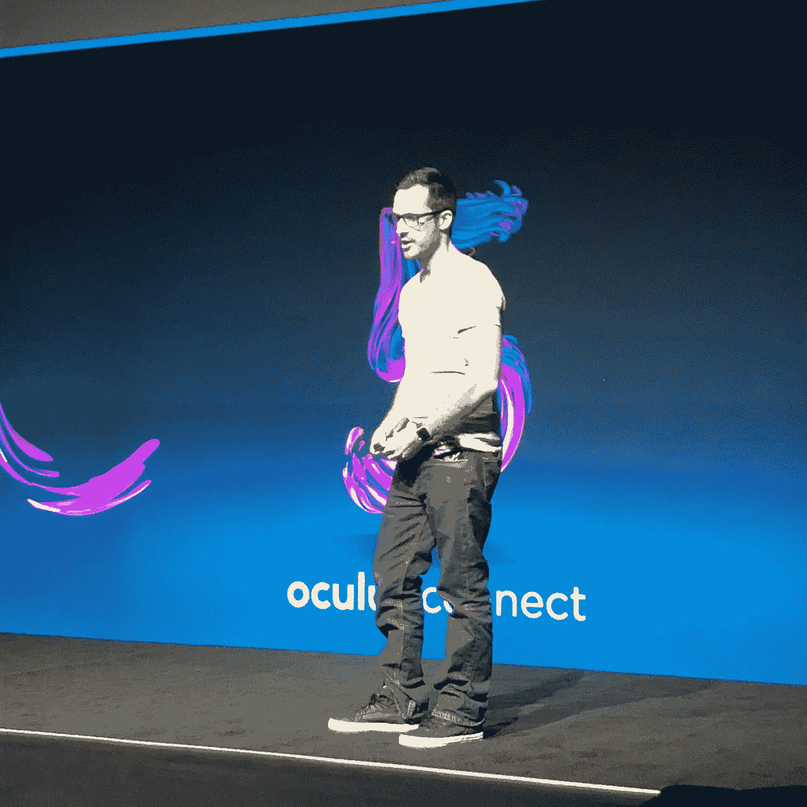
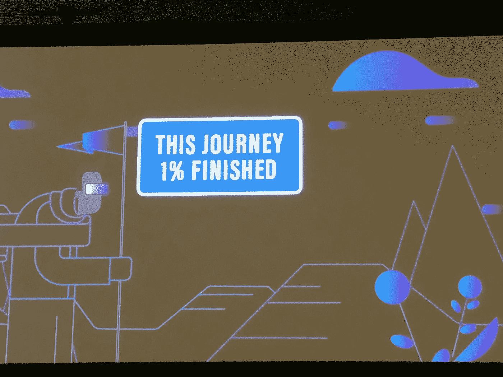
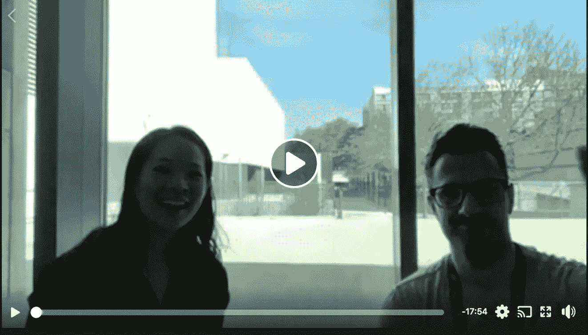

# Honeypixel 的 Systems & Unity 开发人员的产品经理 Peter Howell 提出了 3 条适用于现实生活的关键见解。

> 原文：<https://medium.datadriveninvestor.com/3-key-insights-that-apply-to-real-life-from-peter-howell-product-manager-at-versus-systems-d2de2513ecd0?source=collection_archive---------23----------------------->

Peter speaking at his session “Creative Ways to Get More Eyes on Your App”

请继续阅读我对 Honeypixel 的 Systems 的产品经理 Peter Howel 的采访。他在#OC5 上发表了关于“[让你的应用吸引更多眼球的创造性方法的演讲。](https://www.youtube.com/watch?time_continue=721&v=ymrWNLmeEx0)“他的游戏，透明者的面具也可以在[这里找到。](https://www.oculus.com/experiences/gear-vr/1223236797772008/)

我坐下来和 Peter 讨论了将他的职业从产品经理转变为软件开发人员(同时做这两项工作！).经历过几次职业变化后，我能理解变化带来的挑战和不确定性。在增强现实/虚拟现实(也叫 AR/VR)中也是如此，事物是不断变化的，每个人都在学习。

## 我从与 Peter 的交谈中学到了 3 条重要经验:

## 1.学习和尝试新事物。有耐心经历不同的原型，当事情第一次没有结果时不要放弃。

## 2.在开始之前不知道所有事情是好的，只要继续采取行动。

## 3.技术可以帮助创造更大的共鸣和联系。

在与马克·扎克伯格的主题演讲中，我看到并听到了这句话，这让我松了一口气:

> 这段旅程已经完成了 1%。"

这是一个很好的提醒，让你从“初学者的心态”来处理事情。每个人都在学习，有了这种情绪，就消除了必须完美的压力，给了我们探索和学习的开放性。

在#OC5 发生的所有活动中，我们设法找到了一个安静的地方进行采访，并参加了 FB 直播！我们的现场视频可以在[这里](https://www.facebook.com/carolyn.lowe.16/videos/10156788461312146/)找到。

**有哪些可以应用到我们日常生活中的关键 AR/VR 学习？**

VR/AR 将成为下一个自然计算形式。计算和消费信息的下一步是什么？VR 处于起步阶段；这是为了提醒人们控制自己的期望。我对索尼、HTC、联想以及他们的 VR 产品印象深刻。AR 将会像拥有一部电话一样在我们的生活中普遍存在。如果你把某样东西放入一个具有很棒的风格化元素的形状因子中，它将导致现实生活中更多的人与人之间的互动。用现实世界作为你的画布，对于 AR 来说是很刺激的。

VR 之外还有商业用例——比你想象的要来得快。虚拟存在和连接可以通过 AR/VR 来丰富。AR/VR 非常不同，两者都有使用案例。

AR/VR 创建了一种原始的真实连接，人们可以彼此建立这种连接。两者都将提供虚拟存在；我们现在拥有的最接近的东西是 FaceTime，这是一种框架式的体验。没有太多的深度，虽然这很令人兴奋，因为你有一个连接。AR 和 VR 将丰富连接。

你如何看待讲故事的未来？这将如何影响我们的下一代？

有些游戏谈论的是损失，例如，[那条龙，Cance](http://www.thatdragoncancer.com/#home) r 是一个令人心碎的游戏。从他们的[网站](http://www.thatdragoncancer.com/#home)上引用的话来说，《龙，癌症》是“一款沉浸式叙事视频游戏，通过大约两个小时充满诗意和想象力的游戏，讲述了乔尔·格林与癌症抗争的四年，探索了信仰、希望和爱。”

游戏在叙事上越来越成熟。有在幻想环境中处理现实世界问题的。游戏在很多方面都在成长。我希望它们能对我们的年轻一代产生积极的影响；知道他们并不孤独，并对某些社会问题有更开阔的视野。

游戏开发商越来越认识到(游戏的影响)，因此，伟大的东西已经出来了。游戏延长了游戏时间。他们让玩家在一段时间内买入，而不仅仅是游戏的见证人。玩家是一个可以做出选择的参与者，他/她有机会探索你在电视或电影中可能无法做到的叙事主题。

**你如何平衡一切？你的动力是什么？**

这当然是一个棘手的杂耍。我喜欢创造东西。作为一名产品经理，我和优秀的团队一起工作。我和超级天才的设计师和工程师一起工作。有机会作为项目经理与团队一起构建，然后作为一个单独的开发人员去开发和构建，这很棒。它在创造，也在卸下拥有、开发和设计的全部责任。从专业的角度来看，这两种不同的职业之间有一点差异，一点轻松。

就我的个人生活而言，我正试图更多地关注我的家庭生活；努力多帮老婆做家务，做个好老公，造婴儿床！

非常感谢 [Peter](https://www.linkedin.com/in/petehowell/) 抽出时间在#OC5 与我聊天和联系！真的很感谢！

希望你喜欢这篇文章！祝你这周过得愉快！